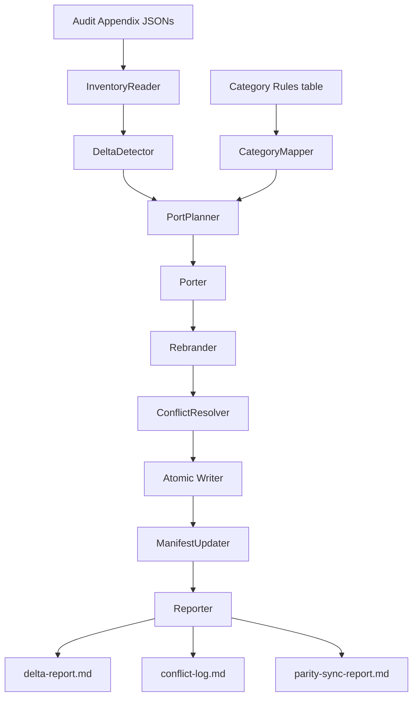
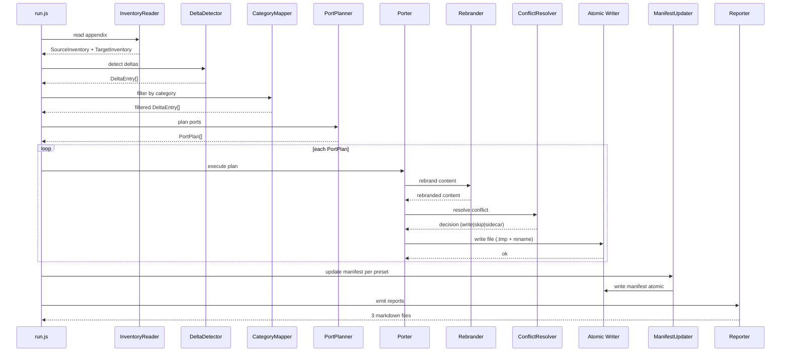

# Tài Liệu Thiết Kế (Design Document)

## Overview

**ClaudeKit Parity Sync** là một maintainer-time tool (Node.js script) được triển khai như một build-time utility, KHÔNG phải là runtime feature của CLI `kiro-kit`. Mục tiêu duy nhất của nó là rút ngắn khoảng cách content giữa source kit (`claudekit-engineer-main/.claude/`) và 6 preset self-contained của KiroKit (`presets/{frontend,backend,fullstack,mobile,devops,data-ai}`), đồng thời tôn trọng ràng buộc tailoring per-category đã được phê duyệt trong tài liệu yêu cầu.

Tool này được hiện thực dưới dạng một CLI script chạy thủ công: `node scripts/parity-sync/run.js [--dry-run] [--preset <name>]`. Output bao gồm ba artifact: `delta-report.md`, `conflict-log.md`, `parity-sync-report.md` (tất cả đặt tại `docs/audits/claudekit-vs-kirokit/`). Nó không sửa CLI source, không tạo shared core, không thay đổi public API CLI.

**Nguyên tắc thiết kế:**

- **Audit appendix là source of truth.** Mọi quyết định port đều dựa trên `inventory-source.json`, `inventory-target.json`, `target-files-*.txt`. Tool không tự đi crawl filesystem để khám phá artifact mới.
- **Idempotent by design.** Chạy nhiều lần ra cùng kết quả; không ghi timestamp vào file artifact.
- **Atomic write.** Mọi thao tác ghi đều qua `<file>.tmp` rồi rename, tránh partial-write khi bị Ctrl+C.
- **Conflict-averse.** Không tự động xoá file target hiện có. Khi không chắc, tạo sidecar `<basename>.source.md` để maintainer review.
- **Rebrand without nuking.** Substitution string-level theo Rebrand Rule (Req 11), không thay đổi tên file (trừ `CLAUDE.md` -> `KIRO.md` ở root).
- **Composable via dry-run.** `--dry-run` sinh ra báo cáo nhưng không ghi file, để maintainer review trước khi commit.

**Phạm vi triển khai:** Một thư mục `scripts/parity-sync/` mới trong root repo, gồm các module Node.js (CommonJS, không cần build step). Không sửa `packages/cli/src/`. Có cập nhật `packages/cli/tests/structural/*.test.js` để nâng min thresholds (đây là test-only change, không phải runtime CLI).

## Architecture

### Pipeline tổng quan

Tool chạy theo pipeline 7 stage tuần tự, mỗi stage là một module thuần chức năng (functional, không state ngoài input/output):



### Pipeline stages

1. **InventoryReader** đọc `inventory-source.json`, `inventory-target.json`, và 7 file `target-files-*.txt`. Validate non-empty và schema (mảng object có `id`, `kit`, `artifact_type`, `path`). Nếu rỗng hoặc lỗi parse, abort với exit code 2 và yêu cầu chạy lại `_build-inventory-source.cjs`/`_build-inventory-target.cjs` (Req 1.4).
2. **DeltaDetector** sinh `DeltaEntry` cho mỗi cặp `(source_artifact, preset)`. Trạng thái được tính bằng cách so sánh `source.path` (chuẩn hoá thành relative path không prefix `claudekit-engineer-main/.claude/`) với danh sách path trong `target-files-<preset>.txt`. Dữ liệu `partial` xuất hiện khi source là skill có `references/` hoặc `scripts/` nhưng target chỉ có `SKILL.md`.
3. **CategoryMapper** áp dụng bảng `CATEGORY_RULES` (xem mục Components and Interfaces) để loại bỏ các pair có status `category-skip`. Đầu ra là tập `(source_artifact, preset, status, reason)` đã thu hẹp.
4. **PortPlanner** convert mỗi pair `missing` hoặc `partial` thành một `PortPlan` mô tả file source nào cần copy, file target nào cần ghi, và những transform nào cần áp dụng (rebrand, frontmatter-merge, sub-skill-split). Stage này là **read-only** (không ghi đĩa).
5. **Porter** chạy mỗi `PortPlan`: đọc nội dung source vào memory, gọi **Rebrander** transform, gọi **ConflictResolver** quyết định write/skip/sidecar, ghi file qua **Atomic Writer** (tmp + rename).
6. **ManifestUpdater** sau khi Porter xong từng preset, đọc `presets/<P>/manifest.json`, thêm entry cho mọi file mới (giữ ordering ổn định để diff sạch), validate JSON parse, ghi atomic.
7. **Reporter** tổng hợp kết quả từ stage 2 (delta-report.md), stage 5 (conflict-log.md), và toàn bộ pipeline (parity-sync-report.md). Mỗi report bắt đầu bằng timestamp ISO 8601 trong front-matter để không ảnh hưởng nội dung file artifact (Req 15.2).

### Định vị tool trong repo

```
scripts/parity-sync/
  run.js                  # entry point (CLI)
  inventory-reader.js
  delta-detector.js
  category-rules.js       # bảng CATEGORY_RULES (data-only)
  category-mapper.js
  port-planner.js
  porter.js
  rebrander.js
  conflict-resolver.js
  atomic-writer.js
  manifest-updater.js
  reporter.js
  lib/
    yaml-front-matter.js  # parse + serialize YAML front-matter (gray-matter wrapper)
    path-utils.js
    hash-utils.js         # sha256 cho idempotency check
docs/audits/claudekit-vs-kirokit/
  delta-report.md         # output, generated
  conflict-log.md         # output, generated
  parity-sync-report.md   # output, generated
  appendix/               # input, ground truth (read-only)
```

### Luồng dữ liệu chi tiết



## Components and Interfaces

### InventoryReader

**Trách nhiệm.** Parse JSON inventory + plain-text file lists, normalize path, expose lookup helpers.

**API.**

```js
// scripts/parity-sync/inventory-reader.js
module.exports = {
  /** @returns {SourceInventory} */
  readSource(appendixDir),
  /** @returns {TargetInventory} */
  readTarget(appendixDir),
};
```

**Đầu vào.** `docs/audits/claudekit-vs-kirokit/appendix/`.

**Đầu ra.** Hai đối tượng:
- `SourceInventory.items: SourceItem[]` — mảng 133 entry tương đương `inventory-source.json`.
- `TargetInventory.byPreset: Record<PresetName, TargetItem[]>` — 7 mảng (gồm `_template`).

**Xử lý lỗi.** Nếu file không tồn tại hoặc rỗng, throw `InventoryError` với message dẫn link tới `_build-inventory-source.cjs`. CLI bắt và exit code 2.

### DeltaDetector

**Trách nhiệm.** Pairwise compare mỗi source artifact với mỗi preset target, sinh `DeltaEntry`.

**API.**

```js
// scripts/parity-sync/delta-detector.js
module.exports = {
  /**
   * @param {SourceInventory} src
   * @param {TargetInventory} tgt
   * @returns {DeltaEntry[]}
   */
  detect(src, tgt),
};
```

**Logic.**
- Với mỗi `srcItem` × mỗi preset `P` (6 preset chính + `_template`):
  - Chuẩn hoá `srcItem.path` thành `relPath` bằng cách strip prefix `claudekit-engineer-main/.claude/`.
  - Sinh `targetPath = presets/<P>/<relPath>`.
  - Nếu `targetPath` có trong `target-files-<P>.txt`: status = `present` (kèm sub-check cho skill structure).
  - Nếu skill folder có target `SKILL.md` nhưng thiếu `references/` hoặc `scripts/` so với source: status = `partial`, reason = `missing-subdir`.
  - Nếu không có: status = `missing`.
- Status `category-skip` được áp ở stage CategoryMapper sau, KHÔNG ở stage này.

### CategoryMapper + Bảng phân loại

**Trách nhiệm.** Áp `CATEGORY_RULES` để chuyển một số `missing` thành `category-skip`.

**Bảng phân loại (CATEGORY_RULES).** Đây là bảng quyết định trung tâm của parity sync, cụ thể hoá Req 5.

#### Agents (16 entries → ALL 6 presets)

| Agent | frontend | backend | fullstack | mobile | devops | data-ai |
|---|---|---|---|---|---|---|
| brainstormer, code-reviewer, copywriter, database-admin, debugger, docs-manager, git-manager, journal-writer, mcp-manager, planner, project-manager, researcher, scout, scout-external, tester, ui-ux-designer | YES | YES | YES | YES | YES | YES |

Ghi chú: Agent KiroKit-specific (api-developer, database-architect, devops-engineer, security-auditor, mobile-developer, frontend-developer, accessibility-auditor, navigation-architect, platform-specialist, state-manager, widget-architect, ci-cd-specialist, infrastructure-engineer, monitoring-engineer, data-pipeline-architect, data-scientist, ml-engineer, model-evaluator, fullstack-developer, performance-optimizer, component-architect) ĐƯỢC GIỮ NGUYÊN, không bị overwrite (Req 3.3).

#### Skills (32 entries → mapping theo Req 4.5–4.10)

| Skill | frontend | backend | fullstack | mobile | devops | data-ai |
|---|---|---|---|---|---|---|
| **Generic core (12)** |
| ai-multimodal | YES | YES | YES | YES | YES | YES |
| code-review | YES | YES | YES | YES | YES | YES |
| common | YES | YES | YES | YES | YES | YES |
| debugging | YES | YES | YES | YES | YES | YES |
| docs-seeker | YES | YES | YES | YES | YES | YES |
| mcp-builder | YES | YES | YES | YES | YES | YES |
| mcp-management | YES | YES | YES | YES | YES | YES |
| planning | YES | YES | YES | YES | YES | YES |
| problem-solving | YES | YES | YES | YES | YES | YES |
| repomix | YES | YES | YES | YES | YES | YES |
| research | YES | YES | YES | YES | YES | YES |
| sequential-thinking | YES | YES | YES | YES | YES | YES |
| skill-creator | YES | YES | YES | YES | YES | YES |
| template-skill | YES | YES | YES | YES | YES | YES |
| **Frontend-leaning** |
| aesthetic | YES | skip | YES | YES | skip | skip |
| frontend-design | YES | skip | YES | YES | skip | skip |
| frontend-development | YES | skip | YES | YES | skip | skip |
| ui-styling | YES | skip | YES | YES | skip | skip |
| threejs | YES | skip | YES | skip | skip | skip |
| web-frameworks | YES | skip | YES | YES | YES | skip |
| chrome-devtools | YES | YES | YES | YES | YES | skip |
| **Backend-leaning** |
| backend-development | skip | YES | YES | skip | YES | skip |
| better-auth | skip | YES | YES | skip | skip | skip |
| databases | skip | YES | YES | skip | YES | YES |
| payment-integration | skip | YES | YES | skip | skip | skip |
| shopify | skip | YES | YES | skip | skip | skip |
| **DevOps-leaning** |
| devops | skip | YES | YES | skip | YES | skip |
| **Data/AI-leaning** |
| google-adk-python | skip | skip | skip | skip | skip | YES |
| document-skills/docx | skip | skip | skip | skip | skip | YES |
| document-skills/pdf | skip | skip | skip | skip | skip | YES |
| document-skills/pptx | skip | skip | skip | skip | skip | YES |
| document-skills/xlsx | skip | skip | skip | skip | skip | YES |
| **Media (cross-cutting)** |
| media-processing | YES | skip | YES | YES | skip | YES |
| **Docs reference (read-only)** |
| claude-code | YES | YES | YES | YES | YES | YES |

Ghi chú: `claude-code` skill GIỮ NGUYÊN tên thư mục (Req 11.2); nội dung là docs về Claude Code product nên không rebrand. KiroKit-specific skills hiện có (app-deployment, flutter-state, mobile-testing, native-integration, offline-first, ci-cd-patterns, container-security, kubernetes-ops, terraform-modules, data-engineering, data-visualization, experiment-tracking, feature-store, jupyter-notebooks, ml-ops, nlp-text-processing, pandas-analysis, pytorch-training, scikit-learn, tensorflow-keras) GIỮ NGUYÊN, không bị overwrite.

#### Commands (53 entries)

| Command | frontend | backend | fullstack | mobile | devops | data-ai | Cơ sở |
|---|---|---|---|---|---|---|---|
| **Generic (Req 5.7) → ALL** |
| ask, brainstorm, code, cook, cook/auto, cook/auto/fast, debug, journal, use-mcp, watzup | YES | YES | YES | YES | YES | YES | Req 5.7 |
| bootstrap, bootstrap/auto, bootstrap/auto/fast | YES | YES | YES | YES | YES | YES | Req 5.7 |
| review/codebase | YES | YES | YES | YES | YES | YES | Req 5.7 |
| skill/add, skill/create, skill/fix-logs, skill/optimize | YES | YES | YES | YES | YES | YES | Req 5.7 |
| git/cm, git/cp, git/pr | YES | YES | YES | YES | YES | YES | Req 6.1 |
| fix, fix/ci, fix/fast, fix/hard, fix/logs, fix/test, fix/types, fix/ui | YES | YES | YES | YES | YES | YES | Req 6.2 |
| plan, plan/ci, plan/cro, plan/fast, plan/hard, plan/two | YES | YES | YES | YES | YES | YES | Req 6.3 |
| scout, scout/ext | YES | YES | YES | YES | YES | YES | Req 5.7 |
| test | YES | YES | YES | YES | YES | YES | Req 5.7 |
| docs/init, docs/summarize, docs/update | YES | YES | YES | YES | YES | YES | Req 5.7 |
| **Content (Req 5.5) → ALL** |
| content/cro, content/enhance, content/fast, content/good | YES | YES | YES | YES | YES | YES | Req 5.5 |
| **Design (Req 5.6) → frontend, fullstack, mobile** |
| design/3d, design/describe, design/fast, design/good, design/screenshot, design/video | YES | skip | YES | YES | skip | skip | Req 5.6 |
| **Integrate (Req 5.4) → backend, fullstack only** |
| integrate/polar, integrate/sepay | skip | YES | YES | skip | skip | skip | Req 5.4 |

Tổng số command port vào mỗi preset (sau category-mapping):
- frontend: 47 generic + 6 design = **~53** (trừ 2 integrate)
- backend: 47 generic + 2 integrate = **~49** (trừ 6 design)
- fullstack: 47 generic + 6 design + 2 integrate = **~55**
- mobile: 47 generic + 6 design = **~53**
- devops: 47 generic = **~47**
- data-ai: 47 generic = **~47**

(Note: count thực tế phụ thuộc vào số file trùng tên đã có ở target. Conflict-resolution sẽ giữ phiên bản KiroKit nếu nó dài hơn 1.5x — Req 12.1.)

#### Hooks, Workflows, Statusline, Settings, Metadata, MCP, .env (→ ALL)

| Artifact | Mọi preset |
|---|---|
| hooks/discord-notify.{js,sh,ps1} | YES |
| hooks/telegram-notify.{js,sh,ps1} | YES |
| hooks/scout-block.{js,sh,ps1} | YES |
| hooks/modularization-hook.js | YES |
| hooks/pre-commit-lint.js | YES |
| hooks/git-status-tracker.js | YES |
| hooks/README.md | YES |
| hooks/.env.example | YES (merge, không xoá key target) |
| hooks/discord-hook-setup.md | YES (mới, từ source) |
| hooks/telegram-hook-setup.md | YES (mới, từ source) |
| workflows/development-rules.md, documentation-management.md, orchestration-protocol.md, primary-workflow.md | YES (merge nếu có drift) |
| statusline.{js,sh,ps1} | YES |
| settings.json | YES (merge, không xoá entry KiroKit-specific) |
| metadata.json | YES (merge, giữ kit_version + preset_version target) |
| .mcp.json.example | YES (merge entry mới) |
| .env.example (root preset) | YES (merge, không xoá key target) |

#### Root-level files (Req 10) — chỉ root repo, không phải preset content

| File source | Đích | Hành động |
|---|---|---|
| claudekit-engineer-main/.commitlintrc.json | ./.commitlintrc.json | copy nếu không tồn tại; diff nếu có |
| claudekit-engineer-main/.releaserc.json | ./.releaserc.json | copy nếu không tồn tại; skip nếu có (CI nhạy cảm) |
| claudekit-engineer-main/.repomixignore | ./.repomixignore | copy nếu không tồn tại; merge nếu có |
| claudekit-engineer-main/CLAUDE.md | ./KIRO.md | copy + rebrand (rename) |
| claudekit-engineer-main/GEMINI.md | ./GEMINI.md | copy nếu không tồn tại |
| claudekit-engineer-main/guide/ | ./docs/guide/ | copy nếu target rỗng |
| claudekit-engineer-main/scripts/test-scout-block.{sh,ps1} | ./scripts/test-scout-block.{js,sh,ps1} | copy + sinh `.js` tương đương |

### PortPlanner

**Trách nhiệm.** Convert `DeltaEntry[]` đã filter thành `PortPlan[]` cụ thể, mô tả từng thao tác I/O.

**API.**

```js
// scripts/parity-sync/port-planner.js
module.exports = {
  /**
   * @param {DeltaEntry[]} deltas
   * @returns {PortPlan[]}
   */
  plan(deltas),
};
```

**Một số transform đặc biệt:**
- **`sub-skill-split`** áp dụng cho `document-skills/{docx,pdf,pptx,xlsx}/`. Mỗi sub-skill là một skill độc lập, có `SKILL.md` riêng (Req 4.4); planner sinh nhiều `PortPlan` (một cho mỗi sub-skill folder), mỗi plan port toàn bộ subtree (`references/`, `scripts/`, `ooxml/schemas/`).
- **`tri-script-extend`** áp dụng cho hook `discord_notify.sh` và `telegram_notify.sh` của ClaudeKit (single-platform). Vì KiroKit đã có `discord-notify.{js,sh,ps1}` (Req 7.2), planner skip hai file này và chỉ port `discord-hook-setup.md`, `telegram-hook-setup.md` (docs).
- **`frontmatter-keep`** áp dụng cho mọi `.md` có YAML front-matter. Source front-matter `name`, `inclusion`, `argument-hint` được giữ nguyên (Req 3.5).

### Porter + Rebrander

**Porter** thực thi `PortPlan`, gọi Rebrander cho mọi file text (`.md`, `.json`, `.js`, `.sh`, `.ps1`, `.py`).

**Rebrander.** Thuần stateless string substitution, áp dụng theo thứ tự:

```js
// scripts/parity-sync/rebrander.js
const SUBSTITUTIONS = [
  // Trật tự quan trọng: rebrand đường dẫn trước branding
  { from: /\.claude\//g, to: '.kiro/' },
  { from: /ClaudeKit/g, to: 'KiroKit' },
  // Rebrand "Claude Code" CHỈ KHI không trong skill claude-code/
  { from: /Claude Code/g, to: 'Kiro', exceptIn: ['skills/claude-code/'] },
  // URL Anthropic giữ nguyên (đã được skip vì không match pattern trên)
];
```

Kèm các invariant nội bộ:
- Không thay đổi URL `https://docs.claude.com/...` (không match pattern).
- Không thay đổi tên file (basename), trừ trường hợp `CLAUDE.md` → `KIRO.md` (rule riêng ở root file).
- Khi gặp `npx claude-code`, prepend block comment `<!-- KiroKit: this references Claude Code CLI; replace with kiro-kit equivalent if applicable -->` (Req 11.5).
- Front-matter `name: claude-code` được serialize lại nguyên văn (giữ tên skill, Req 11.2).

### ConflictResolver

**Trách nhiệm.** Khi target file đã tồn tại và nội dung khác source-rebranded, áp dụng cây quyết định 4 tier theo Req 12.

```mermaid
flowchart TD
    Start[File target tồn tại?] -->|No| WriteNew[Write new file]
    Start -->|Yes| Hash[hash equal?]
    Hash -->|Yes| NoOp[No-op idempotent]
    Hash -->|No| Tier1{target_lines > 1.5 × source_lines?}
    Tier1 -->|Yes| KeepT[Tier 1: keep target, log kept-target]
    Tier1 -->|No| Tier2{Source có YAML field target thiếu?}
    Tier2 -->|Yes| MergeFM[Tier 2: merge front-matter, body target]
    Tier2 -->|No| Tier3{|target_lines − source_lines| < 20%?}
    Tier3 -->|Yes| Sidecar[Tier 3: tạo basename.source.md sidecar]
    Tier3 -->|No| Tier4[Tier 4: default keep target]
    KeepT --> Log[ghi conflict-log.md]
    MergeFM --> Log
    Sidecar --> Log
    Tier4 --> Log
```

Ghi chú: Tier 2 chỉ áp khi source và target cùng là file Markdown có YAML front-matter. JSON/script không qua tier này; chúng đi thẳng từ Tier 1 sang Tier 4. Đối với JSON file (`settings.json`, `metadata.json`, `manifest.json`, `.mcp.json.example`), ConflictResolver gọi một strategy riêng — JSON deep merge giữ key target, chỉ thêm key mới từ source (Req 8.5, 8.6, 7.7).

### AtomicWriter

```js
// scripts/parity-sync/atomic-writer.js
module.exports = {
  /**
   * Ghi nội dung vào path thông qua tmp + rename (atomic trên POSIX và NTFS).
   * @param {string} targetPath
   * @param {string|Buffer} content
   */
  writeAtomic(targetPath, content),
};
```

Implementation: ghi ra `<targetPath>.tmp.<pid>.<random>` rồi `fs.renameSync` về target. Nếu rename fail (ví dụ Windows file lock), fallback `fs.copyFile + unlink tmp`. Đảm bảo Req 15.3.

### ManifestUpdater

**Trách nhiệm.** Sau khi Porter xong cho một preset P, đọc `presets/P/manifest.json`, append entry cho mọi file mới được port, validate.

**Schema entry không thay đổi (Req 18.2).** Chỉ thêm entry mới, không thêm field mới ở root.

```js
// scripts/parity-sync/manifest-updater.js
module.exports = {
  /**
   * @param {PresetName} preset
   * @param {PortedFile[]} portedFiles
   * @returns {ManifestUpdateResult}
   */
  update(preset, portedFiles),
};
```

**Ordering.** Entries được sort theo `target` path ascending để mọi lần chạy sinh diff ổn định. Nếu manifest hiện có không sort, ManifestUpdater giữ ordering hiện có và chèn entry mới vào vị trí phù hợp (stable insert).

**Validate cuối cùng.**
- `JSON.parse(JSON.stringify(manifest))` round-trip (Req 19.6).
- Mọi entry có `source` phải trỏ đến file vật lý tồn tại (Req 19.7).
- Mọi file vật lý trong preset (trừ `manifest.json`, `README.md`) phải có entry tương ứng (Req 13.3).

### Reporter

**Đầu ra.**

1. **delta-report.md.** Section đầu là bảng tổng kết:

   ```
   | Preset    | missing | partial | category-skip | present |
   |-----------|---------|---------|---------------|---------|
   | frontend  |   N1    |   N2    |       N3      |    N4   |
   | backend   |  ...    |  ...    |      ...      |   ...   |
   | ...       |         |         |               |         |
   ```

   Section sau đó là chi tiết per-pair, sort theo `(preset, source.path)`, format:

   ```
   ## frontend

   - [missing] agents/brainstormer.md (size_lines=101) -> presets/frontend/agents/brainstormer.md
   - [partial] skills/aesthetic/SKILL.md (missing references/) -> presets/frontend/skills/aesthetic/SKILL.md
   - [category-skip] skills/payment-integration/SKILL.md (reason: backend-only)
   ```

2. **conflict-log.md.** Mỗi entry là một quyết định ConflictResolver:

   ```
   ## frontend/agents/code-reviewer.md
   - decision: kept-target
   - reason: target_lines (164) > 1.5 × source_lines (98)
   - source_hash: <sha256>
   - target_hash: <sha256>
   - timestamp: 2026-XX-XXTXX:XX:XXZ
   ```

3. **parity-sync-report.md.** Section:
   - Timestamp ISO 8601 ở front-matter.
   - Bảng before/after count agent/skill/command/hook/workflow per preset.
   - Tổng số file port, skip, conflict, manual-review pending.
   - Top 20 file trong "Manual Review Needed" (sidecar `*.source.md`).

Cả ba file: no emoji (Req 1.6, 16.1, 17.4).

## Data Models

### SourceItem

```typescript
interface SourceItem {
  id: string;                 // "src.agent.brainstormer"
  kit: 'source';
  preset: null;               // luôn null cho source
  artifact_type: 'agent' | 'command' | 'skill' | 'hook' | 'workflow'
               | 'statusline' | 'settings' | 'metadata' | 'docs_template'
               | 'env_example' | 'mcp_template';
  path: string;               // "claudekit-engineer-main/.claude/agents/brainstormer.md"
  basename: string;
  size_lines: number;
  front_matter: {
    present: boolean;
    fields: {
      name: string | null;
      description: string | null;
      model: string | null;
      inclusion: string | null;
      tools: string | null;
      'argument-hint': string | null;
    };
  };
  extras: {
    is_sub_skill_container: boolean;
    subdirs: string[];
    cross_platform_group: string | null;
  };
}
```

### TargetItem

```typescript
interface TargetItem {
  preset: PresetName;
  path: string;               // "presets/frontend/agents/brainstormer.md"
  size_lines?: number;
}

type PresetName = 'frontend' | 'backend' | 'fullstack'
                | 'mobile' | 'devops' | 'data-ai' | '_template';
```

### DeltaEntry

```typescript
interface DeltaEntry {
  source_id: string;          // SourceItem.id
  source_path: string;        // relative đã strip "claudekit-engineer-main/.claude/"
  target_preset: PresetName;
  target_path: string;        // "presets/<preset>/<source_path>"
  status: 'present' | 'missing' | 'partial' | 'category-skip';
  reason?: string;            // ví dụ "missing-references", "backend-only"
  source_lines: number;
  target_lines?: number;      // chỉ có khi status === 'present' hoặc 'partial'
}
```

### CategoryRule

```typescript
interface CategoryRule {
  artifact_pattern: string;   // regex hoặc path prefix, ví dụ "skills/threejs/"
  artifact_type: SourceItem['artifact_type'];
  target_presets: PresetName[] | 'all';
  reason?: string;            // dùng khi gán category-skip
}

// Bảng CATEGORY_RULES được khai báo trong category-rules.js,
// ánh xạ 1:1 với "Bảng phân loại" ở mục Components and Interfaces.
```

### PortPlan

```typescript
interface PortPlan {
  source_path: string;            // path tương đối từ ClaudeKit root
  target_paths: string[];         // có thể nhiều khi sub-skill-split
  transforms: Transform[];
  artifact_type: SourceItem['artifact_type'];
  target_preset: PresetName;
}

type Transform =
  | 'rebrand'                     // áp Rebrand Rule
  | 'frontmatter-keep'            // giữ source name/inclusion/argument-hint
  | 'sub-skill-split'             // mỗi sub-skill → PortPlan riêng
  | 'tri-script-extend'           // sinh biến thể `.js` từ `.sh` source
  | 'json-merge'                  // settings.json/metadata.json/manifest.json
  | 'env-merge';                  // .env.example
```

### ManifestEntry (không thay đổi schema, Req 18.2)

```typescript
interface ManifestEntry {
  source: string;     // path trong preset, ví dụ "agents/brainstormer.md"
  target: string;     // path workspace, ví dụ ".kiro/agents/brainstormer.md"
  type: 'agent' | 'skill' | 'command' | 'hook' | 'workflow'
      | 'steering' | 'statusline' | 'settings' | 'metadata'
      | 'docs' | 'env-example' | 'spec-template';
}

interface Manifest {
  preset: PresetName;
  kit_version: string;
  preset_version: string;
  minCounts: { agents: number; skills: number; commands: number;
               hooks: number; workflows: number };
  entries: ManifestEntry[];
  mcpServers?: unknown[];
  hooks?: Record<string, unknown>;
}
```

### ConflictDecision

```typescript
interface ConflictDecision {
  target_path: string;
  decision: 'no-op' | 'write-new' | 'kept-target' | 'merged-frontmatter'
          | 'sidecar' | 'json-merged';
  reason: string;
  source_hash: string;
  target_hash: string | null;
  sidecar_path?: string;            // chỉ khi decision === 'sidecar'
  timestamp: string;                // ISO 8601, chỉ ghi vào conflict-log.md
}
```

### ParityRunResult

```typescript
interface ParityRunResult {
  ranAt: string;                    // ISO 8601
  presets: PresetName[];
  totals: {
    ported: number;
    skipped: number;
    conflicts: number;
    manualReviewPending: number;
  };
  perPreset: Record<PresetName, {
    before: { agents: number; skills: number; commands: number;
              hooks: number; workflows: number };
    after:  { agents: number; skills: number; commands: number;
              hooks: number; workflows: number };
  }>;
  manualReview: string[];           // top 20 sidecar paths
}
```


## Correctness Properties

*A property is a characteristic or behavior that should hold true across all valid executions of a system — essentially, a formal statement about what the system should do. Properties serve as the bridge between human-readable specifications and machine-verifiable correctness guarantees.*

### Acceptance Criteria Testing Prework Summary

Sau khi phân tích toàn bộ 20 requirement (xem chi tiết ở `prework` analysis stored in context), 12 property cốt lõi được rút gọn từ ~80 acceptance criteria sau bước Property Reflection để loại bỏ redundancy. Các criteria edge-case (3.7, 6.8, 7.5, 11.5, 12.4, 15.3) được phủ bởi unit tests với fixture cụ thể, không bằng property tests.

### Property 1: Inventory Reader Soundness

*For all* file `inventory-source.json` và `inventory-target.json` hợp lệ về schema (mảng object có field `id`, `kit`, `artifact_type`, `path`), InventoryReader phải trả về đúng số lượng item bằng `array.length` và mỗi item parse được không mất thông tin. Với mọi file rỗng hoặc malformed JSON, reader phải throw `InventoryError` thay vì trả về kết quả im lặng.

**Validates: Requirements 1.1, 1.4**

### Property 2: Delta Status Totality

*For all* cặp `(source_artifact, preset)` được sinh ra bởi DeltaDetector, status thuộc đúng một trong 4 giá trị enum `{present, missing, partial, category-skip}`. Không có pair nào có status `undefined` hoặc giá trị ngoài enum, và mỗi pair có duy nhất một status (không có pair nào xuất hiện hai lần với hai status khác nhau).

**Validates: Requirements 1.2, 1.3, 4.12, 5.8**

### Property 3: Category Mapping Correctness

*For all* artifact `A` (agent, skill, command) trong source inventory và mọi preset `P` trong 6 preset chính, kết quả phân loại `(A, P)` khớp với bảng `CATEGORY_RULES`: nếu `CATEGORY_RULES[A]` chứa `P`, status có thể là `present`, `missing`, hoặc `partial` (không bao giờ là `category-skip`); nếu `CATEGORY_RULES[A]` không chứa `P`, status phải là `category-skip` với reason không rỗng.

**Validates: Requirements 1.3, 4.5, 4.6, 4.7, 4.8, 4.9, 4.10, 4.12, 5.2, 5.3, 5.4, 5.5, 5.6, 5.7, 6.1, 6.2, 6.3, 6.4**

### Property 4: Rebrand Correctness

*For all* file đã được Porter ghi ra target (trừ file nằm trong `skills/claude-code/`), nội dung không chứa các pattern `Claude Code`, `ClaudeKit`, hoặc đường dẫn `.claude/`. Mọi URL khớp pattern `https://docs.claude.com/...` trong source phải xuất hiện nguyên văn trong target. Basename của file không thay đổi giữa source và target (trừ một rule duy nhất: root file `CLAUDE.md` → `KIRO.md`).

**Validates: Requirements 3.4, 11.1, 11.2, 11.3, 11.4**

### Property 5: Front-matter Round-trip

*For all* file Markdown source có YAML front-matter với field `name`, `inclusion`, hoặc `argument-hint`, nội dung file target đã port có YAML front-matter với cùng giá trị các field đó. Đặc biệt, file source có `name: claude-code` phải có target front-matter `name: claude-code` (không bị rebrand thành `name: kiro`).

**Validates: Requirements 3.5, 6.5, 11.2**

### Property 6: Conflict Resolution Decision Tree

*For all* cặp `(source, target)` mà file target đã tồn tại với nội dung khác source-rebranded, ConflictResolver trả về một `ConflictDecision` khớp với cây 4-tier theo Req 12.1: nếu `target_lines > 1.5 × source_lines` thì decision = `kept-target`; ngược lại nếu source có YAML field mà target thiếu thì decision = `merged-frontmatter`; ngược lại nếu chênh lệch dòng < 20% thì decision = `sidecar`; ngược lại decision = `kept-target` (Tier 4 default). Trong mọi trường hợp, target file gốc không bị xoá khỏi disk, và mọi quyết định có entry tương ứng trong `conflict-log.md`.

**Validates: Requirements 3.2, 6.9, 9.2, 12.1, 12.2, 12.5**

### Property 7: Manifest Coverage and Closure

*For all* preset `P` sau khi ManifestUpdater hoàn tất, manifest thoả ba invariant đồng thời: (a) tập file vật lý trong `presets/P/` (trừ `manifest.json`, `README.md`) bằng tập `entries[*].source` được nối với prefix `presets/P/`; (b) mọi `entries[*].source` trỏ đến file tồn tại trên đĩa; (c) `JSON.parse(JSON.stringify(manifest))` round-trip giữ nguyên cấu trúc khi sort entries theo `target` ascending. Schema root manifest (kit_version, preset_version, minCounts, entries, mcpServers, hooks) không thêm field mới so với version trước parity sync.

**Validates: Requirements 2.4, 13.1, 13.2, 13.3, 13.4, 13.5, 18.2, 19.2, 19.6, 19.7**

### Property 8: Threshold Compliance

*For all* preset `P` trong `{frontend, backend, fullstack, mobile, devops, data-ai}`, count file thoả các threshold tối thiểu: agents `.md` >= 16, skill folders >= 28, command `.md` >= 40, hook tri-script groups >= 6, workflow `.md` >= 4. Đồng thời, structural test trong `packages/cli/tests/structural/` pass cho tất cả 6 preset với các MIN_X được nâng (`MIN_AGENTS=16`, `MIN_SKILLS=28`, `MIN_COMMANDS=40`, `MIN_HOOKS>=6`, `MIN_WORKFLOWS>=4`).

**Validates: Requirements 3.1, 3.6, 4.1, 4.11, 6.7, 7.1, 7.6, 14.1, 14.2, 14.3, 14.4, 14.5, 14.6, 19.1, 19.8**

### Property 9: Tri-script Completeness

*For all* hook script `<name>.sh` hoặc `<name>.ps1` trong `presets/P/hooks/` (và file statusline tương đương ở root preset), tồn tại file `<name>.js` cùng thư mục. Phát biểu logic: với mọi tên `name` xuất hiện ở `<name>.sh` hoặc `<name>.ps1`, set `{<name>.js}` ⊆ filesystem.

**Validates: Requirements 7.2, 7.4, 9.1, 19.4**

### Property 10: Idempotency (Round-trip)

*For all* workspace trạng thái `S0` đã chạy parity-sync xong một lần thành `S1`, lần chạy thứ hai từ `S1` cho ra trạng thái `S2` thoả `git diff(S1, S2) == ∅` cho mọi đường dẫn trong `presets/`. Tương đương: hash sha256 của mọi file đã port giữ nguyên giữa lần chạy 1 và lần chạy 2. Timestamp được ghi vào `delta-report.md` và `parity-sync-report.md` ở front-matter, KHÔNG vào file artifact (Req 15.2).

**Validates: Requirements 15.1, 15.2, 15.4, 19.5**

### Property 11: No Emoji and No PII

*For all* file output `.md`, `.json`, hoặc script (`.js`, `.sh`, `.ps1`) trong `presets/` và `docs/audits/claudekit-vs-kirokit/`, nội dung không match regex emoji `/[\u{1F300}-\u{1FAFF}\u{2600}-\u{27BF}]/u` và không match PII pattern (email RFC-5322 simplified, phone E.164, real-name placeholder). Nếu PII xuất hiện trong source, content target phải có placeholder (`[email]`, `[phone_number]`, `[name]`) thay vì giá trị thực.

**Validates: Requirements 1.6, 11.6, 16.1, 16.2, 16.3, 16.4, 17.4, 19.3**

### Property 12: Sub-skill Subtree Completeness

*For all* skill `S` trong source có thư mục `references/` hoặc `scripts/`, target preset (nếu CATEGORY_RULES cho phép) có cùng cấu trúc subtree với cùng tập file (ngoại trừ rebrand transform được áp lên file `.md` text). Đối với mọi sub-skill container (`document-skills/{docx,pdf,pptx,xlsx}/`), target preset `data-ai` có entry độc lập với `SKILL.md` riêng cho từng sub-skill, và file `.xsd` trong `ooxml/schemas/` được copy nguyên xi byte-identical.

**Validates: Requirements 4.2, 4.3, 4.4, 4.13, 13.4**

## Error Handling

### Phân loại lỗi

| Mã | Tên | Nguồn gốc | Hành động | Exit code |
|---|---|---|---|---|
| E_INV_MISSING | Audit appendix file thiếu hoặc rỗng | InventoryReader | Abort pipeline ngay, hướng dẫn rebuild inventory | 2 |
| E_INV_SCHEMA | JSON schema không khớp | InventoryReader | Abort, log offending entry index | 2 |
| E_FRONTMATTER | YAML front-matter source không hợp lệ | Porter | Skip file, ghi warning vào `delta-report.md`, tiếp tục pipeline | 0 (warning) |
| E_CONFLICT_UNRESOLVED | Tier 3 sidecar tạo lỗi (target read-only?) | ConflictResolver | Skip file, log lỗi vào `conflict-log.md` | 0 (warning) |
| E_WRITE_LOCK | Atomic rename fail (Windows file lock) | AtomicWriter | Fallback `copyFile + unlink tmp`, retry tối đa 3 lần | 0 nếu retry thành công, 3 nếu fail |
| E_MANIFEST_INVALID | Manifest sau update không parse được JSON | ManifestUpdater | Rollback toàn preset (xoá file mới ghi), abort | 4 |
| E_MANIFEST_NO_ORPHAN | Có file vật lý không có entry hoặc ngược lại | ManifestUpdater | Abort, in danh sách mismatch | 4 |
| E_THRESHOLD_FAIL | Sau port, threshold không đạt | Reporter (final check) | Abort với mã 5, in danh sách thiếu | 5 |
| E_REBRAND_LEAK | Rebrand check phát hiện pattern còn sót | Reporter (final check) | Abort với mã 6, in path + line | 6 |

### Error recovery strategy

- **Pre-flight check.** Trước khi vào stage 5 (Porter), CLI chạy dry-run sinh `delta-report.md` và `conflict-log.md` (preview). Maintainer review, sau đó chạy với `--apply`.
- **Rollback per preset.** Mỗi preset là một transaction atomic ở mức ManifestUpdater. Nếu manifest update fail, mọi file vừa ghi cho preset đó được xoá (tracked qua list `portedFiles`), trở về trạng thái trước khi vào preset.
- **Dry-run safety net.** Mặc định khi chạy không có flag, in cảnh báo và không ghi disk; chỉ ghi khi truyền `--apply`.
- **Conflict log preservation.** Nếu pipeline abort giữa chừng, `conflict-log.md` đã ghi xong vẫn được giữ để debug.

### Logging

Mọi stage gọi một logger thuần qua `process.stderr` với format `[YYYY-MM-DDTHH:mm:ssZ] [STAGE] [LEVEL] message`. Không ghi log timestamp vào file artifact (Req 15.2). Log level: `INFO`, `WARN`, `ERROR`. Maintainer redirect stderr vào file riêng nếu cần audit trail.

## Testing Strategy

### Cách tiếp cận kép (Dual approach)

Tool dùng đồng thời unit tests (specific examples + edge cases) và property-based tests (universal invariants). Hai hình thức bổ sung lẫn nhau:
- **Unit tests** xác minh ví dụ cụ thể: parser case, edge content, error path. Dùng cho mọi acceptance criteria được phân loại `yes - example` hoặc `edge-case` trong prework.
- **Property tests** xác minh 12 correctness property liệt kê ở mục trên với input random hoá. Dùng cho mọi property đã liệt kê.

### Property-Based Testing Configuration

- **Library:** `fast-check` (Node.js) — đã thành de facto cho ecosystem Node, không cần build step, hỗ trợ shrinking tốt.
- **Tối thiểu iterations per property:** 100 (`fc.assert(prop, { numRuns: 100 })`).
- **Tag format:** mỗi property test có comment header:
  ```js
  // Feature: claudekit-parity-sync, Property 3: Category Mapping Correctness
  ```
- **Mỗi correctness property tương ứng MỘT property-based test** (12 test files trong `scripts/parity-sync/__tests__/properties/`).

### Generators

- `arbSourceItem` — sinh random `SourceItem` với artifact_type valid, path khớp pattern, front-matter có/không.
- `arbTargetInventory` — sinh random `TargetInventory` với 7 preset, mỗi preset có random subset path.
- `arbMarkdownContent` — sinh random Markdown body có thể chứa `Claude Code`, `.claude/`, URL Anthropic.
- `arbCategoryRulesTable` — sinh CATEGORY_RULES variants để fuzz P3.
- `arbConflictPair` — sinh `(source_lines, target_lines)` để fuzz cây quyết định P6.
- `arbManifest` — sinh manifest valid để fuzz round-trip P7.

### Unit Tests (specific + edge)

Đặt tại `scripts/parity-sync/__tests__/unit/`. Một số fixture cụ thể:
- `fixtures/empty-inventory/` — test E_INV_MISSING.
- `fixtures/malformed-json/` — test E_INV_SCHEMA.
- `fixtures/no-frontmatter-agent/` — test edge 3.7.
- `fixtures/sepay-mcp-reference/` — test edge 6.8.
- `fixtures/sh-only-hook/` — test edge 7.5.
- `fixtures/npx-claude-code-command/` — test edge 11.5 (comment prepend).
- `fixtures/sidecar-deleted/` — test edge 12.4 (rerun không sinh lại).

### Golden-file tests cho Rebrander

Vì Rebrand Rule là string transformation thuần, cách test mạnh nhất là golden-file: input fixture trong `fixtures/rebrand-input/`, expected output trong `fixtures/rebrand-expected/`, test chạy Rebrander rồi diff. Cho phép maintainer review thay đổi rebrand bằng cách commit cập nhật golden file.

### Snapshot tests cho Reporter

Reporter format `delta-report.md`, `conflict-log.md`, `parity-sync-report.md` là output có cấu trúc cố định. Dùng snapshot test (Vitest hoặc Jest snapshot) với input deterministic (fixed seed cho `arbSourceItem`).

### Structural Tests Update (`packages/cli/tests/structural/`)

Cần cập nhật threshold trong các test hiện có (đây là thay đổi test-only, không sửa CLI source theo Req 18, 20.1):

```js
// packages/cli/tests/structural/<preset>.structural.test.js
const MIN_AGENTS = 16;       // was 12
const MIN_SKILLS = 28;       // was 20
const MIN_COMMANDS = 40;     // was 25
const MIN_HOOKS = 6;         // unchanged
const MIN_WORKFLOWS = 4;     // unchanged
```

Thêm 2 test mới:
- `manifest-no-orphan.test.js` — Req 14.7, validate Property 7 (a).
- `manifest-no-broken-link.test.js` — Req 14.8, validate Property 7 (b).

### Test Plan tóm tắt

| Loại | Số lượng | Vị trí | Trigger |
|---|---|---|---|
| Property-based tests | 12 | `scripts/parity-sync/__tests__/properties/` | `npm test -- properties` |
| Unit tests (example + edge) | ~25 | `scripts/parity-sync/__tests__/unit/` | `npm test -- unit` |
| Golden-file (Rebrander) | ~15 fixture pair | `scripts/parity-sync/__tests__/golden/` | `npm test -- golden` |
| Snapshot (Reporter) | 3 | `scripts/parity-sync/__tests__/snapshot/` | `npm test -- snapshot` |
| Structural tests (cập nhật) | 6 (1/preset) | `packages/cli/tests/structural/` | `npm test -- structural` |
| Structural tests (mới) | 2 | `packages/cli/tests/structural/` | `npm test -- structural` |

### Migration path cho structural threshold

Việc nâng threshold từ `MIN_AGENTS=12` lên `16` (và tương tự) sẽ làm 6 structural test hiện tại fail nếu chạy TRƯỚC khi parity-sync hoàn tất port. Migration order bắt buộc:

1. **Bước 1:** Maintainer chạy `node scripts/parity-sync/run.js --apply` để port content đầy đủ vào 6 preset.
2. **Bước 2:** Cập nhật MIN_X trong file `packages/cli/tests/structural/*.test.js`.
3. **Bước 3:** Chạy `npm test -- structural` xác minh pass.
4. **Bước 4:** Commit cả parity-sync output (presets/) và threshold update (test files) trong CÙNG một commit hoặc PR để CI không bị broken khi rebase.

Nếu Bước 2 chạy trước Bước 1, structural test sẽ fail với message `Expected agents >= 16, got 12`. Đây là behavior đúng (test failure báo trước khi merge thiếu content), không cần workaround.

### Coverage targets

- Property tests: bao phủ 100% public API của 7 module pipeline (InventoryReader, DeltaDetector, CategoryMapper, PortPlanner, Porter+Rebrander, ConflictResolver, ManifestUpdater).
- Unit + edge tests: bao phủ tất cả 9 mã lỗi `E_*` ở mục Error Handling.
- Structural tests: bao phủ tất cả 6 preset chính.
- Tổng coverage line/branch >= 85% cho `scripts/parity-sync/`.
