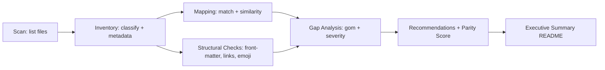

# Tài Liệu Thiết Kế (Design Document)

## Overview

Audit `claudekit-vs-kirokit` là một tính năng one-shot tạo bộ tài liệu Markdown so sánh hai bộ kit. Tính năng KHÔNG sinh code runtime; thay vào đó, một quy trình thủ công có hỗ trợ tool (filesystem listing, ripgrep, file reading, file writing) đọc dữ liệu từ hai gốc và sinh ra báo cáo có cấu trúc tại `docs/audits/claudekit-vs-kirokit/`.

Quy trình audit gồm 6 bước tuần tự:

1. **Scan** - Liệt kê file ở hai gốc, lọc theo pattern exclude.
2. **Inventory** - Phân loại artifact theo `Artifact_Type`, trích metadata.
3. **Mapping** - Khớp artifact Source ↔ Target, tính similarity.
4. **Structural Checks** - Kiểm tra front-matter, hook references, link broken, emoji/PII.
5. **Gap Analysis** - Gom phát hiện thành Gap_List có severity, đếm thống kê.
6. **Recommendations + Executive Summary** - Sinh action item theo priority, tính Parity Score, viết README.

Mỗi bước đọc đầu ra của bước trước dưới dạng JSON trung gian (lưu trong `appendix/`), giữ tính tái lập và cho phép re-run từng bước riêng lẻ khi cần.

### Mục tiêu thiết kế

- **Đơn giản**: Pipeline tuyến tính, không có state phức tạp, không daemon.
- **Tái lập**: Mọi tham số đặt trong `methodology.md`; mọi file output ghi đè được mà không phá thư mục gốc.
- **Minh bạch**: Mỗi gap kèm `evidence` (đường dẫn + trích đoạn ngắn); appendix lưu file listing đầy đủ.
- **Không phụ thuộc môi trường**: Không cần network, không cần build tool. Có thể chạy bằng tổ hợp tool có sẵn của agent.

## Architecture

### Pipeline tổng quan



### Phân chia trách nhiệm

| Bước | Đầu vào | Đầu ra trung gian | File output |
|------|---------|--------------------|-------------|
| Scan | Filesystem | `appendix/source-files.txt`, `appendix/target-files-<preset>.txt` | - |
| Inventory | File listing | `appendix/inventory-source.json`, `appendix/inventory-target.json` | `inventory-source.md`, `inventory-target-<preset>.md`, `inventory-target-summary.md` |
| Mapping | Inventory JSON + nội dung file | `appendix/mapping.json` | `mapping.md`, `mapping.csv` |
| Structural Checks | Inventory + nội dung file | `appendix/structural-findings.json` | (gộp vào `gaps.md`) |
| Gap Analysis | Mapping + Structural | `appendix/gaps.json` | `gaps.md`, `gaps.csv` |
| Recommendations + Summary | Gap_List | - | `recommendations.md`, `README.md`, `methodology.md` |

### Lý do chọn pipeline tuyến tính

- Mỗi bước chỉ phụ thuộc đầu ra bước trước, dễ debug và re-run.
- Trung gian JSON cho phép kiểm tra giữa chừng và viết property test trên format dữ liệu, không cần parse Markdown.
- Bước Mapping và Structural Checks độc lập nên có thể chạy song song khi muốn tăng tốc, nhưng không bắt buộc.

## Components and Interfaces

### Component 1: Scanner

**Trách nhiệm**: Liệt kê đầy đủ file trong hai gốc, áp dụng pattern loại trừ.

**Interface**:

- Input: `roots = [{name: "source", path: "claudekit-engineer-main"}, {name: "target", path: "."}]`, `exclude_patterns = ["node_modules/", "dist/", ".git/", ".coverage", "repomix-output.xml", "*.tar.gz", "*.zip"]`.
- Output: hai file text plain, một dòng một path tương đối (so với workspace root).

**Tool sử dụng**: `listDirectory` (depth lớn) hoặc `fileSearch` với glob `**/*`, sau đó lọc client-side.

### Component 2: Inventory Builder

**Trách nhiệm**: Phân loại từng file vào một `Artifact_Type` theo path prefix, trích metadata cụ thể.

**Quy tắc phân loại** (theo path prefix, ưu tiên match trước):

| Path prefix Source | Path prefix Target | Artifact_Type |
|--------------------|---------------------|---------------|
| `claudekit-engineer-main/.claude/agents/` | `presets/<preset>/agents/` | agent |
| `claudekit-engineer-main/.claude/skills/` | `presets/<preset>/skills/` | skill |
| `claudekit-engineer-main/.claude/commands/` | `presets/<preset>/commands/` | command |
| `claudekit-engineer-main/.claude/hooks/` | `presets/<preset>/hooks/` | hook |
| `claudekit-engineer-main/.claude/workflows/` | `presets/<preset>/workflows/` | workflow |
| - | `presets/<preset>/steering/` | steering |
| `claudekit-engineer-main/.claude/settings.json` | `presets/<preset>/settings.json` | settings |
| `claudekit-engineer-main/.claude/statusline.{js,sh,ps1}` | `presets/<preset>/statusline.*` | statusline |
| `claudekit-engineer-main/.claude/metadata.json` | `presets/<preset>/manifest.json` | metadata |
| `claudekit-engineer-main/.claude/.mcp.json.example` | `presets/<preset>/.mcp.json.example` | mcp_template |
| `claudekit-engineer-main/.claude/.env.example` | `presets/<preset>/.env.example` | env_example |
| `claudekit-engineer-main/docs/` | `docs/` | docs_template |
| - | `.kiro/specs/<spec>/templates/` | spec_template |

**Trích metadata**:

- Agent/Command: parse YAML front-matter ở 30 dòng đầu (giữa hai dòng `---`), lấy field `name`, `description`, `model`, `tools`, `inclusion`, `argument-hint`.
- Skill: kiểm tra `SKILL.md` có ở root folder không; liệt kê subdirectory (`references/`, `scripts/`, `assets/`, `tests/`, `workflows/`); đếm dòng `SKILL.md`.
- Hook: trích extension; group theo basename để phát hiện Cross_Platform_Triple.
- Manifest/settings: parse JSON, lấy field `files`, `minCounts`, `mcpServers`, `hooks`.

**Interface**:

- Input: file listing + workspace.
- Output: `inventory-source.json` và `inventory-target.json` (xem schema bên Data Models).

### Component 3: Mapper

**Trách nhiệm**: Với mỗi artifact Source, tìm artifact tương đương trong từng preset Target, gán nhãn `match | divergent | missing | n/a` và similarity score.

**Thuật toán khớp** (chạy theo thứ tự, dừng khi tìm thấy ứng viên đầu tiên):

1. Khớp basename (loại trừ extension nếu là hook) trong cùng `Artifact_Type` của preset.
2. Khớp đường dẫn tương đối sau khi normalize prefix: `claudekit-engineer-main/.claude/<type>/X` ↔ `presets/<preset>/<type>/X`.
3. Với agent: khớp `name` trong front-matter.
4. Với command: khớp slug suy ra từ đường dẫn (vd `commands/git/pr.md` → slug `git/pr`).
5. Nếu không tìm thấy: gán `missing`. Nếu artifact preset không khớp được với artifact source nào: thêm vào `target-only`.

**Tính similarity** (line-based Jaccard):

- Đọc nội dung text của hai file, split theo `\n`, strip whitespace, bỏ dòng rỗng.
- Build set các dòng còn lại cho mỗi file: `S_a`, `S_b`.
- `similarity = |S_a ∩ S_b| / |S_a ∪ S_b|` (giá trị trong [0, 1]).
- Nhân 100 và làm tròn để lưu thành phần trăm nguyên.

**Quy tắc nhãn**:

- `similarity >= 0.95` và có context keyword phù hợp preset → `match`.
- `similarity >= 0.95` nhưng không có context keyword → `match` (nhãn) NHƯNG sinh thêm Gap `divergent` severity `medium` (yêu cầu 7.2: "chưa tùy biến").
- `0.20 < similarity < 0.95` → `divergent`.
- `similarity <= 0.20` hoặc không tìm thấy ứng viên → `missing`.
- Artifact_Type không áp dụng cho preset (ví dụ `_template` không cần `mcp_template`) → `n/a`.

**Interface**:

- Input: `inventory-source.json`, `inventory-target.json`, content reader.
- Output: `mapping.json` chứa một mảng cell `{source_id, target_id, preset, label, similarity}`.

### Component 4: Structural Checker

**Trách nhiệm**: Kiểm tra mỗi artifact tuân thủ các rule cấu trúc trong Requirement 5 và Requirement 7.

**Danh sách check**:

| Mã check | Đối tượng | Điều kiện vi phạm | Severity |
|----------|-----------|---------------------|----------|
| FM-AGENT | Agent | Thiếu một trong: `inclusion`, `name`, `description`, `model` | medium |
| FM-CMD | Command | Thiếu một trong: `inclusion`, `description`, `argument-hint` | low |
| SKILL-MD | Skill folder | Không có `SKILL.md` và không phải Sub_Skill_Container | high |
| SKILL-PD | SKILL.md | Số dòng > 200 và không có thư mục `references/` | low |
| HOOK-REF | settings.json | File hook được khai báo nhưng không tồn tại | critical |
| TRIPLE | Hook | Source có triple đầy đủ, target preset thiếu biến thể | medium |
| EMOJI | Bất kỳ artifact target nào | Chứa ký tự thuộc Unicode emoji block | low |
| PII | Bất kỳ artifact target nào | Match regex email hoặc số điện thoại | low |
| LINK | Markdown target | Link tương đối `./...` hoặc `../...` không tồn tại | medium |
| MIN-COUNT | manifest.json | `minCounts.<type>` > số đếm thực tế trên disk | high |

**Sub_Skill_Container**: thư mục skill không có `SKILL.md` riêng nhưng chứa ≥ 2 subdirectory mỗi sub có `SKILL.md` riêng.

**Interface**:

- Input: inventory + mapping + content reader.
- Output: `structural-findings.json` mảng `{check_code, artifact_path, preset, severity, evidence}`.

### Component 5: Gap Aggregator

**Trách nhiệm**: Gom kết quả từ Mapper và Structural Checker thành Gap_List duy nhất, sinh `id`, gom entry trùng theo artifact.

**Quy tắc gom**:

- Mỗi finding (mapping `missing`/`divergent` hoặc structural finding) tạo một Gap candidate.
- Hai candidate cùng `(type, artifact_path_source, description)` nhưng khác `preset_affected` → gom vào một Gap với `preset_affected` thành mảng.
- `id` được sinh deterministic: `GAP-<NNN>` với `NNN` là index sau khi sort theo (severity desc, type asc, artifact_path asc).

**Interface**:

- Input: `mapping.json`, `structural-findings.json`.
- Output: `gaps.json` (chuẩn hóa) và `gaps.csv` (flat, một dòng một (gap, preset)).

### Component 6: Recommender + Reporter

**Trách nhiệm**:

1. Map severity → priority theo bảng cố định.
2. Gom Gap có cùng `proposed_action` (heuristic: cùng `type` + cùng `Artifact_Type` + cùng nhóm thư mục) thành một recommendation.
3. Tính Parity Score cho mỗi preset:
   `parity = (matched_count + 0.5 × divergent_count) / source_total_artifact_count × 100`, làm tròn nguyên.
   `source_total_artifact_count` chỉ đếm artifact áp dụng được cho preset đó (loại trừ cell `n/a`).
4. Sinh file Markdown cuối cùng theo template trong section "Output Layout" bên dưới.

**Bảng map severity → priority**:

| Severity | Priority |
|----------|----------|
| critical | P0 |
| high | P1 |
| medium | P2 |
| low | P3 |
| informational | P3 |

**Sắp xếp Recommendation_List**: `priority` tăng dần (P0 đầu) → `effort` tăng dần (S → L).

## Data Models

### Inventory entry

```json
{
  "id": "src.agent.researcher",
  "kit": "source",
  "preset": null,
  "artifact_type": "agent",
  "path": "claudekit-engineer-main/.claude/agents/researcher.md",
  "basename": "researcher",
  "size_lines": 142,
  "front_matter": {
    "present": true,
    "fields": {
      "name": "researcher",
      "description": "...",
      "model": "haiku",
      "inclusion": "manual",
      "tools": ["Glob", "Grep"]
    }
  },
  "extras": {
    "is_sub_skill_container": false,
    "subdirs": ["references", "scripts"],
    "cross_platform_group": null
  }
}
```

`id` được sinh deterministic: `<kit>.<artifact_type>.<basename>` (cộng `<preset>` nếu là target).

### Mapping cell

```json
{
  "source_id": "src.agent.researcher",
  "target_id": "tgt.backend.agent.researcher",
  "preset": "backend",
  "artifact_type": "agent",
  "label": "match",
  "similarity": 97,
  "context_keywords_found": ["nodejs", "fastify"]
}
```

`label ∈ {match, divergent, missing, n/a}`. Khi `label = missing` thì `target_id = null`.

### Gap entry

```json
{
  "id": "GAP-007",
  "type": "missing",
  "severity": "high",
  "artifact_path_source": "claudekit-engineer-main/.claude/agents/debugger.md",
  "artifact_path_target": null,
  "preset_affected": ["backend", "frontend", "fullstack"],
  "description": "Agent debugger không có trong 3 preset",
  "evidence": "Source basename=debugger.md kích thước 218 dòng; mapping label=missing"
}
```

### Recommendation entry

```json
{
  "id": "REC-003",
  "title": "Port agent debugger từ Source sang 3 preset",
  "linked_gap_ids": ["GAP-007"],
  "proposed_action": "Copy claudekit-engineer-main/.claude/agents/debugger.md sang presets/{backend,frontend,fullstack}/agents/debugger.md, tùy biến context keyword theo preset",
  "affected_presets": ["backend", "frontend", "fullstack"],
  "priority": "P1",
  "effort": "M",
  "owner_role": "preset-author"
}
```

### File listing entry (Scan output)

Plain text, một dòng một path. Không header.

## Output Layout

Cấu trúc cố định (Requirement 10):

```
docs/audits/claudekit-vs-kirokit/
├── README.md                          # Executive Summary
├── methodology.md                     # Tham số + công thức + ngưỡng
├── inventory-source.md
├── inventory-target-summary.md
├── inventory-target-backend.md
├── inventory-target-frontend.md
├── inventory-target-fullstack.md
├── inventory-target-mobile.md
├── inventory-target-devops.md
├── inventory-target-data-ai.md
├── inventory-target-_template.md
├── mapping.md
├── mapping.csv
├── gaps.md
├── gaps.csv
├── recommendations.md
└── appendix/
    ├── source-files.txt
    ├── target-files-backend.txt
    ├── target-files-frontend.txt
    ├── target-files-fullstack.txt
    ├── target-files-mobile.txt
    ├── target-files-devops.txt
    ├── target-files-data-ai.txt
    ├── target-files-_template.txt
    ├── inventory-source.json
    ├── inventory-target.json
    ├── mapping.json
    ├── structural-findings.json
    ├── gaps.json
    └── run.log
```

Mỗi file Markdown phải có dòng cuối: `_Generated at: <ISO-8601 timestamp>_`.


## Correctness Properties

_Một property là một đặc tính hoặc hành vi phải đúng cho mọi quá trình thực thi hợp lệ của hệ thống — một mệnh đề hình thức về việc hệ thống phải làm gì. Properties đóng vai trò cầu nối giữa specification dạng văn bản và đảm bảo chính xác có thể kiểm chứng tự động._

### Property 1: Coverage scan đúng và đủ

For all file path tồn tại dưới một trong hai gốc audit, file đó SHALL xuất hiện trong file listing tương ứng (`appendix/source-files.txt` hoặc `appendix/target-files-<preset>.txt`) khi và chỉ khi path đó không match bất kỳ exclude pattern nào.

**Validates: Requirements 1.4, 11.3**

### Property 2: Inventory phủ hết artifact theo prefix

For all file path trong file listing, nếu path khớp một path prefix của một `Artifact_Type` (theo bảng phân loại trong section Components), inventory phải chứa đúng một entry với `artifact_type` đó và `path` bằng path đầu vào.

**Validates: Requirements 2.1, 3.2**

### Property 3: Inventory entry có đủ trường metadata theo type

For all inventory entry, tập trường metadata bắt buộc phải khớp schema theo `artifact_type`: agent/command có `front_matter.fields`, skill có `extras.subdirs` và `extras.is_sub_skill_container`, hook có `extras.cross_platform_group`. Mọi field bắt buộc phải có giá trị non-null.

**Validates: Requirements 2.2, 2.3, 2.4, 2.5**

### Property 4: Manifest mismatch được phát hiện đầy đủ

For all preset có `manifest.json`, với mọi entry trong `manifest.files` mà file đích không tồn tại trên disk, một structural finding phải được sinh; ngược lại, với mọi file tồn tại dưới `presets/<preset>/` thuộc một `Artifact_Type` được audit nhưng không có trong `manifest.files`, một structural finding phải được sinh.

**Validates: Requirements 3.3, 3.4**

### Property 5: Mapping cell hợp lệ về schema

For all cell trong `mapping.json`, `label` phải thuộc tập `{match, divergent, missing, n/a}`; nếu `label ∈ {match, divergent}` thì `similarity` là số nguyên trong `[0, 100]` và `target_id ≠ null`; nếu `label = missing` thì `target_id = null`.

**Validates: Requirements 4.1, 4.5**

### Property 6: Mapping bao phủ hai chiều

For all artifact source mà tất cả 7 preset đều có `label = missing`, artifact đó phải xuất hiện trong "Source-only artifacts" list. For all artifact target không khớp được với artifact source nào, artifact đó phải xuất hiện trong "Target-only artifacts" list của preset tương ứng.

**Validates: Requirements 4.3, 4.4**

### Property 7: Front-matter check sinh đúng severity

For all artifact có `artifact_type = agent` và thiếu một trong các field `inclusion`, `name`, `description`, `model`, một gap loại `structural` với severity `medium` phải được sinh. For all artifact có `artifact_type = command` và thiếu một trong các field `inclusion`, `description`, `argument-hint`, một gap loại `structural` với severity `low` phải được sinh.

**Validates: Requirements 5.1, 5.2**

### Property 8: Skill structure check

For all skill folder không có `SKILL.md` (case-insensitive) và không phải `Sub_Skill_Container`, một gap loại `structural` với severity `high` phải được sinh. For all `SKILL.md` có `size_lines > 200` và folder không chứa subdirectory `references/`, một gap loại `structural` với severity `low` phải được sinh.

**Validates: Requirements 5.3, 5.4**

### Property 9: Hook reference hợp lệ

For all hook reference được khai báo trong `settings.json` của Source_Kit hoặc bất kỳ preset Target_Kit nào mà file đích không tồn tại trên disk, một gap loại `structural` với severity `critical` phải được sinh.

**Validates: Requirements 5.5**

### Property 10: Cross-platform triple đầy đủ

For all `Cross_Platform_Triple` group được Source_Kit cung cấp đầy đủ 3 biến thể (`.js`, `.sh`, `.ps1`), nếu một preset Target_Kit thiếu ít nhất một biến thể, một gap loại `missing` với severity `medium` phải được sinh và liệt kê biến thể bị thiếu.

**Validates: Requirements 5.6**

### Property 11: Emoji và PII không lọt vào target hoặc executive summary

For all target artifact chứa ký tự thuộc Unicode emoji block hoặc match regex email/phone, một gap loại `structural` với severity `low` phải được sinh và đính kèm số dòng vi phạm. For all ký tự trong file `README.md` (Executive Summary), ký tự đó không thuộc Unicode emoji block.

**Validates: Requirements 7.3, 9.6**

### Property 12: Link tương đối phải hợp lệ

For all link tương đối kiểu `./X` hoặc `../X` trong file Markdown của Target_Kit mà file đích không tồn tại, một gap loại `structural` với severity `medium` phải được sinh.

**Validates: Requirements 7.4**

### Property 13: Gap entry có đủ schema

For all gap trong `Gap_List`, entry phải có đủ 8 trường non-null: `id`, `type`, `severity`, `artifact_path_source`, `preset_affected` (mảng non-empty), `description`, `evidence`, và `artifact_path_target` (có thể null khi `type = missing`).

**Validates: Requirements 6.1**

### Property 14: Mapping severity → priority deterministic

For all gap có severity `s`, priority của recommendation tương ứng phải bằng `f(s)` với `f` là hàm cố định: `critical → P0`, `high → P1`, `medium → P2`, `low → P3`, `informational → P3`. Hàm phải total và deterministic.

**Validates: Requirements 6.2, 8.2**

### Property 15: Gap deduplication

For all bộ ba `(type, artifact_path_source, description)`, `Gap_List` chứa đúng một entry với bộ ba đó; entry đó có `preset_affected` là tập hợp tất cả preset bị ảnh hưởng.

**Validates: Requirements 6.4**

### Property 16: MinCount enforcement

For all preset có khai báo `minCounts.<artifact_type> = N`, nếu số đếm thực tế của artifact thuộc type đó trên disk nhỏ hơn `N`, một gap loại `missing` với severity `high` phải được sinh, đính kèm cả số đếm thực tế lẫn ngưỡng `N`.

**Validates: Requirements 12.2, 12.3**

### Property 17: Recommendation schema và ordering

For all recommendation trong `Recommendation_List`, entry phải có đủ 8 trường: `id`, `title`, `linked_gap_ids` (non-empty), `proposed_action`, `affected_presets`, `priority`, `effort`, `owner_role`. For all cặp recommendation `(r_i, r_{i+1})` liên tiếp trong list đã sort, ordering phải tuân thủ: `priority(r_i) ≤ priority(r_{i+1})`, và nếu bằng nhau thì `effort(r_i) ≤ effort(r_{i+1})` (theo thứ tự `S < M < L`). Section "Top 10 Recommendations" trong README chứa tối đa 10 entry đầu tiên của list này.

**Validates: Requirements 8.1, 8.5, 9.4**

### Property 18: Recommendation deduplication

For all tập gap có cùng `(type, artifact_type, action_group)` (với `action_group` là heuristic gom theo nhóm thư mục đích), `Recommendation_List` chứa đúng một entry với `linked_gap_ids` là tập hợp `id` của tất cả gap trong nhóm.

**Validates: Requirements 8.3**

### Property 19: Parity Score đúng công thức và sort

For all preset `p` với `matched_count = m`, `divergent_count = d`, `source_total_artifact_count = s` (chỉ đếm artifact áp dụng được, loại cell `n/a`), `parity(p) = round((m + 0.5 × d) / s × 100)` nằm trong `[0, 100]`. For all cặp preset liên tiếp trong bảng Parity Score, `parity[i] ≥ parity[i+1]`.

**Validates: Requirements 9.2, 9.3**

### Property 20: Output file ràng buộc prefix và timestamp

For all file mà audit tạo ra, đường dẫn của file phải bắt đầu bằng prefix `docs/audits/claudekit-vs-kirokit/`. For all file Markdown output, dòng cuối cùng phải match regex `_Generated at: <ISO-8601 timestamp>_`.

**Validates: Requirements 10.1, 10.4, 10.5**

### Property 21: Methodology phản ánh đúng tham số chạy

For all tham số ảnh hưởng kết quả audit (similarity threshold, exclude patterns, context keywords cho mỗi preset, severity rules), giá trị thực tế đã dùng tại runtime phải xuất hiện trong header của `methodology.md`; nói cách khác, đọc `methodology.md` cho phép tái lập đúng tham số đã chạy.

**Validates: Requirements 11.2**

## Error Handling

Audit_Process là pipeline tuần tự, lỗi tại mỗi bước được xử lý theo nguyên tắc fail-fast nhưng có log đầy đủ:

| Tình huống | Hành vi |
|------------|---------|
| Source_Kit hoặc Target_Kit root không tồn tại | Dừng ngay, ghi lỗi vào `appendix/run.log` với đường dẫn bị thiếu, KHÔNG tạo bất kỳ file output nào (Requirement 1.3) |
| File không đọc được (permission denied, binary lớn) | Skip file, ghi cảnh báo vào `run.log` với path và lý do, không dừng pipeline |
| Front-matter YAML parse lỗi | Đánh dấu `front_matter.present = true` nhưng `front_matter.fields = null`, sinh structural finding "front-matter malformed" severity `medium` |
| `manifest.json` parse lỗi | Sinh gap `structural` severity `critical` cho preset đó, tiếp tục với các preset khác |
| `settings.json` parse lỗi (Source) | Sinh gap `structural` severity `critical`, bỏ qua các check phụ thuộc settings (HOOK-REF), tiếp tục |
| Similarity computation fail (file binary) | Gán `similarity = null`, label = `divergent` mặc định, ghi cảnh báo vào `run.log` |
| Re-run audit khi file output đang có | Ghi đè file (Requirement 10.4); không xóa thư mục gốc; mỗi file ghi đè cập nhật dòng timestamp cuối |
| Disk full khi ghi output | Dừng, log lỗi; các file đã ghi giữ nguyên (đã có timestamp lần ghi gần nhất) |

Mỗi entry trong `run.log` có format:

```
<ISO-8601 timestamp> <LEVEL> <stage> <message>
```

Với `LEVEL ∈ {INFO, WARN, ERROR}`, `stage ∈ {scan, inventory, mapping, structural, gap, recommend, summary}`.

## Testing Strategy

Audit là tính năng one-shot tạo tài liệu, nên testing chia làm hai tầng: (1) test các pure function bên trong pipeline (similarity, severity assignment, parity score, dedup), (2) test integration đầu cuối tạo Audit_Report mẫu trên fixture nhỏ.

### Tầng 1: Unit + Property tests cho pure function

**Property-Based Testing**:

- Library: `fast-check` (TypeScript) hoặc `hypothesis` (Python) tùy ngôn ngữ runner audit. Lựa chọn cuối cùng được ghi trong tasks.md.
- Mỗi property test cấu hình tối thiểu **100 iterations**.
- Mỗi property test phải có comment tag dạng:
  ```
  // Feature: claudekit-vs-kirokit-audit, Property <N>: <property text>
  ```
- Mỗi correctness property trong section trên SHALL được implement bởi đúng MỘT property test.

**Coverage thuộc tầng 1**:

| Function | Property áp dụng |
|----------|-------------------|
| `classify_artifact(path) -> Artifact_Type` | P2 |
| `extract_metadata(file) -> InventoryEntry` | P3 |
| `compute_similarity(file_a, file_b) -> int` | P5 (range), P19 (đầu vào parity) |
| `check_front_matter(entry) -> Finding | null` | P7 |
| `check_skill_structure(entry) -> Finding | null` | P8 |
| `check_hook_reference(settings, files) -> Finding[]` | P9 |
| `check_triple(source_group, target_group) -> Finding | null` | P10 |
| `detect_emoji_pii(content) -> Finding[]` | P11 |
| `check_links(markdown, fs) -> Finding[]` | P12 |
| `dedupe_gaps(findings) -> Gap[]` | P15 |
| `severity_to_priority(severity) -> Priority` | P14 |
| `dedupe_recommendations(gaps) -> Recommendation[]` | P18 |
| `sort_recommendations(list) -> Recommendation[]` | P17 |
| `compute_parity(matched, divergent, total) -> int` | P19 |
| `min_count_check(manifest, counts) -> Finding[]` | P16 |

**Unit examples** (bổ sung property, không thay thế):

- Snapshot test với fixture tối thiểu (1 agent + 1 skill + 1 command + 1 hook triple + 1 manifest) cho mỗi check function.
- Edge case rõ: skill folder rỗng, manifest rỗng `{}`, settings.json không có `hooks`, file 0 dòng, file binary.

### Tầng 2: Integration tests

**Fixture**: Một bản thu nhỏ của hai kit dưới `__fixtures__/`, gồm:

- Source: 2 agent, 1 skill có `SKILL.md`, 1 skill là sub-skill container, 1 command, 1 hook triple, `settings.json`, `metadata.json`.
- Target: 2 preset (`fixture-a`, `fixture-b`) mỗi cái có manifest + một subset artifact có chủ đích thiếu/lệch.

**Test cases**:

1. **Happy path**: Chạy pipeline đầu cuối, kiểm tra cấu trúc thư mục output đầy đủ (Requirement 10.2 → example test) và mỗi file Markdown có timestamp footer (P20).
2. **Source_Kit thiếu**: Đặt path không tồn tại, kiểm tra audit fail, không có file output (Requirement 1.3).
3. **Manifest mismatch**: Thêm file vào filesystem nhưng không update manifest, kiểm tra finding xuất hiện (P4).
4. **Hook reference broken**: Khai báo hook trong settings nhưng không tạo file, kiểm tra gap critical (P9).
5. **Re-run idempotency**: Chạy audit hai lần liên tiếp, đảm bảo output file content thay đổi tối đa ở dòng timestamp.

**Tag format**: Mỗi integration test cũng dùng tag comment như tầng 1.

### Bảng test → property tham chiếu

Bảng đầy đủ ánh xạ test → property → requirement sẽ được sinh trong `tasks.md` ở phase tiếp theo, đảm bảo mỗi correctness property có đúng một property-based test tương ứng (Requirement-mandated dual testing approach).

_Generated at: 2025-01-15T00:00:00Z_
