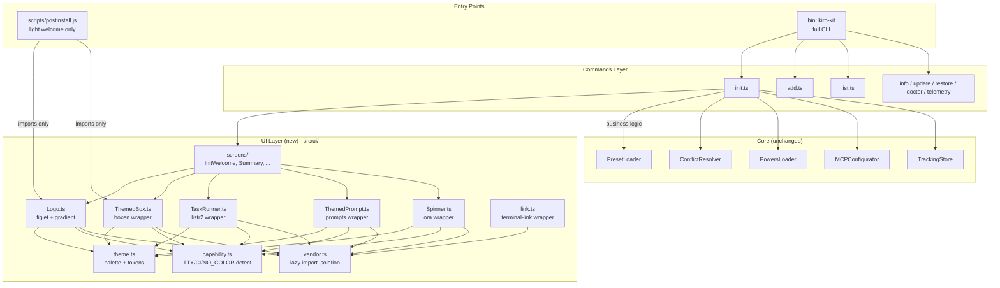
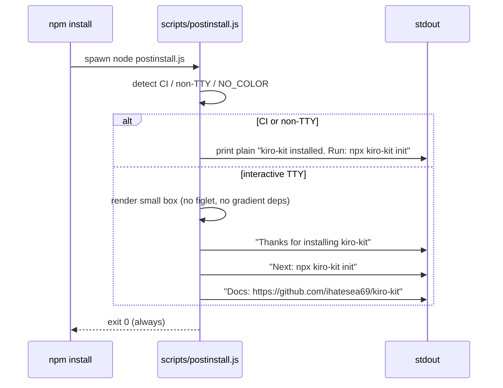
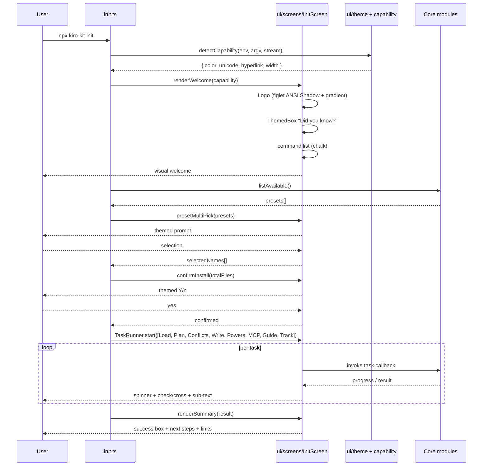

# Design Document: CLI UI Redesign

## Overview

Tài liệu thiết kế lại lớp giao diện dòng lệnh (CLI) cho `kiro-kit`, lấy cảm hứng từ KiroGraph với ASCII logo lớn, gradient tím/xanh, box "Did you know?", task progress đẹp và success summary. Mục tiêu là biến trải nghiệm `npx kiro-kit init` từ một loạt `console.log` thô thành một flow trực quan, có cảm giác "premium" trong khi vẫn giữ nguyên semantic của các luồng nghiệp vụ hiện hữu (chọn presets, conflict resolution, Powers prompts, MCP config, setup guide, tracking metadata).

Thiết kế tách rõ hai bề mặt: (1) một **postinstall script** rất nhẹ, chỉ in một welcome box + next-step hint khi user chạy `npm install kiro-kit` — không block install, không bao giờ prompt; và (2) một **rich UI layer** chỉ kích hoạt trong `npx kiro-kit init` (và mở rộng dần sang các command khác), gồm Logo, ThemedBox, TaskRunner, Spinner, ThemedPrompt. Lớp UI mới được thiết kế như một "presentation layer" thuần - toàn bộ business logic (`PresetLoader`, `ConflictResolver`, `PowersLoader`, `MCPConfigurator`, ...) không thay đổi.

Tất cả ANSI output đều được kiểm soát qua một `terminalCapability` detector (tôn trọng `NO_COLOR`, `--no-color`, non-TTY, `CI`, `TERM=dumb`) và có ASCII fallback cho mỗi component. Các thư viện bên ngoài (`figlet`, `gradient-string`, `chalk`, `boxen`, `ora`, `listr2`, `terminal-link`) được pin chặt và import qua một `ui/vendor` adapter để có thể swap khi cần.

## Architecture



**Nguyên tắc kiến trúc:**

- **Pure presentation layer**: `src/ui/` không gọi vào core, chỉ nhận data và callback. Core không biết UI tồn tại.
- **Lazy vendor imports**: figlet/boxen/ora/listr2/prompts được dynamic-import bên trong `vendor.ts` để postinstall và một số command nhẹ (như `list`, `--version`) không trả phí cold-start.
- **Capability-first**: mọi component nhận `capability` (hoặc đọc từ singleton) và tự fallback. Không có code path nào in raw ANSI nếu `capability.color === false`.
- **Postinstall isolation**: `scripts/postinstall.js` là plain JS (không qua tsup), chỉ dùng built-in `process.stdout` và **không** require các dependency CLI nặng - tránh fail npm install khi optional dep bị thiếu.

## Sequence Diagrams

### Sequence 1: `npm install kiro-kit` (postinstall, light)



### Sequence 2: `npx kiro-kit init` (rich UI flow)



### Sequence 3: Capability degradation paths

```mermaid
sequenceDiagram
    participant CLI as init / postinstall
    participant CAP as capability.ts
    participant LOGO as Logo.ts
    participant BOX as ThemedBox.ts

    CLI->>CAP: detect()
    alt NO_COLOR=1 or --no-color
        CAP-->>CLI: color=false, unicode=true
        CLI->>LOGO: render()
        LOGO-->>CLI: plain ASCII figlet, no gradient
        CLI->>BOX: render()
        BOX-->>CLI: ASCII border, no color
    else non-TTY (pipe, CI)
        CAP-->>CLI: color=false, unicode=false, animate=false
        CLI->>LOGO: render()
        LOGO-->>CLI: single-line text "kiro-kit vX.Y.Z"
        CLI->>BOX: render()
        BOX-->>CLI: simple "--- title ---" header + body
    else full TTY + truecolor
        CAP-->>CLI: color=true, unicode=true, animate=true, hyperlink=true
        CLI->>LOGO: render()
        LOGO-->>CLI: figlet + gradient + bold
        CLI->>BOX: render()
        BOX-->>CLI: rounded box with purple border
    end
```

## Components and Interfaces

### Component 1: TerminalCapability

**Purpose**: Single source of truth cho khả năng render của terminal hiện tại. Mọi UI component phải tham chiếu nó để fallback đúng cách.

**Interface**:

```typescript
export interface TerminalCapability {
  /** stdout is a TTY (not pipe/file) */
  isTTY: boolean;
  /** true unless NO_COLOR / --no-color / non-TTY / CI without FORCE_COLOR */
  color: boolean;
  /** true if terminal likely supports 16M colors (truecolor) */
  truecolor: boolean;
  /** unicode box-drawing/emoji safe (false on legacy Windows cmd) */
  unicode: boolean;
  /** OSC-8 hyperlinks supported */
  hyperlink: boolean;
  /** allow spinners / re-render */
  animate: boolean;
  /** terminal columns (fallback 80) */
  columns: number;
}

export function detectCapability(
  env?: NodeJS.ProcessEnv,
  argv?: readonly string[],
  stream?: NodeJS.WriteStream,
): TerminalCapability;
```

**Responsibilities**:

- Đọc `process.env` (`NO_COLOR`, `FORCE_COLOR`, `CI`, `TERM`, `COLORTERM`, `WT_SESSION`).
- Kiểm tra `stream.isTTY` và `stream.columns`.
- Trả về một object **immutable**, có thể inject để test.
- Không có side effect (không in gì, không cache module-level mặc định - caller chủ động cache).

### Component 2: Theme

**Purpose**: Định nghĩa palette, semantic tokens, và helper compose màu. Tách biệt giá trị màu khỏi component.

**Interface**:

```typescript
export interface ThemePalette {
  primary: string;     // #a970ff
  secondary: string;   // #8bd5ff
  muted: string;       // #6f6a7c
  text: string;        // #f4f1ff
  danger: string;      // #ff5c8a
  success: string;     // #22c55e
  warn: string;        // #f5b042
}

export interface ThemeTokens {
  /** gradient stops for logo (primary -> secondary) */
  logoGradient: readonly [string, string, ...string[]];
  /** style primitives */
  heading: (s: string) => string;
  command: (s: string) => string;
  flag: (s: string) => string;
  pathStyle: (s: string) => string;
  success: (s: string) => string;
  danger: (s: string) => string;
  muted: (s: string) => string;
  link: (label: string, url: string) => string;
}

export function createTheme(
  capability: TerminalCapability,
  palette?: Partial<ThemePalette>,
): ThemeTokens;
```

**Responsibilities**:

- Wrap chalk với hex màu chính xác khi `truecolor`, fallback xuống ANSI 256 khi chỉ có `color`, và identity function khi `color=false`.
- Cung cấp helper `link(label, url)` dùng `terminal-link` nếu `hyperlink=true`, không thì in `label (url)`.
- Không export trực tiếp giá trị hex - chỉ export functions để giữ tính testable.

### Component 3: Logo

**Purpose**: Render ASCII logo lớn cho welcome screen.

**Interface**:

```typescript
export interface LogoOptions {
  text?: string;                       // default: 'kiro-kit'
  font?: 'ANSI Shadow' | 'Big' | 'Slant' | '3D-ASCII' | 'Bloody';
  subtitle?: string;                   // e.g. 'Engineer-grade Kiro presets'
  version?: string;
}

export interface LogoRenderer {
  render(opts: LogoOptions): string;        // multi-line ASCII art
  renderCompact(opts: LogoOptions): string; // single-line fallback
}

export function createLogo(
  capability: TerminalCapability,
  theme: ThemeTokens,
): LogoRenderer;
```

**Responsibilities**:

- Khi `unicode + color`: dùng `figlet.textSync(text, { font })` rồi map qua `gradient-string` với palette `logoGradient`.
- Khi `color=false` hoặc `animate=false`: trả figlet plain text (vẫn ASCII art nhưng không màu).
- Khi `unicode=false` hoặc `columns < 60`: trả `renderCompact` - `kiro-kit vX.Y.Z` bold + subtitle dim.
- **Không in** ra stdout - chỉ trả string. Caller quyết định nơi/khi in.

### Component 4: ThemedBox

**Purpose**: Wrapper boxen tạo box với border tím, padding chuẩn, tiêu đề; có biến thể cho "Did you know?", "Success", "Warning", "Error".

**Interface**:

```typescript
export type BoxVariant = 'info' | 'tip' | 'success' | 'warn' | 'error';

export interface ThemedBoxOptions {
  title?: string;
  variant?: BoxVariant;        // default 'info'
  padding?: number;            // default 1
  width?: number;              // default min(capability.columns - 4, 80)
}

export interface ThemedBoxRenderer {
  render(content: string, opts?: ThemedBoxOptions): string;
}

export function createThemedBox(
  capability: TerminalCapability,
  theme: ThemeTokens,
): ThemedBoxRenderer;
```

**Responsibilities**:

- Map `variant` -> `borderColor` qua theme (info=primary, tip=secondary, success=success, warn=warn, error=danger).
- `unicode=false` -> border style `'classic'` (`+`/`-`/`|`); ngược lại `'round'`.
- `animate=false` không ảnh hưởng (box là static).
- Tự wrap text theo `width`; preserve các dòng đã có ANSI nếu strip-ansi length không vượt width.

### Component 5: TaskRunner

**Purpose**: Hiển thị task progress dạng list (spinner cho task running, check cho ok, cross cho fail) dùng `listr2`, có ASCII fallback.

**Interface**:

```typescript
export interface TaskDef<C = unknown> {
  title: string;
  /** Optional: shown under spinner while running */
  hint?: string;
  /** Skip predicate; receive shared context */
  skip?: (ctx: C) => boolean | string | Promise<boolean | string>;
  /** Returns the task result; may throw to mark failed */
  run: (ctx: C, helpers: TaskHelpers) => Promise<void>;
}

export interface TaskHelpers {
  setOutput(line: string): void;     // stream sub-text under task
  setTitle(title: string): void;     // mutate title (e.g., "Wrote 12 files")
}

export interface TaskRunner<C> {
  run(initialCtx: C): Promise<C>;
}

export function createTaskRunner<C>(
  tasks: TaskDef<C>[],
  capability: TerminalCapability,
  theme: ThemeTokens,
): TaskRunner<C>;
```

**Responsibilities**:

- Khi `animate=true && color=true`: dùng `listr2` với renderer `default`.
- Khi `animate=false || !isTTY`: dùng renderer `simple` (in tuần tự `-> task name ... done`).
- Errors propagate ra với task title đính kèm để init.ts có thể format lỗi cuối cùng.

### Component 6: Spinner

**Purpose**: Spinner ngắn cho các thao tác không nằm trong TaskRunner (ví dụ resolve preset metadata trước khi prompt).

**Interface**:

```typescript
export interface SpinnerHandle {
  start(text?: string): SpinnerHandle;
  setText(text: string): void;
  succeed(text?: string): void;
  fail(text?: string): void;
  warn(text?: string): void;
  stop(): void;
}

export function createSpinner(
  capability: TerminalCapability,
  theme: ThemeTokens,
): SpinnerHandle;
```

**Responsibilities**:

- Wrap `ora`. Khi `animate=false`: `start()` in `-> {text}`; `succeed()` in `[ok] {text}`; `fail()` in `[x] {text}`.
- Tự gọi `stop()` khi process exit (signal handler) để không để spinner "lơ lửng".

### Component 7: ThemedPrompt

**Purpose**: Wrapper `prompts` (đề xuất hơn enquirer vì nhỏ, ESM-first, dễ test) cho multi-select preset, single-select tier, confirm, conflict-choice. Thay thế dần các readline custom prompt trong `init.ts` và `PowersPrompter.ts`.

**Interface**:

```typescript
export interface MultiSelectChoice {
  name: string;
  description: string;
  selected?: boolean;
  hint?: string;
}

export interface ConflictChoice {
  value: 'overwrite' | 'skip' | 'view-diff' | 'overwrite-all';
  label: string;
}

export interface ThemedPrompt {
  multiPickPresets(items: MultiSelectChoice[]): Promise<string[]>;
  selectTier<T extends string>(
    title: string,
    options: Array<{ value: T; label: string; hint?: string }>,
    defaultIndex?: number,
  ): Promise<T>;
  confirm(message: string, defaultYes?: boolean): Promise<boolean>;
  conflictChoice(targetRel: string): Promise<ConflictChoice['value']>;
}

export function createPrompt(
  capability: TerminalCapability,
  theme: ThemeTokens,
): ThemedPrompt;
```

**Responsibilities**:

- Khi `!isTTY`: `confirm` -> trả default; `multiPickPresets` -> trả `[]`; `conflictChoice` -> trả `'skip'`. Tương đương semantics hiện tại.
- Khi `isTTY` mà `color=false`: dùng `prompts` với theme primitives strip màu - vẫn interactive.
- Bắt SIGINT trong-prompt và reject `new Error('SIGINT')` để giữ exit code 130 hiện hữu.

### Component 8: Init Screens

**Purpose**: Compose các component trên thành các "màn hình" mà `init.ts` gọi tuần tự. Tách logic UI khỏi orchestrator.

**Interface**:

```typescript
export interface InitContext {
  capability: TerminalCapability;
  theme: ThemeTokens;
  cliVersion: string;
}

export interface WelcomeData {
  cliVersion: string;
  tipText: string;             // "Did you know?" content
  commands: Array<{ name: string; description: string }>;
}

export interface SummaryData {
  filesWritten: number;
  filesSkipped: number;
  presets: string[];
  setupGuidePath?: string;
  envExamplePath?: string;
  nextSteps: string[];
  docsUrl: string;
}

export interface InitScreens {
  welcome(data: WelcomeData): void;
  summary(data: SummaryData): void;
  errorBox(err: Error): void;
}

export function createInitScreens(ctx: InitContext): InitScreens;
```

## Data Models

### Model 1: TerminalCapability (recap)

```typescript
interface TerminalCapability {
  isTTY: boolean;
  color: boolean;
  truecolor: boolean;
  unicode: boolean;
  hyperlink: boolean;
  animate: boolean;
  columns: number;
}
```

**Validation Rules**:

- `truecolor === true` implies `color === true`.
- `animate === true` implies `isTTY === true`.
- `columns >= 20`; nếu detect < 20 thì clamp lên 20.
- Nếu `process.env.NO_COLOR` được set (any value) thì `color === false && truecolor === false`.
- Nếu `process.env.CI` được set và `FORCE_COLOR` không set thì `animate === false`.

### Model 2: ThemePalette

```typescript
interface ThemePalette {
  primary: string;
  secondary: string;
  muted: string;
  text: string;
  danger: string;
  success: string;
  warn: string;
}
```

**Validation Rules**:

- Mỗi field phải match regex `/^#[0-9a-fA-F]{6}$/`.
- `primary !== secondary` (gradient có ý nghĩa).
- Theme builder phải compute contrast với background giả định (đen) >= 3.0 cho `text`, `success`, `danger`, `warn` (kiểm tra unit test).

### Model 3: TaskDef Context

```typescript
interface InitTaskContext {
  workspaceRoot: string;
  selectedNames: string[];
  presets: ReadonlyArray<{ name: string; version: string; dir: string }>;
  filesPlanned: number;
  filesWritten: number;
  filesSkipped: number;
  conflictMode: 'force' | 'skip-existing' | 'interactive';
  powersFlag: 'none' | 'all' | 'interactive';
  yes: boolean;
  quiet: boolean;
  // populated as tasks execute
  trackedFiles?: ReadonlyArray<TrackedFile>;
  setupGuideWritten?: boolean;
  envExampleWritten?: boolean;
  errors: Array<{ taskTitle: string; error: Error; recoverable: boolean }>;
}
```

**Validation Rules**:

- `selectedNames.length >= 1` khi enter task chain.
- `filesWritten + filesSkipped <= filesPlanned + slack` (slack cho merge MCP/settings tạo thêm file).
- `errors[].recoverable === true` thì task chain tiếp tục; `false` thì abort + render error box.

### Model 4: PostinstallEnvelope

```typescript
interface PostinstallEnvelope {
  version: string;
  isCI: boolean;
  isTTY: boolean;
  noColor: boolean;
  message: 'full' | 'compact' | 'silent';
}
```

**Validation Rules**:

- `isCI || !isTTY` thì `message === 'silent' || 'compact'`.
- `noColor === true` thì không gọi vendor `chalk`/`boxen` modules.
- Postinstall **không bao giờ** trả non-zero exit, kể cả khi render fail (defensive try/catch toàn module).

## Algorithmic Pseudocode

### Algorithm: detectCapability

```pascal
ALGORITHM detectCapability(env, argv, stream)
INPUT: env (process.env), argv (process.argv), stream (NodeJS.WriteStream)
OUTPUT: capability (TerminalCapability)

BEGIN
  ASSERT env IS NOT NULL
  ASSERT stream IS NOT NULL

  isTTY ← stream.isTTY = true
  columns ← stream.columns IF stream.columns >= 20 ELSE 80

  // Color detection
  noColorFlag ← argv CONTAINS '--no-color'
  noColorEnv  ← env['NO_COLOR'] IS DEFINED AND env['NO_COLOR'] != ''
  forceColor  ← env['FORCE_COLOR'] IS DEFINED AND env['FORCE_COLOR'] != '0'

  IF noColorFlag OR noColorEnv THEN
    color ← false
    truecolor ← false
  ELSE IF NOT isTTY AND NOT forceColor THEN
    color ← false
    truecolor ← false
  ELSE
    color ← true
    truecolor ← (env['COLORTERM'] = 'truecolor' OR env['COLORTERM'] = '24bit')
                OR forceColor
  END IF

  // Unicode detection
  IF platform = 'win32' AND env['WT_SESSION'] IS UNDEFINED
                       AND env['TERM_PROGRAM'] IS UNDEFINED THEN
    unicode ← false
  ELSE IF env['TERM'] = 'dumb' THEN
    unicode ← false
  ELSE
    unicode ← true
  END IF

  // Hyperlink detection (best-effort)
  hyperlink ← isTTY AND color AND env['TERM_PROGRAM'] IN
              {'iTerm.app', 'WezTerm', 'vscode', 'Hyper'}

  // Animation
  isCI ← env['CI'] IS DEFINED AND env['CI'] != ''
  animate ← isTTY AND (NOT isCI OR forceColor)

  ASSERT (truecolor = false) OR (color = true)
  ASSERT (animate = false)   OR (isTTY = true)

  RETURN { isTTY, color, truecolor, unicode, hyperlink, animate, columns }
END
```

**Preconditions**:

- `env`, `argv`, `stream` đều defined (caller pass `process.env`, `process.argv`, `process.stdout`).

**Postconditions**:

- Object trả về là frozen (immutable), all fields populated.
- Hai invariant trên (`truecolor implies color`, `animate implies isTTY`) luôn đúng.
- Không có side effect lên `env`/`argv`/`stream`.

**Loop Invariants**: N/A (no loops).

### Algorithm: renderLogo

```pascal
ALGORITHM renderLogo(opts, capability, theme)
INPUT: opts (LogoOptions), capability, theme
OUTPUT: text (String, multi-line)

BEGIN
  text     ← opts.text     OR 'kiro-kit'
  font     ← opts.font     OR 'ANSI Shadow'
  subtitle ← opts.subtitle OR ''
  version  ← opts.version  OR ''

  // Compact path: too narrow or unicode disabled
  IF capability.columns < 60 OR capability.unicode = false THEN
    line ← text
    IF version != '' THEN line ← line + ' v' + version
    line ← theme.heading(line)
    IF subtitle != '' THEN line ← line + '\n' + theme.muted(subtitle)
    RETURN line
  END IF

  // Plain figlet (no color)
  ascii ← figlet.textSync(text, { font: font, horizontalLayout: 'default' })

  IF capability.color = false THEN
    body ← ascii
  ELSE
    body ← gradient(theme.logoGradient).multiline(ascii)
  END IF

  IF subtitle != '' OR version != '' THEN
    tagline ← subtitle
    IF version != '' THEN
      tagline ← tagline + (subtitle = '' ? '' : '  ') + 'v' + version
    END IF
    body ← body + '\n' + theme.muted(tagline)
  END IF

  ASSERT body != NULL AND length(body) > 0
  RETURN body
END
```

**Preconditions**:

- `figlet` và `gradient-string` đã được resolve qua `vendor.ts`.
- `theme.logoGradient.length >= 2`.

**Postconditions**:

- Return string không bao giờ rỗng.
- Khi `capability.color === false`, output không chứa byte `\x1B` (ANSI escape).
- Khi `capability.unicode === false`, output dùng ASCII duy nhất.

### Algorithm: runInitTasks

```pascal
ALGORITHM runInitTasks(ctx, tasks, runner, screens)
INPUT: ctx (InitTaskContext), tasks (TaskDef[]),
       runner (TaskRunner), screens (InitScreens)
OUTPUT: result (InitTaskContext)

BEGIN
  ASSERT length(tasks) > 0
  ASSERT ctx.errors IS empty
  ASSERT ctx.selectedNames.length >= 1

  TRY
    result ← runner.run(ctx)
  CATCH err
    // listr2 throws on first non-recoverable error
    failedTask ← err.task?.title OR 'unknown'
    ctx.errors.push({ taskTitle: failedTask, error: err, recoverable: false })
    screens.errorBox(err)
    THROW err
  END TRY

  // Loop invariant ensured by listr2: each task in `tasks` was either
  // (a) executed to completion, (b) skipped, or (c) failed and aborted.
  FOR each task IN tasks DO
    ASSERT (task was executed) OR (task was skipped) OR (task failed)
  END FOR

  ASSERT result.filesWritten + result.filesSkipped >= 0
  ASSERT result.filesWritten <= result.filesPlanned + 16  // slack for merge files

  RETURN result
END
```

**Preconditions**:

- `tasks` đã được build với context cụ thể của session.
- `ctx.workspaceRoot` exists và writable.

**Postconditions**:

- Khi không throw: `ctx.errors` chỉ chứa recoverable warnings.
- Khi throw: `screens.errorBox` đã được gọi đúng 1 lần.

**Loop Invariants**:

- Trước khi chạy task thứ k: `ctx.filesWritten + ctx.filesSkipped` = số file đã xử lý ở task 0..k-1.
- Trước khi chạy task thứ k: tất cả task 0..k-1 đã succeed hoặc skipped.

### Algorithm: postinstallEntry

```pascal
ALGORITHM postinstallEntry(env, stream, version)
INPUT: env, stream (process.stdout), version
OUTPUT: exitCode (always 0)

BEGIN
  TRY
    isCI       ← env['CI'] IS DEFINED AND env['CI'] != ''
    isTTY      ← stream.isTTY = true
    noColor    ← env['NO_COLOR'] IS DEFINED OR NOT isTTY
    skipNotice ← env['KIRO_KIT_SKIP_POSTINSTALL'] IS DEFINED

    IF skipNotice THEN
      RETURN 0
    END IF

    IF isCI OR NOT isTTY THEN
      stream.write('kiro-kit ' + version + ' installed.\n')
      stream.write('Next: npx kiro-kit init\n')
      RETURN 0
    END IF

    // Light box - NO figlet, NO gradient, only minimal ANSI
    title  ← noColor ? 'kiro-kit' : '\x1B[1;38;2;169;112;255mkiro-kit\x1B[0m'
    body   ← 'Thanks for installing kiro-kit v' + version + '\n\n' +
             '  Next:    npx kiro-kit init\n' +
             '  Docs:    https://github.com/ihatesea69/kiro-kit\n' +
             '  Presets: frontend / backend / fullstack / mobile / devops / data-ai'
    box    ← drawSimpleBox(title, body, noColor)
    stream.write(box + '\n')

    RETURN 0
  CATCH err
    // NEVER fail npm install
    RETURN 0
  END TRY
END
```

**Preconditions**:

- Script được npm gọi trong context post-install; không có user-facing prompts.

**Postconditions**:

- Exit code luôn = 0.
- Không import figlet/boxen/ora (giảm cold start, tránh dep failure).
- Output <= 12 dòng kể cả khi có box.

**Loop Invariants**: N/A.

### Algorithm: renderInitWelcome

```pascal
ALGORITHM renderInitWelcome(data, ctx)
INPUT: data (WelcomeData), ctx (InitContext)
OUTPUT: void (writes to stdout)

BEGIN
  ASSERT data.commands.length >= 1
  ASSERT ctx.capability IS NOT NULL

  logo ← renderLogo({
    text: 'kiro-kit',
    font: 'ANSI Shadow',
    version: data.cliVersion,
    subtitle: 'Engineer-grade Kiro presets'
  }, ctx.capability, ctx.theme)

  print(logo)
  print('')

  tipBox ← themedBox.render(data.tipText, {
    title: 'Did you know?',
    variant: 'tip'
  })
  print(tipBox)
  print('')

  print(ctx.theme.heading('Available commands:'))
  FOR each cmd IN data.commands DO
    line ← '  ' + ctx.theme.command(cmd.name).padEnd(20) +
                  ctx.theme.muted(cmd.description)
    print(line)
  END FOR
  print('')

  ASSERT (output written) AND (no error thrown)
END
```

**Preconditions**:

- `data.commands` non-empty; `cmd.name` length <= 18 chars.
- `data.tipText` đã được sanitize (không chứa ANSI mà caller không kiểm soát).

**Postconditions**:

- Tất cả output đi qua theme primitives, tự strip màu khi `color=false`.
- Không state thay đổi ngoài stdout.

**Loop Invariants**:

- Trước khi in command thứ k: tất cả command 0..k-1 đã được in dưới dạng `name + description`.

## Key Functions with Formal Specifications

### Function 1: `detectCapability(env, argv, stream): TerminalCapability`

**Preconditions**:

- `env`, `argv`, `stream` defined.

**Postconditions**:

- Trả TerminalCapability frozen với cả 7 field populated.
- `truecolor implies color` và `animate implies isTTY` luôn giữ.
- Không mutate input.

**Loop Invariants**: N/A.

### Function 2: `createTheme(capability, palette?): ThemeTokens`

**Preconditions**:

- `capability` valid (qua detectCapability).
- `palette` (nếu có) đã pass validation hex.

**Postconditions**:

- Mọi method trả string. Khi `capability.color === false`, output strip-ansi == input.
- `link(label, url)` luôn chứa `url` text khi `hyperlink === false`.

**Loop Invariants**: N/A.

### Function 3: `Logo.render(opts): string`

**Preconditions**:

- vendor `figlet`, `gradient-string` available; lazy-load đã resolved.
- `opts.font` (nếu có) thuộc tập font đã pre-validate.

**Postconditions**:

- Return non-empty string.
- Khi `capability.unicode === false`: output thuần ASCII (không byte > 0x7F).
- Khi `capability.color === false`: output không chứa `\x1B[`.

**Loop Invariants**: N/A.

### Function 4: `ThemedBox.render(content, opts?): string`

**Preconditions**:

- `content` không null; `opts.width` (nếu có) >= 20.

**Postconditions**:

- Output có đúng `lines(content)` + 2 (top + bottom border) lines.
- Width thực tế <= `capability.columns`.
- Title (nếu có) xuất hiện trên border top.

**Loop Invariants**:

- Khi wrap text trong content: tất cả dòng đã wrap có visible width <= `width - 2*padding - 2`.

### Function 5: `TaskRunner.run(ctx): Promise<C>`

**Preconditions**:

- `tasks.length >= 1`.
- Mỗi task có `title` non-empty và `run` callable.
- `ctx` đã được caller validate.

**Postconditions**:

- Resolve với `ctx` cuối cùng khi tất cả task succeed (hoặc skipped).
- Reject với error đính `taskTitle` khi task throw không recoverable.
- Khi reject: tất cả task đã start đều đã được `stop()` (không leak spinner).

**Loop Invariants**:

- Sau khi task k hoàn thành: `ctx.filesWritten + ctx.filesSkipped` chỉ tăng monotonic.
- Tại thời điểm bất kỳ: số task đã chạy = số task đã được mark trong renderer.

### Function 6: `ThemedPrompt.multiPickPresets(items): Promise<string[]>`

**Preconditions**:

- `items.length >= 1`; mỗi `item.name` unique.

**Postconditions**:

- Return subset của `items.map(i => i.name)`.
- Khi `!isTTY`: return `[]` ngay (không block).
- Khi user nhấn Ctrl+C: reject `Error('SIGINT')`.

**Loop Invariants**:

- Trong loop tương tác: `selected` là subset của `{0..items.length-1}` luôn đúng.
- Ô `cursor` luôn thuộc `[0, items.length)`.

### Function 7: `postinstallEntry(): never`

**Preconditions**:

- Được npm gọi qua `package.json#scripts.postinstall`.

**Postconditions**:

- Process exit code = 0 (luôn luôn).
- Không tạo prompt; không đọc stdin.
- Không import dependency runtime của CLI (figlet/boxen/ora/listr2).
- Total stdout <= ~600 bytes.

**Loop Invariants**: N/A.

## Example Usage

### Example 1: Wiring trong `init.ts`

```typescript
import { detectCapability } from '../ui/capability.js';
import { createTheme } from '../ui/theme.js';
import { createLogo } from '../ui/Logo.js';
import { createThemedBox } from '../ui/ThemedBox.js';
import { createTaskRunner, type TaskDef } from '../ui/TaskRunner.js';
import { createPrompt } from '../ui/ThemedPrompt.js';
import { createInitScreens } from '../ui/screens/InitScreens.js';

async function runInit(opts: InitOptions): Promise<void> {
  const capability = detectCapability(process.env, process.argv, process.stdout);
  const theme = createTheme(capability);
  const screens = createInitScreens({ capability, theme, cliVersion: getKitVersion() });
  const prompt = createPrompt(capability, theme);

  screens.welcome({
    cliVersion: getKitVersion(),
    tipText: 'You can rerun init anytime; existing files are backed up before overwrite.',
    commands: [
      { name: 'init',    description: 'bootstrap a workspace' },
      { name: 'add',     description: 'add a preset' },
      { name: 'list',    description: 'list installed presets' },
      { name: 'doctor',  description: 'verify workspace integrity' },
    ],
  });

  const available = listAvailable();
  const selected = opts.preset?.length
    ? opts.preset
    : await prompt.multiPickPresets(available.map(toChoice));

  if (selected.length === 0) {
    logger.info('No presets selected. Exiting.');
    process.exit(0);
  }

  const presets = loadAll(selected);
  const totalFiles = presets.reduce((n, p) => n + p.manifest.files.length, 0);

  if (!opts.yes && !(await prompt.confirm(
    `About to write ${totalFiles} files. Continue?`, true,
  ))) {
    logger.info('Cancelled.');
    process.exit(0);
  }

  const tasks: TaskDef<InitTaskContext>[] = buildInitTasks(presets, opts, prompt);
  const runner = createTaskRunner(tasks, capability, theme);

  const result = await runner.run(initialContext(presets, opts, totalFiles));

  screens.summary({
    filesWritten: result.filesWritten,
    filesSkipped: result.filesSkipped,
    presets: selected,
    setupGuidePath: result.setupGuideWritten ? '.kiro/POWERS-SETUP.md' : undefined,
    envExamplePath: result.envExampleWritten ? '.env.example' : undefined,
    nextSteps: [
      'Open Kiro IDE in this directory',
      'Run `kiro-kit doctor` to verify',
      'Read .kiro/POWERS-SETUP.md for next configuration',
    ],
    docsUrl: 'https://github.com/ihatesea69/kiro-kit',
  });
}
```

### Example 2: Postinstall script (`scripts/postinstall.js`)

```javascript
#!/usr/bin/env node
// Plain JS, ESM-compatible CommonJS shim. NO external deps.
'use strict';

try {
  const env = process.env;
  if (env.KIRO_KIT_SKIP_POSTINSTALL) process.exit(0);

  const isCI = !!env.CI;
  const isTTY = !!process.stdout.isTTY;
  const noColor = !!env.NO_COLOR || !isTTY;

  // Read own version without requiring CLI bundle
  const pkg = require('../package.json');
  const version = pkg.version;

  if (isCI || !isTTY) {
    process.stdout.write(`kiro-kit ${version} installed.\nNext: npx kiro-kit init\n`);
    process.exit(0);
  }

  const purple = (s) => (noColor ? s : `\x1B[1;38;2;169;112;255m${s}\x1B[0m`);
  const dim    = (s) => (noColor ? s : `\x1B[2m${s}\x1B[0m`);

  const lines = [
    '',
    `  ${purple('kiro-kit')} ${dim('v' + version)} installed`,
    '',
    `  Next:    ${purple('npx kiro-kit init')}`,
    `  Docs:    https://github.com/ihatesea69/kiro-kit`,
    `  Presets: frontend / backend / fullstack / mobile / devops / data-ai`,
    '',
  ];
  process.stdout.write(lines.join('\n') + '\n');
  process.exit(0);
} catch (_err) {
  // Never fail npm install
  process.exit(0);
}
```

### Example 3: TaskRunner trong init flow

```typescript
function buildInitTasks(
  presets: Preset[],
  opts: InitOptions,
  prompt: ThemedPrompt,
): TaskDef<InitTaskContext>[] {
  return [
    {
      title: 'Loading presets',
      run: async (ctx, h) => {
        h.setOutput(`${presets.length} preset(s) selected`);
        ctx.presets = presets.map(p => ({
          name: p.manifest.name,
          version: p.manifest.version,
          dir: p.dir,
        }));
      },
    },
    {
      title: 'Planning operations',
      run: async (ctx, h) => {
        h.setTitle(`Planning operations (${ctx.filesPlanned} files)`);
      },
    },
    {
      title: 'Writing workspace files',
      run: async (ctx, h) => {
        for (const preset of presets) {
          await processPresetFiles(preset, ctx, h, prompt);
        }
        h.setTitle(`Wrote ${ctx.filesWritten} files (${ctx.filesSkipped} skipped)`);
      },
    },
    {
      title: 'Configuring Powers',
      skip: (ctx) => opts.powers === 'none' ? 'powers disabled' : false,
      run: async (ctx, h) => {
        // PowersLoader + MCPConfigurator + setup guide
      },
    },
    {
      title: 'Writing tracking metadata',
      run: async (ctx) => {
        // MetadataWriter + TrackingStore
      },
    },
  ];
}
```

### Example 4: Test capability với inject

```typescript
import { detectCapability } from '../src/ui/capability.js';

test('NO_COLOR forces color off', () => {
  const cap = detectCapability(
    { NO_COLOR: '1' },
    [],
    { isTTY: true, columns: 100 } as NodeJS.WriteStream,
  );
  expect(cap.color).toBe(false);
  expect(cap.truecolor).toBe(false);
});

test('CI without FORCE_COLOR disables animate', () => {
  const cap = detectCapability(
    { CI: 'true', COLORTERM: 'truecolor' },
    [],
    { isTTY: true, columns: 120 } as NodeJS.WriteStream,
  );
  expect(cap.animate).toBe(false);
  expect(cap.color).toBe(true);
});
```

## Correctness Properties

Property-based tests bắt buộc cho lớp UI (ngôn ngữ: `fast-check`, runner: `vitest`).

```typescript
// P1: Capability invariants luôn giữ
forAll(arbitraryEnv, arbitraryArgv, arbitraryStream, (env, argv, stream) => {
  const cap = detectCapability(env, argv, stream);
  expect(cap.truecolor === false || cap.color === true).toBe(true);
  expect(cap.animate   === false || cap.isTTY === true).toBe(true);
  expect(cap.columns >= 20).toBe(true);
});

// P2: NO_COLOR triệt tiêu mọi ANSI byte trong logo
forAll(arbitraryLogoOpts, (opts) => {
  const cap = detectCapability({ NO_COLOR: '1' }, [], ttyStream(120));
  const out = createLogo(cap, createTheme(cap)).render(opts);
  expect(out.includes('\x1B[')).toBe(false);
});

// P3: ThemedBox luôn fit trong capability.columns
forAll(arbitraryBoxContent, arbitraryColumns(40, 200), (content, cols) => {
  const cap = { ...baseCap, columns: cols };
  const out = createThemedBox(cap, createTheme(cap)).render(content);
  for (const line of out.split('\n')) {
    expect(visibleLength(line) <= cols).toBe(true);
  }
});

// P4: TaskRunner monotonicity - filesWritten chỉ tăng
forAll(arbitraryTaskSequence, async (tasks) => {
  let prev = 0;
  const runner = createTaskRunner(instrument(tasks, (ctx) => {
    expect(ctx.filesWritten >= prev).toBe(true);
    prev = ctx.filesWritten;
  }), simpleCap(), simpleTheme());
  await runner.run(emptyCtx());
});

// P5: Postinstall không bao giờ throw / exit non-zero
forAll(arbitraryEnv, async (env) => {
  const code = await runPostinstallInProc(env);
  expect(code).toBe(0);
});

// P6: Prompt non-TTY giữ nguyên semantics cũ
forAll(arbitraryItems, async (items) => {
  const prompt = createPrompt({ ...baseCap, isTTY: false }, simpleTheme());
  expect(await prompt.multiPickPresets(items)).toEqual([]);
  expect(await prompt.confirm('any', true)).toBe(true);
  expect(await prompt.conflictChoice('foo')).toBe('skip');
});
```

## Error Handling

### Error Scenario 1: Vendor module load fail (figlet/boxen/...)

**Condition**: `import('figlet')` throw (ví dụ user thiếu optional dep, hoặc bundle bị lỗi).
**Response**: `vendor.ts` catch và mark capability `vendor.figlet = false`. Logo tự fallback `renderCompact`. Box dùng ASCII border tự code.
**Recovery**: Không abort. Log warning qua `logger.debug`; chỉ surface lên user nếu xảy ra ở task quan trọng.

### Error Scenario 2: Postinstall failure

**Condition**: bất kỳ exception nào trong `scripts/postinstall.js` (filesystem, ANSI write, JSON parse).
**Response**: outer try/catch nuốt error, vẫn `process.exit(0)`.
**Recovery**: User có thể chạy `npx kiro-kit init` bình thường - postinstall chỉ là "bonus".

### Error Scenario 3: TaskRunner non-recoverable error

**Condition**: một task throw không phải SIGINT (ví dụ EACCES trên `.kiro/`).
**Response**: TaskRunner reject; init catch và gọi `screens.errorBox(err)` - render error box (variant=error) với `err.message` + hint "see logs with --verbose". Exit code 1.
**Recovery**: Nếu task ghi file dang dở, các file đã viết được track; lần init kế tiếp sẽ resume thông qua `BackupManager` + `ConflictResolver`.

### Error Scenario 4: SIGINT trong prompt/spinner

**Condition**: user nhấn Ctrl+C giữa render.
**Response**: Process-level handler đã đăng ký (`setupSigintHandler`) gọi `process.exit(130)`. Trước đó các spinner/listr2 task tự cleanup raw mode (đăng ký qua `process.once('SIGINT', cleanup)`).
**Recovery**: Workspace không bị partial-write nhờ `atomicWrite` (đã có sẵn trong `utils/fs-safe.ts`).

### Error Scenario 5: Terminal too narrow (columns < 40)

**Condition**: capability.columns < 40.
**Response**: Logo dùng compact mode, ThemedBox bỏ padding xuống 0, TaskRunner force `simple` renderer.
**Recovery**: Tự động, không user action.

## Testing Strategy

### Unit Testing Approach

- **Mỗi module trong `src/ui/`** có test file colocated `*.test.ts`.
- Inject `capability` và mock `vendor` để test pure render output (snapshot strip-ansi).
- Cover ma trận capability: 4 cấu hình chính (full / no-color / non-TTY / narrow) cho mỗi component.
- Mục tiêu coverage: line >= 90%, branch >= 85% cho `src/ui/`.

### Property-Based Testing Approach

**Property Test Library**: `fast-check` (đã có trong devDependencies).

- Properties P1-P6 ở phần trên là bắt buộc, đặt trong `tests/property/ui-*.test.ts`.
- Generators tái sử dụng từ `tests/property/_arbitraries.ts` (env, argv, stream, terminal capabilities).
- Run với 200 examples mặc định, 1000 examples trong CI nightly.

### Integration Testing Approach

- E2E test trong `tests/e2e/init-ui.e2e.test.ts`: spawn `node dist/index.js init --yes --preset=frontend` trong tempdir; assert stdout contains "kiro-kit" và "Done!"; assert files written; assert exit code 0.
- Capability-pinned e2e: cùng test trên với `NO_COLOR=1` - assert output không chứa `\x1B[`.
- Postinstall e2e: spawn `node scripts/postinstall.js` với env CI/non-CI/NO_COLOR; assert exit 0 mọi case; assert stdout chứa "npx kiro-kit init".

## Performance Considerations

- **Cold start budget cho `kiro-kit --version`**: <= 80ms. Vendor lazy-load đảm bảo `chalk`/`figlet`/`boxen`/`ora`/`listr2`/`prompts` chỉ load khi cần.
- **Init cold start**: <= 250ms tới lúc render welcome (đo trên Node 18, M1, warm fs cache).
- **Postinstall**: <= 30ms (no vendor deps).
- Cấm `import` đồng bộ vendor module ở top-level của bất kỳ file nào trong `src/ui/`.
- TaskRunner không re-render thường xuyên hơn 100ms (listr2 default OK).

## Security Considerations

- Postinstall script **không bao giờ** chạy code remote, không fetch network.
- Welcome content (`tipText`, command descriptions, `nextSteps`) là hằng số trong source - không cho user-content vào trừ qua flag rõ ràng để tránh ANSI injection.
- Bất kỳ string nào đến từ filesystem (paths) khi in qua theme phải được sanitize: strip ANSI escape (`\x1B`, `\x9B`) trước khi render.
- `terminal-link` URL được validate: chỉ chấp nhận `https://` hoặc `mailto:` schemes.
- `chalk` và `boxen` là maintained, low-risk dependencies; pin exact versions.

## Dependencies

### New Runtime Dependencies (pinned exact)

| Package | Version | Purpose |
|---|---|---|
| `chalk` | `5.3.0` | text styling, hex color |
| `figlet` | `1.7.0` | ASCII logo |
| `gradient-string` | `2.0.2` | gradient on logo lines |
| `boxen` | `7.1.1` | bordered boxes |
| `ora` | `8.0.1` | spinners |
| `listr2` | `8.0.1` | task list renderer |
| `prompts` | `2.4.2` | interactive prompts |
| `terminal-link` | `3.0.0` | OSC-8 hyperlinks |

### New Dev Dependencies

| Package | Version | Purpose |
|---|---|---|
| `@types/figlet` | `^1.5.8` | types |
| `@types/gradient-string` | `^1.1.6` | types |
| `@types/prompts` | `^2.4.9` | types |
| `strip-ansi` | `7.1.0` | tests assert no-color outputs |

### Existing (unchanged)

- `commander`, `picocolors`, `diff`, `js-yaml`, `zod`.
- `fast-check`, `vitest`, `tsup`, `typescript`.

### Constraints

- Tất cả vendor packages đều ESM; tương thích với `"type": "module"` của package.
- `tsup` config thêm `external: ['figlet', 'gradient-string', 'boxen', 'ora', 'listr2', 'prompts', 'terminal-link', 'chalk']` để giữ bundle size dưới 200KB và cho phép end-user override version qua peer install nếu cần (không bắt buộc).
- `picocolors` vẫn được giữ cho `utils/color.ts` - backward compat cho code đường truyền log hiện tại; lớp UI mới dùng `chalk` qua `theme.ts`.
- `package.json` thêm trường `scripts.postinstall = "node scripts/postinstall.js"` và include `scripts/postinstall.js` vào `files` array.
