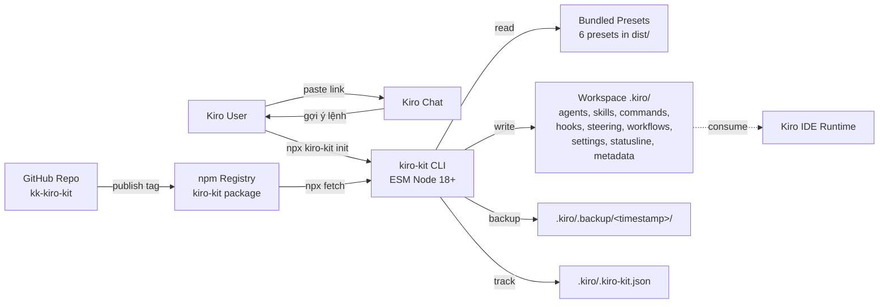
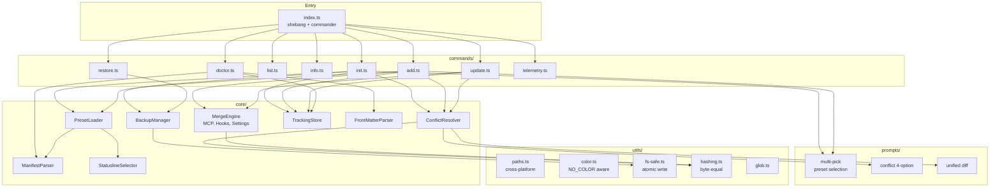
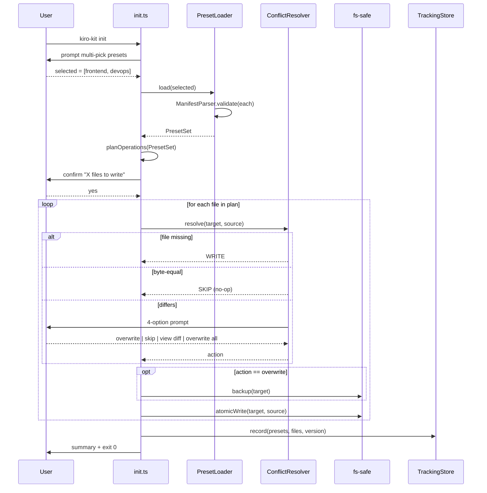
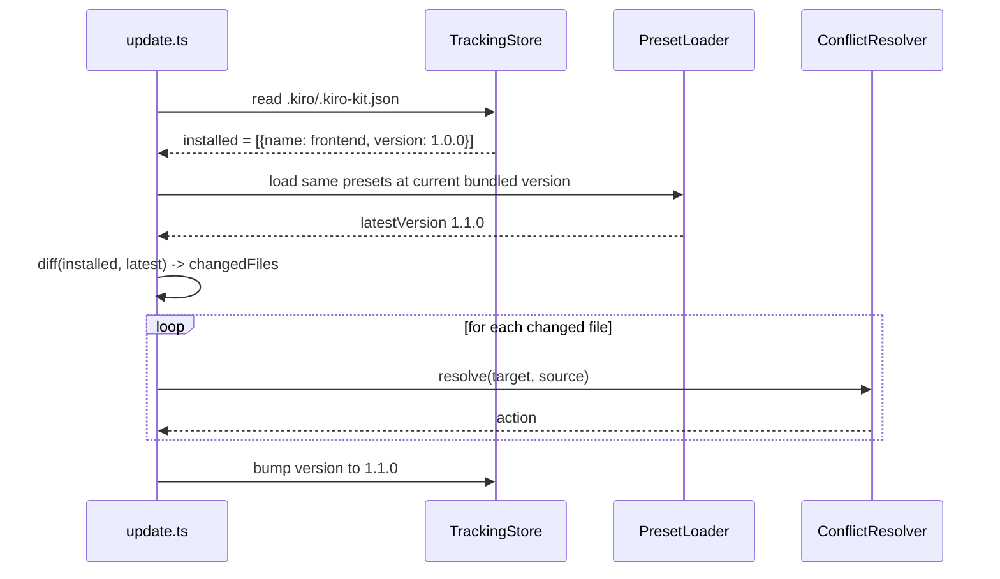
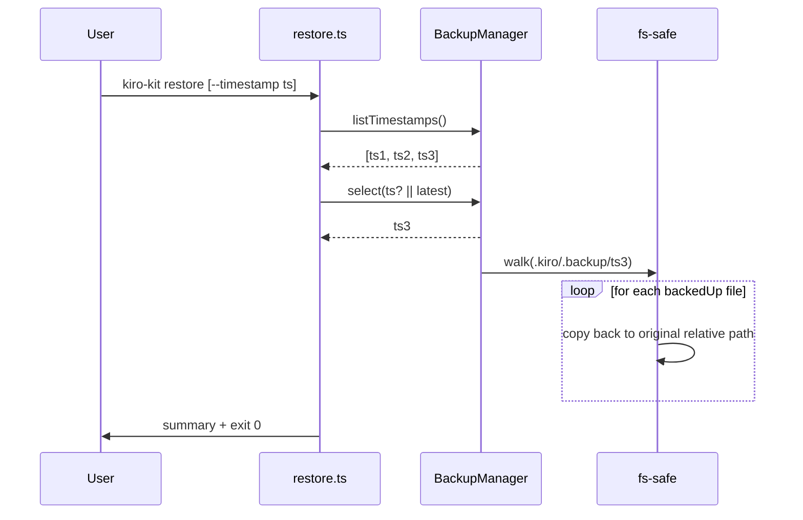

# Tài Liệu Thiết Kế (Design Document)

## Tổng Quan (Overview)

KK-Kiro-Kit là tổ hợp **GitHub repository + npm CLI** giúp Kiro user khởi tạo workspace `.kiro/` ở quy mô engineer-grade chỉ bằng một dòng lệnh `npx kiro-kit init`. Thiết kế bám sát triết lý **parallel namespace mirror**: cấu trúc `.kiro/` tạo ra phải song song 1-1 với `.claude/` của Claude Code, do đó user đã quen `.claude/` chuyển sang Kiro mà không cần học lại mental model.

Sản phẩm gồm 3 thành phần lớn:

1. **Monorepo (pnpm workspaces)** chứa: package CLI tại `packages/cli/`, 6 preset self-contained tại `presets/{frontend,backend,fullstack,mobile,devops,data-ai}/`, docs và CI tại root.
2. **CLI binary `kiro-kit`** với 8 lệnh chính (`init`, `add`, `list`, `info`, `update`, `restore`, `doctor`, `telemetry`) phân phối qua npm dưới dạng ESM thuần.
3. **6 preset tự-chứa**: mỗi preset là một bộ kit hoàn chỉnh (>= 12 agents, >= 20 skills, >= 25 commands, >= 6 hooks, >= 4 workflows, statusline triple, settings/metadata/MCP/env templates, spec/docs templates), có nội dung tailor theo ngữ cảnh chuyên môn.

Các quyết định thiết kế cốt lõi:

- **Self-contained, no-shared-core**: mỗi preset chứa bản sao đầy đủ các artifact, kể cả các artifact có tên trùng (ví dụ `code-reviewer.md`) — đáp ứng Req 24.2 và Req 43. Đánh đổi: tăng dung lượng package nhưng tránh coupling và đơn giản hoá `update`/`restore`.
- **Bundled presets**: tất cả 6 preset nằm sẵn trong npm tarball, không fetch từ GitHub khi `init` — đáp ứng Req 18.2 (offline-first).
- **Atomic file operations**: ghi vào temp dir rồi `rename` để đảm bảo nguyên tử trên cùng filesystem.
- **User-priority merge**: mọi conflict giữa file user và preset đều ưu tiên user (interactive prompt mặc định, hoặc giữ user content cho MCP `mcpServers` field — Req 11.2).
- **Cross-platform-first**: dùng `.js` làm primary script cho hooks/statusline; `.sh`/`.ps1` là fallback — đáp ứng Req 19, 35.


## Kiến Trúc (Architecture)

### Sơ đồ Tổng quan Hệ thống



### Cấu trúc Repository (Monorepo)

```
kk-kiro-kit/
├── README.md                    # Quick Start above-the-fold (Req 1.1)
├── LICENSE                      # MIT (Req 21.4)
├── CONTRIBUTING.md
├── CODE_OF_CONDUCT.md
├── SECURITY.md
├── CHANGELOG.md                 # Keep a Changelog (Req 20.5)
├── .gitignore                   # exclude .env*, node_modules, dist, .backup, mcp.json
├── package.json                 # workspace root
├── pnpm-workspace.yaml
├── tsconfig.base.json
├── .github/
│   ├── workflows/
│   │   ├── ci.yml               # lint, typecheck, test, build, structural, emoji-lint
│   │   └── publish.yml          # tag-triggered npm publish with provenance
│   ├── ISSUE_TEMPLATE/
│   │   ├── bug-report.yml
│   │   ├── feature-request.yml
│   │   └── preset-request.yml
│   └── PULL_REQUEST_TEMPLATE.md
├── packages/
│   └── cli/
│       ├── package.json         # name: kiro-kit, bin: ./dist/index.js
│       ├── tsconfig.json
│       ├── tsup.config.ts       # bundler
│       ├── src/
│       │   ├── index.ts         # entry point with shebang
│       │   ├── commands/        # init, add, list, info, update, restore, doctor, telemetry
│       │   ├── core/            # PresetLoader, ManifestParser, ConflictResolver, MergeEngine, BackupManager, TrackingStore, StatuslineSelector, FrontMatterParser
│       │   ├── prompts/         # interactive multi-pick, conflict prompt, diff viewer
│       │   └── utils/           # paths, color, fs-safe, hashing, glob
│       ├── tests/
│       │   ├── unit/
│       │   ├── e2e/
│       │   ├── property/        # fast-check property tests
│       │   ├── structural/      # preset threshold tests
│       │   └── fixtures/
│       └── dist/                # bundled output, includes presets/ copy
├── presets/
│   ├── frontend/
│   ├── backend/
│   ├── fullstack/
│   ├── mobile/
│   ├── devops/
│   └── data-ai/
└── docs/
    ├── architecture.md
    ├── preset-authoring.md
    └── conflict-resolution.md
```

Mỗi thư mục `presets/<name>/` có cấu trúc đồng nhất:

```
presets/<name>/
├── manifest.json                # Schema tại §Data Models
├── README.md                    # Mô tả preset (Req 21.7)
├── agents/                      # >= 12 *.md (Req 24.3, 31)
├── skills/                      # >= 20 skill folders (Req 24.3, 33)
│   ├── README.md
│   ├── INSTALLATION.md
│   ├── THIRD_PARTY_NOTICES.md
│   ├── agent_skills_spec.md
│   ├── template-skill/
│   ├── .env.example
│   └── <skill-name>/SKILL.md
├── commands/                    # >= 25 *.md, nesting 1-3 cấp (Req 24.3, 32)
├── hooks/                       # >= 6 hooks tri-platform (Req 24.3, 35)
│   ├── README.md
│   ├── .env.example
│   └── <hook-name>.{js,sh,ps1}
├── workflows/                   # >= 4 *.md always-on (Req 24.3, 34)
├── steering/                    # *.md với front-matter inclusion
├── settings.json                # statusLine + hooks registration (Req 38)
├── metadata.json                # version, name, description, buildDate (Req 37)
├── statusline.js                # primary
├── statusline.sh                # Unix fallback
├── statusline.ps1               # Windows fallback
├── .mcp.json.example            # placeholder MCP config (Req 39)
├── .env.example                 # project-level env (Req 40.1)
└── specs/_templates/<name>/{requirements,design,tasks}.md  # (Req 27.1)
```


### Kiến trúc Component CLI



### Luồng Dữ liệu

#### Init flow (Req 3, 9, 14)



#### Add flow (Req 4, 12, 14.4)

Logic giống `init` nhưng đọc tracking file trước, gộp preset mới vào tracking. Nếu workspace chưa có `.kiro/`, tự động delegate sang `init` (Req 4.3).

#### Update flow (Req 7)



#### Restore flow (Req 8)




## Components and Interfaces

### CLI Surface

CLI dùng `commander` cho parsing, `prompts` cho interactive UI, `picocolors` cho ANSI (NO_COLOR aware — Req 28.2). Toàn bộ command đều hỗ trợ `--help`, `--verbose`, `--quiet` (Req 28.5-28.6).

#### `init` — Khởi tạo tương tác

```
kiro-kit init [options]

Options:
  -y, --yes                    Skip confirmation, accept defaults
  --preset <name>              Specify preset (repeatable)
  --force                      Overwrite all files (with backup)
  --skip-existing              Skip all files that already exist
  --no-color                   Disable ANSI colors
  -v, --verbose                Verbose logging
  -q, --quiet                  Errors only
  -h, --help                   Show help
```

Prompt text mẫu (English — CLI luôn English):

```
? Select presets to install: (Press <space> to select, <a> to toggle all)
  > [ ] frontend   - React/Next.js + TypeScript engineer-grade kit
    [ ] backend    - Node/Python/Go API engineer-grade kit
    [ ] fullstack  - Next.js/T3 stack with frontend + backend
    [ ] mobile     - Flutter/React Native kit
    [ ] devops     - Docker/Kubernetes/Terraform kit
    [ ] data-ai    - Python/ML and AI agent toolkit

? About to write 87 files into .kiro/ and 3 files into docs/. Continue? (Y/n)
```

Conflict prompt mẫu:

```
? File .kiro/agents/code-reviewer.md already exists with different content.
  > overwrite       - Replace existing file (backup will be saved)
    skip            - Keep existing file
    view diff       - Show unified diff and ask again
    overwrite all   - Replace this and all remaining conflicting files
```

#### `add <preset>` (Req 4)

```
kiro-kit add <preset> [options]
```

Cùng options với `init` (trừ `--preset`, `<preset>` là positional).

#### `list` (Req 5)

```
kiro-kit list [--json]

Output (text):
  frontend   - React/Next.js + TypeScript engineer-grade kit
              16 agents, 24 skills, 31 commands, 8 hooks, 4 workflows, 9 MCP servers
  backend    - Node/Python/Go API engineer-grade kit
              14 agents, 22 skills, 28 commands, 7 hooks, 4 workflows, 8 MCP servers
  ...
```

#### `info <preset>` (Req 6)

In mô tả đầy đủ, danh sách file kèm target path, MCP servers, hooks, agents, skills, commands, workflows.

#### `update` (Req 7)

```
kiro-kit update [--yes] [--force] [--skip-existing]
```

#### `restore` (Req 8)

```
kiro-kit restore [--timestamp <iso8601>] [--list]

--list  show available backup timestamps then exit
```

#### `doctor` (Req 16)

```
kiro-kit doctor [--fix]

Output:
  [PASS] Node.js version >= 18 (20.10.0)
  [PASS] .kiro/ directory exists
  [PASS] .kiro/settings/mcp.json is valid JSON
  [PASS] .kiro/.kiro-kit.json is valid
  [FAIL] Tracked file .kiro/agents/missing.md not found
         Suggestion: run `kiro-kit add <preset>` to reinstall
  [PASS] Steering front-matter has no trailing whitespace
  [PASS] .kiro/metadata.json is valid JSON
  [WARN] statusline.sh is not executable
         Run with --fix to set executable bit
```

#### `telemetry` (Req 17)

```
kiro-kit telemetry enable
kiro-kit telemetry disable
kiro-kit telemetry status
```

Mặc định: disabled. Config file: `~/.kiro-kit/config.json`.

### Bảng Exit Codes

| Code | Ý nghĩa |
|------|---------|
| 0    | Thành công, hoặc no-op (no preset selected, no backup but graceful exit, network unreachable on `update`) |
| 1    | Lỗi nghiệp vụ: preset không tồn tại, manifest không hợp lệ, doctor fail |
| 2    | Uncaught exception (Req 28.4) |
| 130  | SIGINT (Ctrl+C) trong prompt — Req 3.7 |

### Bảng Mã Lỗi (Error Codes)

| Code   | Loại | Mô tả |
|--------|------|------|
| KK001 | CLI  | Node.js version dưới 18 (Req 2.6) |
| KK002 | CLI  | Unknown command/flag |
| KK010 | Manifest | Manifest JSON parse error |
| KK011 | Manifest | Manifest schema validation failed (field/type mismatch) |
| KK012 | Manifest | File khai báo trong manifest không tồn tại trên disk |
| KK013 | Manifest | File vật lý không được khai báo trong manifest (orphan) |
| KK020 | Preset | Preset không tồn tại |
| KK021 | Preset | Preset version conflict trong dependency chain |
| KK030 | Workspace | `.kiro/` read-only hoặc thiếu permission |
| KK031 | Workspace | Disk full mid-write |
| KK040 | Tracking | `.kiro/.kiro-kit.json` corrupt (Req 42.5) |
| KK041 | Tracking | Tracked file missing on disk (doctor) |
| KK050 | Backup | Backup directory không tồn tại (restore) |
| KK051 | Backup | Backup timestamp không tồn tại |
| KK060 | MCP | Merged MCP file không pass schema validation |
| KK061 | Settings | settings.json corrupt |
| KK070 | FrontMatter | YAML front-matter parse error |
| KK071 | FrontMatter | Required field missing trong front-matter |
| KK080 | Network | Timeout khi check version mới (Req 18.3) |
| KK090 | Hook | Hook script syntax error trên platform tương ứng |
| KK091 | Security | `.env` file detected outside `.gitignore` |


### Core Modules

#### PresetLoader

```typescript
interface PresetLoader {
  load(name: PresetName): Promise<Preset>
  loadAll(names: PresetName[]): Promise<Preset[]>
  listAvailable(): PresetName[]
}

interface Preset {
  manifest: Manifest
  rootDir: string                 // absolute path under bundled dist/presets/<name>
  files: PresetFile[]
}

interface PresetFile {
  source: string                  // absolute path
  target: string                  // relative path under workspace
  type: ArtifactType
  contentHash: string             // sha256 hex (lazy)
}
```

#### ManifestParser

```typescript
interface ManifestParser {
  parse(json: string): Result<Manifest, ManifestError>
  print(m: Manifest): string      // pretty-print 2-space indent (Req 30.3)
  validate(m: Manifest, presetDir: string): Result<void, ManifestError[]>
}
```

Validation steps:
1. Schema check (zod): tất cả required field, kiểu đúng.
2. File completeness: mọi file trong `manifest.files` phải tồn tại tại `presetDir/source` (Req 10.7).
3. No-orphan: mọi file thực tế trong `presetDir` (trừ `manifest.json`, `README.md`) phải có trong `manifest.files` (Req 10.8).

#### ConflictResolver

```typescript
type ConflictAction =
  | 'WRITE_NEW'
  | 'OVERWRITE_WITH_BACKUP'
  | 'SKIP'
  | 'NO_OP'

interface ConflictResolver {
  resolve(opts: {
    target: string
    sourceContent: Buffer
    mode: 'interactive' | 'force' | 'skip-existing'
    sessionState: { overwriteAll: boolean }
  }): Promise<ConflictAction>
}
```

Pseudocode (Req 9):

```
function resolve({target, sourceContent, mode, sessionState}):
  if not exists(target):
    return WRITE_NEW
  currentHash = sha256(read(target))
  newHash = sha256(sourceContent)
  if currentHash == newHash:
    return NO_OP                  # Req 9.6
  if mode == 'force':
    return OVERWRITE_WITH_BACKUP
  if mode == 'skip-existing':
    return SKIP
  if sessionState.overwriteAll:
    return OVERWRITE_WITH_BACKUP
  loop:
    choice = prompt4Option(target)  # overwrite | skip | view diff | overwrite all
    switch choice:
      case 'view-diff':
        printUnifiedDiff(target, sourceContent)
        continue                  # Req 9.4
      case 'overwrite':
        return OVERWRITE_WITH_BACKUP
      case 'skip':
        return SKIP
      case 'overwrite-all':
        sessionState.overwriteAll = true
        return OVERWRITE_WITH_BACKUP
```

#### MergeEngine — MCP, Hooks, Settings

Three sub-mergers:

**MCP Merger** (Req 11):

```
function mergeMCP(existing, presetServers):
  result = deepClone(existing)
  for serverName, def in presetServers:
    if serverName in result.mcpServers:
      // user-priority: keep existing
      log warn "MCP server '${serverName}' already exists, keeping user's definition"
      continue
    result.mcpServers[serverName] = def
  return result
```

**Hooks Array Merger** (Req 12.5):

```
function mergeHooksArray(existingArr, presetArr):
  // dedupe by command field (case-sensitive)
  seen = new Set(existingArr.map(h => h.command))
  result = [...existingArr]
  for h in presetArr:
    if h.command not in seen:
      result.push(h)
      seen.add(h.command)
  return result
```

**Settings Merger** (Req 12.5-12.7):

```
function mergeSettings(existing, presetSettings):
  result = deepClone(existing)
  // arrays: concat-dedupe
  result.hooks = result.hooks ?? {}
  result.hooks.PreToolUse  = mergeHooksArray(existing.hooks?.PreToolUse  ?? [], presetSettings.hooks?.PreToolUse  ?? [])
  result.hooks.PostToolUse = mergeHooksArray(existing.hooks?.PostToolUse ?? [], presetSettings.hooks?.PostToolUse ?? [])
  // non-array fields: last-write-wins with warning
  for k in ['statusLine', 'includeCoAuthoredBy']:
    if k in presetSettings:
      if k in existing && !deepEqual(existing[k], presetSettings[k]):
        log warn "settings.${k} overridden by preset"
      result[k] = presetSettings[k]
  // do not delete user-only fields (Req 12.7)
  return result
```

#### BackupManager

```
function backup(target, timestamp):
  rel = relative(workspace, target)
  dst = .kiro/.backup/<timestamp>/<rel>
  mkdir -p dirname(dst)
  copyFile(target, dst)            // preserves bytes (Req 9.9)

function restore(timestamp?):
  ts = timestamp ?? latestTimestamp(.kiro/.backup/)
  if ts == null: return error KK050
  walk(.kiro/.backup/<ts>/):
    for each file:
      rel = relative(.kiro/.backup/<ts>/, file)
      copyFile(file, workspace/rel)  // overwrite current
  // do not delete backup (Req 8.5)
```

Timestamp format: `YYYYMMDD-HHmmss-mmm` (sortable lexicographically).

#### TrackingStore

```typescript
interface TrackingStore {
  read(workspace: string): Promise<Tracking | null>
  write(workspace: string, t: Tracking): Promise<void>
  recordInstall(presets: Preset[], files: PresetFile[]): Promise<void>
  recordUpdate(presetName: string, newVersion: string): Promise<void>
}
```

Schema chi tiết tại §Data Models. Quan trọng: tracking file chỉ được ghi sau khi tất cả file của operation đã ghi xong (write-tracking-last) để giảm rủi ro stale state.

#### StatuslineSelector (Req 36)

```
function selectStatuslineCommand(platform):
  switch platform:
    case 'win32':  return 'powershell -ExecutionPolicy Bypass -File .kiro/statusline.ps1'
    case 'darwin': return 'bash .kiro/statusline.sh'
    case 'linux':  return 'bash .kiro/statusline.sh'
    default:       return 'node .kiro/statusline.js'  // fallback (Req 36.6)
```

`settings.json` được viết với `statusLine.command` được resolve bằng `process.platform` của user khi chạy `init`.

#### FrontMatterParser (Req 30.7, 31, 32)

```typescript
interface FrontMatterParser {
  parse(content: string): Result<{ frontMatter: object; body: string }, FrontMatterError>
  print(fm: object, body: string): string
}
```

Dùng `js-yaml` cho parse/dump. Validation per artifact type:

- agent: required `name`, `description`
- command: required `description`
- skill SKILL.md: required `name`, `description`
- steering: required `inclusion` (`always`|`manual`|`fileMatch`), `description`; if `fileMatch` thì cần `fileMatchPattern`

#### Hash Utility

`sha256` của content (binary-safe). Dùng cho byte-equal detection (Req 9.6) và tracking file (`contentHash`). Có thể fallback `md5` cho fast-path nội bộ (không bao giờ dùng cho security).

### Atomic Write Strategy

```
function atomicWrite(target, content):
  tmp = target + '.tmp.' + randomSuffix()
  writeFileSync(tmp, content)
  renameSync(tmp, target)          // atomic on same FS
```

Trên Windows, `rename` qua các volume khác nhau sẽ fail; CLI luôn ghi `.tmp` cùng thư mục với target để tránh trường hợp này.

### Cross-platform Hook Registration

Trong `settings.json`, mỗi hook entry có dạng:

```json
{
  "hooks": {
    "PreToolUse": [
      {
        "matcher": ".*",
        "command": "node .kiro/hooks/scout-block.js"
      }
    ]
  }
}
```

Preset luôn ưu tiên `.js` (cross-platform). Nếu hook chỉ tồn tại dạng `.sh`/`.ps1`, settings.json sẽ chứa command tương ứng platform tại thời điểm `init`.


## Data Models

### Manifest Schema (Req 10)

```typescript
type ArtifactType =
  | 'steering' | 'hook' | 'mcp' | 'skill' | 'agent'
  | 'command' | 'workflow' | 'statusline' | 'metadata'
  | 'settings' | 'env' | 'spec' | 'docs' | 'other'

type PresetName = 'frontend' | 'backend' | 'fullstack' | 'mobile' | 'devops' | 'data-ai'

interface Manifest {
  // required
  name: string                    // ví dụ "frontend"
  version: string                 // semver, "1.0.0"
  description: string
  category: PresetName
  files: FileEntry[]

  // optional
  dependencies?: PresetName[]     // Req 10.4
  mcpServers?: Record<string, MCPServerDef>
  hooks?: {
    PreToolUse?: HookEntry[]
    PostToolUse?: HookEntry[]
    agentStop?: HookEntry[]
    fileEdited?: HookEntry[]
  }
  tags?: string[]
  minCounts?: {
    agents?: number
    skills?: number
    commands?: number
    hooks?: number
    workflows?: number
  }
}

interface FileEntry {
  source: string                  // relative to preset root
  target: string                  // relative to workspace root, e.g. ".kiro/agents/researcher.md"
  type: ArtifactType
  executable?: boolean            // Unix exec bit (statusline.sh, *.sh hooks)
}

interface MCPServerDef {
  command: string
  args?: string[]
  env?: Record<string, string>    // chỉ chứa placeholder ${VAR} hoặc <your-key>
}

interface HookEntry {
  matcher?: string                // regex, default ".*"
  command: string                 // ví dụ "node .kiro/hooks/scout-block.js"
}
```

Ví dụ manifest tối giản:

```json
{
  "name": "frontend",
  "version": "1.0.0",
  "description": "React/Next.js + TypeScript engineer-grade kit",
  "category": "frontend",
  "files": [
    { "source": "agents/researcher.md", "target": ".kiro/agents/researcher.md", "type": "agent" },
    { "source": "statusline.sh", "target": ".kiro/statusline.sh", "type": "statusline", "executable": true }
  ],
  "mcpServers": {
    "filesystem": {
      "command": "npx",
      "args": ["-y", "@modelcontextprotocol/server-filesystem", "${WORKSPACE_ROOT}"]
    }
  },
  "minCounts": { "agents": 12, "skills": 20, "commands": 25, "hooks": 6, "workflows": 4 }
}
```

### Tracking File `.kiro/.kiro-kit.json` (Req 42)

```typescript
interface Tracking {
  $schema?: string                // optional schema URL for editor support
  kitVersion: string              // CLI semver at last write
  installedAt: string             // ISO 8601 of first install
  updatedAt: string               // ISO 8601 of latest write
  presets: TrackedPreset[]
}

interface TrackedPreset {
  name: PresetName
  version: string
  installedAt: string
  files: TrackedFile[]
}

interface TrackedFile {
  target: string                  // relative path under workspace
  sourcePreset: PresetName        // attribute file to which preset
  contentHash: string             // sha256 hex of content at install/update time
  installedAt: string
}
```

### Metadata File `.kiro/metadata.json` (Req 37)

```typescript
interface Metadata {
  version: string                 // semver, matches latest installed preset OR kit version
  name: string                    // "kk-kiro-kit-frontend" hoặc "kk-kiro-kit-multi"
  description: string
  buildDate: string               // ISO 8601
  repository: { type: 'git'; url: string }
  // when multiple presets:
  presets?: PresetName[]
  installedAt?: string
  kitVersion?: string
}
```

### Settings File `.kiro/settings.json` (Req 38)

```typescript
interface Settings {
  statusLine?: {
    type: 'command'
    command: string                    // resolved per platform at init
  }
  hooks?: {
    PreToolUse?: HookEntry[]
    PostToolUse?: HookEntry[]
    agentStop?: HookEntry[]
    fileEdited?: HookEntry[]
  }
  includeCoAuthoredBy?: boolean        // default false
  // user-added fields preserved on merge (Req 12.7)
  [key: string]: unknown
}
```

### MCP Config `.kiro/settings/mcp.json`

```typescript
interface MCPConfig {
  mcpServers: Record<string, MCPServerDef>
}
```

`.mcp.json.example` cùng schema, chỉ chứa placeholder.

### Front-matter Schemas

**Agent** (Req 31):

```yaml
---
name: researcher           # kebab-case
description: Use this agent when ...
inclusion: manual          # manual | always | fileMatch  (default manual)
model: inherit             # optional: inherit | sonnet | haiku
tools:                     # optional whitelist
  - Read
  - Grep
---
```

**Command** (Req 32):

```yaml
---
description: Run E2E test suite for the given feature
inclusion: manual
argument-hint: "[feature-name]"
---
```

**Skill SKILL.md** (Req 33):

```yaml
---
name: frontend-design
description: Use when designing React component hierarchies and state flow
---
```

**Steering** (Req 13):

```yaml
---
inclusion: fileMatch
fileMatchPattern: "src/**/*.tsx"
description: React/TSX coding conventions
---
```

**Workflow** (Req 34.3):

Front-matter optional; nếu có, không cần `inclusion` (mặc định always-on).

### Sub-skill Container (Req 33.5)

```
skills/document-skills/
├── docx/SKILL.md       # sub-skill 1
├── pdf/SKILL.md        # sub-skill 2
└── xlsx/SKILL.md       # sub-skill 3
# no SKILL.md at document-skills/ root
```

CLI nhận diện sub-skill container bằng heuristic: thư mục skill không có `SKILL.md` ở root nhưng có >= 1 sub-folder chứa `SKILL.md`.


## Correctness Properties

*Một property là một đặc tính hoặc hành vi phải đúng trong mọi thực thi hợp lệ của hệ thống — về bản chất là một mệnh đề hình thức về những gì hệ thống cần làm. Properties là cây cầu giữa specifications dạng human-readable và các đảm bảo correctness có thể verify được bằng máy.*

Sau prework analysis (xem context của tool prework), 44 requirements với hàng chục acceptance criteria được rút gọn thành ~28 property classes, sau đó qua property reflection được consolidate thành **16 property duy nhất** dưới đây. Mỗi property bao trùm nhiều acceptance criteria liên quan và được verify bằng property-based tests (`fast-check`).

### Property 1: Backup-restore round-trip identity

*For all* workspace state W và bất kỳ chuỗi thao tác kit nào, sau khi `backup(W)` rồi `restore()` cho ra workspace state bằng W (byte-equal cho mọi file mà kit chạm vào).

**Validates: Requirements 8.6, 29.3**

### Property 2: Manifest parse-print round-trip

*For all* valid manifest object M, `parse(print(M))` đẳng cấu (deepEqual) với M; ngược lại, *for all* valid manifest JSON string S, `print(parse(S))` chuẩn hoá lại đúng định dạng pretty-print 2-space, và `parse(print(parse(S))) == parse(S)`.

**Validates: 