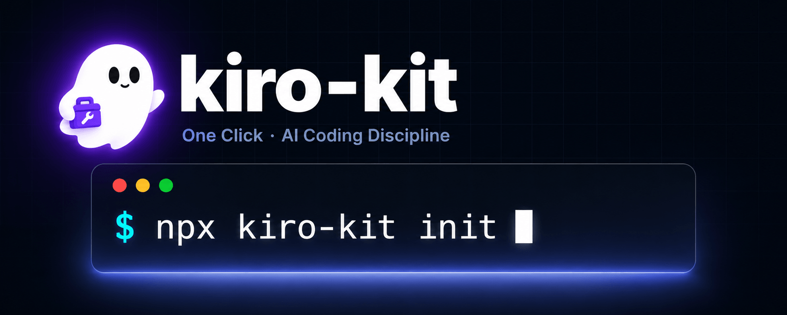

<div align="center">



[](https://github.com/ihatesea69/kiro-kit/actions/workflows/ci.yml)
[](https://www.npmjs.com/package/kiro-kit)
[](./LICENSE)
[](https://www.npmjs.com/package/kiro-kit)
[](https://nodejs.org)

</div>

---

## Quick Start

```bash
npx kiro-kit init
```

Pick from 6 curated presets with an interactive selector — arrow keys to move, Enter to select, Enter again to confirm. Your `.kiro/` workspace is ready with agents, skills, commands, hooks, MCP servers, Powers recommendations, and spec templates.

```bash
# or install globally
npm install -g kiro-kit
kiro-kit init
```

## Presets

| Preset | Stack | What you get |
|--------|-------|--------------|
| `frontend` | React, Next.js, TypeScript | 20 agents, 23 skills, 71 commands tailored for component architecture, accessibility, and performance |
| `backend` | Node, Python, Go APIs | 19 agents, 24 skills, 66 commands for API design, database management, auth, deployment patterns |
| `fullstack` | Next.js, T3 stack | 20 agents, 30 skills, 73 commands covering frontend plus backend, payment integration, e-commerce |
| `mobile` | Flutter, React Native | 23 agents, 28 skills, 71 commands for mobile-first patterns, ai-multimodal, ui-styling |
| `devops` | Docker, Kubernetes, Terraform | 20 agents, 26 skills, 65 commands for CI checks, container scanning, infrastructure as code |
| `data-ai` | Python, ML, AI agents | 20 agents, 30 skills, 70 commands for Pandas, PyTorch, TensorFlow, Jupyter, Google ADK, document processing |

Every preset is **self-contained** with 16+ agents, 22+ skills, 40+ commands, 9+ cross-platform hooks (including 3 domain-specific), 7 native Kiro Agent Hooks, a worked example spec, MCP server auto-config, an enriched Powers catalog, and spec scaffolding.

## CLI Experience

The `kiro-kit init` command features a polished terminal UI:

- Purple gradient ASCII logo (figlet Small font)
- Interactive preset selector: arrow keys to move, Enter to select, Enter x2 to confirm
- Live selected count indicator
- Task progress list with spinners
- Success summary box with file counts and next steps
- Graceful fallback for CI/non-TTY environments

## Native Kiro Agent Hooks

Each preset ships **native Kiro Agent Hooks** (`*.kiro.hook` files) — Kiro's own
event-driven automation format (a `when` trigger + a `then` action) that runs
inside the IDE. Every preset gets 4 shared hooks plus 3 domain-specific ones:

- **Shared**: Run Tests on Save, Spec Task Sync, Secret Scan Before Write, Docs Drift Guard
- **frontend**: Component Scaffold, Accessibility Review, Bundle Size Guard
- **backend**: Migration Safety Review, API Contract Sync, Endpoint Test Coverage
- **fullstack**: Type Sync, Env Schema Sync, Deployment Readiness
- **mobile**: Platform Parity Check, Asset Optimization, Release Checklist
- **devops**: Terraform Plan Review, Container Scan, Cost Estimate
- **data-ai**: Experiment Log, Data Validation, Model Card Update

Every native hook ships **disabled** (`"enabled": false`) so a fresh workspace
never starts an agent run you didn't ask for. Toggle one on in Kiro's Agent Hooks
panel (or set `"enabled": true`). See each preset's `hooks/native-hooks.md` guide.
These are distinct from the cross-platform shell notifier scripts (`.js`/`.sh`/`.ps1`)
that also ship in `hooks/`.

## Spec-Driven Best Practices

Each preset ships a **worked example spec** under `.kiro/specs/examples/` — a
fully-written `requirements.md` / `design.md` / `tasks.md` trio demonstrating
EARS acceptance criteria, Mermaid diagrams, and task-to-requirement traceability:

| Preset | Example spec |
|--------|--------------|
| frontend | Accessible, paginated Product Listing Page |
| backend | Rate-limited API Key Authentication |
| fullstack | End-to-end Stripe Checkout with webhooks |
| mobile | Offline-first Notes with sync + conflict resolution |
| devops | Blue-Green Deployment pipeline on Kubernetes |
| data-ai | Customer Churn Prediction ML pipeline |

A `spec-driven-development.md` steering file teaches the EARS patterns and the
requirements→design→tasks approval gates. Scaffold your own with:

```bash
kiro-kit spec new my-feature            # from the installed template
kiro-kit spec new my-feature --from backend
```

## MCP Server Auto-Configuration

Running `kiro-kit init` generates a functional `.mcp.json`:

- Credential-free servers (filesystem, git, fetch, playwright, memory, context7, sequential-thinking) are enabled immediately
- Servers requiring credentials (postgres, docker, github, sentry) are included as `_disabled_` entries with instructions to enable

## Kiro Powers Integration

Each preset recommends curated [Kiro Powers](https://kiro.dev/powers/) organized by
priority tier. The catalog is metadata-tagged (category, auth type, required env
vars, and whether the Power is MCP-backed), so `init` can **auto-wire the
credential-free MCP-backed Powers** and scaffold the credentialed ones disabled:

| Preset | Essential | Recommended | Optional |
|--------|-----------|-------------|----------|
| frontend | Figma | Netlify, Vercel, Context7, Storybook | Sentry, PostHog, ScoutQA |
| backend | Supabase | Neon, Postman, Context7, Upstash | Stripe, Snyk, Sentry |
| fullstack | Supabase | Figma, Netlify, Stripe, Context7, Clerk | Firebase, LaunchDarkly, Sentry, Resend |
| mobile | Firebase | Figma, Context7, Expo | ElevenLabs, Bria, RevenueCat, OneSignal, Sentry |
| devops | Terraform | Datadog, Snyk, Depot, Context7 | Harness, AWS CDK, Pulumi, Grafana |
| data-ai | ClickHouse | Context7, Exa, Hugging Face | Neon, New Relic, Weights & Biases, Pinecone, LangSmith |

Running `init` auto-configures MCP servers (credential-free ones enabled;
credentialed ones as disabled templates), documents required env vars in
`.env.example`, and generates a `POWERS-SETUP.md` guide.

## Commands

| Command | What it does |
|---------|--------------|
| `kiro-kit init` | Interactive preset picker and workspace bootstrap |
| `kiro-kit add <preset>` | Drop another preset into an existing workspace |
| `kiro-kit list` | See all presets with artifact counts |
| `kiro-kit info <preset>` | Detailed preset contents and file targets |
| `kiro-kit update` | Pull latest preset version into your workspace |
| `kiro-kit restore` | Roll back from a timestamped backup |
| `kiro-kit doctor` | Health check (10 validations, `--fix` auto-repairs) |
| `kiro-kit spec new <name>` | Scaffold a new spec folder from a template |
| `kiro-kit telemetry` | Manage opt-in usage telemetry (off by default) |

### Common Flags

```
-y, --yes              Skip confirmation prompts
--force                Overwrite all conflicts (with backup)
--skip-existing        Skip files that already exist
--no-color             Disable ANSI output
--powers <mode>        Powers setup: none, all, or interactive (default)
--quiet                Suppress non-essential output
```

## How It Works

```
1. Pick presets       2. Resolve conflicts        3. Workspace ready
   ┌─────────┐           ┌──────────────┐            ┌───────────┐
   │ frontend│  ────►    │ Backup +     │  ────►     │  .kiro/   │
   │ devops  │           │ Atomic write │            │  Live     │
   └─────────┘           └──────────────┘            └───────────┘
```

Three principles drive every design decision:

- **Bundled, not fetched** - all presets ship in the npm tarball. Works offline after install.
- **User-priority merge** - existing user content is never silently overwritten. Conflicts always prompt.
- **Atomic writes** - temp file plus rename guarantees no partial state on crash or interrupt.

See [`docs/architecture.md`](./docs/architecture.md) for the module breakdown and [`docs/how-it-works.md`](./docs/how-it-works.md) for lifecycle details.

## Built for Real Workflows

- Cross-platform hooks (`.js` primary, `.sh` and `.ps1` fallbacks)
- 4-option conflict resolution (overwrite, skip, view diff, overwrite all)
- Timestamped backups with `restore` and `restore --list`
- Tracking file (`.kiro/.kiro-kit.json`) records what came from where
- Property-based tests verify invariants (round-trips, commutativity, idempotency)
- Structural tests enforce minimum thresholds across all 6 presets

## Privacy

Telemetry is **off by default**. No data ever leaves your machine unless you explicitly opt in:

```bash
kiro-kit telemetry status     # Check current state
kiro-kit telemetry enable     # Opt in (anonymous events only)
kiro-kit telemetry disable    # Opt out
```

Opt-in events include command name, preset selection, OS, and Node version. Never file contents, paths, or PII.

## Contributing

Got an idea for a new preset, or want to improve an existing one? See [CONTRIBUTING.md](./CONTRIBUTING.md) and [docs/creating-presets.md](./docs/creating-presets.md).

```bash
git clone https://github.com/ihatesea69/kiro-kit.git
cd kiro-kit
pnpm install
pnpm test
```

## License

[MIT](./LICENSE)
