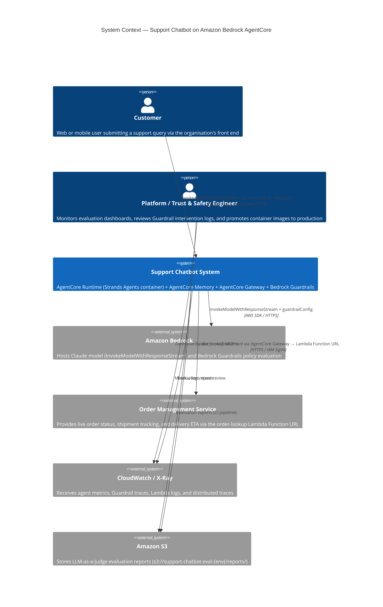
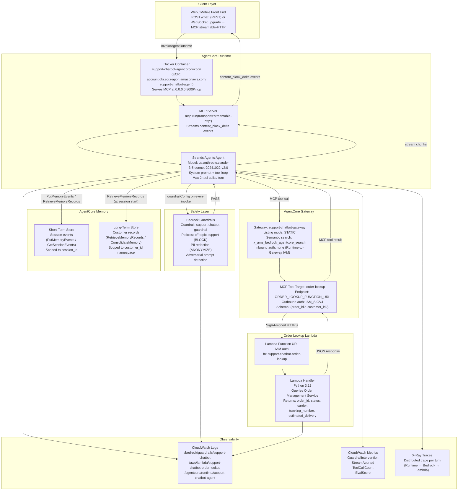
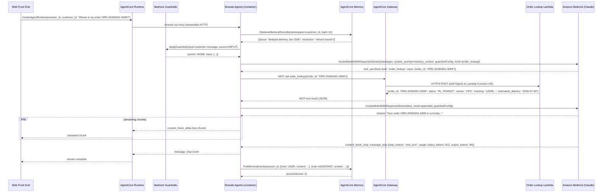

# Design: General-Purpose Support Chatbot on Amazon Bedrock AgentCore

## Architecture

### System Context

A customer submits a support query through the organisation's web or mobile front end. The front end calls the chatbot system over HTTPS, passing the customer's message, a `session_id`, and a verified `customer_id`. The chatbot system — comprising an AgentCore Runtime-hosted Strands Agents container, AgentCore Memory, AgentCore Gateway, and Bedrock Guardrails — processes the query, optionally retrieves live order data from the Order Management Service via the Gateway-registered order-lookup Lambda, and streams the response back. Operational signals (metrics, traces, evaluation reports) flow into CloudWatch and Amazon S3.



### Component Design



### Conversation Turn Sequence — Order Status Query



## Agent Configuration and Prompt Contract

The Strands Agents agent is initialised once at container startup. The system prompt is loaded from `src/agent/prompts.py` and injected into every model call.

```python
# src/agent/agent.py

import os
import boto3
from strands import Agent
from strands.models import BedrockModel
from strands.tools.mcp import MCPClient
from src.agent.prompts import SYSTEM_PROMPT
from src.agent.memory import MemoryClient

MODEL_ID = os.environ["BEDROCK_MODEL_ID"]          # us.anthropic.claude-3-5-sonnet-20241022-v2:0
GUARDRAIL_ARN = os.environ["GUARDRAIL_ARN"]        # arn:aws:bedrock:us-east-1::guardrail/abc123
GUARDRAIL_VERSION = os.environ.get("GUARDRAIL_VERSION", "1")
GATEWAY_ENDPOINT = os.environ["GATEWAY_ENDPOINT"]  # https://<gateway-id>.gateway.bedrock-agentcore.us-east-1.amazonaws.com/mcp

model = BedrockModel(
    model_id=MODEL_ID,
    guardrail_config={
        "guardrailIdentifier": GUARDRAIL_ARN,
        "guardrailVersion": GUARDRAIL_VERSION,
        "trace": "enabled",
    },
    streaming=True,
)

gateway_client = MCPClient(
    server_url=GATEWAY_ENDPOINT,
    transport="streamablehttp",
)

memory_client = MemoryClient(
    memory_id=os.environ["MEMORY_ID"],
    region=os.environ.get("AWS_REGION", "us-east-1"),
)

agent = Agent(
    model=model,
    system_prompt=SYSTEM_PROMPT,
    tools=gateway_client.list_tools_sync(),
    max_tool_calls_per_turn=2,
)
```

```python
# src/agent/prompts.py

SYSTEM_PROMPT = """You are a customer support assistant for Acme Corp.
Your role is to help customers with order status queries, shipment tracking,
and general product questions.

You have access to the `order_lookup` tool, which retrieves live order information.
Always call this tool when a customer asks about a specific order or delivery.

Rules:
- Only discuss topics related to Acme Corp products, orders, and support.
- If asked about anything outside this scope, politely decline and suggest the customer contacts support@acme.com.
- Never fabricate order details; if the tool returns an error, say so honestly.
- Do not repeat PII back to the customer beyond what is strictly necessary.

{memory_context}
"""
```

## MCP Container Server

```python
# src/agent/server.py

import asyncio
import os
from mcp.server import Server
from mcp.server.models import InitializationOptions
from mcp import types
import mcp
from src.agent.agent import agent, memory_client

server = Server("support-chatbot-agent")

@server.call_tool()
async def handle_chat(name: str, arguments: dict) -> list[types.ContentBlock]:
    if name != "chat":
        raise ValueError(f"Unknown tool: {name}")

    session_id: str = arguments["session_id"]
    customer_id: str = arguments["customer_id"]
    message: str = arguments["message"]

    # Retrieve long-term memory at session start (first turn only)
    memory_context = await memory_client.retrieve_long_term(customer_id, top_k=10)
    agent.update_system_prompt(memory_context=memory_context)

    chunks = []
    async for chunk in agent.stream_async(message, session_id=session_id):
        chunks.append(types.TextContent(type="text", text=chunk))

    # Store turn in short-term memory
    await memory_client.put_session_events(session_id, message, "".join(c.text for c in chunks))

    return chunks

@server.list_tools()
async def list_tools() -> list[types.Tool]:
    return [
        types.Tool(
            name="chat",
            description="Send a customer support message and receive a streamed response.",
            inputSchema={
                "type": "object",
                "properties": {
                    "session_id":  {"type": "string"},
                    "customer_id": {"type": "string"},
                    "message":     {"type": "string"},
                },
                "required": ["session_id", "customer_id", "message"],
            },
        )
    ]

if __name__ == "__main__":
    mcp.run(transport="streamable-http", host="0.0.0.0", port=8000)
```

## Order-Lookup Lambda

```python
# src/lambda/order_lookup/handler.py

import json
import os
import boto3
import requests

OMS_API_URL = os.environ["OMS_API_URL"]  # https://internal-oms.acme.com/v1

def handler(event, context):
    """
    Lambda handler invoked by AgentCore Gateway via IAM SigV4-signed Function URL POST.
    Body: {"order_id": "ORD-...", "customer_id": "CUST-..."}  (at least one required)
    """
    body = json.loads(event.get("body", "{}"))
    order_id  = body.get("order_id")
    customer_id = body.get("customer_id")

    if not order_id and not customer_id:
        return {
            "statusCode": 400,
            "body": json.dumps({"error": "order_id or customer_id is required"}),
        }

    try:
        params = {}
        if order_id:
            params["order_id"] = order_id
        if customer_id:
            params["customer_id"] = customer_id

        resp = requests.get(f"{OMS_API_URL}/orders", params=params, timeout=4)
        resp.raise_for_status()
        data = resp.json()
    except requests.exceptions.Timeout:
        return {"statusCode": 504, "body": json.dumps({"error": "Order Management Service timed out"})}
    except requests.exceptions.HTTPError as exc:
        return {"statusCode": 502, "body": json.dumps({"error": str(exc)})}

    return {
        "statusCode": 200,
        "headers": {"Content-Type": "application/json"},
        "body": json.dumps(data),
    }
```

## Memory Client

```python
# src/agent/memory.py

import boto3
from datetime import datetime, timezone

class MemoryClient:
    def __init__(self, memory_id: str, region: str):
        self.memory_id = memory_id
        self.client = boto3.client("bedrock-agentcore-memory", region_name=region)

    async def retrieve_long_term(self, customer_id: str, top_k: int = 10) -> str:
        resp = self.client.retrieve_memory_records(
            memoryId=self.memory_id,
            namespace=f"customer/{customer_id}",
            maxResults=top_k,
        )
        records = resp.get("memoryRecords", [])
        if not records:
            return ""
        summaries = "\n".join(f"- {r['summary']}" for r in records)
        return f"\nCustomer history:\n{summaries}\n"

    async def put_session_events(self, session_id: str, user_message: str, assistant_message: str):
        now = datetime.now(timezone.utc).isoformat()
        self.client.put_memory_events(
            memoryId=self.memory_id,
            sessionId=session_id,
            memoryEvents=[
                {"role": "USER",      "content": user_message,      "timestamp": now},
                {"role": "ASSISTANT", "content": assistant_message, "timestamp": now},
            ],
        )

    def consolidate_session(self, session_id: str, customer_id: str):
        self.client.consolidate_memory(
            memoryId=self.memory_id,
            sessionId=session_id,
            targetNamespace=f"customer/{customer_id}",
        )
```

## Files & Interfaces

| File / Path | Purpose |
|------------|---------|
| `src/agent/agent.py` | Strands Agents `Agent` initialisation; wires `BedrockModel` (with `guardrailConfig`), `MCPClient` pointing to Gateway, `MemoryClient`, and `max_tool_calls_per_turn = 2`. |
| `src/agent/server.py` | MCP `Server` instance exposing the `chat` tool; started with `mcp.run(transport="streamable-http", host="0.0.0.0", port=8000)`; entry point for the Docker container. |
| `src/agent/prompts.py` | `SYSTEM_PROMPT` template with `{memory_context}` placeholder; defines agent persona, tool-use rules, and out-of-scope refusal instruction. |
| `src/agent/memory.py` | `MemoryClient` wrapper over `boto3.client("bedrock-agentcore-memory")`; methods `retrieve_long_term`, `put_session_events`, `consolidate_session`. |
| `src/lambda/order_lookup/handler.py` | Lambda handler for the order-lookup Function URL; calls the internal Order Management Service REST API; returns `{order_id, status, carrier, tracking_number, estimated_delivery}`. |
| `src/lambda/order_lookup/requirements.txt` | Python dependencies for the Lambda layer: `requests==2.32.*`. |
| `Dockerfile` | Multi-stage build: `python:3.12-slim` base; installs `strands-agents`, `mcp[streamable-http]`, `boto3`; copies `src/`; `CMD ["python", "-m", "src.agent.server"]`; exposes port 8000. |
| `infra/terraform/modules/guardrails/main.tf` | `aws_bedrock_guardrail` resource: topic policies (`off-topic-support` BLOCK), content filter (`HATE`, `INSULTS`, `SEXUAL` at HIGH strength), PII entity action (`EMAIL_ADDRESS`, `PHONE_NUMBER`, `CREDIT_DEBIT_CARD_NUMBER` → ANONYMIZE). |
| `infra/terraform/modules/guardrails/variables.tf` | `guardrail_name`, `blocked_topics` (list), `pii_entities` (list of objects), `environment`. |
| `infra/terraform/modules/guardrails/outputs.tf` | `guardrail_arn`, `guardrail_id`, `guardrail_version`. |
| `infra/terraform/modules/memory/main.tf` | `aws_bedrock_agentcore_memory` resource: `short_term_storage_duration_days = 7`, `long_term_storage_enabled = true`; `aws_iam_role_policy` granting the Runtime execution role `bedrock-agentcore:PutMemoryEvents`, `bedrock-agentcore:RetrieveMemoryRecords`, `bedrock-agentcore:ConsolidateMemory`. |
| `infra/terraform/modules/memory/variables.tf` | `memory_name`, `short_term_retention_days`, `environment`. |
| `infra/terraform/modules/memory/outputs.tf` | `memory_id`, `memory_arn`. |
| `infra/terraform/modules/order_lookup/main.tf` | `aws_lambda_function` (Python 3.12, `handler.handler`, `OMS_API_URL` env var, X-Ray tracing active), `aws_lambda_function_url` (`auth_type = "AWS_IAM"`), `aws_iam_role`, `aws_cloudwatch_log_group` (`/aws/lambda/support-chatbot-order-lookup`, retention 30/90 days). |
| `infra/terraform/modules/order_lookup/variables.tf` | `function_name`, `oms_api_url`, `lambda_timeout`, `environment`. |
| `infra/terraform/modules/order_lookup/outputs.tf` | `function_arn`, `function_url`, `function_name`. |
| `infra/terraform/modules/gateway/main.tf` | `aws_bedrock_agentcore_gateway` resource (listing mode `STATIC`, semantic search enabled); `aws_bedrock_agentcore_gateway_target` pointing to `var.order_lookup_function_url` with `auth_type = "IAM_SIGV4"`; `aws_iam_role` for Gateway execution with `lambda:InvokeFunctionUrl` permission on the order-lookup Function URL ARN. |
| `infra/terraform/modules/gateway/variables.tf` | `gateway_name`, `order_lookup_function_url`, `order_lookup_function_arn`, `environment`. |
| `infra/terraform/modules/gateway/outputs.tf` | `gateway_id`, `gateway_endpoint`, `tool_target_id`. |
| `infra/terraform/modules/runtime/main.tf` | `aws_ecr_repository` (`support-chatbot-agent`, image scanning enabled); `aws_bedrock_agentcore_agent_runtime` resource referencing ECR image URI, Memory ID, and Gateway endpoint via env vars; `aws_iam_role` (Runtime execution role) with inline policies for `bedrock:InvokeModelWithResponseStream`, `bedrock:ApplyGuardrail`, `bedrock-agentcore:*Memory*`, `bedrock-agentcore:InvokeGatewayTool`, `xray:PutTraceSegments`, `logs:*`. |
| `infra/terraform/modules/runtime/variables.tf` | `agent_name`, `ecr_image_tag`, `memory_id`, `gateway_endpoint`, `guardrail_arn`, `bedrock_model_id`, `environment`. |
| `infra/terraform/modules/runtime/outputs.tf` | `agent_runtime_arn`, `agent_runtime_id`, `ecr_repository_url`. |
| `infra/terraform/environments/sandbox/main.tf` | Root module instantiating all five modules for sandbox; sets `ecr_image_tag = "latest"`, `short_term_retention_days = 3`, `lambda_timeout = 10`. |
| `infra/terraform/environments/production/main.tf` | Root module for production; sets `ecr_image_tag = "production"`, `short_term_retention_days = 7`, `lambda_timeout = 15`. |
| `tests/integration/test_chat.py` | `pytest` integration test suite; invokes the sandbox Runtime endpoint with `boto3.client("bedrock-agentcore-runtime").invoke_agent_runtime(...)`; asserts streaming response contains expected content. |
| `tests/eval/test_eval.py` | LLM-as-a-Judge evaluation harness; loads golden dataset from `tests/eval/golden_dataset.json`; invokes sandbox endpoint; calls Bedrock judge model; computes scores; writes `eval-report.json` to S3. |
| `tests/eval/golden_dataset.json` | 50 test cases: 25 order-status queries with ground-truth answers, 15 out-of-scope queries with expected refusal flag, 10 adversarial jailbreak inputs with expected `BLOCKED` Guardrail action. |
| `ci/eval-gate.yml` | GitHub Actions workflow: runs `tests/eval/test_eval.py` on pull requests targeting `main`; fails if mean correctness < 4.0 or safety thresholds unmet; uploads `eval-report.json` as a workflow artifact. |
| `docs/adr/adr-001-runtime-vs-harness.md` | ADR: AgentCore Runtime (container) vs. AgentCore Harness for agent deployment. |
| `docs/adr/adr-002-strands-vs-langgraph.md` | ADR: Strands Agents vs. LangGraph as the agent framework. |
| `docs/adr/adr-003-gateway-static-vs-dynamic.md` | ADR: Gateway `STATIC` listing mode vs. `DYNAMIC` and the semantic-search compatibility constraint. |

## Terraform Module: `guardrails`

```hcl
# infra/terraform/modules/guardrails/main.tf

resource "aws_bedrock_guardrail" "support_chatbot" {
  name                      = "${var.guardrail_name}-${var.environment}"
  description               = "Content safety guardrail for the support chatbot"
  blocked_input_messaging   = "I'm sorry, I can only help with Acme Corp support topics."
  blocked_outputs_messaging = "I'm sorry, I cannot provide that information."

  topic_policy_config {
    topics_config {
      name       = "off-topic-support"
      definition = "Any topic unrelated to Acme Corp products, orders, shipments, or customer support."
      examples   = ["Tell me a joke", "Write me a poem", "What is the capital of France?"]
      type       = "DENY"
    }
  }

  content_policy_config {
    filters_config {
      type            = "HATE"
      input_strength  = "HIGH"
      output_strength = "HIGH"
    }
    filters_config {
      type            = "INSULTS"
      input_strength  = "MEDIUM"
      output_strength = "HIGH"
    }
    filters_config {
      type            = "SEXUAL"
      input_strength  = "HIGH"
      output_strength = "HIGH"
    }
  }

  sensitive_information_policy_config {
    pii_entities_config {
      type   = "EMAIL_ADDRESS"
      action = "ANONYMIZE"
    }
    pii_entities_config {
      type   = "PHONE_NUMBER"
      action = "ANONYMIZE"
    }
    pii_entities_config {
      type   = "CREDIT_DEBIT_CARD_NUMBER"
      action = "BLOCK"
    }
  }

  tags = local.common_tags
}

resource "aws_bedrock_guardrail_version" "v1" {
  guardrail_arn = aws_bedrock_guardrail.support_chatbot.guardrail_arn
  description   = "Initial production version"
}
```

## Terraform Module: `gateway`

```hcl
# infra/terraform/modules/gateway/main.tf

resource "aws_bedrock_agentcore_gateway" "support_chatbot" {
  name              = "${var.gateway_name}-${var.environment}"
  description       = "AgentCore Gateway exposing order-lookup as an MCP tool"
  listing_mode      = "STATIC"
  execution_role_arn = aws_iam_role.gateway_execution.arn

  tags = local.common_tags
}

resource "aws_bedrock_agentcore_gateway_target" "order_lookup" {
  gateway_id  = aws_bedrock_agentcore_gateway.support_chatbot.id
  name        = "order-lookup"
  description = "Retrieves live order status from the Order Management Service"
  endpoint    = var.order_lookup_function_url

  credential_provider_config {
    type = "IAM_SIGV4"
  }

  tool_schema = jsonencode({
    name        = "order_lookup"
    description = "Look up the current status, carrier, tracking number, and estimated delivery date for a customer order."
    inputSchema = {
      type = "object"
      properties = {
        order_id    = { type = "string", description = "The order identifier, e.g. ORD-20260301-0099" }
        customer_id = { type = "string", description = "The customer identifier, e.g. CUST-1001" }
      }
    }
  })

  tags = local.common_tags
}

resource "aws_iam_role" "gateway_execution" {
  name = "support-chatbot-gateway-${var.environment}"

  assume_role_policy = jsonencode({
    Version = "2012-10-17"
    Statement = [{
      Effect    = "Allow"
      Principal = { Service = "bedrock-agentcore.amazonaws.com" }
      Action    = "sts:AssumeRole"
    }]
  })

  tags = local.common_tags
}

resource "aws_iam_role_policy" "gateway_invoke_lambda_url" {
  name = "invoke-order-lookup-function-url"
  role = aws_iam_role.gateway_execution.id

  policy = jsonencode({
    Version = "2012-10-17"
    Statement = [{
      Effect   = "Allow"
      Action   = "lambda:InvokeFunctionUrl"
      Resource = var.order_lookup_function_arn
      Condition = {
        StringEquals = { "lambda:FunctionUrlAuthType" = "AWS_IAM" }
      }
    }]
  })
}
```

## Architecture Decision Records

### ADR-001: AgentCore Runtime vs. AgentCore Harness

**Context:** AgentCore offers two agent hosting models: **Runtime** (container-based, GA October 2025), where the team builds and maintains a Docker image; and **Harness** (`CreateHarness`/`InvokeHarness`, GA June 2026), which removes the need for a container or orchestration code entirely and supports Bedrock, Anthropic, OpenAI, and Gemini providers without any infrastructure to build.

**Decision:** Use AgentCore **Runtime** for this chatbot.

**Rationale:** The chatbot requires bespoke session-start logic (long-term memory retrieval before the first model call), a custom `max_tool_calls_per_turn` guard, and `asyncio` stream cancellation handling on client disconnect — all of which require explicit orchestration code. Harness eliminates this code at the cost of removing the ability to intercept individual turns. Runtime's container model provides full control over the agent loop while still delivering serverless scaling and managed deployment. If the feature set simplifies in future, migration to Harness is a container-removal exercise.

**Consequences:** The team owns the container image lifecycle (base image patching, ECR scanning). CI must build and push the image before Terraform apply. Container cold-start adds approximately 2–4 seconds to the first request on a new instance; Runtime's keep-warm behaviour mitigates this under sustained traffic.

### ADR-002: Strands Agents vs. LangGraph

**Context:** Two AWS-compatible agent frameworks were evaluated: Strands Agents (AWS's code-first SDK, Bedrock as default provider, model-driven tool loop) and LangGraph (graph-based orchestration, provider-agnostic, explicit node/edge definition).

**Decision:** Use **Strands Agents**.

**Rationale:** Strands Agents' model-driven tool loop maps directly to the chatbot's requirements: call a model, evaluate tool use, execute tools, continue. No explicit graph topology is needed. Strands integrates natively with Bedrock `guardrailConfig` and AgentCore Memory, reducing integration boilerplate. LangGraph's graph model adds value for complex multi-step workflows with conditional branching; the support chatbot does not require this complexity.

**Consequences:** Future multi-agent orchestration (e.g., routing to a specialised returns agent) can leverage Strands Agents' built-in multi-agent support without switching frameworks. LangGraph's richer observability tracing is traded for Strands' simpler hook-based observability, supplemented by X-Ray in this design.

### ADR-003: Gateway `STATIC` vs. `DYNAMIC` Listing Mode

**Context:** AgentCore Gateway supports two tool listing modes: `STATIC` (tools declared at Gateway creation time, compatible with semantic tool discovery via `x_amz_bedrock_agentcore_search`) and `DYNAMIC` (tools discovered at request time from the target MCP server, incompatible with semantic search and outbound 3LO auth).

**Decision:** Use **`STATIC`** listing mode.

**Rationale:** The order-lookup tool schema is stable and known at infrastructure provisioning time. `STATIC` mode enables the built-in `x_amz_bedrock_agentcore_search` semantic discovery endpoint, which future agents or orchestration layers can use to locate the tool by natural-language query without hard-coding the tool name. `DYNAMIC` mode would disable semantic search and would prevent future use of outbound 3LO OAuth if the Order Management Service API later requires user-delegated authorisation.

**Consequences:** Adding a new MCP tool requires a Terraform change (new `aws_bedrock_agentcore_gateway_target`) and a `terraform apply`. This is acceptable given the low expected frequency of tool additions and the value of semantic discovery.

## Error Handling

### Guardrail Intervention

When Bedrock Guardrails blocks a request (`action = BLOCKED`), Strands Agents raises a `GuardrailInterventionError`. The MCP server catches this exception and returns a canned MCP tool result with the `blocked_outputs_messaging` text rather than an unhandled error. The `GuardrailIntervention` CloudWatch metric is emitted with dimensions `Action` and `PolicyName` for alerting.

### Tool Timeout and Upstream Failure

The order-lookup Lambda has a 15-second timeout (production). The Gateway returns an MCP tool error with `error_code = UPSTREAM_ERROR` on any non-2xx response or timeout from the Lambda Function URL. The Strands Agents tool loop catches this error, appends it as a `tool_result` with `is_error = true`, and allows the model to generate a graceful fallback response without retrying the tool in the same turn.

### Memory Failure

AgentCore Memory calls are non-critical for response generation. `retrieve_long_term` and `put_session_events` failures are caught, logged to CloudWatch with `session_id` and exception type, and suppressed — the agent continues without long-term context or without storing the turn respectively. A `MemoryCallFailure` CloudWatch metric is emitted to surface persistent failures.

### Stream Cancellation

If the client disconnects mid-stream, `src/agent/server.py` catches `asyncio.CancelledError`, cancels the Bedrock `InvokeModelWithResponseStream` HTTP connection, and emits a `StreamAborted` CloudWatch metric with `session_id` and `tokens_consumed_before_abort` (derived from the last received usage chunk).

| Layer | Failure Mode | Handling |
|-------|-------------|---------|
| Guardrail (input) | Topic denial / content filter | Return canned refusal; emit `GuardrailIntervention` metric |
| Bedrock model | `ThrottlingException` | Strands Agents SDK retries with exponential back-off (3 attempts); surface `ModelThrottled` metric on final failure |
| Gateway → Lambda | Non-2xx or timeout | Return `is_error = true` tool result; agent generates fallback response |
| AgentCore Memory | Any exception | Log and suppress; agent continues without context |
| Client disconnect | `asyncio.CancelledError` | Cancel Bedrock stream; emit `StreamAborted` metric |

## Security

| Control | Implementation |
|---------|--------------|
| Runtime execution role | Least-privilege IAM role; scoped `bedrock:InvokeModelWithResponseStream` to the specific model ARN; scoped Memory permissions to the single Memory resource ARN; no wildcard resource permissions. |
| Gateway → Lambda auth | Lambda Function URL configured with `auth_type = "AWS_IAM"`; Gateway execution role has `lambda:InvokeFunctionUrl` only on the specific function ARN; no public Function URL access. |
| Container image | ECR repository has `image_scanning_on_push = true`; `checkov` rule `CKV_AWS_163` enforced in CI; base image updated monthly via Dependabot PR on `Dockerfile`. |
| Secrets | `OMS_API_URL` injected via Lambda environment variable from AWS Systems Manager Parameter Store at deploy time; no secrets in container image layers or Terraform state. |
| Guardrails | PII redaction applied on all model outputs before they leave the Runtime; topic denial blocks off-scope queries at Guardrail evaluation before the model is invoked (no token cost for blocked inputs). |
| Network | Lambda Function URL uses HTTPS only; AgentCore Runtime and Gateway communicate over AWS-internal fabric; no VPC configuration required for AgentCore-to-Bedrock calls. |

## Observability

**Metrics** (CloudWatch namespace `SupportChatbot/{Environment}`):

| Metric | Emitted when |
|--------|-------------|
| `GuardrailIntervention` | Guardrail blocks or anonymises; dimensions: `Action`, `PolicyName` |
| `StreamAborted` | Client disconnects before stream completes |
| `ToolCallCount` | Agent executes a Gateway tool call; dimension: `ToolName` |
| `MemoryCallFailure` | Memory API call fails; dimension: `Operation` |
| `EvalScore` | LLM-as-a-Judge run completes; dimensions: `Metric`, `Environment` |

**Log groups:**

- `/agentcore/runtime/support-chatbot-agent` — agent turn logs (session_id, customer_id, input_tokens, output_tokens, latency_ms)
- `/bedrock/guardrails/support-chatbot` — Guardrail trace entries per turn
- `/aws/lambda/support-chatbot-order-lookup` — Lambda invocation logs (order_id, latency_ms, status_code)

**Distributed tracing:** X-Ray active tracing is enabled on the order-lookup Lambda. The `session_id` is added as an X-Ray annotation (`xray.put_annotation("session_id", session_id)`) in the Lambda handler, enabling traces to be correlated with CloudWatch session logs by `session_id`.

**Evaluation dashboard:** A CloudWatch dashboard `SupportChatbotEval-{env}` plots `EvalScore` (mean correctness, helpfulness, faithfulness) over time, `GuardrailIntervention` counts by policy, and `ToolCallCount` by tool name — providing a single-pane view of quality and safety trends across deployments.

## Cost Model

| Component | Pricing basis | Indicative driver |
|-----------|--------------|------------------|
| AgentCore Runtime | Compute per request duration; see https://aws.amazon.com/bedrock/agentcore/pricing/ for current rates | Number of concurrent conversations × average turn duration |
| Bedrock model (Claude) | Per-token inference pricing (see Bedrock console for current model rates) | Input + output tokens per turn |
| AgentCore Gateway | **$0.005 / 1,000 API invocations** + **$0.02 / 100 tools indexed / month** | Number of order-lookup tool calls; 1 tool indexed = $0.02/month fixed |
| AgentCore Memory (short-term) | **$0.25 / 1,000 events stored** | 2 events/turn × number of turns |
| AgentCore Memory (long-term) | **$0.75 / 1,000 records stored / month** + **$0.50 / 1,000 retrievals** | Number of unique customers with history + sessions per month |
| Order-lookup Lambda | Standard Lambda pricing (pay per invocation + GB-seconds) | Number of tool calls |
| Bedrock Guardrails | Per-text unit evaluated; see Bedrock console | Input + output text units per turn (2 evaluations/turn) |
| ECR | Storage: $0.10 / GB / month | Container image size (≈ 500 MB → ~$0.05/month) |

At 10,000 conversations/month averaging 4 turns each, Gateway cost is approximately $0.20/month (80,000 tool calls × $0.005/1,000) and Memory short-term cost is approximately $8.00/month (80,000 turns × 2 events × $0.25/1,000). Bedrock model and Runtime compute will dominate; retrieve current rates from the pricing page before capacity planning.

## Testing Strategy

### Static Analysis

| Tool | Command | Gate |
|------|---------|------|
| `terraform validate` | `terraform -chdir=infra/terraform/modules/<name> validate` | Zero errors |
| `tflint` | `tflint --module --config .tflint.hcl infra/terraform/` | Zero warnings (ruleset-aws ≥ 0.31) |
| `checkov` | `checkov -d infra/terraform/ --framework terraform` | Zero HIGH/CRITICAL failures |
| `docker build` | `docker build -t support-chatbot-agent:ci .` | Zero build errors; image size < 1 GB |
| `trivy image` | `trivy image --exit-code 1 --severity HIGH,CRITICAL support-chatbot-agent:ci` | Zero HIGH/CRITICAL CVEs |

### Unit Tests

`pytest tests/unit/` covers:

- `test_prompts.py`: assert `SYSTEM_PROMPT` contains the `{memory_context}` placeholder and the out-of-scope instruction.
- `test_memory_client.py`: mock `boto3.client("bedrock-agentcore-memory")`; assert `retrieve_long_term` formats records as bullet lines; assert `put_session_events` sends exactly two events per turn.
- `test_order_lookup_handler.py`: mock `requests.get`; assert 200 path returns `status`, `carrier`, `tracking_number`; assert timeout returns 504; assert missing-params returns 400.

### Integration Tests — Deployed Sandbox

1. **Smoke test:** Invoke the sandbox Runtime endpoint with a known order query; assert the streaming response contains the order ID and a status keyword; assert total time to first chunk ≤ 3 seconds.
2. **Memory persistence test:** Send two consecutive turns in the same session; assert the second turn's response reflects context from the first turn (verified by checking session events via `GetSessionEvents`).
3. **Guardrail block test:** Send a topic-denial prompt ("Write me a haiku"); assert the response text matches `blocked_outputs_messaging` and the `GuardrailIntervention` metric is incremented.
4. **Tool-call limit test:** Craft a message designed to trigger repeated tool calls; assert the agent makes at most 2 Gateway calls per turn (verified via `ToolCallCount` metric).
5. **Order-lookup error test:** Temporarily configure the Lambda to return 503; assert the agent's response acknowledges the error and does not hallucinate order details.

### Evaluation Gate (CI)

Run `pytest tests/eval/test_eval.py` in the `ci/eval-gate.yml` GitHub Actions workflow against the sandbox endpoint after every PR merge to `main`. The workflow fails if:

- Mean `correctness` score across 25 order-status cases < 4.0 / 5.0
- Fewer than 14 of 15 out-of-scope queries yield a refusal response
- Any of the 10 adversarial inputs is not blocked by Guardrails (`action != BLOCKED`)

The full JSON report is uploaded to `s3://support-chatbot-eval-sandbox/reports/{github_run_id}/eval-report.json` and linked as a GitHub Actions workflow artifact.
