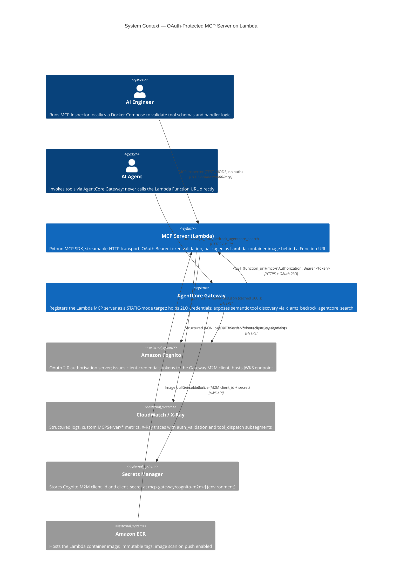
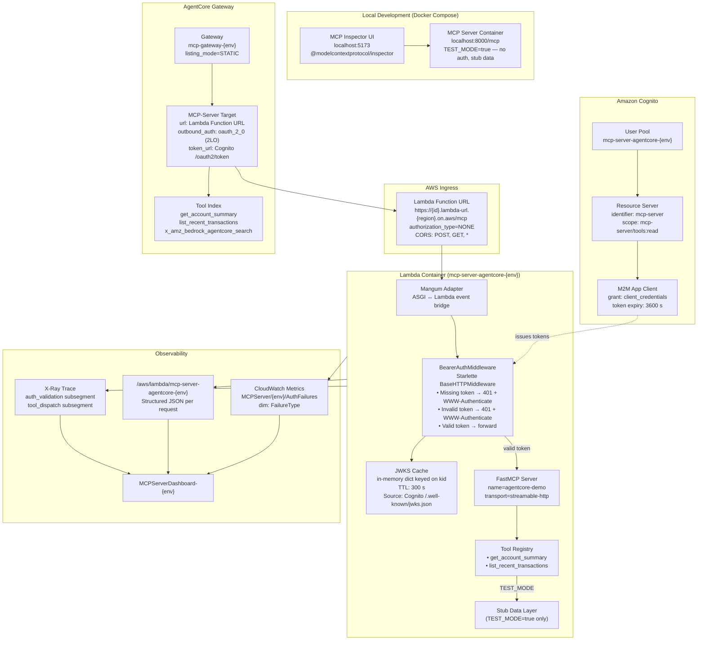
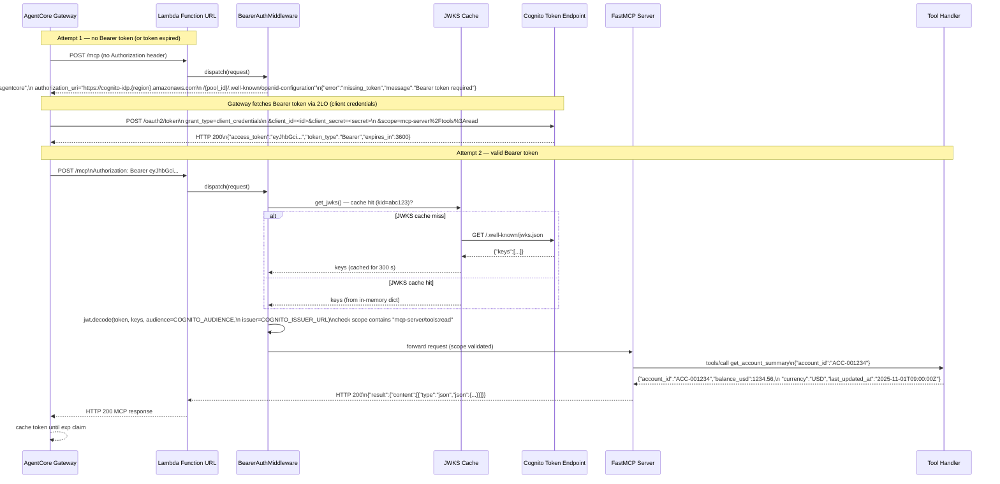

# Design: OAuth-Protected Remote MCP Server on AWS Lambda with AgentCore Gateway

## Architecture

### System Context

The MCP server runs inside a Lambda container image exposed through a **Lambda Function URL**. Amazon Cognito acts as the OAuth 2.0 authorisation server; every request must carry a `Bearer` token issued by Cognito or it receives HTTP 401 with a `WWW-Authenticate` header pointing at the Cognito discovery document. **Amazon Bedrock AgentCore Gateway** (GA October 2025) acts as the primary consumer: it registers the Lambda Function URL as an MCP-server target, holds the Cognito M2M credentials for 2LO outbound auth, and presents the server's tools as part of its unified tool surface to downstream AI agents. Developers interact with the server directly via **MCP Inspector** during local development using Docker Compose in `TEST_MODE`, bypassing OAuth entirely.



### Component Design



### OAuth Handshake — 2LO Token Acquisition and Tool Invocation

This sequence shows the complete RFC 6749 / RFC 7235 handshake, beginning from the moment AgentCore Gateway contacts the Lambda Function URL without a valid token, through Cognito token acquisition, and ending with a successful MCP tool call.



## MCP Tool Contracts

Both tools are registered on the `FastMCP` server using the `@mcp.tool()` decorator. The `inputSchema` is derived automatically from Python type annotations and docstrings; the examples below show the canonical Python signature alongside the JSON Schema that the MCP SDK emits.

### Tool: `get_account_summary`

```python
# src/tools/account.py

import re
from datetime import datetime, timezone
from mcp.server.fastmcp import FastMCP

mcp = FastMCP("agentcore-demo")

ACCOUNT_ID_PATTERN = re.compile(r"^ACC-[0-9]{6}$")

@mcp.tool()
async def get_account_summary(account_id: str) -> dict:
    """
    Retrieve the current balance and metadata for a given account.

    Returns account_id, balance_usd, currency, and last_updated_at (ISO 8601 UTC).
    Raises a validation error if account_id does not match ACC-NNNNNN.
    """
    if not ACCOUNT_ID_PATTERN.match(account_id):
        raise ValueError("invalid account_id format; expected ACC-NNNNNN")

    if _is_test_mode():
        return {
            "account_id": account_id,
            "balance_usd": 1234.56,
            "currency": "USD",
            "last_updated_at": "2025-11-01T09:00:00Z",
        }

    # Production: delegate to internal accounts service
    return await _fetch_account_from_backend(account_id)
```

Emitted `inputSchema`:
```json
{
  "$schema": "https://json-schema.org/draft/2020-12/schema",
  "type": "object",
  "properties": {
    "account_id": {
      "type": "string",
      "description": "Account identifier matching the pattern ACC-NNNNNN"
    }
  },
  "required": ["account_id"],
  "additionalProperties": false
}
```

### Tool: `list_recent_transactions`

```python
@mcp.tool()
async def list_recent_transactions(
    account_id: str,
    limit: int = 10,
) -> dict:
    """
    List the most recent transactions for an account, sorted newest-first.

    limit is clamped to 1–50; a warning field is included if clamping occurred.
    Each transaction contains transaction_id, amount_usd, direction (debit/credit),
    description, and posted_at (ISO 8601 UTC).
    """
    warned = False
    if limit < 1:
        limit = 1
        warned = True
    elif limit > 50:
        limit = 50
        warned = True

    if not ACCOUNT_ID_PATTERN.match(account_id):
        raise ValueError("invalid account_id format; expected ACC-NNNNNN")

    if _is_test_mode():
        transactions = _stub_transactions(account_id)[:limit]
        result: dict = {"account_id": account_id, "transactions": transactions}
        if warned:
            result["warning"] = f"limit was clamped to {limit}"
        return result

    transactions = await _fetch_transactions_from_backend(account_id, limit)
    result = {"account_id": account_id, "transactions": transactions}
    if warned:
        result["warning"] = f"limit was clamped to {limit}"
    return result
```

## Files & Interfaces

| File / Path | Purpose / Interface |
|------------|-------------------|
| `src/server.py` | Lambda handler entry point; constructs the Starlette ASGI app with `BearerAuthMiddleware` mounted, wires `FastMCP` with streamable-HTTP transport, exports `handler = Mangum(app)` |
| `src/auth.py` | `BearerAuthMiddleware(BaseHTTPMiddleware)` — extracts `Authorization` header, calls `get_jwks()`, validates JWT with `python-jose`, returns 401 + `WWW-Authenticate` on failure |
| `src/jwks_cache.py` | `get_jwks() -> dict` — async function; in-memory `_cache` dict keyed on `kid`; `_expires_at: float` using `time.monotonic()`; TTL constant `JWKS_TTL = 300` |
| `src/tools/account.py` | `get_account_summary` and `list_recent_transactions` tool implementations; `_is_test_mode()` helper reads `TEST_MODE` env var |
| `src/stub_data.py` | `_stub_transactions(account_id: str) -> list[dict]` — returns 3 deterministic transaction dicts used when `TEST_MODE=true` |
| `src/observability.py` | `emit_auth_metric(failure_type: str)` — calls CloudWatch `put_metric_data`; `log_request(...)` — writes structured JSON to stdout (captured by Lambda as CloudWatch Logs); `annotate_xray(tool_name: str)` |
| `Dockerfile` | Multi-stage build: `FROM public.ecr.aws/lambda/python:3.12`; `COPY requirements.txt`; `RUN pip install --no-cache-dir -r requirements.txt`; `COPY src/ ${LAMBDA_TASK_ROOT}/src/`; `CMD ["src.server.handler"]` |
| `requirements.txt` | `mcp[cli]>=1.3`, `python-jose[cryptography]>=3.3`, `httpx>=0.27`, `mangum>=0.17`, `aws-xray-sdk>=2.14` |
| `docker-compose.yml` | Service `mcp-server` (local build, `TEST_MODE=true`, port `8000:8000`); service `inspector` (image `mcp/inspector:latest`, port `5173:5173`, env `MCP_SERVER_URL=http://mcp-server:8000/mcp`) |
| `infra/terraform/modules/ecr/main.tf` | `aws_ecr_repository` (`mcp-server-agentcore`, `image_tag_mutability=IMMUTABLE`), `aws_ecr_lifecycle_policy` (retain last 30 tagged images), `aws_ecr_registry_scanning_configuration` (scan on push) |
| `infra/terraform/modules/ecr/variables.tf` | `repository_name`, `environment`, `project`, `owner` |
| `infra/terraform/modules/ecr/outputs.tf` | `repository_url`, `repository_arn` |
| `infra/terraform/modules/cognito/main.tf` | `aws_cognito_user_pool` (MFA off, no user sign-in), `aws_cognito_resource_server` (identifier `mcp-server`, scope `tools:read`), `aws_cognito_user_pool_client` (M2M, `client_credentials` grant only), `aws_secretsmanager_secret` + `aws_secretsmanager_secret_version` (M2M credentials) |
| `infra/terraform/modules/cognito/variables.tf` | `user_pool_name`, `token_validity_seconds`, `environment` |
| `infra/terraform/modules/cognito/outputs.tf` | `user_pool_id`, `user_pool_endpoint`, `m2m_client_id`, `token_url`, `m2m_secret_arn` |
| `infra/terraform/modules/lambda/main.tf` | `aws_lambda_function` (container image, `mcp-server-agentcore-${env}`), `aws_lambda_function_url` (`authorization_type=NONE`, CORS), `aws_iam_role` + inline policy (ECR pull, CloudWatch Logs, X-Ray), `aws_cloudwatch_log_group` (30-day retention sandbox, 90-day production) |
| `infra/terraform/modules/lambda/variables.tf` | `image_uri`, `cognito_issuer_url`, `cognito_audience`, `cognito_required_scope`, `environment`, `memory_size`, `timeout` |
| `infra/terraform/modules/lambda/outputs.tf` | `function_url`, `function_arn`, `function_name` |
| `infra/terraform/modules/gateway/main.tf` | `awscc_bedrock_agentcore_gateway` (Gateway resource), `awscc_bedrock_agentcore_gateway_target` (MCP-server target, `STATIC` mode, OAuth 2LO outbound); `validation` block rejecting `DYNAMIC` mode |
| `infra/terraform/modules/gateway/variables.tf` | `gateway_name`, `mcp_server_url`, `cognito_token_url`, `m2m_secret_arn`, `gateway_listing_mode` (default `"STATIC"`, validated) |
| `infra/terraform/modules/gateway/outputs.tf` | `gateway_id`, `gateway_arn`, `target_id` |
| `infra/terraform/environments/sandbox/main.tf` | Root module instantiating all four modules for the sandbox environment; `image_uri` sourced from `var.image_uri`; `enable_pitr = false` |
| `infra/terraform/environments/production/main.tf` | Root module for production; `memory_size = 1024`, `log_retention = 90`, `enable_pitr = true` |
| `tests/integration/test_oauth_handshake.py` | Asserts HTTP 401 + `WWW-Authenticate` header on request with no token; asserts HTTP 401 on expired/invalid token; asserts HTTP 200 on valid Cognito M2M token |
| `tests/integration/test_tool_invocation.py` | Fetches a Cognito M2M token from the sandbox User Pool; calls `tools/list` and asserts both tools present; calls `get_account_summary` and `list_recent_transactions` via the Gateway; asserts response shapes |

## Terraform Module Structure

### Module: `cognito`

```hcl
# infra/terraform/modules/cognito/main.tf

resource "aws_cognito_user_pool" "mcp" {
  name = "${var.user_pool_name}-${var.environment}"

  # M2M-only pool: no user sign-in features needed
  admin_create_user_config {
    allow_admin_create_user_only = true
  }

  tags = local.common_tags
}

resource "aws_cognito_resource_server" "mcp" {
  user_pool_id = aws_cognito_user_pool.mcp.id
  identifier   = "mcp-server"
  name         = "MCP Server Resource Server"

  scope {
    scope_name        = "tools:read"
    scope_description = "Grants permission to list and invoke MCP tools"
  }
}

resource "aws_cognito_user_pool_client" "m2m" {
  name         = "mcp-gateway-m2m-${var.environment}"
  user_pool_id = aws_cognito_user_pool.mcp.id

  generate_secret                      = true
  allowed_oauth_flows_user_pool_client = true
  allowed_oauth_flows                  = ["client_credentials"]
  allowed_oauth_scopes                 = ["mcp-server/tools:read"]

  access_token_validity  = var.token_validity_seconds / 3600   # hours
  token_validity_units {
    access_token = "hours"
  }

  depends_on = [aws_cognito_resource_server.mcp]
}

resource "aws_secretsmanager_secret" "m2m_credentials" {
  name                    = "mcp-gateway/cognito-m2m-${var.environment}"
  description             = "Cognito M2M client credentials for AgentCore Gateway outbound auth"
  recovery_window_in_days = 7

  tags = local.common_tags
}

resource "aws_secretsmanager_secret_version" "m2m_credentials" {
  secret_id = aws_secretsmanager_secret.m2m_credentials.id
  secret_string = jsonencode({
    client_id     = aws_cognito_user_pool_client.m2m.id
    client_secret = aws_cognito_user_pool_client.m2m.client_secret
  })
}
```

### Module: `lambda`

```hcl
# infra/terraform/modules/lambda/main.tf

resource "aws_cloudwatch_log_group" "mcp_server" {
  name              = "/aws/lambda/mcp-server-agentcore-${var.environment}"
  retention_in_days = var.log_retention_days   # 30 sandbox, 90 production
  kms_key_id        = aws_kms_key.lambda_logs.arn

  tags = local.common_tags
}

resource "aws_lambda_function" "mcp_server" {
  function_name = "mcp-server-agentcore-${var.environment}"
  role          = aws_iam_role.mcp_server.arn
  package_type  = "Image"
  image_uri     = var.image_uri   # e.g. 123456789012.dkr.ecr.us-east-1.amazonaws.com/mcp-server-agentcore@sha256:abc123
  timeout       = var.timeout     # 30
  memory_size   = var.memory_size # 512 sandbox, 1024 production

  environment {
    variables = {
      COGNITO_ISSUER_URL      = var.cognito_issuer_url
      COGNITO_AUDIENCE        = var.cognito_audience
      COGNITO_REQUIRED_SCOPE  = var.cognito_required_scope   # "mcp-server/tools:read"
      LOG_LEVEL               = "INFO"
      POWERTOOLS_SERVICE_NAME = "mcp-server-agentcore"
    }
  }

  tracing_config {
    mode = "Active"   # X-Ray active tracing
  }

  logging_config {
    log_format = "JSON"
    log_group  = aws_cloudwatch_log_group.mcp_server.name
  }

  tags = local.common_tags

  depends_on = [aws_cloudwatch_log_group.mcp_server]
}

resource "aws_lambda_function_url" "mcp_server" {
  function_name      = aws_lambda_function.mcp_server.function_name
  authorization_type = "NONE"   # Application-layer OAuth; see BearerAuthMiddleware

  cors {
    allow_credentials = false
    allow_headers     = ["authorization", "content-type"]
    allow_methods     = ["GET", "POST"]
    allow_origins     = ["*"]
    max_age           = 300
  }
}
```

### Module: `gateway`

```hcl
# infra/terraform/modules/gateway/main.tf

variable "gateway_listing_mode" {
  type        = string
  default     = "STATIC"
  description = "Tool listing mode for the AgentCore Gateway target. Must be STATIC."

  validation {
    condition     = var.gateway_listing_mode == "STATIC"
    error_message = "DYNAMIC listing mode disables semantic search and outbound 3LO; use STATIC."
  }
}

resource "awscc_bedrock_agentcore_gateway" "main" {
  name        = "mcp-gateway-${var.environment}"
  description = "AgentCore Gateway fronting the Lambda MCP server (mcp-server-agentcore)"

  tags = local.common_tags
}

resource "awscc_bedrock_agentcore_gateway_target" "mcp_server" {
  gateway_identifier = awscc_bedrock_agentcore_gateway.main.gateway_id
  name               = "lambda-mcp-server-${var.environment}"
  description        = "Remote MCP server hosted on Lambda Function URL"

  endpoint_configuration = {
    mcp_endpoint = {
      url          = var.mcp_server_url   # Lambda Function URL
      listing_mode = var.gateway_listing_mode
    }
  }

  credential_provider_configurations = [
    {
      credential_provider_type = "GATEWAY_IAM_ROLE"
      oauth2_credential_provider = {
        provider_type = "CUSTOM_JWT"
        custom_jwt_provider = {
          allowed_audience_list = [var.cognito_audience]
          allowed_client_list   = [var.cognito_m2m_client_id]
          discovery_url         = "${var.cognito_issuer_url}/.well-known/openid-configuration"
        }
      }
    }
  ]

  # Outbound auth: Gateway fetches a Cognito token before calling the Lambda URL
  client_token_configuration = {
    client_credentials_provider = {
      token_url     = var.cognito_token_url
      client_id     = var.cognito_m2m_client_id
      client_secret_arn = var.m2m_secret_arn
    }
  }
}
```

## AgentCore Runtime vs Lambda — Trade-Off

The MCP server can alternatively be hosted on **AgentCore Runtime** instead of Lambda. The table below summarises the key trade-offs; this specification implements the Lambda path.

| Dimension | Lambda + Function URL | AgentCore Runtime |
|-----------|----------------------|-------------------|
| Container entrypoint | `CMD ["src.server.handler"]` (Mangum wraps ASGI) | `mcp.run(transport="streamable-http")` on `0.0.0.0:8000/mcp` |
| Scaling | Lambda concurrency (burst: 3 000 in us-east-1) | Container-based scaling managed by Runtime |
| Cold start | ~1–3 s (container image) | No cold start after first request |
| Compute pricing | Lambda pricing (see AWS Lambda pricing page) | Runtime pricing — see https://aws.amazon.com/bedrock/agentcore/pricing/ for current per-vCPU-hour rates (not reproduced here as they are subject to change) |
| Gateway integration | Outbound auth over Function URL (IAM SigV4 or OAuth) | Native Runtime-to-Gateway integration; no Function URL required |
| IAM SigV4 outbound | **Supported** (Lambda Function URLs support SigV4 outbound auth from Gateway) | Supported via native integration |
| OAuth for Gateway outbound | Supported (this spec) | Supported |

> **IAM SigV4 note:** IAM SigV4 as the Gateway outbound auth mechanism works with Amazon API Gateway endpoints and Lambda Function URLs. It does **not** work with Application Load Balancer targets or direct EC2 endpoints. If you switch the hosting target to an ALB-fronted service, you must use OAuth or API key outbound auth instead.

## `DYNAMIC` Listing Mode — Compatibility Warning

> **Warning:** AgentCore Gateway's `DYNAMIC` tool listing mode is **incompatible with semantic search** (`x_amz_bedrock_agentcore_search`) and with **outbound 3LO** (per-end-user tokens; GA April 2026). If `DYNAMIC` mode is configured, the Gateway will not build a tool index, and natural-language tool lookup will silently return no results. This specification enforces `STATIC` mode via a Terraform `validation` block (see the `gateway` module above). Do not override this constraint without first confirming that neither semantic search nor 3LO is required.

## Error Handling

### OAuth Validation Failure Policy

| Scenario | Response | `WWW-Authenticate` Value | CloudWatch Metric |
|----------|----------|-------------------------|------------------|
| No `Authorization` header | HTTP 401 | `Bearer realm="mcp-server-agentcore", authorization_uri="..."` | `AuthFailures / missing_token` |
| Non-Bearer scheme | HTTP 401 | `Bearer realm="mcp-server-agentcore", authorization_uri="..."` | `AuthFailures / missing_token` |
| Expired token | HTTP 401 | `Bearer error="invalid_token"` | `AuthFailures / invalid_token` |
| Wrong audience or issuer | HTTP 401 | `Bearer error="invalid_token"` | `AuthFailures / invalid_token` |
| Invalid signature | HTTP 401 | `Bearer error="invalid_token"` | `AuthFailures / invalid_token` |
| Missing required scope | HTTP 401 | `Bearer error="insufficient_scope"` | `AuthFailures / invalid_token` |
| JWKS fetch failure | HTTP 503 | — | Lambda `Errors` metric |

### Tool Handler Errors

| Scenario | MCP Response | Lambda Behaviour |
|----------|-------------|-----------------|
| Invalid input (e.g., bad `account_id` format) | `isError=true`, sanitised message | HTTP 200 (MCP error is application-level) |
| Unhandled exception in handler | `isError=true`, `"internal error"` | Structured ERROR log; X-Ray fault; no stack trace in response |
| Backend HTTP timeout | `isError=true`, `"upstream timeout"` | X-Ray subsegment with fault annotation |

### JWKS Cache Resilience

If the JWKS endpoint is unavailable and the cache has expired, the middleware returns HTTP 503 with body `{"error": "auth_unavailable", "message": "JWKS endpoint unreachable"}`. It does **not** fail open — tokens are never accepted without validation. The cache TTL of 300 seconds is intentionally short to pick up Cognito key rotations within 5 minutes.

## Security

| Control | Implementation |
|---------|---------------|
| Token validation | RS256 JWT with issuer + audience + scope checks; no symmetric secrets on the server |
| JWKS caching | 300-second in-memory cache; short enough to detect Cognito key rotation |
| Secrets at rest | Cognito M2M `client_secret` stored in Secrets Manager at `mcp-gateway/cognito-m2m-${env}`; Lambda never sees it (Gateway fetches it directly) |
| Lambda execution role | Least-privilege: `logs:CreateLogGroup`, `logs:PutLogEvents`, `xray:PutTraceSegments`, `xray:PutTelemetryRecords`, `cloudwatch:PutMetricData`; no `s3:*`, `dynamodb:*`, or `iam:*` |
| Function URL | `authorization_type=NONE`; application-layer OAuth; no unauthenticated paths reach the MCP handler |
| Container image | Immutable ECR tags; scan on push; `pip install --no-cache-dir` to reduce layer size |
| No SigV4 on ALB | IAM SigV4 outbound auth from Gateway is not available for ALB targets; OAuth 2LO used here instead (compatible with Lambda Function URLs) |

## Observability

### Structured Log Schema

Every Lambda invocation emits one JSON line to `/aws/lambda/mcp-server-agentcore-${env}`:

```json
{
  "timestamp": "2025-11-01T09:01:23.456Z",
  "level": "INFO",
  "request_id": "3c5b8f00-1a2b-4c3d-8e9f-000102030405",
  "tool_name": "get_account_summary",
  "auth_result": "ok",
  "duration_ms": 142,
  "jwks_cache_hit": true,
  "account_id": "ACC-001234"
}
```

### X-Ray Segment Structure

```
Lambda segment: mcp-server-agentcore-{env}
  └── Subsegment: auth_validation
        annotations: { jwks_cache_hit: true }
  └── Subsegment: tool_dispatch
        annotations: { tool_name: "get_account_summary" }
  └── Subsegment: backend_http   (if applicable)
        annotations: { url: "https://internal-accounts-api/..." }
```

### CloudWatch Dashboard Widgets

The `MCPServerDashboard-${var.environment}` dashboard contains:

1. **Lambda Invocations & Errors** — `AWS/Lambda / Invocations` + `Errors` count, 5-minute periods
2. **p99 Latency** — `AWS/Lambda / Duration` p99 statistic
3. **Auth Failures by Type** — `MCPServer/${env} / AuthFailures` grouped by `FailureType` dimension
4. **Cold Start Monitor** — `AWS/Lambda / InitDuration` max, alerting on > 5 000 ms
5. **X-Ray Service Map** — embedded service map widget for the Lambda function ARN

## Cost Model

Costs for the primary AWS resources at moderate load (100 000 MCP tool invocations per month):

| Resource | Pricing Basis | Estimated Monthly Cost |
|----------|--------------|----------------------|
| Lambda | 100 000 invocations × 512 MB × ~200 ms avg duration | ~$0.02 |
| Lambda Function URL | No additional charge beyond Lambda invocation cost | — |
| ECR | Storage for ~500 MB image, negligible data transfer | ~$0.05 |
| CloudWatch Logs | ~1 GB ingested logs per month | ~$0.50 |
| X-Ray | 100 000 traces (first 100 000 free per month) | $0.00 |
| Secrets Manager | 1 secret, 100 000 API calls | ~$0.41 |
| Cognito | 0 MAUs (M2M only, no user sign-ins) | $0.00 |
| **AgentCore Gateway** | 100 000 invocations × $0.005 / 1 000 + 2 tools indexed × $0.02 / 100 tools / month | ~$0.50 + ~$0.00 |
| **Total** | | **~$1.50 / month** |

Gateway pricing is verified: **$0.005 per 1 000 API invocations** and **$0.02 per 100 tools indexed per month**. For AgentCore Runtime compute pricing (if you choose Runtime over Lambda), consult https://aws.amazon.com/bedrock/agentcore/pricing/ — those figures are not reproduced here as they are subject to change. For release status of all AgentCore components, see https://docs.aws.amazon.com/bedrock-agentcore/latest/devguide/release-notes.html.

## Testing Strategy

### Local Development — MCP Inspector Loop

```bash
# Start MCP server + Inspector
docker compose up

# Inspector UI available at http://localhost:5173
# MCP server reachable at http://localhost:8000/mcp (TEST_MODE=true, no auth)
# Invoke get_account_summary with account_id=ACC-000001 from Inspector UI

# Verify tool listing
docker compose exec mcp-server python -m pytest tests/unit/ -v
```

### Unit Tests

| Test Module | What Is Tested |
|------------|---------------|
| `tests/unit/test_auth.py` | `BearerAuthMiddleware`: missing token → 401 + correct `WWW-Authenticate`; invalid token → 401; valid token → 200; JWKS cache hit vs miss |
| `tests/unit/test_tools.py` | `get_account_summary`: valid ID → stub response; invalid pattern → `ValueError`; `list_recent_transactions`: clamping at 1 and 50 |
| `tests/unit/test_jwks_cache.py` | Cache populates on first call; TTL expiry triggers re-fetch; concurrent calls do not duplicate HTTP requests |

### Infrastructure Tests (Static Analysis)

| Tool | Command | Gate |
|------|---------|------|
| `terraform validate` | `terraform -chdir=infra/terraform/modules/<name> validate` | Zero errors |
| `tflint` | `tflint --module --config .tflint.hcl infra/terraform/` | Zero warnings (ruleset-aws ≥ 0.27) |
| `checkov` | `checkov -d infra/terraform/ --framework terraform` | Zero HIGH / CRITICAL failures |
| `hadolint` | `hadolint Dockerfile` | Zero warnings (DL3008: pin apt packages; DL3013: pin pip packages) |

### Integration Tests — Deployed Sandbox

1. **OAuth handshake test:** Call the Lambda Function URL directly with no `Authorization` header; assert HTTP 401 and `WWW-Authenticate` header containing `authorization_uri` pointing at the Cognito discovery endpoint.
2. **Invalid token test:** Send a Bearer token signed with a random key; assert HTTP 401 with `error="invalid_token"`.
3. **Valid token flow:** Fetch a Cognito M2M token from the sandbox User Pool (`/oauth2/token` with `grant_type=client_credentials`); call `tools/list`; assert both `get_account_summary` and `list_recent_transactions` appear.
4. **Gateway tool invocation:** Invoke `get_account_summary` via the AgentCore Gateway target (not the Function URL directly); assert the Gateway forwards the request and returns the MCP result.
5. **Semantic search test:** Invoke `x_amz_bedrock_agentcore_search` with query `"account balance"`; assert `get_account_summary` appears in the top-3 results.
6. **`TEST_MODE` stub consistency:** Call both tools with `TEST_MODE=true` via the local Docker container; assert response shapes match the JSON schemas in `tests/schemas/`.

### CI Pipeline

Static analysis (Terraform validate, tflint, checkov, hadolint, unit tests) runs on every pull request via `ci/mcp-server.yml`. The sandbox deployment and integration test suite run nightly (`schedule: cron 0 2 * * *`) using OIDC-based GitHub Actions role assumption against the sandbox AWS account.
