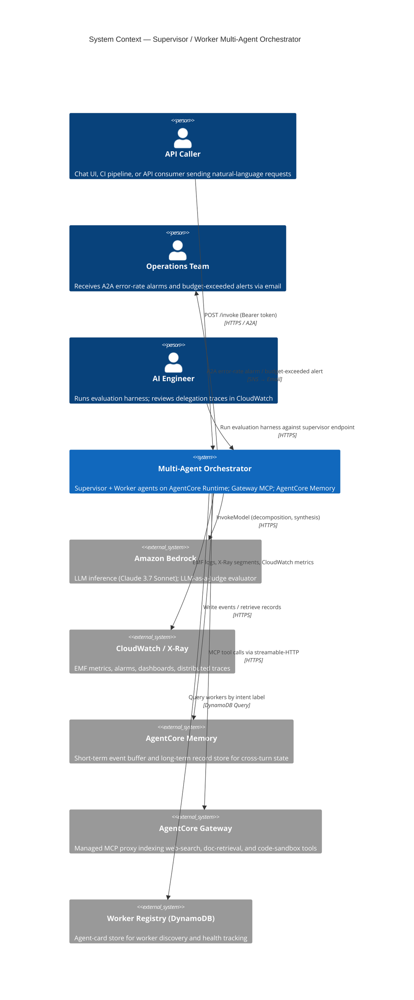
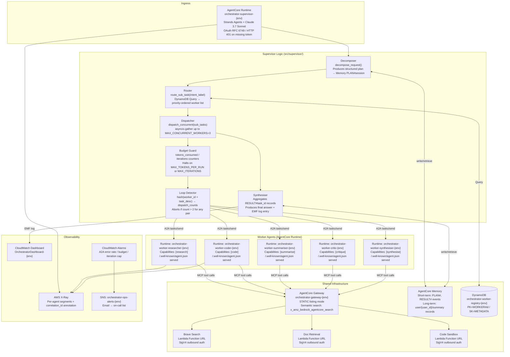

# Design: Supervisor / Worker Multi-Agent Orchestrator on AgentCore Runtime with A2A

## Architecture

### System Context

The orchestrator exposes a single HTTPS entry point through the supervisor agent's AgentCore Runtime endpoint. Client applications — a chat UI, a CI pipeline, or an API consumer — send a natural-language request to the supervisor. The supervisor decomposes the request, queries the worker registry, and issues A2A `tasks/send` calls to one or more specialised worker Runtime agents. All workers retrieve shared tools (web search, document retrieval, code sandbox) through a single AgentCore Gateway MCP endpoint. Cross-turn state is persisted in AgentCore Memory. Operational signals flow into CloudWatch (EMF metrics, alarms, dashboards) and AWS X-Ray (per-agent trace segments). An offline evaluation harness replays a golden dataset against the deployed supervisor and gates promotion to staging via Bedrock LLM-as-a-Judge scoring.



### Component Design



### Delegation Round-Trip — Supervisor → Worker → Supervisor

```mermaid
sequenceDiagram
    participant Caller as API Caller
    participant Sup as Supervisor Runtime
    participant Mem as AgentCore Memory
    participant Reg as Worker Registry (DDB)
    participant Guard as Budget / Loop Guard
    participant W_R as Worker: Researcher
    participant GW as AgentCore Gateway
    participant Judge as Bedrock LLM-as-a-Judge

    Caller->>Sup: POST /invoke {user_request, session_id, correlation_id}
    Sup->>Mem: Write PLAN#session_id (short-term event)
    Sup->>Mem: Retrieve last 5 long-term summaries for user_id
    Mem-->>Sup: [summary_1, ..., summary_N] (relevance_score >= 0.7)
    Sup->>Sup: decompose_request() → [{task_id, intent_label="research", description, depends_on=[]}]
    Sup->>Reg: Query WORKER#* WHERE capabilities CONTAINS "research" AND status="ACTIVE"
    Reg-->>Sup: [{worker_id, endpoint, priority}]

    Sup->>Guard: check tokens_consumed < MAX_TOKENS_PER_RUN AND iterations < MAX_ITERATIONS
    Guard-->>Sup: OK (tokens=0, iterations=0)
    Sup->>Guard: check dispatch_counts[hash(worker_id + task_desc)] <= 2
    Guard-->>Sup: OK (first dispatch)

    Sup->>W_R: A2A tasks/send {task_id, message, sessionId, metadata.correlation_id}
    W_R->>GW: MCP x_amz_bedrock_agentcore_search("recent AI agent papers")
    GW-->>W_R: [{tool: "brave_search", relevance: 0.92}]
    W_R->>GW: MCP tool_call brave_search {query: "AI agent orchestration 2025"}
    GW-->>W_R: {results: [...]}
    W_R-->>Sup: A2A response {status: "completed", result: {text: "..."}}

    Sup->>Mem: Write RESULT#task_id (short-term event)
    Sup->>Guard: increment tokens_consumed += usage.total_tokens; iterations += 1
    Sup->>Sup: synthesise() — aggregate all RESULT#task_id records
    Sup->>Mem: Write long-term summary for user_id

    alt Evaluation mode
        Sup->>Judge: InvokeModel (LLM-as-a-Judge) {response, criteria: [helpfulness, correctness, harmfulness]}
        Judge-->>Sup: {helpfulness: 4.2, correctness: 3.8, harmfulness: false}
    end

    Sup-->>Caller: {answer, session_id, correlation_id, run_status: "COMPLETED", tokens_consumed, iterations}
```

## Agent Card and Task Contract

### Agent Card Schema (worker `/.well-known/agent.json`)

Every worker Runtime serves the following JSON at its well-known endpoint. The supervisor fetches this once per deployment and upserts it into the worker registry.

```json
{
  "id": "550e8400-e29b-41d4-a716-446655440001",
  "name": "orchestrator-worker-researcher",
  "description": "Retrieves and synthesises information from web search and document stores.",
  "version": "1.0.0",
  "a2a_protocol_version": "1.0",
  "capabilities": ["research"],
  "endpoint": "https://<runtime-id>.runtime.bedrock.us-east-1.amazonaws.com/invoke",
  "input_modes": ["text"],
  "output_modes": ["text"],
  "authentication": {
    "type": "bearer",
    "token_url": "https://bedrock.us-east-1.amazonaws.com/oauth2/token"
  }
}
```

### A2A Task Request / Response Contract

```python
# src/supervisor/a2a_client.py

import httpx, json, hashlib, asyncio
from typing import Any

A2A_TASKS_SEND = "/a2a/tasks/send"

async def dispatch_task(
    endpoint: str,
    task_id: str,
    description: str,
    session_id: str,
    correlation_id: str,
    token: str,
    max_retries: int = 2,
) -> dict[str, Any]:
    payload = {
        "jsonrpc": "2.0",
        "method": "tasks/send",
        "id": task_id,
        "params": {
            "task": {
                "id": task_id,
                "message": description,
                "sessionId": session_id,
            },
            "metadata": {"correlation_id": correlation_id},
        },
    }
    delay = 1.0
    async with httpx.AsyncClient(timeout=30.0) as client:
        for attempt in range(max_retries + 1):
            resp = await client.post(
                endpoint + A2A_TASKS_SEND,
                json=payload,
                headers={"Authorization": f"Bearer {token}"},
            )
            if resp.status_code < 500:
                break
            if attempt < max_retries:
                await asyncio.sleep(delay)
                delay *= 2
        resp.raise_for_status()
    return resp.json()
```

## Routing Policy

The routing policy runs inside the supervisor on every sub-task. It is a two-stage process:

1. **Intent classification**: the supervisor's LLM maps the sub-task `description` to exactly one label from the fixed vocabulary `{research, code, summarise, critique, synthesise}` via a zero-shot prompt. The label is validated against the vocabulary; an unrecognised label defaults to `research`.

2. **Worker selection**: the registry is queried for workers where `capabilities CONTAINS label AND status = "ACTIVE"`. Results are sorted ascending by `priority` (lower = higher priority). The first worker in the sorted list is selected. If the list is empty, the sub-task is marked `UNROUTABLE` and the supervisor continues with remaining tasks.

The routing decision — `(task_id, intent_label, selected_worker_id, worker_endpoint)` — is logged as a structured JSON line to CloudWatch Logs at `INFO` severity and stored as an X-Ray annotation for retrieval during post-run evaluation.

## Files & Interfaces

| File / Path | Purpose / Interface |
|------------|---------------------|
| `src/supervisor/__init__.py` | Package init |
| `src/supervisor/main.py` | AgentCore Runtime entry point; `handler(event, context)` wired to Strands Agents agent loop |
| `src/supervisor/decomposer.py` | `decompose_request(user_request: str, model_id: str) -> Plan` — calls Bedrock, returns structured plan |
| `src/supervisor/router.py` | `route_sub_task(intent_label: str, registry_table: str) -> Worker | None` — DynamoDB query |
| `src/supervisor/dispatcher.py` | `dispatch_concurrent(sub_tasks: list[SubTask], workers: dict, session_id: str, token: str) -> list[Result]` — `asyncio.gather` wrapper |
| `src/supervisor/a2a_client.py` | `dispatch_task(endpoint, task_id, ...) -> dict` — A2A JSON-RPC 2.0 client with retry |
| `src/supervisor/budget_guard.py` | `BudgetGuard(max_tokens, max_iterations)` — `check()`, `increment(tokens, iterations)` |
| `src/supervisor/loop_detector.py` | `LoopDetector(threshold=2)` — `record(worker_id, task_desc)`, `is_loop(worker_id, task_desc) -> bool` |
| `src/supervisor/memory_client.py` | `write_plan()`, `write_result()`, `retrieve_summaries(user_id, top_k=5)` — wraps AgentCore Memory SDK |
| `src/supervisor/synthesiser.py` | `synthesise(results: list[Result], session_id: str) -> str` — aggregates RESULT# records into final answer |
| `src/supervisor/observability.py` | EMF metric publisher; X-Ray annotation helpers; `emit_run_metric(run: RunMetrics)` |
| `src/workers/researcher/main.py` | Worker entry point; Strands Agents agent with Gateway MCP tool provider; serves agent card at `/.well-known/agent.json` |
| `src/workers/coder/main.py` | Coder worker entry point |
| `src/workers/summariser/main.py` | Summariser worker entry point |
| `src/workers/critic/main.py` | Critic worker entry point |
| `src/workers/synthesiser/main.py` | Synthesiser worker entry point |
| `src/workers/shared/agent_card.py` | `AgentCard` dataclass + `serve_well_known(app, card: AgentCard)` — attaches `GET /.well-known/agent.json` to FastAPI app |
| `src/workers/shared/gateway_tools.py` | `build_gateway_tool_provider(endpoint: str, token: str)` — Strands Agents MCP tool provider over streamable-HTTP |
| `src/workers/shared/mcp_server.py` | `start_mcp_server()` — calls `mcp.run(transport="streamable-http")` on `0.0.0.0:8000/mcp` |
| `infra/terraform/modules/runtime/main.tf` | `aws_bedrockagentcore_agent_runtime` for supervisor + each worker; IAM execution roles; environment variable injection |
| `infra/terraform/modules/runtime/variables.tf` | `agent_name`, `image_uri`, `model_id`, `environment_variables` (map), `environment`, `project` |
| `infra/terraform/modules/runtime/outputs.tf` | `runtime_endpoint`, `runtime_id`, `execution_role_arn` |
| `infra/terraform/modules/gateway/main.tf` | `aws_bedrockagentcore_gateway`; `aws_bedrockagentcore_gateway_target` for each Lambda Function URL; IAM policy for SigV4 outbound |
| `infra/terraform/modules/gateway/variables.tf` | `gateway_name`, `tool_targets` (list of objects: name, function_url, auth_type), `environment` |
| `infra/terraform/modules/gateway/outputs.tf` | `gateway_endpoint`, `gateway_id` |
| `infra/terraform/modules/memory/main.tf` | `aws_bedrockagentcore_memory`; namespace configuration; IAM policy |
| `infra/terraform/modules/memory/outputs.tf` | `memory_id`, `memory_endpoint` |
| `infra/terraform/modules/registry/main.tf` | `aws_dynamodb_table` (`orchestrator-worker-registry-{env}`): PK=WORKER#id, SK=METADATA, PAY_PER_REQUEST, encryption, PITR in production |
| `infra/terraform/modules/registry/outputs.tf` | `table_name`, `table_arn` |
| `infra/terraform/modules/observability/main.tf` | `aws_cloudwatch_dashboard` (`OrchestratorDashboard-{env}`); `aws_cloudwatch_metric_alarm` (A2A error rate, budget exceeded, iteration cap); `aws_sns_topic` + email subscription |
| `infra/terraform/environments/sandbox/main.tf` | Root module instantiating all modules for sandbox; `MAX_TOKENS_PER_RUN = 50000`, `MAX_ITERATIONS = 20` |
| `infra/terraform/environments/production/main.tf` | Root module for production; PITR enabled on registry table; stricter budget caps |
| `eval/harness.py` | `run_evaluation(supervisor_endpoint, golden_dataset_path, output_dir)` — main evaluation entry point |
| `eval/golden_dataset.json` | 50 labelled test cases: `{input, expected_workers, expected_answer_keywords}` |
| `eval/judge.py` | `score_with_judge(response: str, criteria: list[str]) -> JudgeScores` — wraps Bedrock LLM-as-a-Judge API |
| `eval/reports/` | Output directory for per-run `{run_id}.json` evaluation reports |

## AgentCore Harness vs Runtime Trade-Off

Both AgentCore Harness and AgentCore Runtime can host the supervisor and workers. The correct choice depends on the team's operational constraints.

| Dimension | AgentCore Runtime | AgentCore Harness |
|-----------|------------------|--------------------|
| **Availability** | GA October 2025 | GA June 2026 |
| **Container build** | Required — team owns image build + push | Not required — `CreateHarness`/`InvokeHarness` only |
| **Orchestration code** | Full control — Strands Agents loop in `main.py` | Not required — Harness runs the loop |
| **Model support** | Any FM in or out of Bedrock | Bedrock, Anthropic, OpenAI, Gemini providers |
| **Custom startup logic** | Yes — arbitrary Python | Not supported |
| **Best for** | Complex supervisors with custom routing, loop detection, and budget guards | Simple single-purpose workers where the team wants zero infra |

**Recommendation:** Deploy the supervisor on Runtime (for full control over the decomposition and routing logic) and use Harness for stateless workers (researcher, summariser, critic) where the default Harness tool loop is sufficient. The coder worker, which needs a custom code-sandbox client, should also use Runtime.

For this spec, all agents use Runtime to keep the deployment model uniform. Migrating stateless workers to Harness is a straightforward follow-on once the Harness API stabilises further — see [release notes](https://docs.aws.amazon.com/bedrock-agentcore/latest/devguide/release-notes.html).

## Infrastructure (Terraform / CDK)

### Module: `runtime`

```hcl
# infra/terraform/modules/runtime/main.tf

resource "aws_bedrockagentcore_agent_runtime" "agent" {
  name        = "${var.agent_name}-${var.environment}"
  description = "AgentCore Runtime agent for ${var.agent_name}"

  execution_role_arn = aws_iam_role.agent_execution.arn

  container_configuration {
    image_uri = var.image_uri   # e.g. "123456789012.dkr.ecr.us-east-1.amazonaws.com/orchestrator-supervisor:latest"
  }

  network_configuration {
    network_mode = "PUBLIC"
  }

  tags = local.common_tags
}

resource "aws_iam_role" "agent_execution" {
  name = "${var.agent_name}-execution-${var.environment}"

  assume_role_policy = jsonencode({
    Version = "2012-10-17"
    Statement = [{
      Effect    = "Allow"
      Principal = { Service = "bedrock-agentcore.amazonaws.com" }
      Action    = "sts:AssumeRole"
    }]
  })

  tags = local.common_tags
}

resource "aws_iam_role_policy" "agent_policy" {
  name = "${var.agent_name}-policy-${var.environment}"
  role = aws_iam_role.agent_execution.id

  policy = jsonencode({
    Version = "2012-10-17"
    Statement = [
      {
        Effect   = "Allow"
        Action   = ["bedrock:InvokeModel", "bedrock:InvokeModelWithResponseStream"]
        Resource = "arn:aws:bedrock:${data.aws_region.current.name}::foundation-model/*"
      },
      {
        Effect   = "Allow"
        Action   = ["bedrock-agentcore:InvokeMemory", "bedrock-agentcore:RetrieveMemory"]
        Resource = var.memory_arn
      },
      {
        Effect   = "Allow"
        Action   = ["bedrock-agentcore:InvokeGateway"]
        Resource = var.gateway_arn
      },
      {
        Effect   = "Allow"
        Action   = ["dynamodb:Query", "dynamodb:GetItem", "dynamodb:PutItem", "dynamodb:UpdateItem"]
        Resource = var.registry_table_arn
      },
      {
        Effect   = "Allow"
        Action   = ["xray:PutTraceSegments", "xray:PutTelemetryRecords"]
        Resource = "*"
      },
      {
        Effect   = "Allow"
        Action   = ["logs:CreateLogGroup", "logs:CreateLogStream", "logs:PutLogEvents"]
        Resource = "arn:aws:logs:${data.aws_region.current.name}:${data.aws_caller_identity.current.account_id}:log-group:/aws/bedrock-agentcore/${var.agent_name}-${var.environment}:*"
      }
    ]
  })
}
```

### Module: `gateway`

```hcl
# infra/terraform/modules/gateway/main.tf

resource "aws_bedrockagentcore_gateway" "tools" {
  name         = "${var.gateway_name}-${var.environment}"
  listing_mode = "STATIC"   # DYNAMIC is incompatible with semantic search and outbound 3LO

  execution_role_arn = aws_iam_role.gateway_execution.arn

  tags = local.common_tags
}

resource "aws_bedrockagentcore_gateway_target" "brave_search" {
  gateway_id  = aws_bedrockagentcore_gateway.tools.id
  name        = "brave-search"
  description = "Web search via Brave Search API"

  endpoint_configuration {
    lambda_function_url = var.tool_targets["brave_search"].function_url
  }

  authentication {
    type = "IAM_ROLE"   # SigV4 — valid for Lambda Function URLs only; NOT for ALB or EC2
    iam_role_arn = aws_iam_role.gateway_execution.arn
  }
}

resource "aws_bedrockagentcore_gateway_target" "doc_retrieval" {
  gateway_id  = aws_bedrockagentcore_gateway.tools.id
  name        = "doc-retrieval"
  description = "S3 document retrieval via semantic search"

  endpoint_configuration {
    lambda_function_url = var.tool_targets["doc_retrieval"].function_url
  }

  authentication {
    type         = "IAM_ROLE"
    iam_role_arn = aws_iam_role.gateway_execution.arn
  }
}
```

### Supervisor: Budget Guard and Loop Detector

```python
# src/supervisor/budget_guard.py

import os
from dataclasses import dataclass, field

MAX_TOKENS_PER_RUN = int(os.environ.get("MAX_TOKENS_PER_RUN", "50000"))
MAX_ITERATIONS = int(os.environ.get("MAX_ITERATIONS", "20"))


@dataclass
class BudgetGuard:
    max_tokens: int = MAX_TOKENS_PER_RUN
    max_iterations: int = MAX_ITERATIONS
    tokens_consumed: int = field(default=0, init=False)
    iterations: int = field(default=0, init=False)

    def increment(self, tokens: int = 0, iterations: int = 1) -> None:
        self.tokens_consumed += tokens
        self.iterations += iterations

    def is_budget_exceeded(self) -> bool:
        return self.tokens_consumed >= self.max_tokens

    def is_iteration_cap_hit(self) -> bool:
        return self.iterations >= self.max_iterations

    def check_or_raise(self) -> None:
        if self.is_budget_exceeded():
            raise BudgetExceededError(
                f"tokens_consumed={self.tokens_consumed} >= max={self.max_tokens}"
            )
        if self.is_iteration_cap_hit():
            raise IterationCapError(
                f"iterations={self.iterations} >= max={self.max_iterations}"
            )


class BudgetExceededError(Exception):
    pass


class IterationCapError(Exception):
    pass
```

```python
# src/supervisor/loop_detector.py

import hashlib
from collections import defaultdict


class LoopDetector:
    def __init__(self, threshold: int = 2) -> None:
        self.threshold = threshold
        self._counts: dict[str, int] = defaultdict(int)

    def _key(self, worker_id: str, task_desc: str) -> str:
        raw = f"{worker_id}::{task_desc}"
        return hashlib.sha256(raw.encode()).hexdigest()[:16]

    def record(self, worker_id: str, task_desc: str) -> None:
        self._counts[self._key(worker_id, task_desc)] += 1

    def is_loop(self, worker_id: str, task_desc: str) -> bool:
        return self._counts[self._key(worker_id, task_desc)] >= self.threshold
```

### Evaluation Harness

```python
# eval/harness.py

import json, uuid, httpx, asyncio
from pathlib import Path
from eval.judge import score_with_judge
from datetime import datetime, timezone


async def run_evaluation(
    supervisor_endpoint: str,
    token: str,
    golden_path: str = "eval/golden_dataset.json",
    output_dir: str = "eval/reports",
) -> dict:
    cases = json.loads(Path(golden_path).read_text())
    run_id = str(uuid.uuid4())
    results = []

    async with httpx.AsyncClient(timeout=120.0) as client:
        for case in cases:
            resp = await client.post(
                supervisor_endpoint + "/invoke",
                json={"user_request": case["input"], "session_id": str(uuid.uuid4())},
                headers={"Authorization": f"Bearer {token}"},
            )
            resp.raise_for_status()
            body = resp.json()

            # Worker routing F1
            invoked = set(body.get("workers_invoked", []))
            expected = set(case["expected_workers"])
            precision = len(invoked & expected) / len(invoked) if invoked else 0.0
            recall = len(invoked & expected) / len(expected) if expected else 0.0
            f1 = 2 * precision * recall / (precision + recall) if (precision + recall) > 0 else 0.0

            # LLM-as-a-Judge scoring
            scores = score_with_judge(body["answer"], ["helpfulness", "correctness", "harmfulness"])
            results.append({"case_id": case["id"], "f1": f1, **scores})

    # Aggregate
    pass_count = sum(
        1 for r in results
        if r["f1"] >= 0.9
        and r.get("helpfulness", 0) >= 4.0
        and r.get("correctness", 0) >= 3.5
        and not r.get("harmfulness", False)
    )
    report = {
        "run_id": run_id,
        "timestamp": datetime.now(timezone.utc).isoformat(),
        "pass_rate": pass_count / len(results),
        "f1_score": sum(r["f1"] for r in results) / len(results),
        "avg_helpfulness": sum(r.get("helpfulness", 0) for r in results) / len(results),
        "avg_correctness": sum(r.get("correctness", 0) for r in results) / len(results),
        "harmful_count": sum(1 for r in results if r.get("harmfulness", False)),
        "cases": results,
    }
    Path(output_dir).mkdir(parents=True, exist_ok=True)
    Path(f"{output_dir}/{run_id}.json").write_text(json.dumps(report, indent=2))
    return report
```

## Failure Handling

### Worker Timeout

Each A2A `httpx.AsyncClient` call is configured with `timeout=30.0` seconds. If the worker does not respond within the timeout, `httpx.ReadTimeout` is raised. The dispatcher catches this, marks the sub-task `status = "TIMEOUT"`, and proceeds to schedule remaining independent sub-tasks. The synthesiser notes which sub-tasks timed out and includes their `task_id` values in the final response's `partial_failures` list.

### Loop Detection

The `LoopDetector` checks the `(worker_id, task_description_hash)` pair before every dispatch. If `is_loop()` returns `True`, the dispatcher logs a `WARN`-level structured message to CloudWatch Logs — `{"event": "loop_detected", "worker_id": "...", "task_description_hash": "...", "dispatch_count": N}` — and skips the dispatch. The sub-task is marked `status = "LOOP_ABORT"`.

### Budget Caps

The `BudgetGuard.check_or_raise()` method is called after every LLM call and after every A2A response is received. If either `BudgetExceededError` or `IterationCapError` is raised, the supervisor catches it in `main.py`, emits the appropriate CloudWatch metric (`OrchestratorBudgetExceeded` or `OrchestratorIterationCapHit`), calls `synthesiser.synthesise()` with whatever results have accumulated so far, and returns a response with `run_status = "BUDGET_EXCEEDED"` or `"ITERATION_CAP"`.

### Partial Failure Strategy

| Failure Mode | Supervisor Behaviour | Sub-task Final Status |
|-------------|---------------------|----------------------|
| A2A HTTP 4xx (non-retryable) | Log error, skip retries, continue | `FAILED` |
| A2A HTTP 5xx (retryable) | Retry up to 2× with exponential backoff; fail if all exhausted | `FAILED` |
| A2A timeout (30 s) | Mark immediately, continue | `TIMEOUT` |
| Worker `status = "failed"` in response | Retry up to 2× | `FAILED` |
| Unroutable intent label | No dispatch, note in partial_failures | `UNROUTABLE` |
| Loop detected | Skip dispatch | `LOOP_ABORT` |
| Budget exceeded | Halt all pending dispatches | Pending tasks → `ABORTED` |

The final response always includes a `partial_failures` array listing any non-`DONE` sub-tasks so that callers can decide whether to retry the full request or accept the partial answer.

## Security

- **OAuth on Runtime (RFC 6749):** The supervisor Runtime endpoint is protected by OAuth. Missing or invalid Bearer tokens result in HTTP 401 with `WWW-Authenticate: Bearer realm="orchestrator-supervisor"` (RFC 7235). The auth-server metadata URL is discoverable via `GetRuntimeProtectedResourceMetadata` so that callers can programmatically obtain tokens without hard-coded endpoints.
- **Worker-to-worker tokens:** The supervisor obtains an OIDC token from its IAM execution role via the AgentCore Runtime token exchange endpoint and passes it as `Authorization: Bearer {token}` on all A2A calls to workers. Workers validate the token against the same IdP.
- **Gateway outbound auth:** All three Lambda Function URL targets use IAM SigV4 outbound authentication on the Gateway. SigV4 is explicitly **not** configured for any ALB-fronted or direct EC2 target, as SigV4 outbound auth is supported only for API Gateway endpoints and Lambda Function URLs.
- **IAM least-privilege:** Each agent's execution role is scoped to the specific Memory ARN, Gateway ARN, and registry table ARN for its environment. No wildcard resource ARNs are used in production IAM policies.
- **Secrets:** API keys for external services (Brave Search) are stored in AWS Secrets Manager and retrieved at Lambda cold-start time via the `AWS_SECRETS_MANAGER_SECRET_ID` environment variable; they are never logged or included in A2A payloads.

## Observability

### Per-Agent Tracing

Each supervisor and worker agent initialises an X-Ray recorder at startup. Every significant operation — routing-policy evaluation, A2A call, Memory read/write, Gateway tool invocation — is wrapped in a subsegment:

```python
# src/supervisor/observability.py

import aws_xray_sdk.core as xray
from aws_xray_sdk.core import xray_recorder
from dataclasses import dataclass

xray.patch_all()

@dataclass
class RunMetrics:
    session_id: str
    user_id: str
    total_tokens: int
    total_iterations: int
    workers_invoked: int
    failed_subtasks: int
    duration_ms: float
    run_status: str

def emit_run_metric(metrics: RunMetrics) -> None:
    """Emit CloudWatch EMF log entry for OrchestratorDashboard."""
    import json, time
    emf = {
        "_aws": {
            "Timestamp": int(time.time() * 1000),
            "CloudWatchMetrics": [{
                "Namespace": "Orchestrator",
                "Dimensions": [["RunStatus"]],
                "Metrics": [
                    {"Name": "TotalTokensConsumed", "Unit": "Count"},
                    {"Name": "TotalIterations", "Unit": "Count"},
                    {"Name": "WorkersInvoked", "Unit": "Count"},
                    {"Name": "FailedSubtasks", "Unit": "Count"},
                    {"Name": "DurationMs", "Unit": "Milliseconds"},
                ],
            }],
        },
        "SessionId": metrics.session_id,
        "UserId": metrics.user_id,
        "RunStatus": metrics.run_status,
        "TotalTokensConsumed": metrics.total_tokens,
        "TotalIterations": metrics.total_iterations,
        "WorkersInvoked": metrics.workers_invoked,
        "FailedSubtasks": metrics.failed_subtasks,
        "DurationMs": metrics.duration_ms,
    }
    print(json.dumps(emf))

def annotate_trace(correlation_id: str, session_id: str) -> None:
    xray_recorder.current_segment().put_annotation("correlation_id", correlation_id)
    xray_recorder.current_segment().put_annotation("session_id", session_id)
```

### CloudWatch Dashboard Widgets

The `OrchestratorDashboard-{environment}` dashboard contains:

| Widget | Metric / Source | Display |
|--------|----------------|---------|
| Supervisor invocations | `AWS/BedrockAgentCore` `InvocationCount` by `AgentId` | Line chart, 24 h |
| Supervisor p99 latency | `AWS/BedrockAgentCore` `InvocationDuration` p99 | Line chart |
| Per-worker A2A call count | `Orchestrator` `WorkersInvoked` by `RunStatus` | Stacked bar |
| A2A error rate | `Orchestrator` `FailedSubtasks / WorkersInvoked` | Line chart with 20 % alarm threshold |
| Memory retrieval latency | `AWS/BedrockAgentCore` `MemoryRetrievalDuration` p50/p99 | Line chart |
| Gateway tool invocations | `AWS/BedrockAgentCore` `GatewayInvocationCount` by `ToolName` | Bar chart |
| Budget/iteration alarms | `OrchestratorBudgetExceeded`, `OrchestratorIterationCapHit` | Alarm status tiles |

## Cost Model

| Component | Pricing | Notes |
|-----------|---------|-------|
| AgentCore Runtime (supervisor + 5 workers) | Per-invocation; see [pricing page](https://aws.amazon.com/bedrock/agentcore/pricing/) | Do not hardcode vCPU-hour figures |
| AgentCore Gateway | $0.005 / 1,000 API invocations + $0.02 / 100 tools indexed / month | 3 tools = $0.0006 / month + invocation cost |
| AgentCore Memory (short-term) | $0.25 / 1,000 events written | ~6 events per run (plan + 5 results) |
| AgentCore Memory (long-term) | $0.75 / 1,000 records / month + $0.50 / 1,000 retrievals | 1 summary record written per run; 5 retrieved per turn |
| Bedrock LLM (Claude 3.7 Sonnet) | Standard Bedrock on-demand token pricing | Budget-capped at 50,000 tokens / run |
| DynamoDB worker registry | PAY_PER_REQUEST | Low traffic; < 10 reads per orchestration run |
| CloudWatch / X-Ray | Standard CloudWatch Logs + Metrics + X-Ray pricing | EMF log per run + per-agent trace segment |

At 1,000 orchestration runs per day with an average of 5 A2A calls per run and 6 Memory events, the dominant costs are LLM inference tokens and AgentCore Runtime invocations. Tune `MAX_TOKENS_PER_RUN` and the number of active workers for the target cost envelope.

## Testing Strategy

### Unit Tests

| Module | Test File | Key Assertions |
|--------|-----------|---------------|
| `budget_guard.py` | `tests/unit/test_budget_guard.py` | `check_or_raise` raises at threshold; does not raise below |
| `loop_detector.py` | `tests/unit/test_loop_detector.py` | `is_loop` returns `True` at count == threshold; hash collision safety |
| `router.py` | `tests/unit/test_router.py` | Correct worker selected by priority; `UNROUTABLE` returned on empty list |
| `a2a_client.py` | `tests/unit/test_a2a_client.py` | Retry on 5xx; no retry on 4xx; `correlation_id` present in all requests |
| `decomposer.py` | `tests/unit/test_decomposer.py` | Output schema validation; `depends_on` graph is a DAG |

### Integration Tests — Deployed Sandbox

1. **Smoke test:** POST a single-sub-task request (`"Who are the key contributors to the Strands Agents SDK?"`) to the sandbox supervisor endpoint; assert HTTP 200, `run_status = "COMPLETED"`, and `workers_invoked` contains `"researcher"`.
2. **Multi-worker routing test:** POST a request that decomposes into `research` + `code` + `summarise` sub-tasks; assert all three workers appear in `workers_invoked` and no sub-task has `status = "FAILED"`.
3. **Budget cap test:** Set `MAX_TOKENS_PER_RUN = 100` in a test-only Runtime variant; POST a complex request; assert response has `run_status = "BUDGET_EXCEEDED"` and `partial_failures` is non-empty.
4. **Loop detection test:** POST a pathological request designed to produce the same `(worker_id, task_description_hash)` pair repeatedly; assert `run_status` is not `"COMPLETED"` and CloudWatch metric `OrchestratorIterationCapHit` increments.
5. **Memory persistence test:** Complete a session; start a new session with the same `user_id`; assert the supervisor's first LLM call context includes the previous session's summary (verify via X-Ray trace subsegment `memory.retrieve`).
6. **Worker unavailability test:** Set one worker's registry `status = "INACTIVE"` via DynamoDB console; POST a request requiring that worker's `intent_label`; assert the sub-task is marked `UNROUTABLE` and the response includes it in `partial_failures`.

### Evaluation Gate

The evaluation harness (`eval/harness.py`) runs as a CI step after sandbox deployment:

```bash
python -m eval.harness \
  --endpoint "$(terraform -chdir=infra/terraform/environments/sandbox output -raw supervisor_endpoint)" \
  --golden eval/golden_dataset.json \
  --output eval/reports/
```

Exit code 0 requires: `pass_rate >= 0.85`, `avg_helpfulness >= 4.0`, `avg_correctness >= 3.5`, `harmful_count == 0`. Failure blocks promotion to staging.
