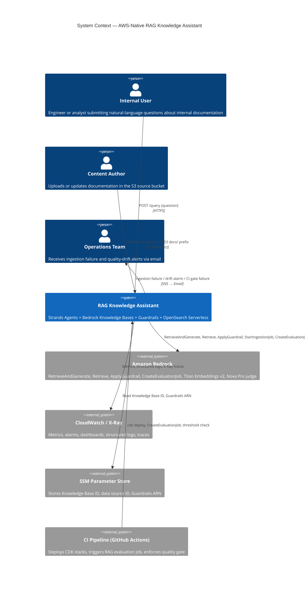
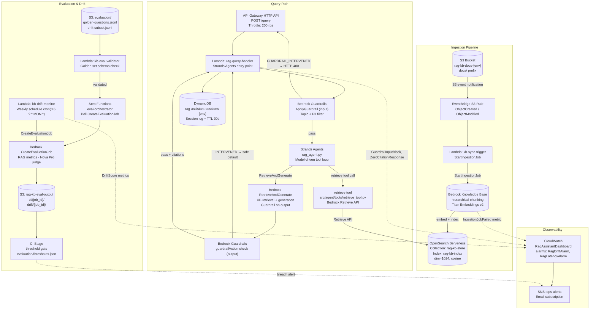
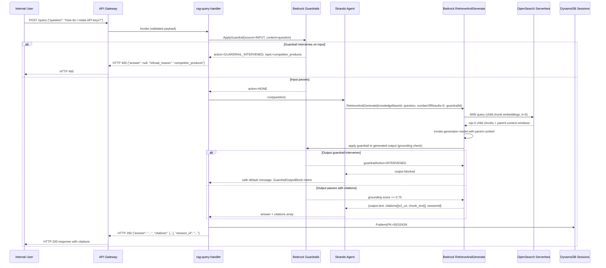

# Design: AWS-Native RAG Knowledge Assistant

## Architecture

### System Context

Internal users submit natural-language questions to a query API endpoint backed by a Lambda function. The Lambda invokes a Strands Agents agent that applies Bedrock Guardrails to the input query, calls the Bedrock `RetrieveAndGenerate` API (or the `Retrieve` API via a Strands tool for granular retrieval), and receives an answer with inline citations. The Knowledge Base retrieves relevant chunks from an OpenSearch Serverless vector collection populated by a Bedrock-managed ingestion pipeline that reads documents from S3. Guardrails are also applied to the model's output before the answer reaches the caller. A CI evaluation pipeline and a weekly drift monitor measure quality using `CreateEvaluationJob` against a golden question set. All operational signals flow to CloudWatch; the CDK application provisions every resource.



### Component Design



### Retrieve → Generate → Cite Sequence



## Ingestion Pipeline

### Chunking and Embedding Configuration

The Knowledge Base data source uses `HIERARCHICAL` chunking. Parent chunks (max 1500 tokens, 100-token overlap) supply the generation context window; child chunks (max 300 tokens, 20-token overlap) supply the ANN query vectors. This two-level split improves recall on long technical documents where relevant facts span multiple paragraphs.

```python
# infra/stacks/knowledge_base_stack.py (excerpt)

from aws_cdk import (
    aws_bedrock as bedrock,
    aws_opensearchserverless as aoss,
    CfnOutput,
    Stack,
)
from constructs import Construct


class RagKnowledgeBaseStack(Stack):
    def __init__(self, scope: Construct, id: str, storage: "RagStorageStack", **kwargs):
        super().__init__(scope, id, **kwargs)

        env_name = self.node.try_get_context("env") or "sandbox"
        chunk_parent = int(self.node.try_get_context("chunk_parent_tokens") or 1500)
        chunk_child = int(self.node.try_get_context("chunk_child_tokens") or 300)
        chunk_overlap = int(self.node.try_get_context("chunk_overlap_tokens") or 20)

        # OpenSearch Serverless collection
        self.aoss_collection = aoss.CfnCollection(
            self, "KbAossCollection",
            name=f"rag-kb-store-{env_name}",
            type="VECTORSEARCH",
            description="Vector store for RAG Knowledge Base",
        )

        # Bedrock Knowledge Base
        self.knowledge_base = bedrock.CfnKnowledgeBase(
            self, "RagKnowledgeBase",
            name=f"rag-kb-{env_name}",
            description="Internal documentation Knowledge Base",
            role_arn=kb_role.role_arn,
            knowledge_base_configuration=bedrock.CfnKnowledgeBase.KnowledgeBaseConfigurationProperty(
                type="VECTOR",
                vector_knowledge_base_configuration=bedrock.CfnKnowledgeBase.VectorKnowledgeBaseConfigurationProperty(
                    embedding_model_arn=(
                        "arn:aws:bedrock:us-east-1::foundation-model/"
                        "amazon.titan-embed-text-v2:0"
                    ),
                ),
            ),
            storage_configuration=bedrock.CfnKnowledgeBase.StorageConfigurationProperty(
                type="OPENSEARCH_SERVERLESS",
                opensearch_serverless_configuration=bedrock.CfnKnowledgeBase.OpenSearchServerlessConfigurationProperty(
                    collection_arn=self.aoss_collection.attr_arn,
                    vector_index_name="rag-kb-index",
                    field_mapping=bedrock.CfnKnowledgeBase.OpenSearchServerlessFieldMappingProperty(
                        vector_field="embedding",
                        text_field="text",
                        metadata_field="metadata",
                    ),
                ),
            ),
        )

        # Data source with hierarchical chunking
        self.data_source = bedrock.CfnDataSource(
            self, "RagDataSource",
            name=f"rag-s3-source-{env_name}",
            knowledge_base_id=self.knowledge_base.attr_knowledge_base_id,
            data_source_configuration=bedrock.CfnDataSource.DataSourceConfigurationProperty(
                type="S3",
                s3_configuration=bedrock.CfnDataSource.S3DataSourceConfigurationProperty(
                    bucket_arn=storage.docs_bucket.bucket_arn,
                    inclusion_prefixes=["docs/"],
                ),
            ),
            vector_ingestion_configuration=bedrock.CfnDataSource.VectorIngestionConfigurationProperty(
                chunking_configuration=bedrock.CfnDataSource.ChunkingConfigurationProperty(
                    chunking_strategy="HIERARCHICAL",
                    hierarchical_chunking_configuration=bedrock.CfnDataSource.HierarchicalChunkingConfigurationProperty(
                        level_configurations=[
                            bedrock.CfnDataSource.HierarchicalChunkingLevelConfigurationProperty(
                                max_tokens=chunk_parent,
                            ),
                            bedrock.CfnDataSource.HierarchicalChunkingLevelConfigurationProperty(
                                max_tokens=chunk_child,
                            ),
                        ],
                        overlap_tokens=chunk_overlap,
                    ),
                ),
            ),
        )

        CfnOutput(self, "KnowledgeBaseId", value=self.knowledge_base.attr_knowledge_base_id)
        CfnOutput(self, "DataSourceId", value=self.data_source.attr_data_source_id)
```

## Retrieval and Citation Contract

The Strands Agents agent calls `RetrieveAndGenerate` and extracts the `citations` array from the response. Every citation element maps a generated text span to one or more retrieved S3 document chunks.

```python
# src/agent/rag_agent.py

import os
import time
import uuid
import boto3
from strands import Agent, tool

bedrock_agent_runtime = boto3.client("bedrock-agent-runtime", region_name="us-east-1")
cloudwatch = boto3.client("cloudwatch")

KB_ID = os.environ["KNOWLEDGE_BASE_ID"]
GUARDRAIL_ID = os.environ["GUARDRAIL_ID"]
GUARDRAIL_VERSION = os.environ.get("GUARDRAIL_VERSION", "DRAFT")
N_RESULTS = int(os.environ.get("N_RESULTS", "5"))


@tool
def retrieve(query: str) -> list[dict]:
    """Retrieve the top-ranked chunks from the Knowledge Base for a given query."""
    resp = bedrock_agent_runtime.retrieve(
        knowledgeBaseId=KB_ID,
        retrievalQuery={"text": query},
        retrievalConfiguration={
            "vectorSearchConfiguration": {"numberOfResults": N_RESULTS}
        },
    )
    return [
        {
            "uri": r["location"]["s3Location"]["uri"],
            "score": r["score"],
            "text": r["content"]["text"],
        }
        for r in resp.get("retrievalResults", [])
    ]


def run_query(question: str, session_id: str | None = None) -> dict:
    session_id = session_id or str(uuid.uuid4())
    t0 = time.monotonic()

    resp = bedrock_agent_runtime.retrieve_and_generate(
        input={"text": question},
        retrieveAndGenerateConfiguration={
            "type": "KNOWLEDGE_BASE",
            "knowledgeBaseConfiguration": {
                "knowledgeBaseId": KB_ID,
                "modelArn": (
                    "arn:aws:bedrock:us-east-1::foundation-model/"
                    "amazon.nova-pro-v1:0"
                ),
                "retrievalConfiguration": {
                    "vectorSearchConfiguration": {"numberOfResults": N_RESULTS}
                },
                "generationConfiguration": {
                    "guardrailConfiguration": {
                        "guardrailId": GUARDRAIL_ID,
                        "guardrailVersion": GUARDRAIL_VERSION,
                    }
                },
            },
        },
        sessionId=session_id,
    )

    latency_ms = int((time.monotonic() - t0) * 1000)
    answer_text = resp["output"]["text"]

    # Extract citations — reject zero-citation responses
    citations = []
    for citation in resp.get("citations", []):
        for ref in citation.get("retrievedReferences", []):
            citations.append(
                {
                    "uri": ref["location"]["s3Location"]["uri"],
                    "excerpt": ref["content"]["text"],
                }
            )

    if not citations:
        cloudwatch.put_metric_data(
            Namespace="RagAssistant/Citations",
            MetricData=[{"MetricName": "ZeroCitationResponse", "Value": 1, "Unit": "Count"}],
        )
        raise ValueError("RetrieveAndGenerate returned no citations — response rejected")

    return {
        "answer": answer_text,
        "citations": citations,
        "session_id": session_id,
        "latency_ms": latency_ms,
    }


# Strands agent definition (tool loop available for multi-step retrieval)
agent = Agent(tools=[retrieve])
```

## Guardrails Stack

```python
# infra/stacks/guardrails_stack.py (excerpt)

from aws_cdk import aws_bedrock as bedrock, CfnOutput, Stack
from constructs import Construct


class RagGuardrailsStack(Stack):
    def __init__(self, scope: Construct, id: str, **kwargs):
        super().__init__(scope, id, **kwargs)

        grounding_threshold = float(
            self.node.try_get_context("guardrail_grounding_threshold") or 0.75
        )

        self.guardrail = bedrock.CfnGuardrail(
            self, "RagGuardrail",
            name=f"rag-assistant-guardrail-{self.node.try_get_context('env') or 'sandbox'}",
            description="Topic, content, PII, and grounding filters for the RAG assistant",
            blocked_input_messaging=(
                "Your query has been blocked. "
                "Please rephrase or contact your administrator."
            ),
            blocked_outputs_messaging=(
                "The response was blocked by content policy. "
                "Please try a different question."
            ),
            topic_policy_config=bedrock.CfnGuardrail.TopicPolicyConfigProperty(
                topics_config=[
                    bedrock.CfnGuardrail.TopicConfigProperty(
                        name="competitor_products",
                        definition="Questions about competitor products or services",
                        examples=["Compare us to product X", "What does vendor Y offer?"],
                        type="DENY",
                    ),
                    bedrock.CfnGuardrail.TopicConfigProperty(
                        name="legal_advice",
                        definition="Requests for legal advice or legal opinions",
                        examples=["Am I liable if...", "Is this contract enforceable?"],
                        type="DENY",
                    ),
                    bedrock.CfnGuardrail.TopicConfigProperty(
                        name="medical_advice",
                        definition="Requests for medical diagnosis or treatment recommendations",
                        examples=["Should I take this medication?"],
                        type="DENY",
                    ),
                ]
            ),
            content_policy_config=bedrock.CfnGuardrail.ContentPolicyConfigProperty(
                filters_config=[
                    bedrock.CfnGuardrail.ContentFilterConfigProperty(
                        type="HATE", input_strength="HIGH", output_strength="HIGH"
                    ),
                    bedrock.CfnGuardrail.ContentFilterConfigProperty(
                        type="VIOLENCE", input_strength="HIGH", output_strength="HIGH"
                    ),
                    bedrock.CfnGuardrail.ContentFilterConfigProperty(
                        type="SEXUAL", input_strength="HIGH", output_strength="HIGH"
                    ),
                ]
            ),
            sensitive_information_policy_config=bedrock.CfnGuardrail.SensitiveInformationPolicyConfigProperty(
                pii_entities_config=[
                    bedrock.CfnGuardrail.PiiEntityConfigProperty(type="EMAIL", action="MASK"),
                    bedrock.CfnGuardrail.PiiEntityConfigProperty(type="PHONE", action="MASK"),
                    bedrock.CfnGuardrail.PiiEntityConfigProperty(type="SSN", action="MASK"),
                    bedrock.CfnGuardrail.PiiEntityConfigProperty(type="NAME", action="MASK"),
                ]
            ),
            contextual_grounding_policy_config=bedrock.CfnGuardrail.ContextualGroundingPolicyConfigProperty(
                filters_config=[
                    bedrock.CfnGuardrail.ContextualGroundingFilterConfigProperty(
                        type="GROUNDING", threshold=grounding_threshold
                    ),
                    bedrock.CfnGuardrail.ContextualGroundingFilterConfigProperty(
                        type="RELEVANCE", threshold=0.70
                    ),
                ]
            ),
        )

        CfnOutput(self, "GuardrailId", value=self.guardrail.attr_guardrail_id)
        CfnOutput(self, "GuardrailArn", value=self.guardrail.attr_guardrail_arn)
```

## Evaluation Gate

The CI quality gate invokes `CreateEvaluationJob` and polls via Step Functions. The threshold manifest is read from `evaluation/thresholds.json` at parse time.

```python
# src/ci/eval_gate.py

import json
import sys
import time
import boto3

bedrock = boto3.client("bedrock", region_name="us-east-1")

THRESHOLDS_PATH = "evaluation/thresholds.json"
POLL_INTERVAL_S = 60
TIMEOUT_S = 1800  # 30 minutes
JUDGE_MODEL = (
    "arn:aws:bedrock:us-east-1::foundation-model/amazon.nova-pro-v1:0"
)


def create_evaluation_job(kb_id: str, golden_set_s3_uri: str, output_s3_uri: str) -> str:
    resp = bedrock.create_evaluation_job(
        jobName=f"rag-ci-eval-{int(time.time())}",
        roleArn=f"arn:aws:iam::{boto3.client('sts').get_caller_identity()['Account']}:role/rag-eval-role",
        evaluationConfig={
            "ragConfig": {
                "knowledgeBaseConfig": {
                    "type": "KNOWLEDGE_BASE",
                    "knowledgeBaseIdentifier": kb_id,
                    "modelIdentifier": JUDGE_MODEL,
                    "retrievalConfig": {
                        "numberOfResults": 5,
                    },
                }
            }
        },
        inferenceConfig={
            "ragConfigs": [
                {
                    "datasetMetricConfigs": [
                        {
                            "taskType": "QuestionAndAnswer",
                            "dataset": {"datasetLocation": {"s3Uri": golden_set_s3_uri}},
                            "metricNames": [
                                "ContextRelevance",
                                "Coverage",
                                "CitationPrecision",
                                "CitationCoverage",
                                "Correctness",
                                "Completeness",
                                "Faithfulness",
                                "Helpfulness",
                            ],
                        }
                    ]
                }
            ]
        },
        outputDataConfig={"s3Uri": output_s3_uri},
    )
    return resp["jobArn"]


def poll_until_complete(job_arn: str) -> dict:
    elapsed = 0
    while elapsed < TIMEOUT_S:
        resp = bedrock.get_evaluation_job(jobIdentifier=job_arn)
        status = resp["status"]
        if status == "COMPLETED":
            return resp
        if status == "FAILED":
            raise RuntimeError(f"Evaluation job {job_arn} failed: {resp.get('failureMessages')}")
        time.sleep(POLL_INTERVAL_S)
        elapsed += POLL_INTERVAL_S
    raise TimeoutError(f"Evaluation job did not complete within {TIMEOUT_S}s")


def assert_thresholds(metrics: dict, thresholds: dict) -> list[str]:
    breaches = []
    for metric, threshold in thresholds.items():
        actual = metrics.get(metric)
        if actual is None or actual < threshold:
            breaches.append(
                f"  {metric}: actual={actual:.3f} < threshold={threshold:.2f}"
            )
    return breaches


if __name__ == "__main__":
    kb_id, golden_s3_uri, output_s3_uri = sys.argv[1], sys.argv[2], sys.argv[3]
    thresholds = json.loads(open(THRESHOLDS_PATH).read())

    job_arn = create_evaluation_job(kb_id, golden_s3_uri, output_s3_uri)
    print(f"Evaluation job started: {job_arn}")

    job = poll_until_complete(job_arn)
    # Parse metrics from evaluation output S3 file (omitted for brevity)
    # metrics = parse_eval_output(job["outputDataConfig"]["s3Uri"])

    breaches = assert_thresholds(metrics, thresholds)
    if breaches:
        print("QUALITY GATE FAILED — breached metrics:")
        print("\n".join(breaches))
        sys.exit(1)
    print("Quality gate passed.")
```

`evaluation/thresholds.json`:

```json
{
  "context_relevance":   0.80,
  "coverage":            0.75,
  "citation_precision":  0.85,
  "citation_coverage":   0.80,
  "correctness":         0.80,
  "completeness":        0.75,
  "faithfulness":        0.85,
  "helpfulness":         0.80
}
```

## Files & Interfaces

| File / Path | Purpose / Interface |
|-------------|---------------------|
| `infra/app.py` | CDK app entry point; instantiates all five stacks, applies `Tags.of(app).add(...)` for `Environment`, `Project`, `ManagedBy`, `Owner` before `app.synth()` |
| `infra/cdk.json` | CDK context values per environment: `env`, `chunk_parent_tokens`, `chunk_child_tokens`, `chunk_overlap_tokens`, `guardrail_grounding_threshold`, `log_retention_days`, `owner` |
| `infra/stacks/storage_stack.py` | `RagStorageStack` — `aws_s3.Bucket` (versioning, SSE-S3, lifecycle rule, block public access), `aws_dynamodb.Table` session log (PAY_PER_REQUEST, TTL, encryption, PITR in production), AOSS access policies; exports `docs_bucket`, `sessions_table` |
| `infra/stacks/knowledge_base_stack.py` | `RagKnowledgeBaseStack` — `aws_opensearchserverless.CfnCollection` (VECTORSEARCH), AOSS encryption/network/data-access policies, `aws_bedrock.CfnKnowledgeBase` (Titan Embeddings v2), `aws_bedrock.CfnDataSource` (HIERARCHICAL chunking); exports `knowledge_base_id`, `data_source_id` |
| `infra/stacks/guardrails_stack.py` | `RagGuardrailsStack` — `aws_bedrock.CfnGuardrail` (topic policy, content filters, PII masking, grounding check); exports `guardrail_id`, `guardrail_arn` |
| `infra/stacks/agent_stack.py` | `RagAgentStack` — `aws_lambda.Function` (`rag-query-handler`, `kb-sync-trigger`, `kb-eval-validator`, `kb-drift-monitor`), `aws_apigatewayv2.HttpApi` (`POST /query`, 200 rps throttle), `aws_stepfunctions.StateMachine` (`eval-orchestrator`), `aws_events.Rule` (S3 sync trigger, weekly drift schedule), SSM `StringParameter` writes for Knowledge Base ID and Guardrails ARN, `aws_iam.Role` per Lambda with least-privilege policies |
| `infra/stacks/observability_stack.py` | `RagObservabilityStack` — `aws_cloudwatch.Dashboard` (`RagAssistantDashboard`), `aws_cloudwatch.Alarm` (`RagDriftAlarm`, `RagLatencyAlarm`), `aws_sns.Topic` (`ops-alerts` with email subscription), `aws_logs.LogGroup` per service with retention |
| `src/agent/rag_agent.py` | Strands Agents agent; exports `run_query(question, session_id) -> dict`; calls `RetrieveAndGenerate` with `numberOfResults=5` and Guardrails config; enforces non-empty `citations` array |
| `src/agent/tools/retrieve_tool.py` | Strands `@tool` function; calls Bedrock `Retrieve` API; returns `list[{"uri", "score", "text"}]` to agent loop |
| `src/lambdas/rag_query_handler/handler.py` | Lambda entry point for `POST /query`; calls `ApplyGuardrail` on input; invokes `run_query`; writes session log to DynamoDB; returns response envelope |
| `src/lambdas/kb_sync_trigger/handler.py` | Lambda triggered by S3 EventBridge rule; reads KB ID and data source ID from SSM; calls `StartIngestionJob`; emits `IngestionJobFailed` metric on error |
| `src/lambdas/kb_eval_validator/handler.py` | Lambda that validates `evaluation/golden-questions.jsonl` schema and record count; fails if count < `MIN_GOLDEN_QUESTIONS` env var; emits `GoldenSetRecordCount` metric |
| `src/lambdas/kb_drift_monitor/handler.py` | Weekly Lambda; calls `CreateEvaluationJob` against `evaluation/drift-subset.jsonl`; parses scores; publishes `DriftScore` metrics to `RagAssistant/Drift` |
| `src/ci/eval_gate.py` | CI script; calls `CreateEvaluationJob` for staging gate; polls until `COMPLETED`; asserts `evaluation/thresholds.json`; exits non-zero on breach |
| `evaluation/golden-questions.jsonl` | Minimum 25 JSONL records; each line: `{"question": "...", "expected_answer": "...", "reference_context": "..."}` |
| `evaluation/drift-subset.jsonl` | Exactly 10 JSONL records drawn from the golden set; used by weekly drift monitor to reduce evaluation cost |
| `evaluation/thresholds.json` | Threshold manifest for all eight RAG metrics; read by both `eval_gate.py` and `kb-drift-monitor` |
| `docs/architecture/adr-001-hierarchical-vs-fixed-chunking.md` | ADR: hierarchical vs. fixed-size chunking strategy |
| `docs/architecture/adr-002-retrieve-and-generate-vs-two-step.md` | ADR: `RetrieveAndGenerate` unified API vs. `Retrieve` + `InvokeModel` two-step pattern |
| `docs/architecture/adr-003-opensearch-serverless-vs-aurora-pgvector.md` | ADR: OpenSearch Serverless vs. Aurora pgvector as the vector store |
| `docs/architecture/system-context.mmd` | Mermaid C4 Context diagram source |
| `docs/architecture/component-design.mmd` | Mermaid flowchart (component design) source |
| `docs/architecture/retrieve-generate-cite-sequence.mmd` | Mermaid sequence diagram source |

## IaC Resource List

The five CDK stacks provision the following AWS resources. All resources inherit the four mandatory tags via `Tags.of(app).add(...)` in `infra/app.py`.

| CDK Stack | AWS Resources |
|-----------|--------------|
| `RagStorageStack` | `aws_s3.Bucket` (docs source), `aws_dynamodb.Table` (session log, PAY_PER_REQUEST, TTL, PITR production), `aws_opensearchserverless.CfnEncryptionPolicy`, `aws_opensearchserverless.CfnNetworkPolicy`, `aws_opensearchserverless.CfnAccessPolicy` |
| `RagKnowledgeBaseStack` | `aws_opensearchserverless.CfnCollection` (VECTORSEARCH), `aws_bedrock.CfnKnowledgeBase`, `aws_bedrock.CfnDataSource` (HIERARCHICAL chunking, S3 source), `aws_iam.Role` (KB service role with S3 read + AOSS write + Titan Embeddings invocation) |
| `RagGuardrailsStack` | `aws_bedrock.CfnGuardrail` (topic policy, content filters, PII masking, grounding check), `aws_bedrock.CfnGuardrailVersion` (DRAFT and RELEASED versions) |
| `RagAgentStack` | `aws_apigatewayv2.HttpApi` + `aws_apigatewayv2.HttpStage` (access logs, 200 rps throttle), four `aws_lambda.Function` resources (`rag-query-handler`, `kb-sync-trigger`, `kb-eval-validator`, `kb-drift-monitor`), `aws_stepfunctions.StateMachine` (`eval-orchestrator`), `aws_events.Rule` (S3 object created/modified → `kb-sync-trigger`), `aws_events.Rule` (weekly cron → `kb-drift-monitor`), four `aws_ssm.StringParameter` (KB ID, data source ID, Guardrails ID, evaluation output bucket), four `aws_iam.Role` with least-privilege policies |
| `RagObservabilityStack` | `aws_cloudwatch.Dashboard` (`RagAssistantDashboard`), `aws_cloudwatch.Alarm` × 2 (`RagDriftAlarm`, `RagLatencyAlarm`), `aws_sns.Topic` (`ops-alerts`), `aws_sns.Subscription` (email), five `aws_logs.LogGroup` (`/rag-assistant/ingestion`, `/rag-assistant/guardrails/output`, `/rag-assistant/guardrails/grounding`, `/rag-assistant/latency`, `/rag-assistant/sessions`) with configured retention |

## Architecture Decision Records

### ADR-001: Hierarchical vs. Fixed-Size Chunking

**Context:** Internal documentation includes long-form technical pages (10–50 kB) where a single concept spans multiple paragraphs. Fixed-size chunking with a 300-token window risks splitting explanations mid-sentence; a 1500-token window reduces precision.

**Decision:** Use `HIERARCHICAL` chunking with child chunks (300 tokens, 20-token overlap) for ANN scoring and parent chunks (1500 tokens) as the generation context window.

**Rationale:** Hierarchical chunking preserves retrieval precision (child-level ANN scoring) and generation coherence (parent-level context) without the manual post-processing required by sliding-window approaches. Bedrock Knowledge Bases support this natively via `chunkingStrategy = HIERARCHICAL`, removing the need for custom chunking code.

**Consequences:** Parent chunks must fit within the generation model's context window together with the prompt. At 1500 tokens × 5 results = 7500 tokens of retrieved context, the total prompt remains within the Nova Pro context budget. If average document sections grow beyond 2000 tokens, the parent max-token value must be re-evaluated under ADR review.

### ADR-002: `RetrieveAndGenerate` vs. `Retrieve` + `InvokeModel` Two-Step

**Context:** Bedrock offers both a unified `RetrieveAndGenerate` API (single call, managed prompt construction, built-in citation extraction) and a two-step pattern (`Retrieve` then `InvokeModel` with a custom prompt).

**Decision:** Use `RetrieveAndGenerate` as the primary path. Expose `Retrieve` as a Strands agent tool for cases where the agent loop needs granular context before calling the generation model.

**Rationale:** `RetrieveAndGenerate` returns a structured `citations` array that maps generated text spans to source chunks, which this specification requires. Reproducing that mapping in a custom two-step implementation would add fragile post-processing logic. The Strands `retrieve` tool supplements the primary path for multi-step retrieval without replacing it.

**Consequences:** The generation model and prompt template are managed by Bedrock; custom prompt injection for chain-of-thought is not supported on `RetrieveAndGenerate` without using the `orchestrationConfiguration.promptTemplate` override (available on Bedrock Agents, not on Knowledge Bases standalone). If custom prompts become necessary, migration to a Bedrock Agent with a Knowledge Base action group is the documented upgrade path.

### ADR-003: OpenSearch Serverless vs. Aurora pgvector

**Context:** Bedrock Knowledge Bases support multiple vector store backends: OpenSearch Serverless, Aurora PostgreSQL (pgvector), Amazon Neptune Analytics, Redis Enterprise Cloud, and Pinecone.

**Decision:** Use OpenSearch Serverless (AOSS) with `type = VECTORSEARCH`.

**Rationale:** AOSS is the native, fully managed option for Bedrock Knowledge Bases with no cluster sizing or patching overhead. It provides multi-AZ replication, automatic index management, and IAM data-plane access policies compatible with the CDK `CfnAccessPolicy` construct. Aurora pgvector would require provisioning an RDS cluster, managing schema migrations, and configuring VPC connectivity — cost and operational overhead not justified for a knowledge-base workload with unpredictable query volume.

**Consequences:** AOSS pricing is per OCU-hour; cost visibility requires tagging the collection and monitoring the `OpenSearchServerless` cost category in Cost Explorer. If the organisation already operates Aurora PostgreSQL clusters and pgvector has been enabled, a future ADR should re-evaluate Aurora as the vector store to consolidate infrastructure.

## Error Handling

### Ingestion Failures

| Scenario | Handling |
|----------|---------|
| `StartIngestionJob` API error | `kb-sync-trigger` Lambda catches the exception, logs to `/rag-assistant/ingestion`, emits `IngestionJobFailed` metric, publishes to `ops-alerts` SNS |
| Ingestion job `status = FAILED` | A CloudWatch Events rule on `BedrockKnowledgeBase` ingestion job state change (or polling Lambda) detects `FAILED` and repeats the same alert path |
| S3 EventBridge rule delivery failure | EventBridge retries for 24 h with exponential back-off; after exhaustion, the event is routed to an EventBridge DLQ (`kb-sync-trigger-eb-dlq`) |
| Document exceeds embedding model token limit | Bedrock reports `numberOfDocumentsFailed > 0` in the ingestion summary; the `kb-sync-trigger` Lambda emits `DocumentsFailed` metric and logs the affected S3 key |

### Query Path Failures

| Scenario | Handling |
|----------|---------|
| `ApplyGuardrail` action = `GUARDRAIL_INTERVENED` (input) | Return HTTP 400 with refusal JSON; do not invoke Knowledge Base |
| `RetrieveAndGenerate` `guardrailAction = INTERVENED` (output) | Return safe default message; emit `GuardrailOutputBlock` metric |
| `RetrieveAndGenerate` returns empty `citations` | Emit `ZeroCitationResponse` metric; return HTTP 422 |
| DynamoDB session log `PutItem` failure | Log to `/rag-assistant/sessions` and emit `SessionLogFailed` metric; do not fail the query response (session logging is best-effort) |
| `RetrieveAndGenerate` p99 > 10 000 ms | Trigger `RagLatencyAlarm`; write `HighLatencyEvent` structured log |

### Evaluation Gate Failures

| Scenario | Handling |
|----------|---------|
| `CreateEvaluationJob` API error | CI script exits non-zero; publishes failure to `ops-alerts` |
| Job `status = FAILED` | Immediate CI fail; job ID and failure message published to `ops-alerts` |
| Timeout (> 30 min) | Step Functions Wait state exhausted; `StopEvaluationJob` called; timeout alert published |
| Metric threshold breach | CI script prints breach table; exits non-zero; production promotion blocked |

## Security

| Control | Implementation |
|---------|---------------|
| S3 bucket encryption | SSE-S3 (`BucketEncryption.S3_MANAGED`) on the docs source bucket; SSE-KMS (`aws/s3` alias) on the evaluation output bucket |
| AOSS data-plane access | `CfnAccessPolicy` grants `aoss:ReadDocument`, `aoss:WriteDocument` only to the KB service role ARN and the `kb-drift-monitor` Lambda role ARN; no wildcard principals |
| Bedrock Knowledge Base IAM role | Scoped to `s3:GetObject` and `s3:ListBucket` on the docs bucket ARN; `aoss:APIAccessAll` on the AOSS collection ARN; `bedrock:InvokeModel` on the Titan Embeddings model ARN only |
| Lambda IAM roles | Per-function least-privilege: `rag-query-handler` — `bedrock:RetrieveAndGenerate`, `bedrock:Retrieve`, `bedrock:ApplyGuardrail`, `dynamodb:PutItem` (session table); `kb-sync-trigger` — `bedrock:StartIngestionJob`, `ssm:GetParameter`; `kb-eval-validator` — `s3:GetObject` (evaluation prefix), `s3:ListBucket`; `kb-drift-monitor` — `bedrock:CreateEvaluationJob`, `cloudwatch:PutMetricData` |
| Guardrails PII masking | `NAME`, `EMAIL`, `PHONE`, `SSN` masked in all input and output paths at the Guardrails layer before any logging |
| cdk-nag | `AwsSolutions` and `NIST.SP.800.53.R5` rule sets run on every `cdk synth`; zero HIGH/CRITICAL suppressions without documented justification |

## Observability

### CloudWatch Dashboard — `RagAssistantDashboard`

| Widget | Metric | Statistic |
|--------|--------|-----------|
| Ingestion jobs (success / failure) | `RagAssistant/Ingestion` → `DocumentsIndexed`, `IngestionJobFailed` | Sum (1 h period) |
| Guardrail blocks | `RagAssistant/Guardrails` → `GuardrailInputBlock`, `GuardrailOutputBlock` | Sum (5 min) |
| Zero-citation responses | `RagAssistant/Citations` → `ZeroCitationResponse` | Sum (5 min) |
| Query latency p50 / p99 | Custom metric from `rag-query-handler` EMF log: `RagAssistant/Latency` → `RetrieveAndGenerateLatencyMs` | p50, p99 (5 min) |
| Evaluation scores (latest) | `RagAssistant/Drift` → one widget per metric (`context_relevance`, `coverage`, etc.) | Average (latest weekly run) |

### X-Ray Tracing

All Lambda functions have `aws_lambda.Tracing.ACTIVE` enabled. Each `rag-query-handler` invocation creates subsegments for:
1. `ApplyGuardrail` (input)
2. `RetrieveAndGenerate` (KB + model)
3. DynamoDB `PutItem` (session log)

The `session_id` is added as an X-Ray trace annotation via `xray_recorder.put_annotation("session_id", session_id)`, enabling traces to be filtered by session in the X-Ray console.

## Cost Model

RAG assistant running costs have four primary drivers. Exact per-token prices vary by model and region; always reference the current [Amazon Bedrock pricing page](https://aws.amazon.com/bedrock/pricing/) before budgeting.

| Driver | Cost Component |
|--------|---------------|
| Embedding calls (ingestion) | Titan Embeddings v2 input tokens per ingestion job — charged per 1 000 input tokens |
| Embedding calls (retrieval) | Titan Embeddings v2 input tokens per query (query text only) |
| Generation model (retrieval + answer) | Input tokens (query + retrieved context chunks) + output tokens (answer) per `RetrieveAndGenerate` call |
| OpenSearch Serverless | Per OCU-hour for the VECTORSEARCH collection (two OCUs minimum in production) |
| Bedrock RAG evaluation | Per evaluation job: model tokens consumed by the judge model (`amazon.nova-pro-v1:0`) × number of question-answer pairs; see Bedrock pricing for model evaluation |
| AgentCore Gateway (future) | $0.005 / 1,000 API invocations + $0.02 / 100 tools indexed / month if the Knowledge Base is surfaced through AgentCore Gateway |

For AgentCore Runtime, Browser, and Code Interpreter compute pricing see [https://aws.amazon.com/bedrock/agentcore/pricing/](https://aws.amazon.com/bedrock/agentcore/pricing/); those figures are not reproduced here as they were not verified at specification time. For component GA status see [https://docs.aws.amazon.com/bedrock-agentcore/latest/devguide/release-notes.html](https://docs.aws.amazon.com/bedrock-agentcore/latest/devguide/release-notes.html).

## Testing Strategy

### Static Analysis

| Tool | Command | Gate |
|------|---------|------|
| `cdk synth` | `cdk synth --context env=sandbox` | Zero synthesis errors |
| `cdk-nag` | Run in `app.py` via `Aspects.of(app).add(AwsSolutionsChecks())` | Zero unsuppressed `AwsSolutions` or `NIST.SP.800.53.R5` findings |
| `cfn-lint` | `cfn-lint cdk.out/*.template.json` | Zero errors |
| `pytest` (unit) | `pytest tests/unit/ -v` | 100 % pass |

### Unit Tests (`tests/unit/`)

- `test_citation_extraction.py` — asserts `run_query` raises `ValueError` when `citations` is empty; asserts citation shape `{"uri": ..., "excerpt": ...}` for a mocked `RetrieveAndGenerate` response.
- `test_eval_gate.py` — asserts `assert_thresholds` returns the correct breach list for a fixture metrics dict; asserts empty list for an all-passing fixture.
- `test_eval_validator.py` — asserts `kb-eval-validator` fails on a JSONL file with a missing `question` field; asserts it fails when record count = 24.
- `test_guardrails_stack.py` — CDK assertion test verifying `CfnGuardrail` has `topicPolicyConfig` with exactly three `DENY` topics.

### Integration Tests — Deployed Sandbox

1. **Ingestion smoke test:** Upload `tests/fixtures/sample-doc.md` to `s3://rag-kb-docs-sandbox-{account_id}/docs/`; poll the Knowledge Base sync status via `aws bedrock-agent get-ingestion-job`; assert `status = COMPLETE` within 5 minutes.
2. **Query smoke test:** POST `{"question": "What is the API key rotation procedure?"}` to the sandbox API Gateway endpoint; assert HTTP 200, non-empty `answer`, and at least one `citations` element with a valid `s3://` URI.
3. **Guardrail input block test:** POST `{"question": "Compare our product to competitor X"}` ; assert HTTP 400 and `refusal_reason = "competitor_products"`.
4. **Zero-citation rejection test:** Mock `RetrieveAndGenerate` to return an empty `citations` array (via Lambda environment variable flag in sandbox); assert HTTP 422 and a `ZeroCitationResponse` CloudWatch metric increment.
5. **Evaluation gate smoke test:** Run `src/ci/eval_gate.py` with the sandbox Knowledge Base ID and `evaluation/golden-questions.jsonl`; assert the script exits 0 (all thresholds met after a successful ingestion) or explicitly verifies a sub-threshold metric produces exit code 1.

### CI Pipeline

Static analysis and unit tests run in `.github/workflows/ci.yml` on every pull request. The CDK sandbox deploy and integration tests run as a nightly job (`schedule: cron(0 2 * * *)`) against the shared sandbox AWS account using OIDC-based role assumption. The staging deploy with the Bedrock RAG evaluation quality gate runs on every merge to `main`, blocking production promotion until all eight metrics pass their thresholds.
