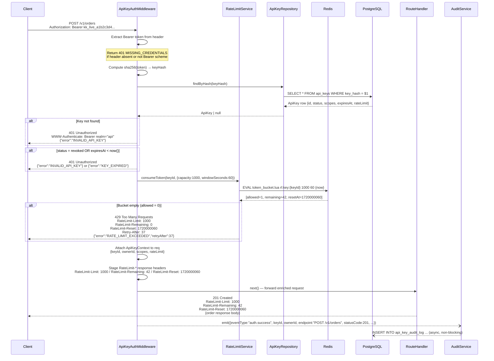

# Design: API Key Authentication

## Architecture

### System Context

The API key authentication system sits at the edge of the REST API request pipeline as a pair of composable middleware layers — one for identity validation, one for rate-limit enforcement. It serves consumer applications (mobile clients, third-party integrations, server-to-server automations) that need machine-readable credentials scoped to specific resource permissions. The system depends on a PostgreSQL database for durable key storage and the append-only audit log, and on Redis for low-latency atomic rate-limit bucket management. It operates in parallel with (not as a replacement for) session or JWT authentication used by the key management endpoints themselves.

### Component Design

```
HTTP Request (Authorization: Bearer kk_live_...)
  └─> Router
        └─> ApiKeyAuthMiddleware           # extracts + hashes token, resolves key, checks expiry/revocation
              └─> RateLimitMiddleware      # atomically deducts token from Redis bucket; sets RateLimit-* headers
                    └─> ScopeGuard        # asserts key.scopes satisfies endpoint's required scopes
                          └─> RouteHandler
                                ├─> ApiKeyService            # key issuance, revocation, rotation business logic
                                │     ├─> ApiKeyRepository   # SQL CRUD against PostgreSQL
                                │     └─> RateLimitService   # Lua script eval against Redis
                                └─> AuditService             # async audit event emission
                                      └─> PostgreSQL (api_key_audit_log)
```

### Request Lifecycle: Authenticated + Rate-Limited Request



## Data Models

### ApiKey

```typescript
interface ApiKey {
  id: string;              // UUID v4 — primary key
  name: string;            // human-readable label, 1–100 chars
  keyHash: string;         // SHA-256 hex digest of raw key (64 chars) — indexed unique
  keyPrefix: string;       // first 8 chars of raw key, e.g. "kk_live_" — non-secret display token
  ownerId: string;         // UUID of the owning user / tenant
  scopes: string[];        // e.g. ["read:orders", "write:products"]
  status: 'active' | 'revoked' | 'rotating' | 'expired';
  rateLimit: RateLimitConfig;
  createdAt: Date;         // UTC
  expiresAt: Date | null;  // null = never expires unless revoked
  revokedAt: Date | null;
  lastUsedAt: Date | null; // updated asynchronously; not a blocker for auth path
}

interface RateLimitConfig {
  capacity: number;        // max tokens in bucket, e.g. 1000
  windowSeconds: number;   // full-refill window in seconds, e.g. 60
}
```

**Key generation:** Raw key = `kk_live_` + `base62(crypto.randomBytes(32))`, yielding approximately 190 bits of effective entropy. The `kk_live_` prefix lets users and monitoring tools identify credentials at a glance and filter them out of logs.

**Hashing:** `keyHash = crypto.createHash('sha256').update(rawKey).digest('hex')`. SHA-256 is appropriate here because API keys are high-entropy random values; a slow hash (bcrypt/argon2) is unnecessary and would add unacceptable latency to the per-request auth path.

### Scope

```typescript
// Scopes are a static catalogue defined at deploy time.
type Scope =
  | 'read:orders'    | 'write:orders'
  | 'read:products'  | 'write:products'
  | 'read:customers' | 'write:customers'
  | 'read:analytics'
  | 'write:*';       // wildcard — satisfies any write:* requirement

interface ScopeDefinition {
  name: Scope;
  description: string;   // human-readable explanation shown in key management UI
  resource: string;      // e.g. "orders"
  action: 'read' | 'write';
}
```

Scopes are stored as a PostgreSQL `text[]` array column on `api_keys`. The `ScopeGuard` middleware resolves wildcard matches at runtime: a key with `write:*` satisfies any endpoint requiring `write:orders`, `write:products`, etc.

### RateLimitBucket (Redis)

```
Key pattern : rl:key:{keyId}
Type        : Redis Hash
Fields:
  tokens      — current float token count, e.g. "42.75"
  lastRefill  — unix timestamp (float seconds) when last refill was computed

TTL         : windowSeconds * 2  (set atomically inside the Lua script)
              Inactive buckets auto-expire; they re-initialise at capacity on next access.
```

The bucket state is managed exclusively by a single Lua script evaluated atomically on Redis, preventing race conditions under concurrent requests from the same key:

```lua
-- token_bucket.lua
-- KEYS[1] = rl:key:{keyId}
-- ARGV[1] = capacity   (number)
-- ARGV[2] = windowSeconds (number)
-- ARGV[3] = now        (float unix seconds)
-- Returns: {allowed (0|1), remainingFloor (int), resetAt (int unix seconds)}

local capacity   = tonumber(ARGV[1])
local window     = tonumber(ARGV[2])
local now        = tonumber(ARGV[3])
local bucket     = redis.call('HMGET', KEYS[1], 'tokens', 'lastRefill')
local tokens     = tonumber(bucket[1]) or capacity
local lastRefill = tonumber(bucket[2]) or now
local elapsed    = math.max(0, now - lastRefill)
local refillRate = capacity / window
tokens           = math.min(capacity, tokens + elapsed * refillRate)
local allowed    = tokens >= 1
if allowed then tokens = tokens - 1 end
redis.call('HSET', KEYS[1], 'tokens', tostring(tokens), 'lastRefill', tostring(now))
redis.call('EXPIRE', KEYS[1], math.ceil(window * 2))
local resetAt    = math.ceil(now + (1 - tokens) / refillRate)
return {allowed and 1 or 0, math.floor(tokens), resetAt}
```

### ApiKeyAuditLog

```typescript
interface ApiKeyAuditLog {
  id: string;             // UUID v4 — primary key
  eventType:
    | 'auth.success'
    | 'auth.failure'
    | 'auth.rate_limited'
    | 'key.created'
    | 'key.revoked'
    | 'key.rotated';
  keyId: string | null;   // null when token is entirely unrecognised
  ownerId: string | null;
  actorId: string | null; // for lifecycle events: the user who triggered the action
  ipAddress: string;      // normalised IPv4 or IPv6
  userAgent: string | null;
  endpoint: string | null;    // e.g. "POST /v1/orders"
  statusCode: number | null;
  metadata: Record<string, unknown>; // JSONB — additional context (e.g. invalidScopes list)
  timestamp: Date;        // UTC — append-only, no UPDATE/DELETE permitted at DB role level
}
```

**PostgreSQL Schema:**

```sql
CREATE TABLE api_keys (
  id             UUID        PRIMARY KEY DEFAULT gen_random_uuid(),
  name           TEXT        NOT NULL CHECK (char_length(name) BETWEEN 1 AND 100),
  key_hash       CHAR(64)    NOT NULL,
  key_prefix     CHAR(8)     NOT NULL,
  owner_id       UUID        NOT NULL,
  scopes         TEXT[]      NOT NULL DEFAULT '{}',
  status         TEXT        NOT NULL DEFAULT 'active'
                             CHECK (status IN ('active','revoked','rotating','expired')),
  rate_limit     JSONB       NOT NULL DEFAULT '{"capacity":1000,"windowSeconds":60}',
  created_at     TIMESTAMPTZ NOT NULL DEFAULT NOW(),
  expires_at     TIMESTAMPTZ,
  revoked_at     TIMESTAMPTZ,
  last_used_at   TIMESTAMPTZ
);

CREATE UNIQUE INDEX idx_api_keys_key_hash     ON api_keys (key_hash);
CREATE        INDEX idx_api_keys_owner_status ON api_keys (owner_id, status);

CREATE TABLE api_key_audit_log (
  id           UUID        PRIMARY KEY DEFAULT gen_random_uuid(),
  event_type   TEXT        NOT NULL,
  key_id       UUID,
  owner_id     UUID,
  actor_id     UUID,
  ip_address   INET        NOT NULL,
  user_agent   TEXT,
  endpoint     TEXT,
  status_code  SMALLINT,
  metadata     JSONB       NOT NULL DEFAULT '{}',
  timestamp    TIMESTAMPTZ NOT NULL DEFAULT NOW()
);

CREATE INDEX idx_audit_key_time ON api_key_audit_log (key_id, timestamp DESC);
```

## API Design

### Key Management Endpoints

All key management endpoints require the caller to be authenticated via the user's **session or JWT**, not via an API key — this prevents a compromised API key from being used to issue, update, or revoke other keys.

| Method | Path | Description |
|--------|------|-------------|
| POST | `/v1/api-keys` | Issue a new API key |
| GET | `/v1/api-keys` | List caller's API keys (paginated) |
| GET | `/v1/api-keys/:keyId` | Get metadata for a single key |
| DELETE | `/v1/api-keys/:keyId` | Revoke a key immediately |
| PUT | `/v1/api-keys/:keyId/scopes` | Update the scope set on an active key |
| POST | `/v1/api-keys/:keyId/rotate` | Issue a replacement key, optionally with a grace period |
| GET | `/v1/api-keys/:keyId/audit` | Paginated audit log for a specific key |

### Request / Response Schemas

**POST /v1/api-keys — Issue a key**

```typescript
// Request body
interface CreateApiKeyRequest {
  name: string;              // 1–100 chars, required
  scopes: string[];          // non-empty array of recognised scope strings, required
  expiresIn?: string;        // ISO 8601 duration, e.g. "P90D" (90 days); omit = no expiry
  rateLimit?: {
    capacity: number;        // 1–100000
    windowSeconds: number;   // 1–86400
  };
}

// Response 201 Created — raw key included ONCE, never returned again
interface CreateApiKeyResponse {
  id: string;                // UUID of the new key record
  key: string;               // full raw key, e.g. "kk_live_a1b2c3d4..."  ← store securely
  keyPrefix: string;         // "kk_live_a1" — safe to display in UI
  name: string;
  scopes: string[];
  status: 'active';
  rateLimit: { capacity: number; windowSeconds: number };
  createdAt: string;         // ISO 8601 UTC
  expiresAt: string | null;
}
```

**GET /v1/api-keys — List keys**

```typescript
// Query params: ?page=1&pageSize=20&status=active
// Response 200 OK
interface ListApiKeysResponse {
  data: ApiKeyMetadata[];
  pagination: {
    page: number;
    pageSize: number;
    total: number;
  };
}

interface ApiKeyMetadata {
  id: string;
  keyPrefix: string;          // e.g. "kk_live_a1" — no hash, no raw key
  name: string;
  scopes: string[];
  status: 'active' | 'revoked' | 'rotating' | 'expired';
  rateLimit: { capacity: number; windowSeconds: number };
  createdAt: string;
  expiresAt: string | null;
  lastUsedAt: string | null;
}
```

**POST /v1/api-keys/:keyId/rotate — Rotate a key**

```typescript
// Request body
interface RotateApiKeyRequest {
  gracePeriodSeconds?: number;  // 0–3600; 0 (default) = revoke old key immediately
}

// Response 200 OK
interface RotateApiKeyResponse {
  newKeyId: string;
  key: string;                   // new raw key — shown ONCE
  keyPrefix: string;
  oldKeyId: string;
  oldKeyStatus: 'revoked' | 'rotating';
  gracePeriodEndsAt: string | null;  // null if gracePeriodSeconds = 0
}
```

**PUT /v1/api-keys/:keyId/scopes — Update scopes**

```typescript
// Request body
interface UpdateScopesRequest {
  scopes: string[];  // complete replacement scope set
}
// Response 200 OK: updated ApiKeyMetadata
```

**GET /v1/api-keys/:keyId/audit — Query audit log**

```typescript
// Query params: ?eventType=auth.failure&from=2025-01-01T00:00:00Z&to=2025-01-31T23:59:59Z&page=1&pageSize=50
// Response 200 OK
interface AuditLogResponse {
  data: ApiKeyAuditLog[];
  pagination: { page: number; pageSize: number; total: number };
}
```

### Error Responses

All error bodies follow a consistent envelope to enable programmatic handling:

```typescript
interface ApiError {
  error: string;           // machine-readable code in SCREAMING_SNAKE_CASE
  message?: string;        // optional human-readable explanation
  [key: string]: unknown;  // additional context fields specific to the error type
}
```

| HTTP Status | `error` Code | Trigger | Notable Response Headers |
|-------------|-------------|---------|--------------------------|
| 400 | `INVALID_SCOPE` | `scopes` array contains unrecognised scope | — |
| 400 | `VALIDATION_ERROR` | Request body fails JSON schema validation | — |
| 401 | `MISSING_CREDENTIALS` | No `Authorization` header or not Bearer scheme | `WWW-Authenticate: Bearer realm="api"` |
| 401 | `INVALID_API_KEY` | Hash not found in DB or key status is revoked | `WWW-Authenticate: Bearer realm="api"` |
| 401 | `KEY_EXPIRED` | Key found but `expiresAt` is in the past | `WWW-Authenticate: Bearer realm="api"` |
| 403 | `INSUFFICIENT_SCOPE` | Key lacks required scopes for the endpoint | — |
| 403 | `SCOPE_ELEVATION_DENIED` | Key creation requested scopes caller cannot grant | — |
| 404 | `KEY_NOT_FOUND` | Revoke / update on non-existent or foreign-owned key | — |
| 422 | `KEY_LIMIT_REACHED` | Owner already has 50 active keys | — |
| 429 | `RATE_LIMIT_EXCEEDED` | Token bucket empty | `RateLimit-Limit`, `RateLimit-Remaining: 0`, `RateLimit-Reset`, `Retry-After` |
| 503 | `SERVICE_UNAVAILABLE` | DB or Redis unavailable during auth pipeline | `Retry-After: 10` |

## Rate Limiting

### Algorithm

The system uses a **continuous token bucket** (also called a "leaky bucket in credit form"). Unlike a fixed window counter, a token bucket smooths bursts and provides proportional recovery during idle periods.

**Per-key parameters:**
- `capacity` (C) — maximum tokens in the bucket; also the burst ceiling.
- `windowSeconds` (W) — the time in seconds for the bucket to refill from 0 to C.
- **Refill rate** = `C / W` tokens per second (fractional, continuous).

**Token consumption algorithm (per request):**
1. Fetch `{tokens, lastRefill}` from the Redis Hash.
2. Compute `elapsed = now - lastRefill`.
3. `tokens = min(C, tokens + elapsed × (C / W))` — apply partial refill.
4. If `tokens >= 1`: deduct 1, allow the request. Else: reject with 429.
5. Store updated `{tokens, lastRefill = now}` atomically.
6. Return `{allowed, floor(tokens), resetAt}` to the middleware.

Steps 1–6 execute atomically inside a single Lua `EVAL` call on Redis.

### Rate-Limit Response Headers

Every response from a protected endpoint includes these headers (conforming to [IETF draft-ietf-httpapi-ratelimit-headers-07](https://datatracker.ietf.org/doc/html/draft-ietf-httpapi-ratelimit-headers)):

| Header | Value | Example |
|--------|-------|---------|
| `RateLimit-Limit` | Bucket capacity (C) | `1000` |
| `RateLimit-Remaining` | `floor(tokens)` after this request | `42` |
| `RateLimit-Reset` | Unix epoch when bucket next reaches capacity | `1720000060` |
| `Retry-After` | Seconds until ≥ 1 token available (429 responses only) | `37` |

### Storage

- **Primary store**: Redis Hash `rl:key:{keyId}` — fields `tokens` (float string) and `lastRefill` (float epoch string).
- **TTL**: `windowSeconds * 2`, set atomically by the Lua script; inactive buckets auto-expire and re-initialise at `capacity` on the next request.
- **Failover**: if the Lua EVAL throws a Redis connection error, the middleware logs a `rate_limit_redis_error` warning and applies a per-process in-memory fallback bucket for the current request only (not persisted). After 5 consecutive Redis errors within a 10-second window, a circuit breaker trips, the middleware switches to "degraded allow" mode (all requests pass, no deduction), and emits a `rate_limit_degraded` Prometheus gauge set to `1`. The circuit breaker resets after a successful Redis ping.

## Error Handling

### 401 Paths

| Trigger | Where detected | Response |
|---------|---------------|----------|
| `Authorization` header missing or not `Bearer` | `ApiKeyAuthMiddleware` — no DB call made | `401 MISSING_CREDENTIALS` + `WWW-Authenticate` header |
| Bearer token hash not found in `api_keys` | After `findByHash` returns null | `401 INVALID_API_KEY` + `WWW-Authenticate` header |
| Key found but `status = 'revoked'` | After `findByHash` returns row | `401 INVALID_API_KEY` + `WWW-Authenticate` header |
| Key found but `expiresAt < now()` | After `findByHash` returns row | `401 KEY_EXPIRED` + `WWW-Authenticate` header |
| DB unavailable during lookup | `ApiKeyRepository` throws connection error | `503 SERVICE_UNAVAILABLE` + `Retry-After: 10` |

The hash lookup always runs to completion before returning any 401, preventing token length or prefix leakage via differential response timing.

### 403 Paths

After the middleware resolves a valid, active key and attaches `ApiKeyContext`, the `ScopeGuard` decorator compares `req.apiKey.scopes` against the route's `@RequireScopes(...)` list. If any required scope is absent and no wildcard covers it, the guard returns `403 INSUFFICIENT_SCOPE` with both `required` and `provided` arrays without invoking the route handler.

### 429 Paths

`RateLimitService.consumeToken()` returns `{ allowed: false, remaining: 0, resetAt }` when the Lua script finds `tokens < 1`. The middleware assembles the `RateLimit-*` and `Retry-After` headers from those return values and returns 429. The route handler is never invoked. The audit service records an `auth.rate_limited` event asynchronously.

## Security

- **No plaintext storage**: only `SHA-256(rawKey)` is written to disk; a full breach of the `api_keys` table yields only unhashed digests that cannot be reversed without exhaustive preimage search.
- **High-entropy keys**: 32 random bytes encoded in base62 yields ~190 bits of effective entropy; online brute force at 10,000 guesses/second would take longer than the age of the universe.
- **Constant-time response**: the middleware always computes the SHA-256 hash of the incoming token (even when the header is clearly malformed) and always waits for the full DB round-trip before returning any 401, preventing timing-oracle attacks.
- **Scope containment**: creating a key with a scope not held by the requesting user's own session is rejected with `403 SCOPE_ELEVATION_DENIED` — keys can never grant more access than the human who created them.
- **Rotation grace window**: the old key transitions to `status = 'rotating'` rather than being deleted, allowing in-flight requests to complete. After the grace period, a scheduled job sets `status = 'revoked'`.
- **Audit log immutability**: the `api_key_audit_log` table grants only INSERT + SELECT to the application database role; no UPDATE or DELETE is possible, making the audit trail tamper-evident at the database permission level.
- **Log redaction**: the logging middleware is configured to scrub any field whose key matches `authorization`, `key`, `rawKey`, or `keyHash` from all structured log output. A CI test asserts that no raw key value appears in captured log lines across 50 test requests.
- **Key prefix for identification**: the 8-character `keyPrefix` stored in the database and returned in list responses lets users identify their keys without the database holding any portion of the key that could be used to reconstruct or impersonate it.

## Performance

- **Auth latency target**: p95 ≤ 20 ms for the full auth pipeline (SHA-256 hash + DB lookup + Redis Lua EVAL).
- **Database indexes**:
  - `idx_api_keys_key_hash` — unique B-tree on `key_hash`; ensures the auth lookup is a single O(log n) index scan.
  - `idx_api_keys_owner_status` — composite on `(owner_id, status)`; covers the list-keys query with status filter.
  - `idx_audit_key_time` — on `(key_id, timestamp DESC)`; covers the per-key audit log query with time-range filter.
- **Async audit writes**: `AuditService.emit()` pushes events to an in-process queue (e.g. BullMQ with a Redis-backed job store). The main request path returns before the audit INSERT completes, so database write latency never impacts API response time.
- **Redis single round-trip**: `RateLimitService` sends one Lua EVAL per request; there is no multi-step pipeline or transaction needed.
- **Optional LRU cache**: recently resolved `ApiKey` records can be held in a small in-process LRU cache (TTL = 5 seconds, max 10,000 entries) to avoid a DB hit on every request for hot keys. On revocation, the service writes a `revoked:{keyId}` sentinel to Redis with a 10-second TTL; the middleware checks for this sentinel before serving from the LRU cache, bounding the revocation propagation delay to under 5 seconds.
- **Connection pooling**: both the PostgreSQL client (e.g. `pg-pool`) and the Redis client (e.g. `ioredis`) are configured with pool sizes tuned to the expected concurrency profile (default: PG max 20, Redis max 10 per process).

## Testing Strategy

**Unit tests** (Jest or Vitest — no real DB or Redis):
- `generateRawKey` / `hashKey` / `extractKeyPrefix` — format assertions, hash determinism, 100k-sample uniqueness check.
- `ApiKeyService.issueKey` — scope validation rejection, key-limit enforcement at 50, `expiresIn` computation, default rate-limit application.
- `ApiKeyService.revokeKey` — repository delegation, Redis sentinel write.
- `ApiKeyService.rotateKey` — grace period scheduling, old key status transition.
- `RateLimitService` — Lua script logic simulated with `ioredis-mock`: refill rate math, bucket cap enforcement, 429 trigger at 0 tokens, TTL set correctly.
- `ScopeGuard` — matrix of scope combinations: exact match, subset failure, wildcard resolution, missing `ApiKeyContext`.
- `AuditService` — correct `eventType` mapping for each auth outcome, retry logic on write failure, counter increment after 3rd failure.

**Integration tests** (against Docker Compose with real PostgreSQL + Redis):
- Full middleware chain: issue key → make authenticated request → assert `RateLimit-*` headers present and `remaining` decrements.
- Revocation propagation: revoke key → within 5 seconds → assert next request returns `401 INVALID_API_KEY`.
- Scope enforcement: make request with key missing required scope → assert `403 INSUFFICIENT_SCOPE` body matches schema with `required` and `provided` fields.
- Rate-limit exhaustion: burst `capacity + 1` concurrent requests from same key → assert exactly 1 returns `429` with correct headers, remainder succeed.
- Key rotation with grace: rotate with `gracePeriodSeconds: 30` → old key still accepted → after grace period → old key returns `401`.
- Audit log completeness: run 10 mixed requests (success/failure/rate-limited) → query `/v1/api-keys/:id/audit` → assert all 10 events present with correct `eventType`.

**Load tests** (k6):
- Ramp to 500 virtual users, each making 20 req/s against a protected endpoint with valid API keys.
- Assert p95 end-to-end latency ≤ 20 ms in the k6 summary output.
- Assert zero 5xx responses over a 5-minute sustained run.
- Rate-limit burst scenario: single key sends `capacity + 50` requests in 1 second; assert exactly 50 return 429.

**Security tests** (run in CI):
- Log-scraping test: capture all structured log output for 50 mixed auth requests; assert no field value matches the raw key pattern `kk_live_[A-Za-z0-9]+`.
- Timing test: send 1,000 requests with invalid keys; assert standard deviation of response times < 2 ms to confirm constant-time behaviour.
