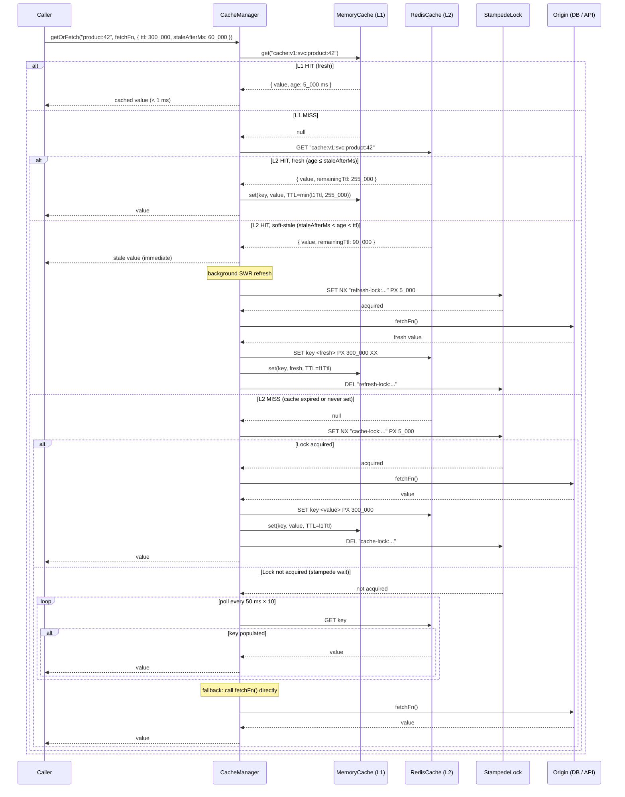

# Design: Caching Strategy

## Architecture

### System Context

The caching layer sits between service and repository code and their underlying origins (PostgreSQL, external HTTP APIs, expensive computations). Rather than wrapping a single data source, the `CacheManager` is a general-purpose utility injected into any service that needs to reduce origin load. It manages two physical tiers: an in-process `lru-cache` instance (L1) and a shared Redis cluster (L2). Tag-based invalidation coordinates cache coherence across tiers. The stampede lock prevents database thundering-herd on popular expired keys.

### Component Design

```
Caller (Route Handler / Service Method)
  └─> CacheManager.getOrFetch(key, fetchFn, options)
        │
        ├─ 1. L1 HIT?  ──yes──> return cached value (< 1 ms)
        │      (MemoryCache.get)
        │
        ├─ 2. L2 HIT?  ──yes──> populate L1, return value
        │      (RedisCache.get)
        │         └─ is stale (age > staleAfterMs)? ──yes──> return value
        │                                                      + background SWR refresh
        │
        ├─ 3. MISS: acquire stampede lock
        │      (StampedeLock.acquire → Redis SET NX PX)
        │         │
        │         ├─ acquired ──> call fetchFn()
        │         │                 ├─ success ──> RedisCache.set (PX ttl)
        │         │                 │             + MemoryCache.set
        │         │                 │             + DEL lock key
        │         │                 │             + SADD tag sets
        │         │                 └─ error ──>  DEL lock key; propagate error
        │         │
        │         └─ not acquired ──> poll RedisCache every 50 ms × 10
        │                              ├─ key appears ──> return it
        │                              └─ exhausted ──> call fetchFn() (fallback)
        │
        └─> CacheInvalidator.invalidate(key | tag)
              ├─ MemoryCache.delete(key)            (synchronous)
              └─ RedisCache.del(key | tag-set keys) (awaited)
```

### Cache-Aside Read with SWR



## Data Models

### CacheEntry (internal)

```typescript
interface CacheEntry<T = unknown> {
  value: T;
  storedAt: number;   // Date.now() at write time — used to compute age for SWR
  ttlMs: number;      // stored alongside value in Redis as a metadata field
}
```

`CacheEntry` is serialised to JSON via `JSON.stringify({ value, storedAt, ttlMs })` before being stored in Redis. On retrieval, the object is parsed and `age = Date.now() - storedAt` is computed to determine freshness for SWR.

### CacheOptions

```typescript
interface CacheOptions {
  ttl?: number;          // ms; default: CacheConfig.defaultTtlMs (60_000)
  staleAfterMs?: number; // ms; must be < ttl; enables SWR; omit to disable SWR
  tags?: string[];       // semantic labels for batch invalidation, e.g. ["product:42", "catalog"]
  bypass?: boolean;      // if true, skip all cache layers (equivalent to ttl: 0)
}
```

### CacheConfig

```typescript
interface CacheConfig {
  globalPrefix: string;        // e.g. "cache:v1:orders-svc" — prepended to every key
  defaultTtlMs: number;        // default 60_000 (60 s)
  l1MaxSize: number;           // max entries in L1; default 1_000
  l1Ttl: number;               // L1 TTL cap in ms; default 30_000 (30 s)
  lockTtlMs: number;           // stampede lock TTL in ms; default 5_000
  lockRetryIntervalMs: number; // ms between lock wait polls; default 50
  lockRetryCount: number;      // max poll attempts before fallback; default 10
  refreshLockTtlMs: number;    // SWR refresh lock TTL in ms; default 5_000
  maxValueSizeBytes: number;   // max serialised value size; default 1_048_576 (1 MB)
}
```

### Redis Key Layout

```
{globalPrefix}:{sha256(parts)}              — cache value key (STRING; PX ttl)
cache-lock:{globalPrefix}:{sha256(parts)}   — stampede lock (STRING, NX; PX lockTtlMs)
refresh-lock:{globalPrefix}:{sha256(parts)} — SWR refresh lock (STRING, NX; PX refreshLockTtlMs)
cache-tag:{globalPrefix}:{tag}              — tag member set (SET; SADD; EXPIRE = entry TTL)
```

All key components use the `:` delimiter. The sha256 of parts prevents key length attacks and ensures consistent key length regardless of input complexity.

## Files & Interfaces

```
src/
  cache/
    cacheManager.ts        # CacheManager — getOrFetch(), get(), set(), invalidate(), invalidateByTag()
    memoryCache.ts         # MemoryCache — wraps lru-cache; get(), set(), delete(), clear()
    redisCache.ts          # RedisCache — wraps ioredis; get(), set(), del(), pipeline ops
    stampedeLock.ts        # StampedeLock — acquire(), release() via Redis SET NX
    invalidator.ts         # CacheInvalidator — invalidate(key), invalidateByTag(tag)
    keyBuilder.ts          # buildCacheKey(namespace, ...parts): string (SHA-256 hash of parts)
    swr.ts                 # SwrCoordinator — in-process singleflight for SWR refreshes
    config.ts              # CacheConfig interface + defaults
    types.ts               # CacheEntry, CacheOptions, CacheConfig exports
    errors.ts              # CacheConfigError, CacheKeyError, CacheValueTooLargeError, InvalidationError
  api/
    middleware/
      cachingMiddleware.ts # optional HTTP GET response cache middleware using CacheManager
```

**Key exported signatures:**

```typescript
// src/cache/cacheManager.ts
export class CacheManager {
  constructor(redis: Redis, config?: Partial<CacheConfig>);

  getOrFetch<T>(
    key: string,
    fetchFn: () => Promise<T>,
    options?: CacheOptions,
  ): Promise<T>;

  get<T>(key: string): Promise<T | null>;

  set<T>(key: string, value: T, options?: CacheOptions): Promise<void>;

  invalidate(key: string): Promise<void>;

  invalidateByTag(tag: string): Promise<void>;

  flushNamespace(version: string): Promise<{ deletedCount: number }>;
}

// src/cache/keyBuilder.ts
export function buildCacheKey(namespace: string, ...parts: (string | number)[]): string;
// Throws CacheKeyError if parts is empty or any part is null/undefined.
// Returns: "{globalPrefix}:{namespace}:{sha256(parts.join(':'))}"

// src/cache/stampedeLock.ts
export class StampedeLock {
  acquire(key: string, ttlMs: number): Promise<boolean>; // true = acquired
  release(key: string): Promise<void>;
}
```

## Cache-Aside Pattern

### Read Path (full detail)

```
getOrFetch(key, fetchFn, { ttl, staleAfterMs, tags })
  1. k = buildCacheKey(namespace, ...parts)
  2. l1 = MemoryCache.get(k)
  3. IF l1 hit AND l1.age <= staleAfterMs (or SWR disabled):  RETURN l1.value
  4. IF l1 hit AND l1.age > staleAfterMs:  TRIGGER background SWR; RETURN l1.value
  5. l2 = RedisCache.get(k)
  6. IF l2 hit AND l2.age <= staleAfterMs (or SWR disabled):  populate L1; RETURN l2.value
  7. IF l2 hit AND l2.age > staleAfterMs:  populate L1; TRIGGER background SWR; RETURN l2.value
  8. // Complete miss path
  9. IF singleflight[k] in-flight:  AWAIT existing in-flight promise; RETURN value
  10. acquired = StampedeLock.acquire("cache-lock:{k}", lockTtlMs)
  11. IF acquired:
        value = await fetchFn()
        await RedisCache.set(k, value, ttl, tags)
        MemoryCache.set(k, value, min(l1Ttl, ttl))
        await StampedeLock.release("cache-lock:{k}")
        RETURN value
  12. ELSE:  poll L2 every lockRetryIntervalMs × lockRetryCount
        IF key appears: populate L1; RETURN value
        ELSE (fallback): value = await fetchFn(); RETURN value (no caching)
```

### Write Path

All writes go directly to the origin (database, external API). After a successful write:

```typescript
await db.updateProduct(id, data);      // 1. Write to origin first
await cacheManager.invalidate(         // 2. Then invalidate cache
  buildCacheKey('product', id),
);
// OR for batch invalidation of a logical group:
await cacheManager.invalidateByTag(`product:${id}`);
```

The invariant is: always write to the origin before invalidating the cache. Inverting the order creates a window where a concurrent reader repopulates the cache with stale data immediately after invalidation.

## Stale-While-Revalidate

SWR allows the service to serve slightly stale data without the latency cost of blocking on a fresh fetch. A typical configuration for a product catalog:

```typescript
await cacheManager.getOrFetch(
  buildCacheKey('catalog', 'products', page.toString()),
  () => db.listProducts({ page }),
  {
    ttl: 300_000,         // 5 minutes: entry lives in cache for up to 5 min
    staleAfterMs: 30_000, // 30 seconds: after 30 s, serve stale but refresh in background
    tags: ['catalog'],    // batch-invalidate all catalog pages on a product write
  },
);
```

**SWR invariants:**
- A background refresh is never launched more than once per key at a time (enforced by `refresh-lock` in Redis + in-process `SwrCoordinator`).
- If the refresh `fetchFn` throws, the stale value remains in cache; the refresh error is logged but not propagated to any caller.
- The `XX` flag on the background `SET` ensures the key is not re-written if it was explicitly invalidated while the refresh was in flight.

## Invalidation

### Key-Based Invalidation

```typescript
// src/cache/invalidator.ts
export class CacheInvalidator {
  async invalidate(key: string): Promise<void> {
    this.memoryCache.delete(key);                     // synchronous L1 eviction
    await this.redis.del(this.fullKey(key));           // awaited L2 deletion
  }
}
```

### Tag-Based Invalidation

```typescript
async invalidateByTag(tag: string): Promise<void> {
  const tagKey = `cache-tag:${this.config.globalPrefix}:${tag}`;
  const members = await this.redis.smembers(tagKey);  // all cache keys with this tag
  this.memoryCache.deleteAll(members);               // synchronous L1 eviction
  if (members.length > 0) {
    const pipeline = this.redis.pipeline();
    for (const k of members) pipeline.del(k);
    pipeline.del(tagKey);                             // delete the tag set itself
    await pipeline.exec();
  }
}
```

Tag sets are stored as Redis SETs (`SADD cache-tag:{prefix}:{tag} {key}`) with a TTL matching the associated entry, so they expire automatically if invalidation is never explicitly called.

## Stampede Protection

The two-layer stampede protection provides complementary guarantees:

1. **In-process singleflight** (`src/cache/swr.ts`): If 50 concurrent requests in the same Node.js process all miss L1 and L2 for the same key, only one `fetchFn()` call is made; the other 49 `await` the first promise. This eliminates redundant Redis lock attempts from within a single process.

2. **Redis distributed lock** (`StampedeLock`): If 3 pods each have 50 concurrent requests for the same key, the singleflight reduces them to 3 Redis lock attempts. Only 1 pod wins the lock and calls `fetchFn()`; the other 2 poll L2 until the winner populates it.

```
100 concurrent requests × same cache key
  └─> in-process singleflight ──> 1 Redis lock attempt per process (3 pods = 3 attempts)
        └─> Redis SET NX   ──> 1 winner calls fetchFn(), 2 losers poll L2
              └─> fetchFn() populates L2; losers read it on next poll
```

## Error Handling

| Error Class | When Thrown | Behaviour |
|-------------|------------|-----------|
| `CacheConfigError` | `staleAfterMs >= ttl` | Thrown at call time; not cached |
| `CacheKeyError` | Empty `parts` or `null`/`undefined` part | Thrown at `buildCacheKey()` call |
| `CacheValueTooLargeError` | Serialised value > `maxValueSizeBytes` | Thrown at `set()`; value not cached |
| `InvalidationError` | Redis unreachable during `invalidate()` | L1 evicted; L2 failure logged; thrown |

**Redis degradation (non-error paths):**
- `get()` Redis failure → log `warn`, skip L2, fall through to origin.
- `set()` Redis failure after origin fetch → log `warn`, return value to caller without caching.
- `invalidate()` Redis failure → throws `InvalidationError` (caller must handle).
- Lock acquire failure → poll fallback; ultimately call `fetchFn()` directly.

These behaviours ensure Redis outages degrade gracefully to increased origin load rather than causing request failures.

## Testing Strategy

**Unit tests** (Jest / Vitest — `ioredis-mock`, no real infrastructure):
- `buildCacheKey()` — same inputs always produce same output; different inputs produce different hashes; null/undefined part throws `CacheKeyError`; empty parts throws `CacheKeyError`.
- `MemoryCache` — eviction at `l1MaxSize`; TTL expiry; `delete()` removes immediately; `clear()` empties cache.
- `RedisCache` — `set()` calls `SET key <json> PX <ttl>`; `get()` deserialises and computes age; Redis error path returns `null` (not throws).
- `StampedeLock` — `acquire()` returns `true` on first call, `false` on second concurrent call (NX); `release()` deletes the lock key.
- `CacheManager.getOrFetch()` — L1 hit: `fetchFn` not called; L2 hit (fresh): `fetchFn` not called, L1 populated; L2 miss: `fetchFn` called, L2 and L1 populated; `fetchFn` throws: nothing cached, error propagated; `staleAfterMs` triggers SWR and returns stale value immediately.
- `CacheInvalidator.invalidateByTag()` — assert `SMEMBERS` then pipeline `DEL` for all members; assert L1 entries deleted.

**Integration tests** (Testcontainers Redis):
- Round-trip: `set(key, value, { ttl: 5000, tags: ['t1'] })` → `get(key)` returns correct value; after 5 s key is absent.
- SWR: `set(key, 'old', { ttl: 10_000, staleAfterMs: 100 })`, sleep 150 ms, call `getOrFetch(key, () => 'new', ...)`; assert 'old' returned immediately; wait for background refresh; assert `get(key)` returns 'new'.
- Tag invalidation: set 5 keys all tagged `'catalog'`; call `invalidateByTag('catalog')`; assert all 5 keys absent from Redis; assert tag set `cache-tag:...:catalog` absent.
- Stampede: `DEL key` in Redis, fire 100 concurrent `getOrFetch()` in the same process; assert `fetchFn` called exactly once (singleflight dedup); all 100 calls return the same value.
- Cross-pod stampede: start 3 separate `CacheManager` instances sharing the same Redis; fire concurrent misses; assert `fetchFn` called at most 1 time across all 3 instances (Redis lock winner only).
- Redis degradation: disconnect Redis mid-test; assert `getOrFetch()` still returns value (origin fallback); assert no uncaught exceptions.
- Value size guard: call `set(key, hugePaylod)` where payload serialises to > 1 MB; assert `CacheValueTooLargeError` thrown and key not present in Redis.

**Load tests** (k6 + Testcontainers):
- 500 virtual users, each calling `getOrFetch` for 20 different keys; assert p99 latency ≤ 1 ms for L1 hits; p99 ≤ 5 ms for L2 hits.
- Assert `fetchFn` call count ≤ 1.1 × number of unique keys (allowing at most 10 % overcalls from stampede fallback across all test iterations).
- Assert Redis `GET` command count ≤ 1.5 × total calls (accounting for L1 hits that bypass Redis entirely).
