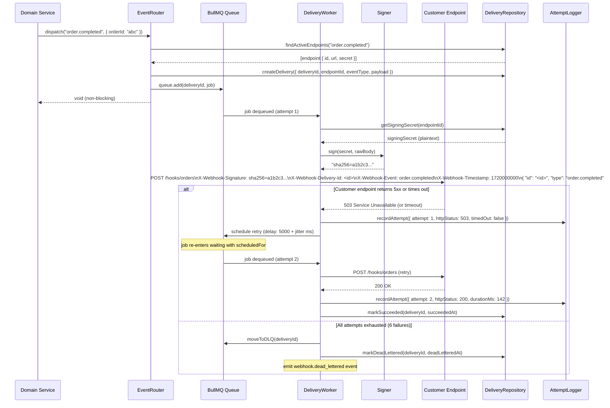

# Design: Webhook Delivery System

## Architecture

### System Context

The webhook delivery system sits between internal domain events (orders, payments, subscriptions) and registered customer HTTPS endpoints. When a business event occurs, the `EventRouter` fans it out to all matching active endpoints by enqueuing one BullMQ delivery job per endpoint. `DeliveryWorker` processes pick up jobs, sign the payload with HMAC-SHA256, POST to the customer URL, and record the outcome. PostgreSQL stores endpoint metadata, delivery records, and attempt logs. Redis (via BullMQ) provides the durable delivery queue and DLQ. A REST API exposes registration, status querying, and replay operations.

### Component Design

```
Domain Service (order, payment, subscription, ...)
  └─> EventRouter.dispatch(eventType, payload)
        └─> EndpointRepository.findActive(eventType)   # SELECT from webhook_endpoints
              └─> DeliveryRepository.create(delivery)  # INSERT WebhookDelivery
                    └─> DeliveryQueue.enqueue(job)     # BullMQ queue.add()

BullMQ Queue: webhook-deliveries
  │
  ▼
DeliveryWorker (N concurrent slots)
  ├─> EndpointRepository.getSigningSecret(endpointId)  # fetch plaintext secret
  ├─> Signer.sign(secret, rawBody)                     # HMAC-SHA256 → X-Webhook-Signature
  ├─> HTTP POST → customer endpoint URL
  │     (headers: Content-Type, X-Webhook-Signature,
  │               X-Webhook-Delivery-Id, X-Webhook-Event,
  │               X-Webhook-Timestamp)
  ├─> AttemptLogger.record(attempt)                    # INSERT WebhookAttempt
  ├── on 2xx     → DeliveryRepository.markSucceeded()
  ├── on non-2xx / timeout → schedule retry OR DLQHandler.moveToDLQ()
  └── on HTTP 410 → DeliveryRepository.markFailed(permanentFailure: true)
                    EndpointRepository.deactivate(endpointId)

DLQHandler
  └─> POST /webhooks/deliveries/:id/replay
        └─> DeliveryQueue.enqueue(newJob, { attemptsMade: 0 })

WebhookAPI (Express / Fastify)
  ├─> POST /webhooks/endpoints              # register endpoint
  ├─> GET  /webhooks/endpoints             # list endpoints
  ├─> DELETE /webhooks/endpoints/:id       # deactivate endpoint
  ├─> POST /webhooks/endpoints/:id/rotate-secret
  ├─> POST /webhooks/endpoints/:id/test    # synthetic test delivery
  ├─> GET  /webhooks/events               # event catalogue
  ├─> GET  /webhooks/deliveries           # query deliveries
  ├─> GET  /webhooks/deliveries/:id       # single delivery + attempts
  ├─> POST /webhooks/deliveries/:id/replay
  └─> GET  /webhooks/endpoints/:id/stats  # 7-day aggregate stats
```

### Delivery Sequence with Retry



## Data Models

### WebhookEndpoint

```typescript
interface WebhookEndpoint {
  id: string;                     // UUID v4
  customerId: string;             // UUID of the owning customer
  url: string;                    // HTTPS URL, max 2 048 chars
  events: string[];               // e.g. ["order.completed", "payment.failed"]
  description: string | null;     // max 255 chars; optional
  active: boolean;                // false when deactivated or HTTP 410 received
  signingSecretHash: string;      // SHA-256 hex of the plaintext secret — never returned via API
  previousSecretHash: string | null; // set during rotation grace period
  rotationExpiresAt: Date | null; // when previousSecretHash should be retired
  createdAt: Date;                // UTC
  lastDeliveryAt: Date | null;    // updated asynchronously on delivery outcome
  lastDeliveryStatus: 'succeeded' | 'failed' | null;
}
```

The plaintext signing secret is stored in a secrets manager (e.g. AWS Secrets Manager, HashiCorp Vault) keyed by `webhook-secret:{endpointId}`. The `signingSecretHash` in PostgreSQL is only used to verify secret ownership during rotation; it is never used for signature computation.

### WebhookDelivery

```typescript
interface WebhookDelivery {
  id: string;                     // UUID v4 — also the BullMQ job ID
  endpointId: string;             // FK → webhook_endpoints.id
  customerId: string;             // denormalised for fast per-customer queries
  eventType: string;              // e.g. "order.completed"
  payload: Record<string, unknown>; // the event data object; max 512 KB
  status: DeliveryStatus;
  attemptsMade: number;           // total HTTP attempts so far
  maxAttempts: number;            // default 6
  enqueuedAt: Date;               // UTC
  nextAttemptAt: Date | null;     // set when a retry is scheduled
  succeededAt: Date | null;
  deadLetteredAt: Date | null;
  permanentFailure: boolean;      // true when stopped by HTTP 410 response
  sourceDeliveryId: string | null; // set when this is a replayed delivery
}

type DeliveryStatus =
  | 'pending'
  | 'succeeded'
  | 'failed'
  | 'dead-lettered';
```

### WebhookAttempt

```typescript
interface WebhookAttempt {
  id: string;                    // UUID v4
  deliveryId: string;            // FK → webhook_deliveries.id
  attemptNumber: number;         // 1-indexed; each retry increments this
  requestedAt: Date;             // UTC — when the HTTP POST was initiated
  httpStatusCode: number | null; // null on connection error or timeout
  responseBody: string | null;   // first 1 024 bytes of response; null on error
  durationMs: number;            // time from POST start to response headers
  timedOut: boolean;
  errorMessage: string | null;   // non-null on connection error or non-HTTP failure
}
```

### PostgreSQL Schema

```sql
CREATE TABLE webhook_endpoints (
  id                  UUID        PRIMARY KEY DEFAULT gen_random_uuid(),
  customer_id         UUID        NOT NULL,
  url                 TEXT        NOT NULL CHECK (url ~ '^https://'),
  events              TEXT[]      NOT NULL DEFAULT '{}',
  description         TEXT        CHECK (char_length(description) <= 255),
  active              BOOLEAN     NOT NULL DEFAULT true,
  signing_secret_hash CHAR(64)    NOT NULL,            -- SHA-256 of plaintext secret
  previous_secret_hash CHAR(64),                       -- set during rotation
  rotation_expires_at TIMESTAMPTZ,
  created_at          TIMESTAMPTZ NOT NULL DEFAULT NOW(),
  last_delivery_at    TIMESTAMPTZ,
  last_delivery_status TEXT       CHECK (last_delivery_status IN ('succeeded','failed'))
);

CREATE INDEX idx_wh_endpoints_customer_active
  ON webhook_endpoints (customer_id, active)
  WHERE active = true;

CREATE INDEX idx_wh_endpoints_events
  ON webhook_endpoints USING GIN (events);

CREATE TABLE webhook_deliveries (
  id                UUID        PRIMARY KEY,    -- same as BullMQ job ID
  endpoint_id       UUID        NOT NULL REFERENCES webhook_endpoints(id),
  customer_id       UUID        NOT NULL,
  event_type        TEXT        NOT NULL,
  payload           JSONB       NOT NULL,
  status            TEXT        NOT NULL DEFAULT 'pending'
                                CHECK (status IN ('pending','succeeded','failed','dead-lettered')),
  attempts_made     SMALLINT    NOT NULL DEFAULT 0,
  max_attempts      SMALLINT    NOT NULL DEFAULT 6,
  enqueued_at       TIMESTAMPTZ NOT NULL DEFAULT NOW(),
  next_attempt_at   TIMESTAMPTZ,
  succeeded_at      TIMESTAMPTZ,
  dead_lettered_at  TIMESTAMPTZ,
  permanent_failure BOOLEAN     NOT NULL DEFAULT false,
  source_delivery_id UUID       REFERENCES webhook_deliveries(id)
);

CREATE INDEX idx_wh_deliveries_endpoint_status
  ON webhook_deliveries (endpoint_id, status, enqueued_at DESC);

CREATE INDEX idx_wh_deliveries_customer_enqueued
  ON webhook_deliveries (customer_id, enqueued_at DESC);

CREATE TABLE webhook_attempts (
  id              UUID        PRIMARY KEY DEFAULT gen_random_uuid(),
  delivery_id     UUID        NOT NULL REFERENCES webhook_deliveries(id),
  attempt_number  SMALLINT    NOT NULL,
  requested_at    TIMESTAMPTZ NOT NULL DEFAULT NOW(),
  http_status_code SMALLINT,
  response_body   TEXT,       -- first 1 024 bytes
  duration_ms     INTEGER,
  timed_out       BOOLEAN     NOT NULL DEFAULT false,
  error_message   TEXT
);

CREATE INDEX idx_wh_attempts_delivery ON webhook_attempts (delivery_id, attempt_number);
```

## Files & Interfaces

```
src/
  webhooks/
    eventRouter.ts               # EventRouter.dispatch() — fan-out to endpoints
    deliveryQueue.ts             # BullMQ Queue wrapper — enqueue(), getJob()
    signer.ts                    # Signer.sign(secret, body): string
    deliveryWorker.ts            # BullMQ Worker — HTTP POST, retries, DLQ routing
    dlqHandler.ts                # DLQHandler — moveToDLQ(), replay()
    atLeastOnce.ts               # idempotency + at-least-once delivery notes
    repository/
      endpointRepository.ts      # CRUD for WebhookEndpoint; secret retrieval
      deliveryRepository.ts      # CRUD + status updates for WebhookDelivery
      attemptRepository.ts       # INSERT WebhookAttempt records
    config.ts                    # WebhookConfig interface + defaults
    types.ts                     # WebhookEndpoint, WebhookDelivery, WebhookAttempt
    errors.ts                    # EndpointNotFoundError, DeliveryNotFoundError, etc.
    catalogue.ts                 # EVENT_CATALOGUE: event type definitions + example payloads
  api/
    routes/
      webhooks.ts                # All /webhooks/* Express routes
    middleware/
      rateLimiter.ts             # per-customer rate limiting on registration endpoints
```

**Key exported signatures:**

```typescript
// src/webhooks/signer.ts
export function sign(secret: string, rawBody: Buffer): string;
// Returns: 'sha256=' + createHmac('sha256', secret).update(rawBody).digest('hex')

export function verify(
  secret: string,
  rawBody: Buffer,
  signatureHeader: string,
  timestampHeader: string,
  toleranceSeconds?: number,  // default 300
): boolean;
// timingSafeEqual comparison; also checks timestamp freshness

// src/webhooks/eventRouter.ts
export class EventRouter {
  dispatch(eventType: string, payload: Record<string, unknown>): Promise<void>;
}

// src/webhooks/deliveryWorker.ts
export class DeliveryWorker {
  start(): void;
  stop(): Promise<void>;
}

// src/webhooks/repository/endpointRepository.ts
export class EndpointRepository {
  create(data: CreateEndpointData): Promise<{ endpoint: WebhookEndpoint; signingSecret: string }>;
  findActiveByEventType(eventType: string): Promise<WebhookEndpoint[]>;
  getSigningSecret(endpointId: string): Promise<string>;  // fetches from secrets manager
  deactivate(endpointId: string): Promise<void>;
  rotateSecret(endpointId: string, gracePeriodSeconds: number): Promise<{ newSecret: string }>;
}
```

## Retry & DLQ

### Backoff Parameters (Delivery)

Webhook deliveries use longer delays than internal job queues because customer endpoints are external services with unknown recovery times:

| Attempt n | Base delay | Max jitter | Effective range |
|-----------|-----------|-----------|----------------|
| 1 | 5 000 ms | 5 000 ms | 5 – 10 s |
| 2 | 10 000 ms | 5 000 ms | 10 – 15 s |
| 3 | 20 000 ms | 5 000 ms | 20 – 25 s |
| 4 | 40 000 ms | 5 000 ms | 40 – 45 s |
| 5 | 80 000 ms | 5 000 ms | 80 – 85 s |
| 6+ | capped | 5 000 ms | ≤ 1 hour + jitter |

`maxDelay` is 3 600 000 ms (1 hour), ensuring that even deeply failed endpoints receive at most 1-hour-spaced retries.

### Poison Endpoint Detection

When a customer endpoint returns HTTP 410 (Gone), the `DeliveryWorker` calls `EndpointRepository.deactivate(endpointId)` and marks the delivery as `permanentFailure: true`. All subsequent `EventRouter.dispatch()` calls skip this endpoint until it is manually re-activated via `PUT /webhooks/endpoints/:id` with `{ "active": true }`.

## HMAC Signing

The signing implementation strictly follows Stripe's webhook signature pattern:

```typescript
// src/webhooks/signer.ts
import { createHmac, timingSafeEqual } from 'crypto';

export function sign(secret: string, rawBody: Buffer): string {
  const hmac = createHmac('sha256', secret);
  hmac.update(rawBody);
  return 'sha256=' + hmac.digest('hex');
}

export function verify(
  secret: string,
  rawBody: Buffer,
  signatureHeader: string,   // value of X-Webhook-Signature header
  timestampHeader: string,   // value of X-Webhook-Timestamp header (unix epoch seconds)
  toleranceSeconds = 300,
): boolean {
  // 1. Reject stale requests
  const ts = parseInt(timestampHeader, 10);
  if (Math.abs(Date.now() / 1000 - ts) > toleranceSeconds) return false;
  // 2. Constant-time comparison
  const expected = Buffer.from(sign(secret, rawBody));
  const received = Buffer.from(signatureHeader);
  if (expected.length !== received.length) return false;
  return timingSafeEqual(expected, received);
}
```

**Customer verification reference (TypeScript):**

```typescript
// Customer's server-side snippet — include in platform docs
import express from 'express';
import { verify } from './webhookVerifier';  // a copy of the above verify() function

app.post('/hooks/orders', express.raw({ type: 'application/json' }), (req, res) => {
  const valid = verify(
    process.env.WEBHOOK_SECRET!,
    req.body,                                    // raw Buffer (do NOT parse first)
    req.headers['x-webhook-signature'] as string,
    req.headers['x-webhook-timestamp'] as string,
  );
  if (!valid) return res.status(401).send('Invalid signature');
  const event = JSON.parse(req.body.toString());
  // process event...
  res.sendStatus(200);
});
```

## Error Handling

| Scenario | HTTP Status | `error` Code | Behaviour |
|----------|------------|-------------|-----------|
| Non-HTTPS URL at registration | 400 | `INSECURE_URL` | No record created |
| Unrecognised event type | 400 | `INVALID_EVENT_TYPE` | `invalidTypes` array included |
| Endpoint limit (20) reached | 422 | `ENDPOINT_LIMIT_REACHED` | — |
| Delivery not found | 404 | `DELIVERY_NOT_FOUND` | — |
| Endpoint not found | 404 | `ENDPOINT_NOT_FOUND` | — |
| Replay to inactive endpoint | 409 | `ENDPOINT_INACTIVE` | — |
| Customer endpoint returns non-2xx | — | — | Retry with backoff |
| Customer endpoint returns 410 | — | — | Mark `permanentFailure`; deactivate endpoint |
| Customer endpoint times out | — | — | `timedOut: true` in attempt log; retry |
| All 6 attempts exhausted | — | — | Move to DLQ; emit `webhook.dead_lettered` |

Network errors thrown by the HTTP client (`got` or `undici`) are caught in `DeliveryWorker`, recorded as `WebhookAttempt` with `errorMessage`, and counted as a failed attempt subject to the retry schedule.

## Testing Strategy

**Unit tests** (Jest / Vitest — no real DB or Redis):
- `Signer.sign()` — assert output matches `sha256=` + known HMAC-SHA256 hex for a fixed secret and body; assert different bodies produce different signatures.
- `Signer.verify()` — valid signature + fresh timestamp → `true`; tampered body → `false`; stale timestamp (> 300 s) → `false`; mismatched length → `false` (no timing leak).
- `EventRouter.dispatch()` — mock `EndpointRepository`: dispatch with 3 matching endpoints enqueues 3 jobs; 0 matching endpoints enqueues 0 jobs; unrecognised event type returns silently.
- `DeliveryWorker` retry routing — mock HTTP client: 2xx → mark succeeded; 5xx → schedule retry; 410 → `permanentFailure` + deactivate; 6th failure → `DLQHandler.moveToDLQ`.
- `DLQHandler.replay()` — mock delivery and queue: assert new delivery enqueued with `attemptsMade: 0`; assert `sourceDeliveryId` set to original.

**Integration tests** (Docker Compose — PostgreSQL + Redis):
- Registration → delivery: register endpoint, dispatch `order.completed`, assert delivery `status: succeeded` and 1 `WebhookAttempt` with `httpStatusCode: 200` (use a local `httpbin`-style server).
- Retry flow: endpoint returns 503 twice then 200; assert `attemptsMade: 3`, `status: succeeded`, 3 attempt records with correct status codes.
- DLQ: endpoint always returns 500 with `maxAttempts: 3`; assert `status: dead-lettered`, 3 attempt records, `webhook.dead_lettered` event emitted.
- Replay: after DLQ, update the local server to return 200, call `POST /webhooks/deliveries/:id/replay`; assert new delivery `status: succeeded`.
- HMAC verification: configure integration-test endpoint to call `verify()`; assert it returns 200 only when the signature matches and the timestamp is fresh.
- Secret rotation: rotate secret with 60 s grace; dispatch an event; assert delivery succeeds using the new secret; assert the old secret is also accepted within the grace period.
- HTTP 410 poison: endpoint returns 410; assert `permanentFailure: true`; assert endpoint is deactivated; assert subsequent `dispatch()` calls skip the endpoint.

**Load tests** (k6):
- Fan-out: 50 events/second with 20 active endpoints each; assert 1 000 deliveries/second enqueue rate at p95 ≤ 100 ms.
- Worker throughput: assert 500 deliveries all succeed within 30 s using 10 workers with concurrency 5.
- Assert zero unexpected 5xx on the webhook management API under 200 req/s.
