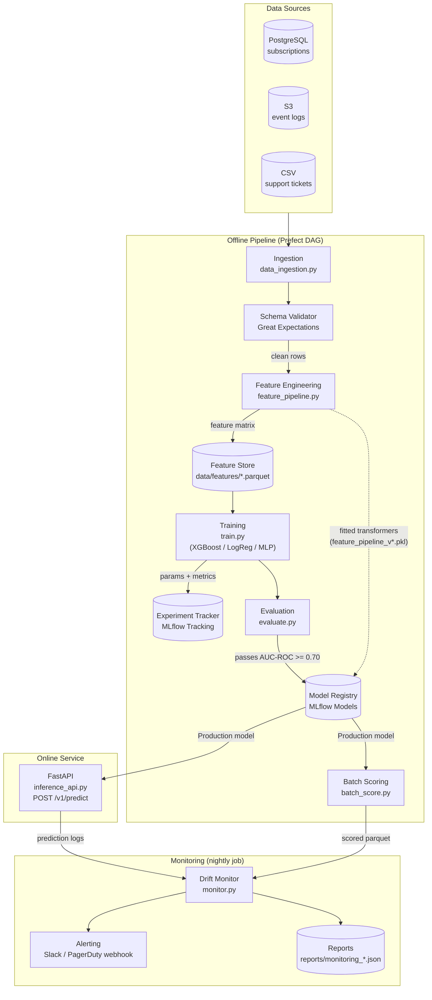

# Design: Customer Churn Prediction

## Architecture

### System Context

The Customer Churn Prediction system operates in two modes that share a common model registry and feature pipeline artefact:

- **Offline pipeline**: A Prefect DAG runs nightly. It ingests customer data from PostgreSQL, S3 parquet partitions, and CSV exports; engineers features; and produces a scored output parquet consumed by the CRM. A separate weekly DAG retrains the model and registers a new candidate when drift thresholds are breached.
- **Online service**: A FastAPI application deployed as a Docker container serves sub-100 ms predictions to the product backend for in-session retention triggers (e.g., displaying a discount offer when a high-risk customer visits the cancellation page).

Both modes load the same `Production`-staged model and `FeaturePipeline` artefact from the MLflow Model Registry, ensuring training-serving consistency.

### Component Design



### Technology Choices

| Concern | Choice | Rationale |
|---------|--------|-----------|
| Primary model | XGBoost 2.x | Strong tabular performance, native `scale_pos_weight` for imbalance, fast CPU inference |
| Baseline model | scikit-learn `LogisticRegression` | Interpretable, fast; used as champion-challenger lower bound |
| Deep learning option | PyTorch MLP | Available when embedding features require a neural backbone |
| Experiment tracking | MLflow 2.x | Self-hosted, file-system-compatible, supports model registry |
| Data validation | Great Expectations 0.18 | Declarative expectation suites, HTML reports |
| Imbalance handling | imbalanced-learn SMOTE | Applied only on training folds, never test |
| Hyperparameter tuning | Optuna 3.x | Efficient TPE sampler, MLflow callback |
| Inference framework | FastAPI + Uvicorn | Async, Pydantic v2 validation, standard health probes |
| Monitoring | Custom PSI / KL + Evidently | PSI and KL computed in-house; Evidently for richer HTML drift reports |
| Orchestration | Prefect 2.x | Python-native DAG definition, retry logic, alert hooks |
| Serialisation | joblib | scikit-learn standard; handles large numpy arrays efficiently |

## Data Models

### Feature Schema

The canonical schema is defined in `src/churn/schema.py` and versioned as `SCHEMA_VERSION`. Every feature file and `FeaturePipeline` artefact embeds this version string.

```python
# src/churn/schema.py
SCHEMA_VERSION = "1"

FEATURE_SCHEMA: dict[str, dict] = {
    # RFM — recency, frequency, monetary
    "days_since_last_login":        {"dtype": "float32", "nullable": False, "range": [0, 3650]},
    "login_count_30d":              {"dtype": "float32", "nullable": False, "range": [0, None]},
    "total_spend_90d":              {"dtype": "float32", "nullable": False, "range": [0, None]},
    # Session aggregates
    "session_count_7d":             {"dtype": "float32", "nullable": True,  "range": [0, None]},
    "session_count_30d":            {"dtype": "float32", "nullable": False, "range": [0, None]},
    "avg_session_duration_30d":     {"dtype": "float32", "nullable": True,  "range": [0, None]},
    # Support signals
    "support_ticket_count_90d":     {"dtype": "float32", "nullable": False, "range": [0, None]},
    "days_since_last_support":      {"dtype": "float32", "nullable": True,  "range": [0, None]},
    # Contract
    "contract_tenure_days":         {"dtype": "float32", "nullable": False, "range": [0, None]},
    "plan_tier":                    {"dtype": "category", "nullable": False,
                                     "values": ["free", "starter", "pro", "enterprise"]},
    # Label (present in training data only)
    "churned_30d":                  {"dtype": "int8",    "nullable": False, "values": [0, 1]},
}

FEATURE_COLUMNS = [k for k, v in FEATURE_SCHEMA.items() if k != "churned_30d"]
NULLABLE_COLUMNS = {k for k, v in FEATURE_SCHEMA.items() if v.get("nullable")}
CATEGORICAL_COLUMNS = {k for k, v in FEATURE_SCHEMA.items() if v["dtype"] == "category"}
REQUIRED_COLUMNS = {k for k, v in FEATURE_SCHEMA.items() if not v.get("nullable")} - {"churned_30d"}
```

### Prediction Request and Response

Pydantic v2 models used by the FastAPI service (`src/churn/api_models.py`):

```python
from pydantic import BaseModel, Field
from typing import Literal

class PredictRequest(BaseModel):
    customer_id: str
    features: dict[str, float | str | None]  # null values are imputed server-side

class FeatureImputationMeta(BaseModel):
    feature: str
    strategy: Literal["median", "unknown_bucket"]
    original_value: float | str | None

class PredictResponse(BaseModel):
    customer_id: str
    churn_probability: float = Field(ge=0.0, le=1.0)
    churn_binary: bool                          # probability >= operating_threshold
    model_version: str                          # e.g. "churn_prediction/3"
    latency_ms: float
    imputed_features: list[FeatureImputationMeta]

class BatchPredictRequest(BaseModel):
    requests: list[PredictRequest] = Field(max_length=1000)

class BatchPredictResponse(BaseModel):
    predictions: list[PredictResponse]
    batch_latency_ms: float
```

### Model Metadata and Model Card Fields

Written to `models/model_card_{version}.json` and stored as MLflow tags:

```json
{
  "model_name": "churn_prediction",
  "version": 3,
  "registered_at": "2024-09-01T02:15:00Z",
  "run_id": "abc123def456",
  "training_data_manifest": "data/manifests/2024-09-01_subscriptions.json",
  "training_data_checksum": "sha256:9f3a1b...",
  "feature_pipeline_version": "2",
  "schema_version": "1",
  "hyperparameter_hash": "md5:4d72...",
  "evaluation_metrics": {
    "val_auc_roc": 0.834,
    "test_auc_roc": 0.831,
    "test_avg_precision": 0.612,
    "test_f1_at_0.5": 0.584,
    "test_precision_at_0.5": 0.641,
    "test_recall_at_0.5": 0.537,
    "test_recall_at_0.3": 0.712,
    "test_brier_score": 0.098
  },
  "model_card": {
    "intended_use": "Identify customers at high risk of churning within 30 days for proactive CRM outreach and in-product retention triggers.",
    "training_population": "Active subscribers with >= 7 days tenure, subscription events 2024-01-01 to 2024-08-31.",
    "out_of_scope": "Predicting churn beyond 30 days; free-trial users (no spend history); B2B enterprise accounts with custom contracts.",
    "known_limitations": "Enterprise segment underrepresented in training (N < 500); imputed session features inflate prediction uncertainty; calibration degrades for customers with < 14 days tenure.",
    "fairness_notes": "Churn rate varies by plan tier and geography. Evaluate per-segment recall before deploying campaigns to avoid over-contacting lower-value segments.",
    "approved_by": "ml-team@example.com",
    "promoted_at": "2024-09-01T08:30:00Z"
  }
}
```

## Pipeline Design

The full ML lifecycle is a directed acyclic graph of atomic, idempotent stages. Any stage can be re-run in isolation using its CLI entry point.

```
Ingest → Validate → Feature-Eng → Train → Evaluate → Register → Batch-Score
                                                            ↓
                                                     Online API (always-on)
                                                            ↓
                                                     Monitor (nightly)
```

| Stage | Entry Point | Key Output | Failure Behaviour |
|-------|-------------|------------|-------------------|
| Ingest | `python -m churn.data_ingestion` | `data/raw/*.parquet` + manifest JSON | Halt on > 1 % invalid rows or missing required column |
| Validate | Great Expectations suite in `ge_suites/churn_raw.json` | Validation report HTML | Halt on any critical expectation failure |
| Feature-Eng | `python -m churn.feature_pipeline` | `data/features/churn_features_*.parquet` + `models/feature_pipeline_v*.pkl` | Halt on schema error; emit warnings for soft violations |
| Train | `python -m churn.train` | MLflow run + logged model artefact | Mark run FAILED; do not register |
| Evaluate | `python -m churn.evaluate` | Metrics dict + calibration PNG in MLflow | Block registration if AUC-ROC < 0.70 |
| Register | `python -m churn.register` | MLflow Model Registry entry + model card JSON | Retry 3x with backoff; raise `RegistryConnectionError` |
| Batch-Score | `python -m churn.batch_score` | `data/predictions/churn_scores_{date}.parquet` | Exit non-zero + alert on missing Production model |
| Monitor | `python -m churn.monitor` | `reports/monitoring_{date}.json` + alerts | Emit `LOW_PREDICTION_VOLUME_ALERT` if N < 100 |

The Prefect flow (`pipelines/churn_pipeline.py`) wires these stages with `@task` decorators, configures retries and timeouts per stage, and sends a `PIPELINE_FAILED` webhook alert on any unhandled exception.

### Configuration File Structure

```
configs/
  ingestion.yaml     # sources, modes (full/incremental), null_rate_thresholds
  features.yaml      # look-back windows, imputation strategies, outlier clip policy
  training.yaml      # model_type, hyperparameters, random_seed, cv_strategy, imbalance_strategy
  evaluation.yaml    # operating_thresholds, performance_gates (auc_roc_min, brier_max)
  monitoring.yaml    # psi_thresholds, kl_threshold, degradation_delta, webhook_url_env_var
```

## Model Evaluation

### Metrics and Thresholds

| Metric | Minimum Gate | Business Target | Notes |
|--------|-------------|-----------------|-------|
| AUC-ROC (validation) | 0.70 (hard gate, blocks registration) | >= 0.80 | Threshold-agnostic discrimination |
| AUC-ROC (test) | Must exceed champion − 0.01 | >= 0.80 | Champion/challenger promotion guard |
| Average Precision (test) | — | >= 0.50 | Robust to class imbalance |
| Recall @ threshold=0.3 (test) | — | >= 0.60 | Prioritise catching churners |
| Brier Score (test) | — | <= 0.12 | Probability calibration quality |
| F1 @ operating threshold (test) | — | >= 0.55 | Reported; not a gate |

### Validation Strategy

- **Data split**: Chronological 70 / 15 / 15 (train / validation / test) on `event_date`. The test set is never touched until final evaluation after a model candidate passes the validation-set AUC-ROC gate.
- **Cross-validation**: `TimeSeriesSplit(n_splits=5)` on train + validation combined, used for Optuna hyperparameter search. Mean AUC-ROC across folds is the optimisation objective.
- **Champion/challenger**: The challenger's test-set AUC-ROC must exceed the current Production model's registered test AUC-ROC by more than 0.01 to be promoted.
- **Calibration**: Platt scaling (`CalibratedClassifierCV(method="sigmoid", cv=5)`) applied after final model selection. Calibration evaluated with the Brier Score and a reliability diagram.

### Class Imbalance Handling

Expected churn prevalence: 5–8 % positive rate. Strategy (selected via config):

1. **`balanced_weight`** (default): `scale_pos_weight = n_negative / n_positive` for XGBoost; `class_weight="balanced"` for LogisticRegression. Fast, no data augmentation.
2. **`smote`**: Apply `imblearn.over_sampling.SMOTE(k_neighbors=5)` to the training fold only, inside the cross-validation loop. Never applied to validation or test sets.
3. **`none`**: No adjustment. Use only when the dataset is balanced after resampling.

All training runs log the per-class sample counts before and after imbalance handling to MLflow, and the per-class precision and recall are always reported separately in the evaluation suite.

## Inference API

The inference service (`src/churn/inference_api.py`) is a FastAPI application served by `uvicorn`, packaged as `docker/Dockerfile.serve`.

### Endpoints

| Method | Path | Description | p95 SLA |
|--------|------|-------------|---------|
| POST | `/v1/predict` | Single-customer real-time prediction | < 100 ms |
| POST | `/v1/predict/batch` | Batch of up to 1 000 customers | < 500 ms |
| GET | `/health/live` | Liveness: always 200 while process runs | — |
| GET | `/health/ready` | Readiness: 200 only after model loaded | — |
| GET | `/v1/model/info` | Active model version and card summary | < 10 ms |

### Startup Sequence

```python
@asynccontextmanager
async def lifespan(app: FastAPI):
    # 1. Load FeaturePipeline from registry (resolves transformer medians, vocab)
    app.state.feature_pipeline = load_feature_pipeline(version=settings.feature_pipeline_version)
    # 2. Load Production model from MLflow registry
    app.state.model = mlflow.sklearn.load_model(f"models:/churn_prediction/Production")
    # 3. Run a warm-up prediction on a synthetic row
    _warmup(app.state.feature_pipeline, app.state.model)
    # 4. Set readiness flag
    app.state.model_loaded = True
    yield
    # Cleanup on shutdown
    app.state.model_loaded = False
```

### Missing Feature Handling at Inference

At request time, before features are passed to the model, the handler:

1. Identifies any feature key absent from or `null` in the request payload.
2. For numeric nullable features: applies the median value stored in `feature_pipeline.imputer_.statistics_`.
3. For categorical features: applies the `unknown` bucket if the value is null or not in the encoder vocabulary.
4. Appends each imputed field to `imputed_features` in the response, preserving the original null value for downstream logging.

The handler never raises a 4xx for a missing feature; it always returns a prediction with transparency about what was imputed.

### Example Request / Response

```http
POST /v1/predict
Content-Type: application/json

{
  "customer_id": "cust_8842",
  "features": {
    "days_since_last_login": 21.0,
    "login_count_30d": 3.0,
    "total_spend_90d": 49.99,
    "session_count_7d": null,
    "session_count_30d": 5.0,
    "avg_session_duration_30d": null,
    "support_ticket_count_90d": 2.0,
    "days_since_last_support": 5.0,
    "contract_tenure_days": 180.0,
    "plan_tier": "starter"
  }
}
```

```json
{
  "customer_id": "cust_8842",
  "churn_probability": 0.741,
  "churn_binary": true,
  "model_version": "churn_prediction/3",
  "latency_ms": 11.8,
  "imputed_features": [
    {"feature": "session_count_7d",         "strategy": "median", "original_value": null},
    {"feature": "avg_session_duration_30d",  "strategy": "median", "original_value": null}
  ]
}
```

## Monitoring and Drift

### Reference Statistics File

Written at training time by `src/churn/train.py` to `models/reference_stats_v{version}.json`. Contains, per feature:
- Numerical: mean, std, min, max, and percentiles (5th, 25th, 50th, 75th, 95th)
- Categorical: value counts dict and total N

The monitoring job loads this file exclusively; it never reads the training dataset.

### Data Drift — PSI per Feature

```
PSI = Σ (Pserving_i − Pref_i) × ln(Pserving_i / Pref_i)
```

Numerical features are binned into 10 equal-width buckets computed from the reference distribution. For categoricals, each category is a bin. Thresholds:

| PSI Range | Verdict | Action |
|-----------|---------|--------|
| 0.0 – 0.10 | Stable | None |
| 0.10 – 0.20 | Moderate drift | Warning logged |
| > 0.20 | High drift | `DATA_DRIFT_ALERT` sent to webhook |

### Prediction Drift — KL Divergence

```
KL(serving || reference) = Σ P_serving(s) × log(P_serving(s) / P_ref(s))
```

Scores are binned into 20 buckets between 0 and 1. KL > 0.1 triggers `PREDICTION_DRIFT_ALERT`.

### Realised Performance Monitoring

30 days after each batch scoring date, the monitoring job:
1. Joins `data/predictions/churn_scores_{scoring_date}.parquet` to CRM labels on `customer_id`.
2. Computes realised AUC-ROC and Average Precision on the labelled subset.
3. Compares to `evaluation_metrics.test_auc_roc` from the active model's model card.
4. Triggers `MODEL_DEGRADATION_ALERT` if realised AUC-ROC < registered AUC-ROC − 0.05 and initiates an automatic retraining Prefect flow.

### Low-Volume Guard

If fewer than 100 predictions were served in the last 24 hours, statistical drift estimates are unreliable. The monitoring job emits `LOW_PREDICTION_VOLUME_ALERT` and skips PSI and KL computation for that day, logging the actual prediction count.

### Alert Payload Structure

```json
{
  "alert_type": "DATA_DRIFT_ALERT",
  "model_version": "churn_prediction/3",
  "monitoring_run_id": "mon-2024-09-02",
  "metric": "psi",
  "current_value": 0.31,
  "threshold": 0.20,
  "affected_features": ["days_since_last_login", "session_count_30d"],
  "dashboard_url": "https://mlflow.internal/monitoring/2024-09-02",
  "timestamp": "2024-09-02T06:00:12Z"
}
```

## Error Handling

| Error Condition | Exception / Response | Recovery |
|----------------|---------------------|----------|
| > 1 % rows fail schema validation | `SchemaValidationError` — halt pipeline | Fix data source; re-run ingestion |
| Required column missing from source | `SchemaDriftError` — halt pipeline | Investigate upstream schema change |
| MLflow registry unreachable | `RegistryConnectionError` — retry 3x | Check MLflow server; alert on-call |
| No Production model at API startup | `/health/ready` returns HTTP 503 | Register and promote a model; redeploy |
| Unknown categorical at inference | Handled: `unknown` bucket applied | Log counter metric; review in monitoring |
| Missing feature at inference | Handled: median imputed | Populate `imputed_features` in response |
| Batch request > 1 000 items | HTTP 422 `Unprocessable Entity` | Caller must split into smaller batches |
| Prediction volume < 100 in 24 h | `LOW_PREDICTION_VOLUME_ALERT` | Investigate batch scoring job |
| Realised AUC-ROC drop > 0.05 | `MODEL_DEGRADATION_ALERT` + auto-retrain trigger | Review drift reports; retrain with fresh data |
| Feature value outside ±3σ clip | `OutlierClipWarning` logged | Review data pipeline for anomalous values |

## Testing Strategy

### Unit Tests (`tests/unit/`)

| File | What Is Tested |
|------|---------------|
| `test_schema.py` | `FEATURE_SCHEMA` completeness; Pydantic `PredictRequest` rejects unknown extra fields |
| `test_ingestion.py` | `SchemaValidationError` at 1.5 % invalid rows; `SchemaDriftError` on missing column; manifest written; watermark updated on incremental load (mocked DB / S3) |
| `test_feature_pipeline.py` | RFM values match manual calculation on fixture rows; median imputation sets `_imputed` flag; outlier clipping at ±3σ; unknown-category bucketing; chunked transform equals single-pass transform |
| `test_train.py` | MLflow `log_param` called with `random_seed`; `scale_pos_weight` set when churn rate < 10 %; run tagged FAILED at AUC-ROC = 0.69; heartbeat thread starts and joins |
| `test_evaluate.py` | Gate blocks registration at AUC-ROC = 0.69; calibration curve artefact logged; Brier Score value correct on toy distribution |
| `test_register.py` | Retry fires 3x on mocked `MlflowException`; model card JSON contains all required fields; `--dry-run` does not write any artefact |
| `test_monitor.py` | PSI > 0.2 triggers alert; PSI < 0.1 produces no alert; KL > 0.1 triggers alert; N < 100 triggers `LOW_PREDICTION_VOLUME_ALERT`; realised AUC-ROC drop > 0.05 triggers `MODEL_DEGRADATION_ALERT` |

### Integration Tests (`tests/integration/`)

| File | What Is Tested |
|------|---------------|
| `test_pipeline_e2e.py` | Full pipeline (ingest → feature-eng → train → evaluate → register) on 500-row fixture; assert model registered in temporary MLflow instance |
| `test_api.py` | FastAPI `TestClient`: `/health/ready` is 503 before model load; `/v1/predict` returns correct `imputed_features` for a payload missing `session_count_7d`; `/v1/predict/batch` rejects 1 001 items with 422 |
| `test_batch_score.py` | Batch scoring on 200-row fixture; output parquet has required columns; no nulls in `churn_probability` |

### Model Tests (`tests/model/`)

| File | What Is Tested |
|------|---------------|
| `test_model_invariance.py` | Changing `customer_id` does not alter `churn_probability`; increasing `days_since_last_login` monotonically increases `churn_probability` (all else equal) |
| `test_calibration.py` | Brier Score on validation fixture is <= 0.12 |
| `test_class_imbalance_recall.py` | Minority-class recall >= 0.60 at threshold 0.3 on a synthetically imbalanced fixture (5 % positive rate) |

### Data Tests (`tests/data/`)

| File | What Is Tested |
|------|---------------|
| `test_reference_stats.py` | `reference_stats_v{version}.json` contains all feature names; no NaN values in any stat field |
| `test_feature_distributions.py` | No feature column has > 10 % null values in the fixture training dataset after feature engineering |
