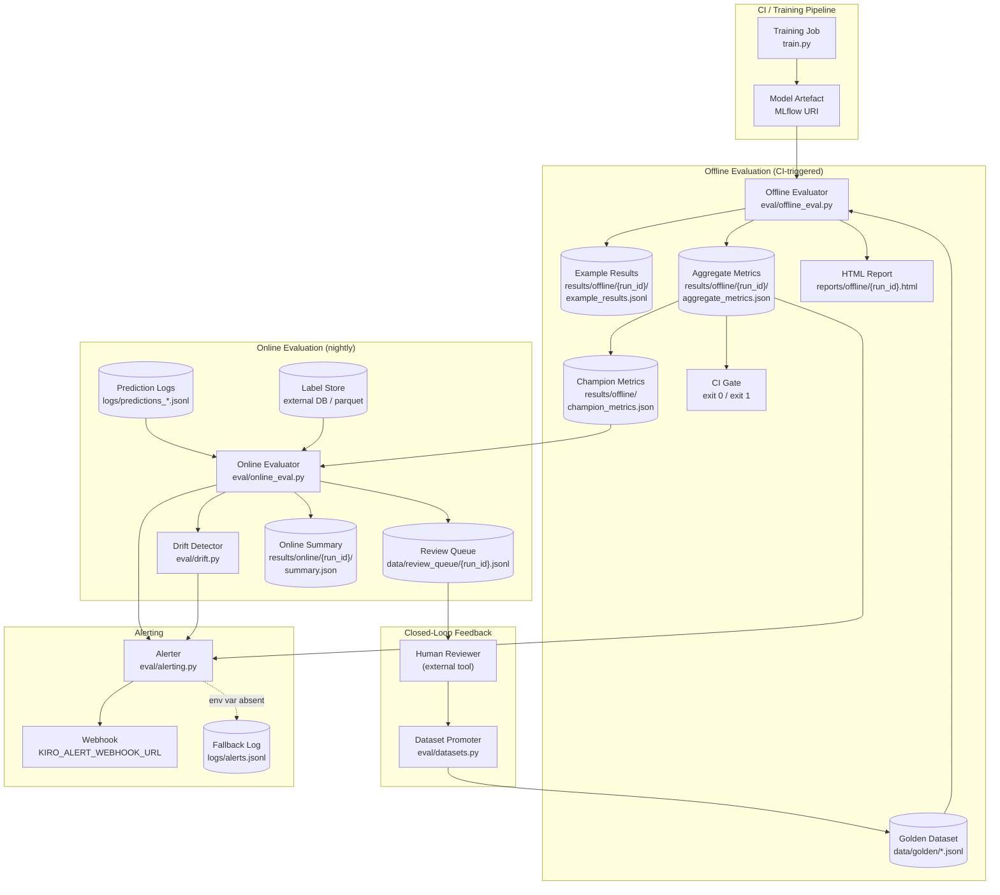

# Design: Model Evaluation Pipeline

## Architecture

### System Context

The Model Evaluation Pipeline integrates with the ML platform at two lifecycle points:

- **Offline evaluation** is invoked by CI immediately after a training run produces a model artefact. The offline evaluator loads the model, runs every golden-dataset example through the evaluator suite, checks all metric gates, and either exits non-zero (blocking promotion) or updates `results/offline/champion_metrics.json` as the new regression baseline.
- **Online evaluation** runs as a nightly batch job scheduled by Prefect. It samples production prediction logs, joins deferred ground-truth labels, computes the same evaluators, detects input distribution drift, measures offline↔online metric divergence, and routes anomalous examples to the human review queue. Human reviewers label queue items; approved failures are fed back into the golden dataset through a controlled promotion step, closing the quality loop.

Both modes share `eval/metrics.py` (the evaluator registry) and `eval/schemas.py` (result schemas), ensuring metrics computed offline and online are directly comparable.

### Component Design



## Data Models

All models are defined in `eval/schemas.py` using Pydantic v2.

### GoldenExample and DatasetMeta

```python
# eval/datasets.py
from __future__ import annotations
from pydantic import BaseModel, Field
from datetime import datetime
from typing import Any, Literal

class GoldenExample(BaseModel):
    example_id: int                              # monotonically increasing; set by add()
    input: dict[str, Any]                        # raw feature dict or {"text": "..."}
    ground_truth: Any                            # int | float | str | list (ranking)
    added_at: datetime                           # UTC ISO-8601
    added_by: str                                # from KIRO_EVAL_USER env var
    source: Literal["manual", "online_feedback"] = "manual"
    prediction_id: str | None = None             # production request ID; online_feedback only
    tags: list[str] = Field(default_factory=list)
    input_hash: str = ""                         # SHA-256 of JSON-serialised input; set by add()

class DatasetMeta(BaseModel):
    dataset_name: str
    schema_version: str
    example_count: int
    checksum_sha256: str                         # SHA-256 of entire .jsonl file
    feedback_loop_additions: int = 0
    last_modified: datetime
    shard_files: list[str] = Field(default_factory=list)   # populated when sharding kicks in
```

### ExampleResult

```python
# eval/schemas.py
from pydantic import BaseModel
from datetime import datetime
from typing import Any, Literal

class EvaluatorScore(BaseModel):
    score: float | None                          # null when evaluator raised an exception
    error: str | None = None                     # "<ExceptionType>: <message>"

class ExampleResult(BaseModel):
    example_id: int
    run_id: str                                  # e.g. "offline-20240901-abc123"
    mode: Literal["offline", "online"]
    model_uri: str
    input: dict[str, Any]
    ground_truth: Any
    model_output: Any
    latency_ms: float
    scores: dict[str, EvaluatorScore]            # evaluator_id → score
    evaluated_at: datetime
    labelled: bool = True                        # False for online examples without labels
```

### AggregateMetrics

```python
# eval/schemas.py
from typing import Literal

class MetricGateResult(BaseModel):
    metric_name: str
    value: float | None
    threshold: float | None
    direction: Literal["min", "max"] | None      # "min" = higher-is-better
    required: bool
    passed: bool | None                          # null if metric value is null

class LatencyPercentiles(BaseModel):
    p10_ms: float
    p50_ms: float
    p90_ms: float

class AggregateMetrics(BaseModel):
    run_id: str
    model_uri: str
    dataset_name: str
    example_count: int
    gate_passed: bool
    metrics: dict[str, float | None]             # evaluator_id → aggregate value
    gate_results: list[MetricGateResult]
    latency: LatencyPercentiles
    evaluated_at: datetime
```

### OnlineSummary

```python
# eval/schemas.py
class PSIResult(BaseModel):
    feature_name: str
    psi: float
    verdict: Literal["stable", "moderate_drift", "high_drift"]

class OnlineSummary(BaseModel):
    run_id: str
    model_uri: str
    sample_size: int
    labelled_count: int
    label_fraction: float
    low_label_coverage: bool
    online_metrics: dict[str, float | None]
    offline_metrics: dict[str, float | None]     # from champion_metrics.json
    divergence: dict[str, float]                 # metric_id → |online − offline|
    drift_detected: bool
    psi_results: list[PSIResult]
    review_queue_items: int
    alert_statuses: dict[str, str]               # alert_type → "posted" | "logged"
    evaluated_at: datetime
```

### Alert Payloads

```python
# eval/alerting.py
from dataclasses import dataclass
from datetime import datetime

@dataclass
class RegressionAlert:
    alert_type: str = "REGRESSION_ALERT"
    run_id: str = ""
    model_uri: str = ""
    champion_uri: str = ""
    metric_name: str = ""
    challenger_value: float = 0.0
    champion_value: float = 0.0
    delta: float = 0.0
    regression_delta_threshold: float = 0.0
    evaluated_at: str = ""                       # UTC ISO-8601

@dataclass
class DivergenceAlert:
    alert_type: str = "DIVERGENCE_ALERT"
    run_id: str = ""
    metric_name: str = ""
    online_value: float = 0.0
    offline_value: float = 0.0
    divergence: float = 0.0
    threshold: float = 0.0
    drift_detected: bool = False
    drifted_features: list[str] = None
    evaluated_at: str = ""
```

## Files & Interfaces

```
eval/
  datasets.py        — add(dataset, record, dry_run) → GoldenExample
                       load(dataset_name) → list[GoldenExample]
                       verify_checksum(dataset_name) → None | DatasetIntegrityError
                       promote_queue(dataset_name, approved_by) → PromotionReport
  offline_eval.py    — run_offline_eval(model_uri, dataset_name, champion_uri?) → AggregateMetrics
                       CLI: __main__ with --model-uri, --dataset, --champion-uri, --config
  online_eval.py     — run_online_eval(config: OnlineEvalConfig) → OnlineSummary
                       _sample_logs(window_hours, sample_size, stratify_col) → pd.DataFrame
                       _join_labels(df, label_store_config) → pd.DataFrame
                       CLI: __main__ with --config
  metrics.py         — EVALUATOR_REGISTRY: dict[str, Callable[[np.ndarray, np.ndarray], float]]
                       @register_evaluator(name) decorator
                       Built-in evaluators: accuracy, precision, recall, f1,
                         auc_roc, avg_precision,   # classification
                         mae, rmse, mape, r2,       # regression
                         ndcg_at_5, ndcg_at_10, map_at_10, mrr  # ranking
  drift.py           — compute_psi(reference: np.ndarray, serving: np.ndarray, bins=10) → PSIResult
                       compute_kl(p: np.ndarray, q: np.ndarray, eps=1e-8) → float
                       load_reference_stats(path) → dict[str, dict]
  alerting.py        — send_alert(alert: RegressionAlert | DivergenceAlert) → Literal["posted","logged"]
                       _post_webhook(url, payload, timeout=10) → None
                       _log_fallback(payload) → None   # writes to logs/alerts.jsonl
  results.py         — CLI: slice(run_id, filter_expr, mode), compare(run_a, run_b)
  schemas.py         — GoldenExample, DatasetMeta, ExampleResult, EvaluatorScore,
                       AggregateMetrics, MetricGateResult, LatencyPercentiles,
                       OnlineSummary, PSIResult, RegressionAlert, DivergenceAlert
  report.py          — render_html_report(run_id, metrics, template_dir) → Path
                       Jinja2 template: templates/eval_report.html
configs/
  eval_config.yaml   — evaluators list, metric gates (name/threshold/direction/required),
                       regression deltas per metric, timeout_seconds
  online_eval.yaml   — online_sample_size, label_store config, divergence_thresholds,
                       anomaly_confidence_gap, max_review_items_per_run
  golden_schema.json — JSON Schema for GoldenExample.input and .ground_truth fields
models/
  reference_stats.json  — per-feature mean/std/percentiles; written by training pipeline
results/
  offline/{run_id}/
    example_results.jsonl
    aggregate_metrics.json
    summary.json
  offline/champion_metrics.json
  online/{run_id}/
    example_results.jsonl
    summary.json
data/
  golden/{dataset_name}.jsonl
  golden/{dataset_name}.meta.json
  review_queue/{run_id}.jsonl
logs/
  predictions_*.jsonl     — written by inference service
  alerts.jsonl            — fallback alert store
reports/
  offline/{run_id}.html
pipelines/
  eval_pipeline.py   — Prefect flow: offline_eval (on model artefact trigger)
                       + online_eval (nightly); on_failure → send_alert("PIPELINE_FAILED")
```

## Metrics & Thresholds

| Task | Evaluator ID | Default Gate | Direction | Notes |
|------|-------------|-------------|-----------|-------|
| Classification | `accuracy` | 0.80 | min (higher better) | Primary gate |
| Classification | `auc_roc` | 0.75 | min | Threshold-agnostic; uses `roc_auc_score` |
| Classification | `avg_precision` | 0.60 | min | Robust to class imbalance |
| Classification | `recall` | 0.65 | min | Configurable per project |
| Regression | `r2` | 0.70 | min | Primary regression gate |
| Regression | `rmse` | — | max (lower better) | Project-specific; informational default |
| Ranking | `ndcg_at_10` | 0.70 | min | Primary ranking gate |
| Divergence | per metric | 0.05 | max | Triggers `DivergenceAlert` |
| PSI per feature | `psi` | 0.20 | max | > 0.20 → `high_drift` |
| Regression delta | per metric | 0.01 | max | Triggers `RegressionAlert` |

## Offline vs Online Evaluation

| Dimension | Offline | Online |
|-----------|---------|--------|
| Trigger | CI on model commit / training job | Nightly Prefect schedule |
| Dataset | Fixed versioned golden dataset | Stratified sample of production logs |
| Labels | Always available (golden set) | Joined from label store; may lag |
| Sample size | All golden examples (up to 10 000) | Up to 5 000 per config |
| Evaluator suite | Full `eval_config.yaml` list | Same list |
| Primary purpose | CI gate, model selection | Divergence and drift monitoring |
| Result store | `results/offline/{run_id}/` | `results/online/{run_id}/` |
| Champion file updated | Yes (on passing run) | No |
| Review queue populated | No | Yes (anomaly examples) |
| Regression check | Challenger vs champion | Online vs offline baseline |

## Error Handling

| Condition | Behaviour |
|-----------|-----------|
| Dataset checksum mismatch | `DatasetIntegrityError` — exit 3; write error to summary.json |
| Model URI not loadable | `ModelLoadError` — exit 2; write structured error to summary.json |
| Unknown evaluator name in config | `UnknownEvaluatorError` — exit 1 before any examples processed |
| Single example evaluator exception | Catch; write `null` score + error message; log warning; continue |
| Required gate failure | Exit 1; `gate_passed: false` in summary.json |
| Regression detected | `RegressionAlert` posted; exit 1 |
| Webhook POST fails | Retry once after 3 s; on second failure write to `logs/alerts.jsonl` |
| `KIRO_ALERT_WEBHOOK_URL` not set | All alerts written to `logs/alerts.jsonl` silently |
| Degenerate class in dataset | Skip AUC-ROC and AP; emit `DegenerateClassWarning`; continue |
| Online label fraction < 30 % | `LowLabelCoverageWarning`; compute on available subset; flag in summary |
| Review queue full (max items) | Stop appending to queue; log count of dropped items |
| Evaluation timeout exceeded | Emit `EvalTimeoutError`; write partial results; exit 2 |

## Testing Strategy

### Unit Tests (`tests/unit/`)

| File | What Is Tested |
|------|---------------|
| `test_datasets.py` | `add()` appends with correct `example_id` and checksum update; `DatasetIntegrityError` on tampered file; duplicate input hash is skipped with warning; `--dry-run` writes nothing; closed-loop `source` tag and `prediction_id` stored |
| `test_metrics.py` | `auc_roc` matches `sklearn.metrics.roc_auc_score` on 100-row fixture; `DegenerateClassWarning` on single-class input; per-evaluator exception yields `null` score; MAPE skips zero-ground-truth examples; `UnknownEvaluatorError` on unregistered name |
| `test_offline_eval.py` | Gate passes at accuracy 0.85 (gate 0.80); gate fails at accuracy 0.78 (exit 1); `RegressionAlert` raised when challenger drops 0.03 below champion with delta threshold 0.01; `champion_metrics.json` not updated on gate failure; progress log written every 100 examples |
| `test_drift.py` | PSI = 0 on identical distributions; PSI = 0.31 on known-divergent arrays classified as `high_drift`; `compute_kl` returns 0 on identical histograms; Laplace smoothing (eps=1e-8) prevents log(0) |
| `test_alerting.py` | `send_alert` posts correct JSON body with all required keys; writes to `logs/alerts.jsonl` when env var absent; retries once on HTTP 500 then falls back to log |
| `test_results.py` | `slice` filter returns only examples with `scores.accuracy == 0`; `compare` lists regressions > 0.05; null `example_id` write is rejected; p10/p50/p90 latency present in aggregate output |

### Integration Tests (`tests/integration/`)

| File | What Is Tested |
|------|---------------|
| `test_offline_e2e.py` | Full offline run on 200-example fixture with `sklearn.dummy.DummyClassifier`; assert `example_results.jsonl` has 200 lines; assert `aggregate_metrics.json` contains `accuracy`, `auc_roc`, and `latency`; assert HTML report file exists and contains "Gate Status" |
| `test_online_e2e.py` | Online run on 500 mock prediction log entries with 70 % label coverage; assert `label_fraction ≈ 0.70`; inject feature array with PSI = 0.31 and assert `drift_detected: true`; assert `review_queue/{run_id}.jsonl` is created |
| `test_feedback_loop.py` | Write 3 items to review queue as `confirmed_failure`; run `promote-queue`; assert golden dataset grows by 3; assert `champion_metrics.json` is refreshed; run with 1 duplicate and assert `examples_skipped_as_duplicates == 1` |
