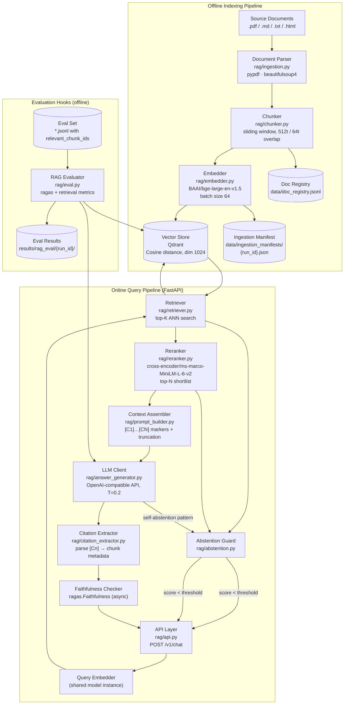

# Design: RAG Chatbot

## Architecture

### System Context

The RAG Chatbot operates in two distinct operational modes:

- **Offline indexing pipeline**: A batch job ingests documents, splits them into overlapping chunks, encodes chunks with a sentence-transformer, and upserts them into a Qdrant vector store. This pipeline runs on demand or on a schedule when the corpus changes.
- **Online query pipeline**: A FastAPI service receives user queries, embeds the query, retrieves the top-K most similar chunks from Qdrant, reranks with a cross-encoder, assembles a grounded prompt with citation markers, calls the LLM API, verifies faithfulness, and returns a structured response with inline citations.

Evaluation hooks integrate with the `ragas` library to measure retrieval quality (context precision, recall, MRR) and answer quality (faithfulness, answer relevance) against a labelled evaluation set.

### Component Design



## Data Models

All models are defined in Pydantic v2 in `rag/schemas.py`.

### Document and Chunk

```python
# rag/schemas.py
from __future__ import annotations
from pydantic import BaseModel, Field
from datetime import datetime
from typing import Any

class Document(BaseModel):
    doc_id: str                        # SHA-256 of (filepath + last_modified ISO string)
    filename: str
    filepath: str
    file_type: str                     # "pdf", "md", "txt", "html"
    total_pages: int | None            # available for PDF only
    char_count: int
    ingested_at: datetime
    chunk_ids: list[str]               # assigned after chunking

class Chunk(BaseModel):
    chunk_id: str                      # "{doc_id}:{chunk_index:04d}"
    doc_id: str
    filename: str
    page_number: int | None
    chunk_index: int
    char_start: int
    char_end: int
    text: str
    token_count: int                   # tokenised by embedding model tokenizer
    embedding: list[float] | None      # set after encode(); None in metadata-only contexts
```

### Retrieval and Reranking

```python
# rag/schemas.py
class RetrievedChunk(BaseModel):
    chunk_id: str
    doc_id: str
    filename: str
    page_number: int | None
    text: str
    retrieval_score: float             # cosine similarity [0, 1]
    reranker_score: float | None       # cross-encoder score; None before reranking
    citation_index: int | None         # [C1] → 1, assigned by context assembler

class ContextBundle(BaseModel):
    query: str
    chunks: list[RetrievedChunk]       # ordered by reranker_score desc
    context_text: str                  # assembled with [Cn] markers, truncated
    context_token_count: int
    retrieval_top_k: int
    rerank_top_n: int
```

### API Request and Response

```python
# rag/schemas.py
from typing import Literal

class ChatRequest(BaseModel):
    query: str = Field(min_length=1, max_length=2000)
    doc_filter: str | None = None      # restrict to a specific source document
    session_id: str | None = None      # for logging only; no state maintained

class CitationRecord(BaseModel):
    citation_index: int                # 1-based, matches [Cn] in answer
    chunk_id: str
    filename: str
    page_number: int | None
    excerpt: str                       # first 200 chars of chunk for display

class ChatResponse(BaseModel):
    request_id: str
    query: str
    answer: str                        # with [Cn] inline markers preserved
    citations: list[CitationRecord]
    abstained: bool
    abstention_reason: Literal[
        "retrieval_threshold", "reranker_threshold",
        "llm_self_abstention", "safety_filter"
    ] | None
    faithfulness_score: float | None   # from ragas; null if check disabled
    uncited_claims_warning: bool
    retrieval_scores: list[dict]       # [{chunk_id, score}] for top-K
    reranker_scores: list[dict]        # [{chunk_id, score}] for top-N
    context_token_count: int
    model_id: str
    latency_ms: float
```

### Evaluation Record

```python
# rag/eval.py
class EvalQuery(BaseModel):
    query_id: str
    query: str
    expected_answer: str | None        # None for retrieval-only eval records
    relevant_chunk_ids: list[str]
    doc_filter: str | None = None

class PerQueryMetrics(BaseModel):
    query_id: str
    abstained: bool
    context_precision: float | None    # null if abstained
    context_recall: float | None
    mrr: float | None
    faithfulness: float | None         # null if abstained or no expected_answer
    answer_relevance: float | None
    retrieval_latency_ms: float
    total_latency_ms: float
```

## Files & Interfaces

```
rag/
  ingestion.py       — ingest(source_path, config) → IngestionManifest
                       _parse_document(path) → Document + raw_text
                       _delete_stale_chunks(doc_id, collection) → int   # chunks deleted
  chunker.py         — chunk_text(text, doc, tokenizer, chunk_size, overlap) → list[Chunk]
                       Uses: transformers.AutoTokenizer (embedding model tokenizer)
  embedder.py        — Embedder.encode(chunks: list[Chunk]) → list[Chunk]  # with .embedding set
                       Embedder.encode_query(query: str) → list[float]
                       Uses: sentence_transformers.SentenceTransformer("BAAI/bge-large-en-v1.5")
  vector_store.py    — QdrantStore.upsert(chunks: list[Chunk]) → int
                       QdrantStore.search(query_vec, top_k, filter?) → list[RetrievedChunk]
                       QdrantStore.delete_by_doc_id(doc_id) → int
                       QdrantStore.ensure_collection(dim, distance) → None
                       Uses: qdrant_client.QdrantClient
  retriever.py       — retrieve(query, embedder, store, config) → list[RetrievedChunk]
                       _apply_min_score_filter(chunks, threshold) → list[RetrievedChunk]
  reranker.py        — Reranker.rerank(query, chunks, top_n) → list[RetrievedChunk]
                       Uses: sentence_transformers.CrossEncoder("cross-encoder/ms-marco-MiniLM-L-6-v2")
  prompt_builder.py  — build_context(query, chunks, max_tokens, tokenizer) → ContextBundle
                       _truncate_at_chunk_boundary(text, max_tokens, tokenizer) → str
  answer_generator.py — LLMClient.generate(context_bundle, config) → str
                        Uses: openai.OpenAI(base_url=LLM_API_BASE, api_key=LLM_API_KEY)
  citation_extractor.py — extract_citations(answer, context_bundle) → tuple[str, list[CitationRecord]]
                          _validate_citation_index(n, max_n) → bool
  abstention.py      — AbstentionGuard.check_retrieval(chunks, threshold) → bool
                       AbstentionGuard.check_reranker(chunks, threshold) → bool
                       AbstentionGuard.check_llm_output(answer, patterns) -> bool
  faithfulness.py    — check_faithfulness(query, answer, context_chunks, config) → float | None
                       Uses: ragas.metrics.Faithfulness, ragas.metrics.AnswerRelevancy
  api.py             — FastAPI app; POST /v1/chat → ChatResponse
                       GET /health/live, GET /health/ready
                       Shared state: embedder, reranker, qdrant_store, llm_client, abstention_guard
  eval.py            — run_rag_eval(eval_set_path, config) → dict  # aggregate metrics
                       _compute_retrieval_metrics(retrieved_ids, relevant_ids, top_k) → dict
                       CLI: __main__ with --eval-set, --config
  schemas.py         — Document, Chunk, RetrievedChunk, ContextBundle,
                       ChatRequest, ChatResponse, CitationRecord,
                       EvalQuery, PerQueryMetrics
configs/
  rag_config.yaml    — collection_name, chunk_size, chunk_overlap, embedding_batch_size,
                       retrieval_top_k, retrieval_min_score, rerank_top_n, rerank_min_score,
                       context_max_tokens, answer_max_tokens, faithfulness_min_score,
                       enable_faithfulness_check, incremental
  pii_patterns.yaml  — regex patterns for safety filter (shared with LLM eval harness)
  jailbreak_patterns.yaml — (shared with LLM eval harness)
templates/
  rag_prompt.j2      — Jinja2 template: system instruction + context with [Cn] + user query
data/
  ingestion_manifests/{run_id}.json
  doc_registry.jsonl
results/
  rag_eval/{run_id}/per_query_metrics.jsonl
  rag_eval/{run_id}/aggregate_metrics.json
```

## Retrieval

### Embedding Model

`BAAI/bge-large-en-v1.5` (sentence-transformers) produces 1024-dimensional L2-normalised vectors. Queries are prefixed with `"Represent this sentence for searching relevant passages: "` as recommended by the model's documentation. Chunks are embedded without a prefix. The model is loaded once at ingestion and at service start via `SentenceTransformer("BAAI/bge-large-en-v1.5")` and shared across all requests.

### Qdrant Collection Configuration

```python
from qdrant_client.models import VectorParams, Distance

client.create_collection(
    collection_name=config.collection_name,
    vectors_config=VectorParams(size=1024, distance=Distance.COSINE),
)
```

Payload indexes are created on `doc_id` and `filename` to support metadata filter queries efficiently.

### Retrieval Flow

```
query → encode_query() → ANN search (top-K=20)
      → score filter (> 0.70) → abstain if empty
      → pass to reranker (top-K list)
```

### Reranking

```python
from sentence_transformers import CrossEncoder
reranker = CrossEncoder("cross-encoder/ms-marco-MiniLM-L-6-v2")
pairs = [(query, chunk.text) for chunk in chunks]
scores = reranker.predict(pairs)
ranked = sorted(zip(chunks, scores), key=lambda x: x[1], reverse=True)
top_n = [chunk for chunk, _ in ranked[:config.rerank_top_n]]
```

If all scores < `config.rerank_min_score` (0.30), trigger abstention.

## Hallucination Mitigation

Hallucination is addressed at three layers to avoid single-point-of-failure:

| Layer | Mechanism | When |
|-------|-----------|------|
| Retrieval threshold | Abstain if cosine similarity < 0.70 for all top-K chunks | Before any LLM call |
| Reranker threshold | Abstain if all cross-encoder scores < 0.30 | Before any LLM call |
| System prompt grounding | Instruction: "Answer only from the provided context; insert [Cn] after every factual claim" | At LLM call time |
| LLM self-abstention | Detect "I don't have enough information" pattern in LLM output | After LLM response |
| Post-generation faithfulness | `ragas.Faithfulness` score; log warning if < 0.70 | After LLM response (async) |
| Safety filter | Block PII or jailbreak content in LLM output | After LLM response |

The `ragas` faithfulness check is intentionally non-blocking at inference time; it runs asynchronously and logs warnings to allow retrieval-based and prompt-based mitigations to do the primary work without adding latency.

## Evaluation Hooks

### Retrieval Metrics

```python
def compute_retrieval_metrics(
    retrieved_ids: list[str],
    relevant_ids: list[str],
    top_k: int,
) -> dict:
    hits = set(retrieved_ids[:top_k]) & set(relevant_ids)
    precision = len(hits) / min(top_k, len(retrieved_ids))
    recall = len(hits) / len(relevant_ids) if relevant_ids else None
    mrr = next(
        (1 / (i + 1) for i, cid in enumerate(retrieved_ids[:top_k]) if cid in set(relevant_ids)),
        0.0,
    )
    return {"context_precision": precision, "context_recall": recall, "mrr": mrr}
```

### ragas Integration

```python
from ragas import evaluate
from ragas.metrics import Faithfulness, AnswerRelevancy
from datasets import Dataset

result = evaluate(
    Dataset.from_list([{
        "question": query,
        "answer": answer,
        "contexts": [chunk.text for chunk in context_bundle.chunks],
        "ground_truth": expected_answer,  # optional
    }]),
    metrics=[Faithfulness(), AnswerRelevancy()],
)
```

`ragas` requires an LLM call internally for its own evaluation; configure it with the same `LLM_API_BASE` and `LLM_API_KEY` used for generation.

### Evaluation Gates

| Metric | Default Gate | Notes |
|--------|-------------|-------|
| `mean_context_precision` | ≥ 0.70 | Fraction of retrieved chunks that are relevant |
| `mean_context_recall` | ≥ 0.60 | Fraction of relevant chunks retrieved |
| `mean_mrr` | ≥ 0.50 | Quality of first relevant chunk rank |
| `mean_faithfulness` | ≥ 0.75 | Fraction of answer claims supported by context |
| `mean_answer_relevance` | ≥ 0.70 | Answer addresses the question |
| `abstention_rate` | ≤ 0.20 | Should only abstain on genuinely unanswerable queries |
| `low_faithfulness_rate` | ≤ 0.10 | Fraction of responses with faithfulness < 0.70 |

## Error Handling

| Condition | Behaviour |
|-----------|-----------|
| Unsupported file type in ingestion | `UnsupportedFileTypeError`; log; continue to next file |
| Qdrant connection failure | Retry 3× with exponential backoff; raise `VectorStoreConnectionError` |
| Zero chunks above retrieval min score | Abstention response; `abstention_reason: "retrieval_threshold"` |
| All reranker scores below threshold | Abstention response; `abstention_reason: "reranker_threshold"` |
| LLM API call failure | Retry once after 2 s; return HTTP 503 on second failure |
| LLM self-abstention pattern detected | Return structured abstention; `abstention_reason: "llm_self_abstention"` |
| Safety filter match in LLM output | Suppress answer; abstention with `abstention_reason: "safety_filter"` |
| ragas library unavailable at eval time | Log `FaithfulnessCheckSkipped`; set `faithfulness_score: null` |
| Invalid citation index [C{n>N}] | `InvalidCitationWarning`; strip invalid marker; continue |
| PII in LLM output | Safety filter triggered; abstention response |
| `retrieval_top_k > 50` | Clamp to 50; emit `HighRetrievalKWarning` at startup |

## Testing Strategy

### Unit Tests (`tests/unit/`)

| File | What Is Tested |
|------|---------------|
| `test_chunker.py` | 512-token chunks from a 2 000-token document produce correct overlap; `chunk_id` format `{doc_id}:{index:04d}`; last chunk does not exceed document boundary; single-sentence document produces one chunk |
| `test_embedder.py` | `encode_query` output dimension is 1024; L2 norm ≈ 1.0 (normalised); identical inputs produce identical embeddings; query prefix applied to query but not to chunks |
| `test_retriever.py` | Retriever returns empty list when all scores < `retrieval_min_score`; metadata filter correctly passes Qdrant `Filter` object; `HighRetrievalKWarning` raised when `top_k > 50` |
| `test_reranker.py` | Top-N are returned in descending reranker score order; abstention triggered when all scores < 0.30; fewer than N input chunks returns all available |
| `test_prompt_builder.py` | Context truncates at chunk boundary, not mid-sentence; `[C1]` prefix present on first chunk; `context_token_count` matches actual token count of assembled string |
| `test_citation_extractor.py` | `[C2]` parsed and resolved to correct `chunk_id` from `ContextBundle`; `[C99]` (out of range) produces `InvalidCitationWarning`; answer with no markers returns empty `citations` list |
| `test_abstention.py` | `"I don't have enough information"` triggers `llm_self_abstention`; retrieval score 0.65 (below 0.70) triggers `retrieval_threshold`; reranker score 0.25 triggers `reranker_threshold` |
| `test_faithfulness.py` | Mock `ragas.evaluate` returning 0.55 triggers `LowFaithfulnessWarning`; `enable_faithfulness_check: false` sets `faithfulness_score: null`; answer supported by context returns score ≥ 0.80 on fixture pair |

### Integration Tests (`tests/integration/`)

| File | What Is Tested |
|------|---------------|
| `test_ingestion_e2e.py` | Ingest a 10-page PDF and a Markdown file; assert Qdrant collection contains expected chunk count; assert `doc_registry.jsonl` has 2 entries; re-ingest the same PDF with modified content and assert old chunks are deleted and new chunks replace them |
| `test_query_e2e.py` | Insert 5 known chunks into a test Qdrant collection; send a query whose answer is in chunk 3; assert `citations` contains chunk 3's `chunk_id`; assert `abstained: false`; assert `latency_ms < 5000` |
| `test_abstention_e2e.py` | Insert chunks about topic A; query about topic B (no relevant chunks); assert `abstained: true` and `answer` matches abstention string; assert `citations` is empty |
| `test_rag_eval_e2e.py` | Run `run_rag_eval()` on a 20-query eval set with known `relevant_chunk_ids`; assert `per_query_metrics.jsonl` has 20 lines; assert `aggregate_metrics.json` contains `mean_context_precision`, `mean_mrr`, `mean_faithfulness`; assert abstained queries excluded from faithfulness aggregate |
