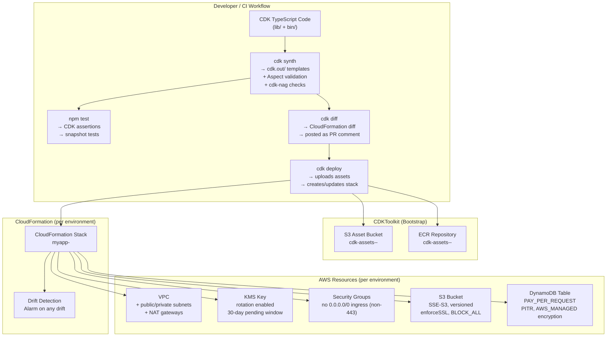

# Design: AWS CDK Infrastructure

## Architecture

### System Context

The CDK Infrastructure project connects five external systems:

- **GitHub** — source of truth for all CDK code; pull requests gate changes; CI runs `cdk synth`, tests, and `cdk diff`; tagged releases trigger prod deployments.
- **AWS CloudFormation** — the deployment engine; receives synthesised templates from CDK; manages resource lifecycle, rollback, and drift detection.
- **AWS CDK Bootstrap** (`CDKToolkit` stack) — created once per account/region; provides the S3 asset bucket (`cdk-assets-<account>-<region>`) and ECR repository for Lambda bundles and Docker images.
- **AWS Cost Explorer** — receives resource tags (`Environment`, `ManagedBy: cdk`, `Repository`, `Version`) for cost attribution per environment.
- **Developer workstations** — run `cdk synth / diff / deploy` locally for iteration; must have `aws-cdk` CLI and valid AWS credentials (SSO or IAM Identity Center recommended).

### Component Design

#### Stack Organisation

```
CDK App (bin/app.ts)
├── DevStack        (account: dev-account-id,     region: us-east-1)
├── StagingStack    (account: staging-account-id, region: us-east-1)
└── ProdStack       (account: prod-account-id,    region: us-east-1)
        │
        ├── NetworkingConstruct    (VPC, subnets, NAT gateways, route tables)
        ├── SecurityConstruct      (KMS keys, security groups, IAM boundary)
        ├── StorageConstruct       (S3 bucket, DynamoDB table)
        └── ComputeConstruct       (ECS cluster or Lambda execution layer)
```

Each stack instantiates the same four constructs with environment-specific `EnvironmentConfig` values. Constructs are composed inside the stack constructor; there are no cross-stack CloudFormation exports (to avoid tight coupling and update ordering issues) — shared values are passed as typed construct outputs.

#### Environment Configuration

```typescript
// lib/config.ts
export type Environment = 'dev' | 'staging' | 'prod';

export interface EnvironmentConfig {
  account:         string;
  region:          string;
  vpcCidr:         string;
  natGateways:     number;           // dev=1, staging=1, prod=3
  tableClass:      dynamodb.TableClass;
  retentionDays:   logs.RetentionDays;
  removalPolicy:   cdk.RemovalPolicy;
  isProd:          boolean;
  domainName:      string;
}

export const CONFIG: Record<Environment, EnvironmentConfig> = {
  dev: {
    account:       '111122223333',
    region:        'us-east-1',
    vpcCidr:       '10.0.0.0/16',
    natGateways:   1,
    tableClass:    dynamodb.TableClass.STANDARD,
    retentionDays: logs.RetentionDays.ONE_WEEK,
    removalPolicy: cdk.RemovalPolicy.DESTROY,
    isProd:        false,
    domainName:    'dev.app.example.com',
  },
  staging: { /* ... natGateways: 1, retentionDays: TWO_WEEKS ... */ },
  prod: {
    account:       '444455556666',
    region:        'us-east-1',
    vpcCidr:       '10.2.0.0/16',
    natGateways:   3,
    tableClass:    dynamodb.TableClass.STANDARD_INFREQUENT_ACCESS,
    retentionDays: logs.RetentionDays.THREE_MONTHS,
    removalPolicy: cdk.RemovalPolicy.RETAIN,
    isProd:        true,
    domainName:    'app.example.com',
  },
};
```

### Architecture Diagram



## Infrastructure

### Construct Implementations

**`lib/constructs/networking-construct.ts`**

```typescript
import * as ec2 from 'aws-cdk-lib/aws-ec2';
import { Construct } from 'constructs';

export interface NetworkingProps {
  cidr:        string;
  natGateways: number;
  maxAzs:      number;
}

export class NetworkingConstruct extends Construct {
  public readonly vpc: ec2.Vpc;

  constructor(scope: Construct, id: string, props: NetworkingProps) {
    super(scope, id);
    this.vpc = new ec2.Vpc(this, 'Vpc', {
      ipAddresses:    ec2.IpAddresses.cidr(props.cidr),
      maxAzs:         props.maxAzs,
      natGateways:    props.natGateways,
      subnetConfiguration: [
        { cidrMask: 24, name: 'Public',   subnetType: ec2.SubnetType.PUBLIC },
        { cidrMask: 24, name: 'Private',  subnetType: ec2.SubnetType.PRIVATE_WITH_EGRESS },
        { cidrMask: 28, name: 'Isolated', subnetType: ec2.SubnetType.PRIVATE_ISOLATED },
      ],
      enableDnsHostnames: true,
      enableDnsSupport:   true,
    });
  }
}
```

**`lib/constructs/security-construct.ts`**

```typescript
import * as kms  from 'aws-cdk-lib/aws-kms';
import * as iam  from 'aws-cdk-lib/aws-iam';
import * as cdk  from 'aws-cdk-lib';

export class SecurityConstruct extends Construct {
  public readonly appKey: kms.Key;

  constructor(scope: Construct, id: string, isProd: boolean) {
    super(scope, id);
    this.appKey = new kms.Key(this, 'AppKey', {
      enableKeyRotation: true,
      pendingWindow:     cdk.Duration.days(30),
      removalPolicy:     isProd
        ? cdk.RemovalPolicy.RETAIN
        : cdk.RemovalPolicy.DESTROY,
      description:       'Application encryption key — managed by CDK',
    });
  }

  grantDecrypt(grantee: iam.IGrantable): iam.Grant {
    return this.appKey.grant(grantee, 'kms:Decrypt', 'kms:GenerateDataKey');
  }
}
```

**`lib/constructs/storage-construct.ts`**

```typescript
import * as s3       from 'aws-cdk-lib/aws-s3';
import * as dynamodb from 'aws-cdk-lib/aws-dynamodb';

export class StorageConstruct extends Construct {
  public readonly bucket: s3.Bucket;
  public readonly table:  dynamodb.Table;

  constructor(scope: Construct, id: string, props: StorageProps) {
    super(scope, id);

    this.bucket = new s3.Bucket(this, 'AppBucket', {
      encryption:        s3.BucketEncryption.S3_MANAGED,
      enforceSSL:        true,
      blockPublicAccess: s3.BlockPublicAccess.BLOCK_ALL,
      versioned:         true,
      removalPolicy:     props.removalPolicy,
      autoDeleteObjects: !props.isProd,
      lifecycleRules: props.isProd ? [{
        noncurrentVersionExpiration: cdk.Duration.days(90),
      }] : [],
    });

    this.table = new dynamodb.Table(this, 'AppTable', {
      partitionKey:       { name: 'PK', type: dynamodb.AttributeType.STRING },
      sortKey:            { name: 'SK', type: dynamodb.AttributeType.STRING },
      billingMode:        dynamodb.BillingMode.PAY_PER_REQUEST,
      pointInTimeRecovery: true,
      encryption:         dynamodb.TableEncryption.AWS_MANAGED,
      removalPolicy:      props.removalPolicy,
    });
  }
}
```

### cdk-nag Integration

`cdk-nag` is applied as a CDK Aspect in `bin/app.ts`:

```typescript
import { AwsSolutionsChecks } from 'cdk-nag';
import { Aspects } from 'aws-cdk-lib';

Aspects.of(app).add(new AwsSolutionsChecks({ verbose: true }));
```

Any suppression requires an explicit reason:

```typescript
NagSuppressions.addResourceSuppressions(bucket, [{
  id:     'AwsSolutions-S1',
  reason: 'Server access logging disabled for dev — cost not justified; re-enable for staging/prod.',
}]);
```

## Files & Interfaces

| File | Purpose |
|------|---------|
| `bin/app.ts` | CDK App entry; reads `environment` context; instantiates `DevStack`, `StagingStack`, `ProdStack` |
| `lib/config.ts` | `EnvironmentConfig` type + `CONFIG` record for all three environments |
| `lib/base-stack.ts` | Abstract `BaseStack extends cdk.Stack`; applies resource tagging (`Environment`, `ManagedBy`, `Repository`, `Version`) in constructor |
| `lib/stacks/dev-stack.ts` | `DevStack extends BaseStack`; composes constructs with `dev` config |
| `lib/stacks/staging-stack.ts` | `StagingStack extends BaseStack` |
| `lib/stacks/prod-stack.ts` | `ProdStack extends BaseStack` |
| `lib/constructs/networking-construct.ts` | VPC, subnets, NAT gateways |
| `lib/constructs/security-construct.ts` | KMS key, security groups, `grantDecrypt` helper |
| `lib/constructs/storage-construct.ts` | S3 bucket + DynamoDB table with shared security defaults |
| `lib/constructs/compute-construct.ts` | ECS cluster (or Lambda execution environment layer) |
| `lib/aspects/no-wildcard-iam.ts` | CDK Aspect that fails synth if any IAM policy has `Action: "*"` or `Resource: "*"` on sensitive services |
| `test/stacks/dev-stack.test.ts` | CDK assertions + snapshot for `DevStack` |
| `test/stacks/prod-stack.test.ts` | CDK assertions for prod-specific settings (RETAIN, encryption, 3 NATs) |
| `test/constructs/networking.test.ts` | Isolated construct test: VPC CIDR, subnet count, NAT gateway count |
| `test/constructs/storage.test.ts` | S3 encryption, versioning, DynamoDB PITR, billing mode |
| `test/constructs/security.test.ts` | KMS rotation, pending window, grant assertions |
| `cdk.json` | App command, feature flags, context keys (account IDs, regions per environment) |
| `tsconfig.json` | `"strict": true`, `"noImplicitAny": true`, `"target": "ES2020"` |

## IAM & Security

### Aspect-Based Policy Enforcement

`lib/aspects/no-wildcard-iam.ts` visits every `iam.CfnPolicy` and `iam.CfnRole` in the construct tree during `cdk synth`. It fails with a descriptive error if:

- Any IAM statement contains `Action: "*"` or `Action: ["*"]`
- Any DynamoDB, S3, KMS, or SSM action is paired with `Resource: "*"`
- Any role has an `AssumedRolePolicyDocument` with `Principal: { AWS: "*" }`

```typescript
// lib/aspects/no-wildcard-iam.ts (abbreviated)
export class NoWildcardIam implements IAspect {
  visit(node: IConstruct): void {
    if (!(node instanceof iam.CfnPolicy)) return;
    const stmts = (node.policyDocument as any).Statement ?? [];
    for (const s of stmts) {
      if ([s.Action].flat().some(a => a === '*'))
        throw new Error(`[NoWildcardIam] ${node.logicalId} has Action:* — use specific actions`);
    }
  }
}
```

### Encryption Defaults

| Resource | Encryption | Enforced by |
|----------|-----------|------------|
| S3 bucket | SSE-S3 (`S3_MANAGED`) | `StorageConstruct` constructor |
| DynamoDB table | AWS-managed KMS (`AWS_MANAGED`) | `StorageConstruct` constructor |
| CloudWatch Logs | AWS-managed KMS | `SecurityConstruct.grantDecrypt` applied to log group |
| ECS secrets | AWS Secrets Manager with `appKey` | `ComputeConstruct` injects via `ecs.Secret.fromSecretsManager` |
| Inter-service TLS | Enforced by `enforceSSL: true` on S3; ALB listener on port 443 only | `StorageConstruct`, `ComputeConstruct` |

## Rollback Strategy

### CloudFormation Native Rollback

CDK produces standard CloudFormation templates; all rollback is handled by CloudFormation automatically:

- If a stack update fails at any resource, CloudFormation reverts all resources in the update to their previous state.
- Stateful resources (DynamoDB, S3) in prod have `removalPolicy: RETAIN`, so even a `cdk destroy` leaves data intact.
- Resource logical IDs are CDK-managed (not overridden with `physicalName`), allowing CloudFormation to replace resources safely by creating the new resource before deleting the old one.

### Manual Rollback (Previous Git Tag)

If a deployed template must be rolled back to a prior version:

```bash
git checkout v<previous-tag>
cdk synth -c environment=prod
cdk diff ProdStack               # verify only the intended resources change
cdk deploy ProdStack --require-approval broadening
```

The diff output should match the changes introduced in the bad tag, now reversed.

## Error Handling

| Failure | Detection | Resolution |
|---------|-----------|-----------|
| `cdk synth` Aspect violation | Non-zero exit; descriptive error naming the construct and policy | Fix the construct; re-run synth |
| `cdk-nag` check failure | Non-zero exit; NagError with rule ID and resource path | Fix or add justified suppression with `reason` |
| `cdk deploy` CloudFormation update failure | Stack status `UPDATE_ROLLBACK_COMPLETE` in console | Investigate CloudFormation Events; fix and redeploy |
| CloudFormation drift detected | `CFDriftAlarm` CloudWatch Alarm fires | Run `cdk deploy` to reconcile; investigate out-of-band changes |
| TypeScript compile error | `tsc --noEmit` exits non-zero in CI | Fix type error; CDK will not even synth |

## Testing Strategy

### CDK Assertion Tests

```typescript
// test/constructs/storage.test.ts
import { Template } from 'aws-cdk-lib/assertions';
import * as cdk     from 'aws-cdk-lib';
import { StorageConstruct } from '../../lib/constructs/storage-construct';

test('S3 bucket enforces SSL and blocks public access', () => {
  const app   = new cdk.App();
  const stack = new cdk.Stack(app, 'Test');
  new StorageConstruct(stack, 'Storage', {
    removalPolicy: cdk.RemovalPolicy.DESTROY,
    isProd:        false,
  });
  const tpl = Template.fromStack(stack);

  tpl.hasResourceProperties('AWS::S3::BucketPolicy', {
    PolicyDocument: {
      Statement: [{ Condition: { Bool: { 'aws:SecureTransport': 'false' } }, Effect: 'Deny' }],
    },
  });
  tpl.hasResourceProperties('AWS::S3::Bucket', {
    PublicAccessBlockConfiguration: {
      BlockPublicAcls:       true,
      BlockPublicPolicy:     true,
      IgnorePublicAcls:      true,
      RestrictPublicBuckets: true,
    },
    VersioningConfiguration: { Status: 'Enabled' },
  });
});
```

### Snapshot Tests

```typescript
// test/stacks/dev-stack.test.ts
import { Template } from 'aws-cdk-lib/assertions';
import { buildDevStack } from '../helpers';

test('DevStack snapshot', () => {
  const { stack } = buildDevStack();
  expect(Template.fromStack(stack).toJSON()).toMatchSnapshot();
});
```

Snapshots are committed to the repository. The `--update-snapshots` flag is required to accept intentional template changes, creating a paper trail in the PR diff.

| Test type | Tool | Coverage | Run trigger |
|-----------|------|----------|------------|
| TypeScript compile | `tsc --noEmit` | All `.ts` files | Every CI run |
| CDK unit assertions | `vitest` + `aws-cdk-lib/assertions` | Resource properties, IAM policy statements, outputs | Every PR |
| CDK snapshot | `vitest` + `.toMatchSnapshot()` | Full template drift detection | Every PR |
| Aspect validation | `cdk synth` (in-process) | `NoWildcardIam`, `NoDynamoWildcard` | Every CI run |
| `cdk-nag` | `cdk synth` with `AwsSolutionsChecks` Aspect | Well-Architected security rules | Every CI run |
| Integration | `cdk deploy DevStack` + smoke assertions | Real AWS resource creation and connectivity | On merge to `main` |
