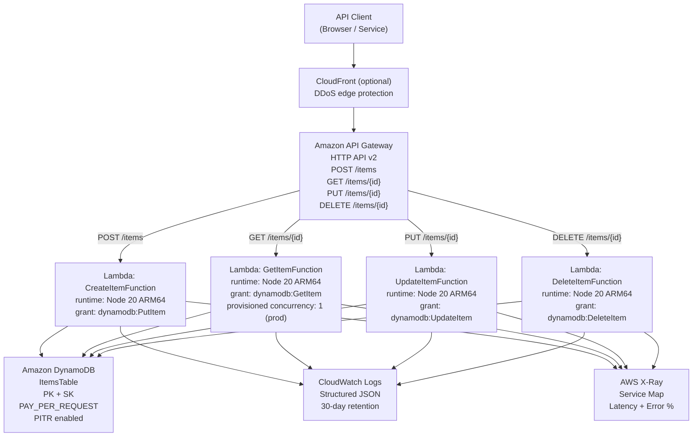

# Design: AWS Serverless API (API Gateway + Lambda + DynamoDB)

## Architecture

### System Context

The serverless API connects four external actors:

- **API clients** — browsers, mobile apps, or service-to-service callers that send HTTPS requests to the API Gateway endpoint.
- **AWS API Gateway (HTTP API v2)** — the public entry point; routes each HTTP method/path combination to the corresponding Lambda integration using payload format version 2.0.
- **AWS Lambda** — four independent functions, one per CRUD route; each executes in an isolated environment and interacts with DynamoDB via the AWS SDK v3.
- **Amazon DynamoDB** — single-table design; on-demand billing; stores all `Item` records; accessed by Lambda functions using scoped IAM permissions.
- **AWS X-Ray + CloudWatch Logs** — receive traces and structured JSON logs from every Lambda invocation; visualised in the X-Ray service map and CloudWatch Logs Insights.

### Component Design

#### AWS Resource Map

| Resource | CDK Construct | Purpose |
|----------|--------------|---------|
| `ItemsTable` | `dynamodb.Table` (L2) | Single DynamoDB table; PK=`PK` (STRING), SK=`SK` (STRING); PAY\_PER\_REQUEST |
| `CreateItemFunction` | `NodejsFunction` (L2) | Handles `POST /items`; granted `dynamodb:PutItem` only |
| `GetItemFunction` | `NodejsFunction` (L2) | Handles `GET /items/{id}`; granted `dynamodb:GetItem` only |
| `UpdateItemFunction` | `NodejsFunction` (L2) | Handles `PUT /items/{id}`; granted `dynamodb:UpdateItem` only |
| `DeleteItemFunction` | `NodejsFunction` (L2) | Handles `DELETE /items/{id}`; granted `dynamodb:DeleteItem` only |
| `ServerlessApi` | `apigatewayv2.HttpApi` (L2) | HTTP API; CORS preflight configured; routes wired to Lambda integrations |
| `GetItemAlias` | `lambda.Alias` | Points to latest `GetItemFunction` version; enables provisioned concurrency in prod |
| `InitDurationAlarm` | `cloudwatch.Alarm` | Fires when p99 cold-start init exceeds 800 ms over 24 h |
| `OpsAlertsTopic` | `sns.Topic` | Receives CloudWatch Alarm notifications for ops team |

#### Route-to-Function Mapping

| HTTP Method | Path | Lambda Function | IAM Action |
|-------------|------|-----------------|------------|
| `POST` | `/items` | `CreateItemFunction` | `dynamodb:PutItem` |
| `GET` | `/items/{id}` | `GetItemFunction` | `dynamodb:GetItem` |
| `PUT` | `/items/{id}` | `UpdateItemFunction` | `dynamodb:UpdateItem` |
| `DELETE` | `/items/{id}` | `DeleteItemFunction` | `dynamodb:DeleteItem` |

### Architecture Diagram



## Infrastructure

### CDK Stack Structure

```
lib/
├── serverless-api-stack.ts      # Main CDK stack — wires all constructs
├── constructs/
│   ├── items-table.ts           # DynamoDB TableConstruct (L3 wrapper)
│   ├── crud-api.ts              # HttpApi + routes + CORS
│   └── lambda-function.ts       # Reusable NodejsFunction factory with defaults
bin/
└── app.ts                       # CDK App entry point; reads -c environment=<env>
lambda/
├── handlers/
│   ├── createItem.ts
│   ├── getItem.ts
│   ├── updateItem.ts
│   └── deleteItem.ts
├── shared/
│   ├── ddb-client.ts            # Singleton DynamoDBDocumentClient
│   ├── logger.ts                # aws-lambda-powertools/logger setup
│   └── response.ts              # Typed API Gateway response helpers
test/
├── serverless-api-stack.test.ts # CDK assertions + snapshot tests
└── handlers/
    ├── createItem.test.ts
    └── getItem.test.ts
```

### CDK Construct Snippets

**`lib/constructs/items-table.ts`** — DynamoDB table with security defaults:

```typescript
import * as dynamodb from 'aws-cdk-lib/aws-dynamodb';
import * as cdk from 'aws-cdk-lib';
import { Construct } from 'constructs';

export class ItemsTableConstruct extends Construct {
  public readonly table: dynamodb.Table;

  constructor(scope: Construct, id: string, isProd: boolean) {
    super(scope, id);
    this.table = new dynamodb.Table(this, 'ItemsTable', {
      partitionKey: { name: 'PK', type: dynamodb.AttributeType.STRING },
      sortKey:      { name: 'SK', type: dynamodb.AttributeType.STRING },
      billingMode:  dynamodb.BillingMode.PAY_PER_REQUEST,
      pointInTimeRecovery: true,
      encryption:   dynamodb.TableEncryption.AWS_MANAGED,
      removalPolicy: isProd
        ? cdk.RemovalPolicy.RETAIN
        : cdk.RemovalPolicy.DESTROY,
    });
  }
}
```

**`lib/constructs/lambda-function.ts`** — shared Lambda defaults:

```typescript
import * as lambda from 'aws-cdk-lib/aws-lambda';
import { NodejsFunction, NodejsFunctionProps } from 'aws-cdk-lib/aws-lambda-nodejs';
import * as logs from 'aws-cdk-lib/aws-logs';
import * as cdk from 'aws-cdk-lib';
import { Construct } from 'constructs';

export function createHandler(
  scope: Construct,
  id: string,
  entry: string,
  env: Record<string, string>,
  isProd: boolean,
): NodejsFunction {
  return new NodejsFunction(scope, id, {
    entry,
    runtime:      lambda.Runtime.NODEJS_20_X,
    architecture: lambda.Architecture.ARM_64,
    tracing:      lambda.Tracing.ACTIVE,
    environment:  env,
    bundling: {
      minify:          true,
      sourceMap:       true,
      externalModules: ['@aws-sdk/client-dynamodb', '@aws-sdk/lib-dynamodb'],
    },
    logRetention: logs.RetentionDays.THIRTY_DAYS,
    currentVersionOptions: {
      removalPolicy: isProd
        ? cdk.RemovalPolicy.RETAIN
        : cdk.RemovalPolicy.DESTROY,
    },
  });
}
```

**`lib/serverless-api-stack.ts`** — IAM grants scoped to exact actions:

```typescript
// Least-privilege grants — each function receives exactly one DynamoDB action
table.grantReadData(getItemFn);          // resolves to dynamodb:GetItem + GetItem only
table.grant(createItemFn, 'dynamodb:PutItem');
table.grant(updateItemFn, 'dynamodb:UpdateItem');
table.grant(deleteItemFn, 'dynamodb:DeleteItem');

// Provisioned concurrency for GetItemFunction in prod
if (isProd) {
  const version = getItemFn.currentVersion;
  const alias = new lambda.Alias(this, 'GetItemProdAlias', {
    aliasName:                    'prod',
    version,
    provisionedConcurrentExecutions: 1,
  });
  cdk.Tags.of(alias).add('Environment',      'prod');
  cdk.Tags.of(alias).add('BilledConcurrency','provisioned');
}
```

## Files & Interfaces

| File | Purpose |
|------|---------|
| `bin/app.ts` | CDK App entry; reads `environment` context key; instantiates `ServerlessApiStack` |
| `lib/serverless-api-stack.ts` | Top-level stack; composes `ItemsTableConstruct`, `CrudApiConstruct`, four handlers |
| `lib/constructs/items-table.ts` | DynamoDB table construct with encryption, PITR, removal policy |
| `lib/constructs/crud-api.ts` | `HttpApi` + CORS + four `HttpLambdaIntegration` routes; exports `CfnOutput ApiEndpoint` |
| `lib/constructs/lambda-function.ts` | Shared `NodejsFunction` factory (runtime, arch, tracing, bundling, log retention) |
| `lambda/handlers/createItem.ts` | `POST /items` handler; validates body; calls `PutCommand`; returns 201 |
| `lambda/handlers/getItem.ts` | `GET /items/{id}` handler; calls `GetCommand`; returns 200 or 404 |
| `lambda/handlers/updateItem.ts` | `PUT /items/{id}` handler; calls `UpdateCommand`; returns 200 or 404 |
| `lambda/handlers/deleteItem.ts` | `DELETE /items/{id}` handler; calls `DeleteCommand`; returns 204 |
| `lambda/shared/ddb-client.ts` | Singleton `DynamoDBDocumentClient` initialised outside handler for reuse across warm invocations |
| `lambda/shared/logger.ts` | `aws-lambda-powertools/logger` instance; injects `service`, `environment` from env vars |
| `lambda/shared/response.ts` | `ok(body)`, `notFound(id)`, `badRequest(errors)`, `internalError()` helper functions |
| `test/serverless-api-stack.test.ts` | CDK `Template.fromStack()` assertions; snapshot test |
| `.github/workflows/deploy.yml` | CI/CD pipeline (see the CI/CD Pipeline spec) |
| `cdk.json` | CDK app config; context keys for `dev`, `staging`, `prod` environments |

### Lambda Handler Interface

Each handler receives the standard API Gateway v2 event (`APIGatewayProxyEventV2`) and returns `APIGatewayProxyResultV2`:

```typescript
// lambda/handlers/getItem.ts
import { APIGatewayProxyEventV2, APIGatewayProxyResultV2 } from 'aws-lambda';
import { GetCommand } from '@aws-sdk/lib-dynamodb';
import { ddbClient } from '../shared/ddb-client';
import { logger }    from '../shared/logger';
import { ok, notFound } from '../shared/response';

export const handler = async (
  event: APIGatewayProxyEventV2,
): Promise<APIGatewayProxyResultV2> => {
  const id = event.pathParameters?.id ?? '';
  logger.info('get_item', { itemId: id });

  const result = await ddbClient.send(new GetCommand({
    TableName: process.env.TABLE_NAME!,
    Key: { PK: `ITEM#${id}`, SK: `ITEM#${id}` },
  }));

  if (!result.Item) return notFound(id);
  return ok(result.Item);
};
```

## IAM & Security

### Execution Role Design

CDK creates one IAM role per Lambda function. The `table.grant(fn, action)` method generates an inline policy statement with:

- `Effect: Allow`
- `Action: [<specific action>]`
- `Resource: <table.tableArn>` — exact ARN, not a wildcard

No function receives `AmazonDynamoDBFullAccess`, `dynamodb:*`, or any `Resource: "*"` DynamoDB statement.

A CDK `Aspects` visitor validates this at synth time:

```typescript
// lib/aspects/no-wildcard-dynamo.ts
import * as iam from 'aws-cdk-lib/aws-iam';
import { Aspects, IAspect } from 'aws-cdk-lib';
import { IConstruct } from 'constructs';

export class NoDynamoWildcard implements IAspect {
  visit(node: IConstruct): void {
    if (node instanceof iam.CfnPolicy) {
      const doc = node.policyDocument as any;
      for (const stmt of doc.Statement ?? []) {
        const actions: string[] = [stmt.Action].flat();
        const resources: string[] = [stmt.Resource].flat();
        if (actions.some(a => a.startsWith('dynamodb:')) && resources.includes('*')) {
          throw new Error(
            `[NoDynamoWildcard] Policy ${node.logicalId} grants DynamoDB on Resource:*`
          );
        }
      }
    }
  }
}
// In stack: Aspects.of(this).add(new NoDynamoWildcard());
```

### Secret and Configuration Handling

- `TABLE_NAME` is passed as a Lambda environment variable using `table.tableName` (resolved by CloudFormation at deploy time).
- No secrets are hardcoded; if the API adds an authoriser later, the JWT signing key will be read from AWS Secrets Manager at initialisation using `@aws-sdk/client-secrets-manager` with caching.

## Rollback Strategy

| Failure scenario | Detection | Recovery |
|-----------------|-----------|----------|
| Lambda deployment fails | CloudFormation rollback (`UpdateRollbackComplete`) | CDK re-deploys previous version automatically |
| DynamoDB table update fails | CloudFormation rolls back IAM + Lambda changes; table retained | Investigate and re-run `cdk deploy` |
| Handler runtime error (5xx) | CloudWatch Alarm `FunctionErrorRate > 1 %` for 1 min | Lambda automatically retries on async invocations; synchronous callers receive 502 and may retry |
| Provisioned concurrency update fails | CloudFormation rolls back alias update | Previous alias version remains active |

`GetItemFunction` publishes a new Lambda `Version` on every deployment. The `prod` alias is updated to point to the new version atomically by CloudFormation. If the deployment fails, CloudFormation rolls the alias pointer back to the previous version — zero additional scripting required.

## Observability

### Structured Log Schema

Every handler emits one log line per invocation at `INFO` level (success) or `ERROR` level (failure):

```json
{
  "level": "INFO",
  "service": "serverless-api",
  "functionName": "GetItemFunction",
  "awsRequestId": "abc-123",
  "correlationId": "Root=1-abc;Parent=def;Sampled=1",
  "event": "get_item",
  "itemId": "a1b2c3",
  "durationMs": 12
}
```

### CloudWatch Alarms

| Alarm | Metric | Threshold | Action |
|-------|--------|-----------|--------|
| `FunctionErrorRateAlarm` | `AWS/Lambda Errors / Invocations` per function | > 1 % for 1 min | SNS → `ops-alerts` topic |
| `InitDurationAlarm` | Logs Insights: `Init Duration` p99 | > 800 ms over 24 h | SNS → `ops-alerts` topic |
| `DDBThrottleAlarm` | `AWS/DynamoDB SystemErrors` on `ItemsTable` | > 0 for 5 min | SNS → `ops-alerts` topic |

### X-Ray

`lambda.Tracing.ACTIVE` enables automatic segment capture for the Lambda initialisation and invocation phases. DynamoDB SDK calls are automatically traced by the AWS SDK v3 X-Ray middleware. The X-Ray service map in the AWS Console shows the full request path from API Gateway through each Lambda to DynamoDB with latency percentiles.

## Error Handling

| Scenario | Lambda behaviour | HTTP response |
|----------|-----------------|---------------|
| Item not found (`GetItem` returns no `Item`) | Log `WARN`; return structured error | 404 `{ "error": "Item not found", "id": "<id>" }` |
| Invalid request body (missing required fields) | Validate with `zod`; log `WARN` | 400 `{ "error": "Validation failed", "details": [...] }` |
| DynamoDB `ConditionalCheckFailedException` | Log `WARN`; do not retry | 409 `{ "error": "Conflict", "message": "..." }` |
| DynamoDB throttle (`ProvisionedThroughputExceededException`) | SDK auto-retry (3 attempts, exponential backoff) | 503 if all retries exhausted |
| Unexpected error | Log `ERROR` with stack trace | 500 `{ "error": "Internal server error" }` — no stack trace exposed to caller |

All error responses include the header `X-Request-Id: <awsRequestId>` for client-side correlation.

## Testing Strategy

| Layer | Tool | What is tested | When |
|-------|------|---------------|------|
| Handler unit tests | `vitest` + `@aws-sdk/client-dynamodb` mock | Business logic, validation, error branches | On every PR push |
| CDK unit tests | `aws-cdk-lib/assertions` `Template.fromStack()` | Resource counts, IAM policy statements, environment variables, CORS config | On every PR push |
| CDK snapshot tests | `Template.toJSON()` + `vitest` snapshot | Full CloudFormation template drift detection | On every PR push |
| Integration tests | AWS SDK calls against deployed `dev` stack | End-to-end CRUD operations via real API Gateway endpoint | On merge to `main` (dev deploy) |
| Load tests | `artillery run load-test.yml` | p99 latency < 200 ms at 200 RPS; Lambda concurrency auto-scale | Weekly scheduled run against `staging` |

**CDK assertion example** (`test/serverless-api-stack.test.ts`):

```typescript
import { Template } from 'aws-cdk-lib/assertions';
import * as cdk from 'aws-cdk-lib';
import { ServerlessApiStack } from '../lib/serverless-api-stack';

test('GetItemFunction has only dynamodb:GetItem on table ARN', () => {
  const app   = new cdk.App({ context: { environment: 'dev' } });
  const stack = new ServerlessApiStack(app, 'TestStack');
  const tpl   = Template.fromStack(stack);

  tpl.hasResourceProperties('AWS::IAM::Policy', {
    PolicyDocument: {
      Statement: [
        {
          Action:   'dynamodb:GetItem',
          Effect:   'Allow',
          Resource: { 'Fn::GetAtt': ['ItemsTable', 'Arn'] },
        },
      ],
    },
  });
});
```
