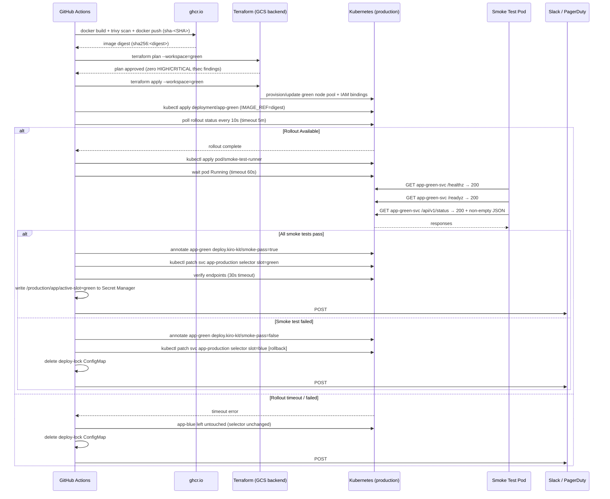

# Design: Blue-Green Deployment

## Architecture

### System Context

The Blue-Green Deployment system connects four external systems:

- **GitHub** — source of truth for application code and workflow definitions (`.github/workflows/deploy.yml`). Emits `push` events that trigger the pipeline and receives Deployment status events written back by the pipeline.
- **Google Cloud Platform (GKE + GCS + Secret Manager)** — hosts the `production` GKE cluster, the `myapp-tf-state` GCS bucket for Terraform remote state, and Secret Manager secrets including `/production/app/active-slot`.
- **GitHub Container Registry (`ghcr.io`)** — stores versioned, immutable container images tagged `sha-<SHA>` and `latest`. The `build` job pushes; the `deploy-green` job pulls.
- **Observability stack** — Prometheus (in-cluster) scrapes both slots; Grafana dashboards display per-slot metrics; PagerDuty receives P1 pages; Slack `#deployments` receives P2/P3 notifications via incoming webhook.

### Component Design

#### CI Pipeline Stages

The pipeline is a single GitHub Actions workflow (`.github/workflows/deploy.yml`) with six jobs linked by `needs` dependencies:

| Job | Runner | Responsibility |
|-----|--------|----------------|
| `build` | `ubuntu-22.04` | Multi-stage `docker build`, Trivy CVE scan (HIGH/CRITICAL blocks push), push to `ghcr.io`, output digest-pinned `image-ref` |
| `plan-infra` | `ubuntu-22.04` | `terraform plan` in `green` workspace, `tfsec` + `checkov` static analysis, post plan summary as sticky PR comment |
| `deploy-green` | `ubuntu-22.04` | Acquire `deploy-lock` ConfigMap, `terraform apply`, `envsubst` image ref into manifest, `kubectl apply`, poll rollout status (5-min timeout) |
| `smoke-test` | `ubuntu-22.04` | Apply smoke-test pod into `production` ns, execute `runner.sh` against `app-green-svc`, emit structured JSON logs, annotate Deployment |
| `switch-traffic` | `ubuntu-22.04` | Patch `app-production` Service selector to `slot: green`, verify endpoints (30-s timeout), write active slot to Secret Manager |
| `rollback` | `ubuntu-22.04` | Conditional (`if: failure()`): patch selector back to `slot: blue`, annotate `app-green`, delete `deploy-lock`, notify Slack + PagerDuty |

#### Kubernetes Resources

| Resource | Kind | Namespace | Purpose |
|----------|------|-----------|---------|
| `app-blue` | Deployment | `production` | Active slot — previous stable release; never touched by the deploy pipeline |
| `app-green` | Deployment | `production` | Inactive slot — receives the new image; pods labelled `slot: green` |
| `app-production` | Service | `production` | Single external entry point; `slot` label selector is toggled by the pipeline |
| `app-green-svc` | Service (ClusterIP) | `production` | Internal-only Service targeting `slot: green`; used exclusively by the smoke-test pod |
| `app-ingress` | Ingress | `production` | Routes `app.example.com` → `app-production`; TLS terminated at `nginx-ingress` |
| `ci-deployer` | ServiceAccount | `production` | RBAC identity assumed by GitHub Actions inside the cluster |
| `ci-deployer-role` | Role | `production` | Minimum-privilege verb/resource list for CI operations |
| `ci-deployer-rb` | RoleBinding | `production` | Binds `ci-deployer` SA to `ci-deployer-role` within `production` namespace |
| `deploy-lock` | ConfigMap | `production` | Distributed lock preventing concurrent deployments; holds `run-id` and `started-at` |

#### Traffic Routing

```
Internet
   │
   ▼
[nginx-ingress-controller]          LoadBalancer Service, TLS termination
   │
   ▼
[app-ingress]                       Ingress — host: app.example.com → app-production:80
   │
   ▼
[app-production Service]            selector: slot: <active>
   │
   ├──▶ [app-blue pods]  slot=blue   ← receives 100% traffic before switch
   └──▶ [app-green pods] slot=green  ← receives 100% traffic after switch

[app-green-svc Service]             selector: slot: green (ClusterIP, smoke tests only)
   └──▶ [app-green pods] slot=green
```

### System Interaction — Pipeline Sequence



## Infrastructure

### Terraform Resources

All Terraform code lives under `infrastructure/` with the following layout:

```
infrastructure/
├── modules/
│   ├── gke-nodepool/           # google_container_node_pool for blue and green
│   │   ├── main.tf
│   │   ├── variables.tf        # var.slot ("blue"|"green"), var.node_count, var.machine_type
│   │   └── outputs.tf
│   └── k8s-rbac/               # ci-deployer ServiceAccount, Role, RoleBinding
│       ├── main.tf
│       └── variables.tf
├── environments/
│   └── production/
│       ├── backend.tf          # GCS remote state: gs://myapp-tf-state/production
│       ├── main.tf             # Calls modules/gke-nodepool and modules/k8s-rbac
│       ├── variables.tf
│       └── terraform.tfvars
└── workspaces/
    ├── blue.tfvars             # slot = "blue"
    └── green.tfvars            # slot = "green"
```

Key Terraform resources declared in `infrastructure/environments/production/main.tf`:

| Resource | Terraform Type | Description |
|----------|---------------|-------------|
| `google_container_node_pool.blue` | `google_container_node_pool` | 3-node `e2-standard-4` pool, labelled `slot=blue` |
| `google_container_node_pool.green` | `google_container_node_pool` | 3-node `e2-standard-4` pool, labelled `slot=green`; managed in `green` workspace |
| `google_service_account.tf_deployer` | `google_service_account` | CI Terraform identity; no `roles/editor` |
| `google_project_iam_member.tf_deployer_container_admin` | `google_project_iam_member` | `roles/container.nodePoolAdmin` on the project |
| `kubernetes_service_account.ci_deployer` | `kubernetes_service_account` | K8s identity for GitHub Actions runner |
| `kubernetes_role.ci_deployer` | `kubernetes_role` | Scoped RBAC Role (see Security section) |
| `kubernetes_role_binding.ci_deployer` | `kubernetes_role_binding` | Binds SA to Role in `production` namespace only |

Remote state backend (`infrastructure/environments/production/backend.tf`):

```hcl
terraform {
  backend "gcs" {
    bucket = "myapp-tf-state"
    prefix = "production"
  }
}
```

### Kubernetes Manifests Overview

Manifests live under `k8s/production/`:

```
k8s/production/
├── namespace.yaml                   # production namespace with labels
├── blue/
│   └── deployment.yaml              # app-blue Deployment; image pinned to last known-good SHA
├── green/
│   └── deployment.yaml              # app-green Deployment; ${IMAGE_REF} substituted by CI
├── service.yaml                     # app-production Service; selector toggled by pipeline
├── service-green-internal.yaml      # app-green-svc ClusterIP for smoke tests
├── ingress.yaml                     # app-ingress → app-production:80
└── monitoring/
    ├── podmonitor.yaml              # PodMonitor for blue + green slots
    └── alerts.yaml                  # PrometheusRule with P1/P2/P3 alert rules
k8s/smoke-tests/
├── pod.yaml                         # curl-based test pod (restartPolicy: Never)
└── runner.sh                        # Bash HTTP assertion suite
```

`k8s/production/green/deployment.yaml` (abbreviated):

```yaml
apiVersion: apps/v1
kind: Deployment
metadata:
  name: app-green
  namespace: production
  annotations:
    deploy.kiro-kit/slot: green
spec:
  replicas: 3
  selector:
    matchLabels:
      app: myapp
      slot: green
  template:
    metadata:
      labels:
        app: myapp
        slot: green
    spec:
      serviceAccountName: app-workload
      containers:
        - name: app
          image: ${IMAGE_REF}          # substituted by CI via: envsubst < deployment.yaml | kubectl apply -f -
          imagePullPolicy: Always
          ports:
            - containerPort: 8080
          readinessProbe:
            httpGet:
              path: /readyz
              port: 8080
            initialDelaySeconds: 10
            periodSeconds: 5
            failureThreshold: 3
          livenessProbe:
            httpGet:
              path: /healthz
              port: 8080
            initialDelaySeconds: 15
            periodSeconds: 10
            failureThreshold: 3
```

`k8s/production/service.yaml` (abbreviated):

```yaml
apiVersion: v1
kind: Service
metadata:
  name: app-production
  namespace: production
spec:
  selector:
    app: myapp
    slot: blue          # toggled to "green" by switch-traffic job; reverted by rollback job
  ports:
    - port: 80
      targetPort: 8080
  type: ClusterIP
```

## Pipeline Design

### Stage Overview

| # | Stage | Job Name | Needs | Success Condition | On Failure |
|---|-------|----------|-------|-------------------|------------|
| 1 | Build & Scan | `build` | — | Image pushed; digest output set | Halt; upload Trivy SARIF artifact |
| 2 | IaC Plan | `plan-infra` | `build` | Zero tfsec/checkov HIGH/CRITICAL | Block `deploy-green`; post plan diff as PR comment |
| 3 | Deploy Green | `deploy-green` | `plan-infra` | `app-green` rollout `Available` | Trigger `rollback`; blue untouched |
| 4 | Smoke Test | `smoke-test` | `deploy-green` | All HTTP assertions 200 OK | Trigger `rollback`; Service selector unchanged |
| 5 | Switch Traffic | `switch-traffic` | `smoke-test` | Green pods in `app-production` endpoints | Trigger `rollback`; revert selector to blue |
| 6 | Rollback | `rollback` | `deploy-green`, `smoke-test`, `switch-traffic` | Selector verified back to blue | Page on-call; open P0 GitHub issue |

### GitHub Actions Workflow Skeleton (`.github/workflows/deploy.yml`)

```yaml
name: Blue-Green Deploy
on:
  push:
    branches: [main]

concurrency:
  group: deploy-production
  cancel-in-progress: false

permissions:
  contents: read
  packages: write
  id-token: write
  deployments: write

env:
  IMAGE_NAME: ghcr.io/${{ github.repository }}
  CLUSTER_NAME: production-gke
  CLUSTER_LOCATION: us-central1
  NAMESPACE: production

jobs:
  build:
    runs-on: ubuntu-22.04
    outputs:
      image-ref: ${{ steps.push.outputs.image-ref }}
    steps:
      - uses: actions/checkout@v4
      - name: Build image
        run: docker build -t $IMAGE_NAME:sha-${{ github.sha }} .
      - name: Trivy CVE scan
        uses: aquasecurity/trivy-action@0.24.0
        with:
          image-ref: $IMAGE_NAME:sha-${{ github.sha }}
          exit-code: '1'
          severity: HIGH,CRITICAL
          output: trivy-results.sarif
      - name: Push image
        id: push
        run: |
          echo "${{ secrets.GITHUB_TOKEN }}" | docker login ghcr.io -u ${{ github.actor }} --password-stdin
          docker push $IMAGE_NAME:sha-${{ github.sha }}
          DIGEST=$(docker inspect --format='{{index .RepoDigests 0}}' $IMAGE_NAME:sha-${{ github.sha }})
          echo "image-ref=$DIGEST" >> $GITHUB_OUTPUT

  plan-infra:
    needs: [build]
    runs-on: ubuntu-22.04
    steps:
      - uses: google-github-actions/auth@v2
        with:
          workload_identity_provider: ${{ secrets.WIF_PROVIDER }}
          service_account: ${{ secrets.TF_DEPLOYER_SA }}
      - run: |
          terraform -chdir=infrastructure/environments/production init
          terraform -chdir=infrastructure/environments/production workspace select green
          terraform -chdir=infrastructure/environments/production plan -var-file=../../workspaces/green.tfvars -out=tfplan
      - run: tfsec infrastructure/ --minimum-severity HIGH
      - run: checkov -d infrastructure/ --compact --quiet

  deploy-green:
    needs: [plan-infra]
    runs-on: ubuntu-22.04
    steps:
      - uses: google-github-actions/auth@v2
        with:
          workload_identity_provider: ${{ secrets.WIF_PROVIDER }}
          service_account: ${{ secrets.TF_DEPLOYER_SA }}
      - uses: google-github-actions/get-gke-credentials@v2
        with:
          cluster_name: ${{ env.CLUSTER_NAME }}
          location: ${{ env.CLUSTER_LOCATION }}
      - name: Acquire deploy lock
        run: |
          kubectl create configmap deploy-lock \
            --from-literal=run-id=${{ github.run_id }} \
            --from-literal=started-at=$(date -u +%Y-%m-%dT%H:%M:%SZ) \
            -n ${{ env.NAMESPACE }}
      - name: Terraform apply (green workspace)
        run: terraform -chdir=infrastructure/environments/production apply tfplan
      - name: Deploy app-green
        env:
          IMAGE_REF: ${{ needs.build.outputs.image-ref }}
        run: |
          envsubst < k8s/production/green/deployment.yaml | kubectl apply -f - -n ${{ env.NAMESPACE }}
          kubectl rollout status deployment/app-green -n ${{ env.NAMESPACE }} --timeout=5m

  smoke-test:
    needs: [deploy-green]
    runs-on: ubuntu-22.04
    steps:
      - uses: google-github-actions/get-gke-credentials@v2
        with:
          cluster_name: ${{ env.CLUSTER_NAME }}
          location: ${{ env.CLUSTER_LOCATION }}
      - name: Run smoke tests
        run: |
          kubectl apply -f k8s/smoke-tests/pod.yaml -n ${{ env.NAMESPACE }}
          kubectl wait pod/smoke-test-runner -n ${{ env.NAMESPACE }} --for=condition=Ready --timeout=60s
          kubectl exec -n ${{ env.NAMESPACE }} smoke-test-runner -- /smoke-tests/runner.sh

  switch-traffic:
    needs: [smoke-test]
    runs-on: ubuntu-22.04
    steps:
      - uses: google-github-actions/get-gke-credentials@v2
        with:
          cluster_name: ${{ env.CLUSTER_NAME }}
          location: ${{ env.CLUSTER_LOCATION }}
      - name: Switch Service selector to green
        run: |
          kubectl patch service app-production -n ${{ env.NAMESPACE }} \
            -p '{"spec":{"selector":{"slot":"green"}}}'
      - name: Verify green endpoints
        run: |
          for i in $(seq 1 6); do
            READY=$(kubectl get endpoints app-production -n ${{ env.NAMESPACE }} \
              -o jsonpath='{.subsets[0].addresses}' | jq length)
            [ "$READY" -eq 3 ] && echo "All 3 green pods registered" && exit 0
            sleep 5
          done
          echo "Endpoint verification timed out" && exit 1
      - name: Update active-slot secret
        run: |
          echo -n "green" | gcloud secrets versions add /production/app/active-slot --data-file=-

  rollback:
    needs: [deploy-green, smoke-test, switch-traffic]
    if: failure()
    runs-on: ubuntu-22.04
    steps:
      - uses: google-github-actions/get-gke-credentials@v2
        with:
          cluster_name: ${{ env.CLUSTER_NAME }}
          location: ${{ env.CLUSTER_LOCATION }}
      - name: Revert Service selector to blue
        run: |
          kubectl patch service app-production -n ${{ env.NAMESPACE }} \
            -p '{"spec":{"selector":{"slot":"blue"}}}'
      - name: Annotate app-green with rollback metadata
        run: |
          kubectl annotate deployment app-green -n ${{ env.NAMESPACE }} \
            deploy.kiro-kit/rollback-reason="${{ github.job }}" \
            deploy.kiro-kit/rollback-timestamp="$(date -u +%Y-%m-%dT%H:%M:%SZ)" \
            --overwrite
      - name: Release deploy lock
        run: kubectl delete configmap deploy-lock -n ${{ env.NAMESPACE }} --ignore-not-found
      - name: Notify Slack
        run: |
          curl -sf -X POST "${{ secrets.SLACK_DEPLOY_WEBHOOK }}" \
            -H 'Content-Type: application/json' \
            -d "{\"text\":\":red_circle: Deploy sha-${{ github.sha }} FAILED — rolled back to blue. Run: ${{ github.server_url }}/${{ github.repository }}/actions/runs/${{ github.run_id }}\"}"
```

## Rollback Strategy

### Automatic Rollback (Pipeline-Triggered)

The `rollback` job activates if any of `deploy-green`, `smoke-test`, or `switch-traffic` reports failure. Steps execute in this fixed order:

1. **Revert selector** — `kubectl patch service app-production -n production -p '{"spec":{"selector":{"slot":"blue"}}}'`. Takes effect within `kube-proxy` sync period (< 5 s).
2. **Verify blue endpoints** — Poll `kubectl get endpoints app-production` until blue pods appear (30-s timeout). If verification fails, the rollback job itself fails.
3. **Annotate green Deployment** — Write `deploy.kiro-kit/rollback-reason` and `deploy.kiro-kit/rollback-timestamp` so the incident is traceable in Kubernetes audit logs without querying CI.
4. **Release lock** — `kubectl delete configmap deploy-lock -n production --ignore-not-found` unblocks any queued pipeline run.
5. **Notify** — POST to `SLACK_DEPLOY_WEBHOOK`. If the rollback job itself fails at any step, additionally fire a PagerDuty Events API v2 alert and create a GitHub issue labelled `p0-incident`.

The `app-green` Deployment is intentionally left running at the failed image so engineers can inspect pod logs and run `kubectl exec` for post-mortem without needing a live cluster snapshot.

### Manual Rollback (Out-of-Band)

If GitHub Actions is unavailable, an SRE with `kubectl` access to the cluster can run:

```bash
# Revert traffic to blue
kubectl patch service app-production -n production \
  -p '{"spec":{"selector":{"slot":"blue"}}}'

# Confirm blue pods are now in endpoints
kubectl get endpoints app-production -n production

# Release the deploy lock if it exists
kubectl delete configmap deploy-lock -n production --ignore-not-found
```

This restores traffic within seconds regardless of CI availability.

### Rollback Decision Matrix

| Failing stage | Service selector at time of rollback job | Rollback action | Customer-visible impact |
|---------------|------------------------------------------|-----------------|------------------------|
| `deploy-green` (rollout timeout) | Still `slot: blue` (never patched) | Annotate + release lock | None |
| `smoke-test` (assertion failure) | Still `slot: blue` (never patched) | Annotate + release lock | None |
| `switch-traffic` (endpoint timeout) | `slot: green` (patch applied) | Revert to `slot: blue` | < 30 s |
| `rollback` itself fails | Indeterminate | Page on-call; open P0 issue | Potential ongoing impact |

## Observability

### Metrics

Both `app-blue` and `app-green` pods expose `/metrics` on port `9090` (Prometheus text format). `PodMonitor` resources in `k8s/production/monitoring/podmonitor.yaml` configure a 15-second scrape interval and pass the `slot` pod label through to all time series.

| Metric | Alert Threshold | Purpose |
|--------|-----------------|---------|
| `http_requests_total{slot}` | — | Compare request rates between slots during switch |
| `http_request_duration_seconds{slot, quantile="0.99"}` | > 500 ms for 1 min | Latency regression detection |
| `http_errors_total{slot, status=~"5.."}` | > 1 % error rate for 1 min | Error budget burn |
| `kube_deployment_status_replicas_available{deployment="app-green"}` | < 3 for > 2 min | Insufficient green pod capacity |

### Dashboards

A Grafana dashboard (`Blue-Green Deploy — Production`) provisioned from `monitoring/dashboards/blue-green-deploy.json` contains:

- **Traffic Split** — time-series showing `http_requests_total` rate per slot label; highlights the exact moment of traffic switch.
- **Green Rollout Timeline** — annotation overlay showing when `deploy-green`, `smoke-test`, and `switch-traffic` jobs ran.
- **Smoke Test Results** — table panel reading from the `smoke_test_result` log-based metric (Cloud Logging → Prometheus).
- **Active Slot** — single-stat panel querying GCP Secret Manager to display `blue` or `green`.

### Alerting

| Severity | Condition | Channel |
|----------|-----------|---------|
| P1 (page) | `http_errors_total` > 5 % error rate over 1 min on active slot | PagerDuty via Events API v2 |
| P1 (page) | `rollback` GitHub Actions job itself fails | PagerDuty + auto GitHub issue |
| P2 (notify) | `smoke-test` job fails | Slack `#deployments` |
| P2 (notify) | Green rollout times out (> 5 min) | Slack `#deployments` |
| P3 (ticket) | Total deployment duration > 12 min | Auto GitHub issue |

### Logging

All pipeline steps emit structured JSON logs to stdout. The smoke-test runner (`k8s/smoke-tests/runner.sh`) produces one JSON line per test case:

```json
{
  "test": "liveness",
  "endpoint": "GET /healthz",
  "status": "pass",
  "http_status": 200,
  "latency_ms": 14,
  "slot": "green",
  "run_id": "9876543210",
  "timestamp": "2025-03-15T10:22:01Z"
}
```

Logs from the GKE cluster are shipped to Cloud Logging via the Fluent Bit DaemonSet. A log-based metric `smoke_test_failures_total` (filtered on `"status":"fail"`) feeds the P2 Slack alert.

## Security

### RBAC Design

The `ci-deployer` ServiceAccount in the `production` namespace is bound to a namespaced Role with the minimum permissions required by each pipeline stage:

```yaml
apiVersion: rbac.authorization.k8s.io/v1
kind: Role
metadata:
  name: ci-deployer-role
  namespace: production
rules:
  - apiGroups: ["apps"]
    resources: ["deployments"]
    verbs: ["get", "list", "patch", "update"]
  - apiGroups: [""]
    resources: ["services"]
    verbs: ["get", "list", "patch"]
  - apiGroups: [""]
    resources: ["endpoints"]
    verbs: ["get", "list"]
  - apiGroups: [""]
    resources: ["configmaps"]
    verbs: ["get", "list", "create", "delete", "patch"]
  - apiGroups: [""]
    resources: ["pods"]
    verbs: ["get", "list", "create", "delete"]
  - apiGroups: [""]
    resources: ["pods/exec"]
    verbs: ["create"]
```

The Role grants no access to Secrets, Namespaces, ClusterRoles, NetworkPolicies, or any other resource. `ClusterRole` bindings are explicitly prohibited.

### OIDC Workload Identity Federation

GitHub Actions obtains a short-lived OIDC token and exchanges it for a GKE access token without any stored JSON key file:

```yaml
- uses: google-github-actions/auth@v2
  with:
    workload_identity_provider: >-
      projects/${{ vars.GCP_PROJECT_NUM }}/locations/global/
      workloadIdentityPools/github/providers/github
    service_account: ci-deployer@${{ vars.GCP_PROJECT_ID }}.iam.gserviceaccount.com
```

The Workload Identity Pool is configured to trust tokens from `https://token.actions.githubusercontent.com` with the attribute condition `attribute.repository == "<org>/<repo>"` to prevent tokens from other repositories from mapping to the CI service account.

### Image Supply Chain

- **Trivy** scans the built image before the push step; `--exit-code 1 --severity HIGH,CRITICAL` blocks the push on any finding.
- All downstream jobs reference the digest-pinned image (`ghcr.io/<org>/<app>@sha256:<digest>`) rather than the mutable `:sha-<SHA>` tag.
- The `app-green` Deployment manifest sets `imagePullPolicy: Always` so the kubelet always verifies the digest at pod startup.
- Scan results are uploaded as a SARIF artifact (`trivy-results.sarif`) and optionally submitted to the GitHub Security tab via `github/codeql-action/upload-sarif`.

### Secret Management

Application-level secrets (database passwords, API keys) are stored in Google Secret Manager and injected at pod startup via Kubernetes `ExternalSecret` resources (External Secrets Operator). The CI pipeline's `ci-deployer` service account has no access to application secrets; it only manipulates Kubernetes workload resources.

## Testing Strategy

| Layer | Tool | Scope | Pipeline Stage |
|-------|------|-------|----------------|
| Unit tests | `go test -race ./...` / `jest --ci` | Application business logic | Run on every PR; gate on merge to `main` |
| Container vulnerability scan | Trivy | Built image CVEs | `build` job (HIGH/CRITICAL blocks push) |
| IaC static analysis | `tfsec`, `checkov` | Terraform security posture | `plan-infra` job (HIGH/CRITICAL blocks deploy) |
| Smoke tests | Custom HTTP runner (`k8s/smoke-tests/runner.sh`) | `/healthz`, `/readyz`, `/api/v1/status` on `app-green-svc` | `smoke-test` job |
| Traffic verification | `kubectl get endpoints` poll | `app-production` endpoint list matches 3 green pod IPs | `switch-traffic` job |
| Rollback drill | Manual chaos exercise | Full rollback path — inject bad image → verify auto-rollback → confirm blue receives traffic | Monthly off-cycle rehearsal; results recorded in `docs/runbooks/rollback-drill-log.md` |
| Post-deploy load test | `k6 run k6/smoke-load.js` (optional) | p99 latency < 200 ms at 500 RPS against `app-production` after switch | Optional post-`switch-traffic` step |
