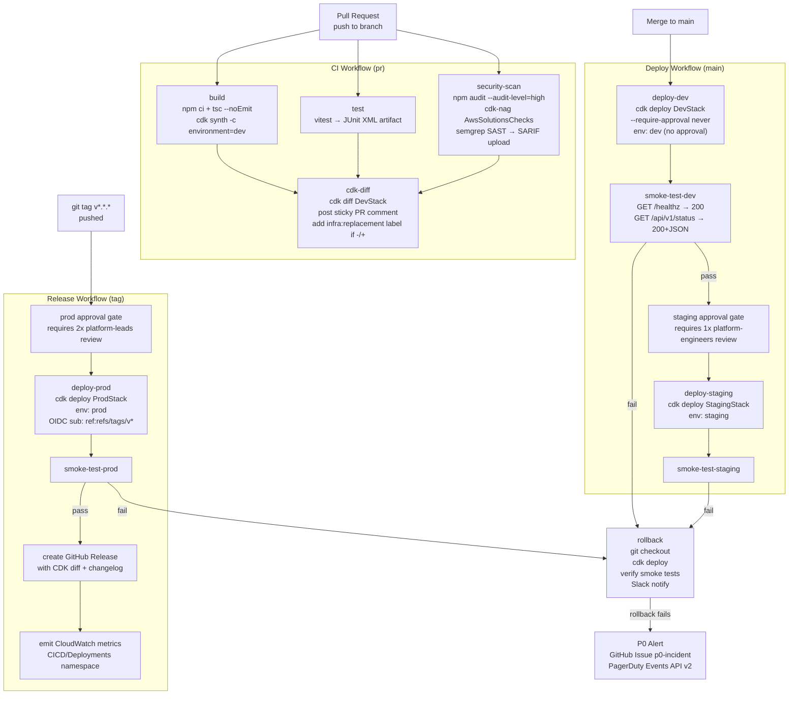

# Design: CI/CD Pipeline (GitHub Actions → AWS via OIDC)

## Architecture

### System Context

The CI/CD pipeline connects five external systems:

- **GitHub** — source of truth for code, workflow definitions, and environment protection rules. Emits `push`, `pull_request`, and `create` (tag) events that trigger workflows. Receives Deployment status API calls back from the pipeline.
- **AWS IAM / STS** — exchanges GitHub Actions OIDC JWTs for short-lived credentials via `AssumeRoleWithWebIdentity`. Hosts the `GitHubActionsDeployRole` with environment-scoped trust conditions.
- **AWS CloudFormation** — executes CDK-synthesised templates; manages resource creation, update, and rollback.
- **Slack** — receives deployment success, failure, and rollback notifications via incoming webhook.
- **PagerDuty** — receives P0 alerts when a rollback itself fails, via Events API v2.

### Pipeline Overview

Three workflow files drive the entire delivery process:

| Workflow File | Trigger | Purpose |
|---------------|---------|---------|
| `.github/workflows/ci.yml` | `pull_request` → `main` | Build, test, security scan, CDK diff, PR comment |
| `.github/workflows/deploy.yml` | `push` → `main` | Deploy to dev → staging (with approval) |
| `.github/workflows/release.yml` | `push` tag `v*.*.*` | Deploy to prod (with two-reviewer approval) |

### Pipeline Stage Flow



## Infrastructure

### IAM Role Design

One deployment role per environment (or account), each with a scoped trust policy:

```typescript
// In CDK bootstrap extension or a dedicated IAM stack
const devDeployRole = new iam.Role(this, 'GitHubActionsDevRole', {
  assumedBy: new iam.FederatedPrincipal(
    oidcProvider.openIdConnectProviderArn,
    {
      StringEquals: {
        'token.actions.githubusercontent.com:aud': 'sts.amazonaws.com',
        'token.actions.githubusercontent.com:sub':
          'repo:myorg/myrepo:ref:refs/heads/main',
      },
    },
    'sts:AssumeRoleWithWebIdentity',
  ),
  managedPolicies: [/* scoped CDK deploy permissions only */],
  maxSessionDuration: cdk.Duration.hours(1),
  roleName: 'GitHubActionsDevDeployRole',
});

// Prod: only tag refs are allowed to assume
const prodDeployRole = new iam.Role(this, 'GitHubActionsProdRole', {
  assumedBy: new iam.FederatedPrincipal(
    oidcProvider.openIdConnectProviderArn,
    {
      StringEquals: {
        'token.actions.githubusercontent.com:aud': 'sts.amazonaws.com',
        'token.actions.githubusercontent.com:sub':
          'repo:myorg/myrepo:ref:refs/tags/v*',  // tags only
      },
    },
    'sts:AssumeRoleWithWebIdentity',
  ),
});
```

The assumed role grants only the permissions the CDK deploy requires: `cloudformation:*` on the app's stacks, `s3:*` on the CDK asset bucket, `iam:PassRole` to the CloudFormation execution role, and `ssm:GetParameter` for CDK bootstrap parameters. It does NOT grant `AdministratorAccess`.

### OIDC Provider (one-time bootstrap)

```bash
# Create the OIDC provider in the target AWS account
aws iam create-open-id-connect-provider \
  --url https://token.actions.githubusercontent.com \
  --client-id-list sts.amazonaws.com \
  --thumbprint-list 6938fd4d98bab03faadb97b34396831e3780aea1
```

## Files & Interfaces

| File | Purpose |
|------|---------|
| `.github/workflows/ci.yml` | PR workflow: `build`, `test`, `security-scan`, `cdk-diff` jobs |
| `.github/workflows/deploy.yml` | Merge-to-main workflow: `deploy-dev`, `smoke-test-dev`, `deploy-staging` (gated), `smoke-test-staging` |
| `.github/workflows/release.yml` | Tag workflow: `deploy-prod` (gated by 2 reviewers), `smoke-test-prod`, `create-release`, `emit-metrics` |
| `.github/workflows/rollback.yml` | Reusable workflow (`workflow_call`) that accepts `environment`, `stack-name`, `target-tag` inputs; called by deploy workflows on smoke-test failure |
| `scripts/smoke-test.sh` | Bash script; takes `BASE_URL` env var; asserts `GET /healthz` and `GET /api/v1/status`; emits structured JSON per assertion; exits 1 on any failure |
| `scripts/emit-metrics.sh` | Bash script; reads `DEPLOY_DURATION_SECONDS` and `SMOKE_PASS` env vars; calls `aws cloudwatch put-metric-data` to `CICD/Deployments` namespace |
| `scripts/changelog.sh` | Bash script; runs `git log --oneline <prev-tag>..<new-tag>` and formats as Markdown for GitHub Release notes |
| `iam/github-actions-roles.ts` | CDK stack that creates OIDC provider + `GitHubActionsDevDeployRole`, `GitHubActionsStagingDeployRole`, `GitHubActionsProdDeployRole` |

### Workflow Skeletons

**`.github/workflows/ci.yml`** (abbreviated):

```yaml
name: CI
on:
  pull_request:
    branches: [main]

permissions:
  contents: read
  pull-requests: write
  security-events: write    # for SARIF upload

jobs:
  build:
    runs-on: ubuntu-22.04
    steps:
      - uses: actions/checkout@v4
      - uses: actions/setup-node@v4
        with: { node-version: '20', cache: 'npm' }
      - run: npm ci
      - run: npx tsc --noEmit
      - run: npx cdk synth -c environment=dev

  test:
    runs-on: ubuntu-22.04
    steps:
      - uses: actions/checkout@v4
      - uses: actions/setup-node@v4
        with: { node-version: '20', cache: 'npm' }
      - run: npm ci
      - run: npm test -- --reporter=junit --outputFile=test-results.xml
      - uses: actions/upload-artifact@v4
        with: { name: test-results, path: test-results.xml }

  security-scan:
    runs-on: ubuntu-22.04
    steps:
      - uses: actions/checkout@v4
      - uses: actions/setup-node@v4
        with: { node-version: '20', cache: 'npm' }
      - run: npm ci
      - run: npm audit --audit-level=high --omit=dev
      - run: npx cdk synth -c environment=dev   # includes cdk-nag
      - uses: returntocorp/semgrep-action@v1
        with:
          config: >-
            p/typescript
            p/secrets
          generateSarif: '1'
      - uses: github/codeql-action/upload-sarif@v3
        with: { sarif_file: semgrep.sarif }

  cdk-diff:
    runs-on: ubuntu-22.04
    needs: [build]
    permissions:
      id-token: write
      contents: read
      pull-requests: write
    steps:
      - uses: actions/checkout@v4
      - uses: actions/setup-node@v4
        with: { node-version: '20', cache: 'npm' }
      - run: npm ci
      - uses: aws-actions/configure-aws-credentials@v4
        with:
          role-to-assume:    ${{ vars.AWS_DEV_ROLE_ARN }}
          role-session-name: github-actions-${{ github.run_id }}
          aws-region:        us-east-1
      - id: diff
        run: |
          DIFF=$(npx cdk diff DevStack -c environment=dev 2>&1 || true)
          echo "diff<<EOF" >> $GITHUB_OUTPUT
          echo "$DIFF"     >> $GITHUB_OUTPUT
          echo "EOF"       >> $GITHUB_OUTPUT
          if echo "$DIFF" | grep -q "^[-+]"; then echo "has_changes=true" >> $GITHUB_OUTPUT; fi
      - uses: marocchino/sticky-pull-request-comment@v2
        with:
          message: |
            ## CDK Diff — DevStack
            ```
            ${{ steps.diff.outputs.diff }}
            ```
      - if: steps.diff.outputs.has_changes == 'true'
        uses: actions/github-script@v7
        with:
          script: |
            github.rest.issues.addLabels({
              issue_number: context.issue.number,
              owner: context.repo.owner,
              repo: context.repo.repo,
              labels: ['infra:replacement']
            })
```

**`.github/workflows/deploy.yml`** (abbreviated):

```yaml
name: Deploy
on:
  push:
    branches: [main]

concurrency:
  group:             deploy-${{ github.ref_name }}
  cancel-in-progress: true   # dev only; overridden per-job for staging

permissions:
  id-token:    write
  contents:    read
  deployments: write

jobs:
  deploy-dev:
    runs-on: ubuntu-22.04
    environment: dev
    steps:
      - uses: actions/checkout@v4
      - uses: actions/setup-node@v4
        with: { node-version: '20', cache: 'npm' }
      - run: npm ci
      - uses: aws-actions/configure-aws-credentials@v4
        with:
          role-to-assume:    ${{ vars.AWS_DEV_ROLE_ARN }}
          role-session-name: github-actions-${{ github.run_id }}
          aws-region:        us-east-1
      - run: npx cdk deploy DevStack -c environment=dev --require-approval never --outputs-file outputs.json
      - run: echo "API_ENDPOINT=$(jq -r '.DevStack.ApiEndpoint' outputs.json)" >> $GITHUB_ENV
      - uses: actions/upload-artifact@v4
        with: { name: dev-outputs, path: outputs.json }

  smoke-test-dev:
    needs: deploy-dev
    runs-on: ubuntu-22.04
    steps:
      - uses: actions/checkout@v4
      - uses: actions/download-artifact@v4
        with: { name: dev-outputs }
      - run: |
          API_ENDPOINT=$(jq -r '.DevStack.ApiEndpoint' outputs.json)
          BASE_URL=$API_ENDPOINT bash scripts/smoke-test.sh

  deploy-staging:
    needs: smoke-test-dev
    runs-on: ubuntu-22.04
    environment: staging   # triggers protection rule — 1 reviewer required
    steps:
      - uses: actions/checkout@v4
      - uses: actions/setup-node@v4
        with: { node-version: '20', cache: 'npm' }
      - run: npm ci
      - uses: aws-actions/configure-aws-credentials@v4
        with:
          role-to-assume:    ${{ vars.AWS_STAGING_ROLE_ARN }}
          role-session-name: github-actions-${{ github.run_id }}
          aws-region:        us-east-1
      - run: npx cdk deploy StagingStack -c environment=staging --require-approval never --outputs-file staging-outputs.json

  rollback:
    needs: [smoke-test-dev, smoke-test-staging]
    if: failure()
    uses: ./.github/workflows/rollback.yml
    with:
      environment:  ${{ needs.smoke-test-dev.result == 'failure' && 'dev' || 'staging' }}
      stack-name:   ${{ needs.smoke-test-dev.result == 'failure' && 'DevStack' || 'StagingStack' }}
    secrets: inherit
```

**`scripts/smoke-test.sh`**:

```bash
#!/usr/bin/env bash
set -euo pipefail

BASE_URL="${BASE_URL:?BASE_URL is required}"
PASS=0; FAIL=0

assert() {
  local name="$1" url="$2" expected_status="$3"
  local start=$(date +%s%3N)
  local http_status
  http_status=$(curl -sf --max-time 10 -o /tmp/body -w "%{http_code}" "$url" || echo "000")
  local latency=$(( $(date +%s%3N) - start ))
  local status="pass"
  [[ "$http_status" != "$expected_status" ]] && status="fail"
  printf '{"test":"%s","environment":"%s","status":"%s","http_status":%s,"latency_ms":%s,"endpoint":"%s"}\n' \
    "$name" "${ENVIRONMENT:-unknown}" "$status" "$http_status" "$latency" "$url"
  [[ "$status" == "pass" ]] && ((PASS++)) || ((FAIL++))
}

assert "healthz"    "$BASE_URL/healthz"      200
assert "api-status" "$BASE_URL/api/v1/status" 200

# Validate non-empty JSON body on api-status
body=$(cat /tmp/body)
if ! echo "$body" | jq 'keys | length > 0' > /dev/null 2>&1; then
  printf '{"test":"api-status-body","status":"fail","reason":"empty-or-invalid-json"}\n'
  ((FAIL++))
fi

echo "Smoke tests: $PASS passed, $FAIL failed"
[[ "$FAIL" -eq 0 ]] || exit 1
```

## IAM & Security

### OIDC Subject Constraints

| Environment | IAM trust condition `sub` | Allows |
|-------------|--------------------------|--------|
| `dev` | `repo:myorg/myrepo:ref:refs/heads/main` | Main branch merges only |
| `staging` | `repo:myorg/myrepo:environment:staging` | GitHub Environment jobs only |
| `prod` | `repo:myorg/myrepo:ref:refs/tags/v*` | Tagged releases only |

### Minimum IAM Permissions for Deployment Role

The `GitHubActionsDeployRole` policy grants:

```json
{
  "Statement": [
    { "Effect": "Allow", "Action": ["cloudformation:*"],
      "Resource": "arn:aws:cloudformation:us-east-1:<account>:stack/myapp-<env>/*" },
    { "Effect": "Allow", "Action": ["s3:GetObject", "s3:PutObject", "s3:ListBucket"],
      "Resource": ["arn:aws:s3:::cdk-assets-<account>-us-east-1",
                   "arn:aws:s3:::cdk-assets-<account>-us-east-1/*"] },
    { "Effect": "Allow", "Action": ["iam:PassRole"],
      "Resource": "arn:aws:iam::<account>:role/cdk-cfn-exec-role-<account>-us-east-1" },
    { "Effect": "Allow", "Action": ["ssm:GetParameter"],
      "Resource": "arn:aws:ssm:us-east-1:<account>:parameter/cdk-bootstrap/*" },
    { "Effect": "Allow", "Action": ["cloudwatch:PutMetricData"],
      "Resource": "*",
      "Condition": { "StringEquals": { "cloudwatch:namespace": "CICD/Deployments" } } }
  ]
}
```

No `AdministratorAccess`. No `*` on IAM actions. The CloudFormation execution role (separate CDK bootstrap role) holds broader permissions within CloudFormation's resource-creation context.

## Rollback Strategy

### Automatic Rollback Trigger

The `rollback` reusable workflow (`.github/workflows/rollback.yml`) is called by deploy workflows when any smoke-test job reports failure:

```yaml
# .github/workflows/rollback.yml
on:
  workflow_call:
    inputs:
      environment: { type: string, required: true }
      stack-name:  { type: string, required: true }
      target-tag:  { type: string, default: '' }   # empty = find previous tag automatically

jobs:
  rollback:
    runs-on: ubuntu-22.04
    environment: ${{ inputs.environment }}
    steps:
      - uses: actions/checkout@v4
        with:
          fetch-depth: 0   # full history needed for git describe
      - name: Resolve previous tag
        id: prev
        run: |
          CURRENT=$(git describe --tags --abbrev=0 HEAD 2>/dev/null || echo 'none')
          PREV=$(git describe --tags --abbrev=0 "${CURRENT}^" 2>/dev/null || echo 'none')
          echo "tag=$PREV" >> $GITHUB_OUTPUT
      - uses: actions/checkout@v4
        with:
          ref: ${{ inputs.target-tag || steps.prev.outputs.tag }}
      - run: npm ci
      - uses: aws-actions/configure-aws-credentials@v4
        with:
          role-to-assume:    ${{ vars[format('AWS_{0}_ROLE_ARN', inputs.environment)] }}
          role-session-name: rollback-${{ github.run_id }}
          aws-region:        us-east-1
      - run: npx cdk deploy ${{ inputs.stack-name }} -c environment=${{ inputs.environment }} --require-approval never
      - name: Verify rollback with smoke test
        run: BASE_URL=${{ vars[format('{0}_API_ENDPOINT', inputs.environment)] }} bash scripts/smoke-test.sh
      - name: Notify Slack
        if: always()
        run: |
          curl -sf -X POST "${{ secrets.SLACK_DEPLOY_WEBHOOK }}" \
            -H 'Content-Type: application/json' \
            -d "{\"text\":\"Rollback to ${{ steps.prev.outputs.tag }} in ${{ inputs.environment }}: ${{ job.status }}. Run: ${{ github.server_url }}/${{ github.repository }}/actions/runs/${{ github.run_id }}\"}"
```

### Rollback Decision Matrix

| Failing stage | Rollback target | Customer impact |
|--------------|-----------------|----------------|
| `smoke-test-dev` | Previous `main` commit on `dev` | None — staging and prod unaffected |
| `smoke-test-staging` | Previous successful staging deploy tag | None — prod unaffected |
| `smoke-test-prod` | Previous prod release tag (`v*`) | < 5 min degraded; rollback restores previous release |
| Rollback itself fails | P0 alert + manual intervention | Ongoing impact; PagerDuty fires |

## Observability

### CloudWatch Custom Metrics

After each successful deployment, `scripts/emit-metrics.sh` publishes:

| Metric | Unit | Dimensions |
|--------|------|-----------|
| `DeploymentDuration` | Seconds | `Environment`, `Repository` |
| `SmokeTestsPassed` | Count | `Environment`, `Repository` |
| `SmokeTestsFailed` | Count | `Environment`, `Repository` |
| `RollbackTriggered` | Count | `Environment`, `Repository` |

```bash
# scripts/emit-metrics.sh
aws cloudwatch put-metric-data \
  --namespace "CICD/Deployments" \
  --metric-data \
    "[{\"MetricName\":\"DeploymentDuration\",\"Value\":${DEPLOY_DURATION_SECONDS},
       \"Unit\":\"Seconds\",\"Dimensions\":[
         {\"Name\":\"Environment\",\"Value\":\"${ENVIRONMENT}\"},
         {\"Name\":\"Repository\",\"Value\":\"${GITHUB_REPOSITORY}\"}]}]"
```

### GitHub Deployment Statuses

Every deploy job calls the GitHub Deployments API at start (`in_progress`) and end (`success`/`failure`) using `actions/github-script@v7`. These statuses appear on the repository's Deployments page and in branch protection rules.

### Slack Notifications

| Event | Message | Channel |
|-------|---------|---------|
| Deployment started | `Deploying <sha> to <env>…` | `#deployments` |
| Deployment succeeded | `Deploy <sha> to <env> succeeded in <N>s` | `#deployments` |
| Smoke test failed | `Smoke tests FAILED in <env> — triggering rollback` | `#deployments` |
| Rollback succeeded | `Rollback to <prev-tag> in <env> completed` | `#deployments` |
| Rollback failed | `P0: Rollback FAILED in <env>` | `#incidents` |

## Error Handling

| Failure | CI behaviour | Resolution path |
|---------|-------------|----------------|
| `npm audit` HIGH/CRITICAL | `security-scan` job fails; PR blocked | Update vulnerable package; re-push |
| `cdk-nag` ERROR finding | `security-scan` job fails; PR blocked | Fix construct or add justified suppression |
| `cdk deploy` CloudFormation rollback | `deploy-*` job fails; CloudFormation auto-reverts; smoke test not run | Investigate CloudFormation Events; fix and redeploy from `main` |
| Smoke test assertion failure | `smoke-test-*` job fails; rollback job triggered | Automatic rollback; investigate application logs |
| OIDC token exchange failure (`AccessDenied`) | `configure-aws-credentials` step fails | Verify `sub` condition in IAM trust policy matches workflow context |
| Concurrent prod deployment attempt | Blocked by `concurrency` group (`cancel-in-progress: false`) | Wait for in-progress deploy to complete |

## Testing Strategy

| Layer | Tool | Scope | Trigger |
|-------|------|-------|---------|
| Workflow syntax | `actionlint` | All `.github/workflows/*.yml` | Pre-commit hook + CI |
| OIDC role assumption | AWS CLI test job | Confirm `aws sts get-caller-identity` succeeds with each deploy role | PR + nightly |
| Smoke-test script unit test | `bats` (Bash Automated Testing System) | `scripts/smoke-test.sh` with `httpretty` mock server | CI (`test` job) |
| End-to-end pipeline | Full `ci.yml` + `deploy.yml` run | Triggered on every merge to `main` in the test org | On merge |
| Rollback drill | Manual trigger of `rollback.yml` with a known-bad tag | Confirm rollback deploys previous version and smoke tests pass | Monthly |
