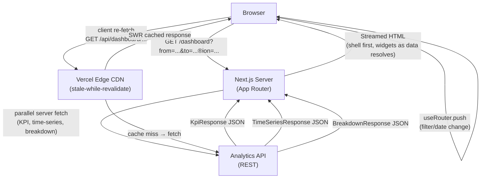

# Design: Analytics Dashboard

## Architecture

### System Context

The Analytics Dashboard lives at `app/(app)/dashboard/page.tsx` inside the authenticated route group `(app)`. The page entry is a React Server Component that reads URL search params (date range, dimension filters), fires parallel server-side fetches for KPI data and all chart datasets, and streams the page shell to the browser while each data section resolves inside its own `<Suspense>` boundary.

Chart rendering uses `recharts`, which requires a Client Component wrapper because it depends on DOM measurement for responsive sizing. All data fetching, however, happens in Server Components and is passed down as serialised props, keeping client-side bundle size minimal.

URL query parameters are the single source of truth for all filter state, enabling shareable dashboard links. Client Components read `useSearchParams()` for derived state and write via `useRouter().push()` inside `useTransition`.



### Component Design

```
app/(app)/dashboard/
  page.tsx                            (S) Reads searchParams, fires parallel fetches, composes layout
  loading.tsx                         (S) Route-level Suspense fallback — renders DashboardSkeleton
  error.tsx                           (C) Error Boundary — renders DashboardError
  layout.tsx                          (S) Dashboard shell: sidebar nav, top toolbar

  _components/
    DashboardSkeleton.tsx             (S) Full skeleton matching real layout (tiles + charts)
    Toolbar.tsx                       (C) Date-range picker + dimension filter dropdowns + Export button
    DateRangePicker.tsx               (C) Preset buttons + calendar for custom range
    DimensionFilterDropdown.tsx       (C) Multi-select dropdown per dimension (Region, Channel, etc.)
    ExportMenu.tsx                    (C) "Download CSV" / "Download JSON" dropdown
    KpiSection.tsx                    (S) Wraps KPI tile grid inside <Suspense>
    KpiTile.tsx                       (S) Single KPI: label, value, change, arrow icon
    KpiTileSkeleton.tsx               (S) Pulsing placeholder matching KpiTile dimensions
    LineChartSection.tsx              (S) Fetches time-series data, passes to LineChartWidget
    LineChartWidget.tsx               (C) recharts ResponsiveContainer + LineChart; tooltip; data table toggle
    BarChartSection.tsx               (S) Fetches breakdown data, passes to BarChartWidget
    BarChartWidget.tsx                (C) recharts BarChart; click-to-filter; expand/collapse
    EmptyState.tsx                    (S) "No data for this period" + Reset filters button
    ErrorState.tsx                    (C) Per-widget error + Retry button + attempt counter
    AccessibleDataTable.tsx           (C) Visually-hidden <table> with Show/Hide toggle

  _lib/
    types.ts                          TypeScript interfaces (KpiMetric, TimeSeries, BreakdownRow, DashboardFilters)
    filters.ts                        parseDashboardFilters() — URL searchParams → DashboardFilters
    url.ts                            buildDashboardUrl() — DashboardFilters → canonical URL
    api.ts                            fetchKpis(), fetchTimeSeries(), fetchBreakdown() server-side helpers
    export.ts                         generateCsv(), generateJson() client-side export utilities
    granularity.ts                    inferGranularity(from, to) → 'hourly' | 'daily' | 'weekly'

app/api/dashboard/
  kpis/route.ts                       GET — proxies to Analytics API, revalidate: 300
  time-series/route.ts                GET — proxies to Analytics API, revalidate: 60
  breakdown/route.ts                  GET — proxies to Analytics API, revalidate: 60
```

## Data Models

```typescript
// _lib/types.ts

/** A single KPI metric with current and prior-period values */
export interface KpiMetric {
  id: string;                    // e.g. 'revenue', 'dau', 'churn_rate'
  label: string;                 // display name, e.g. "Monthly Revenue"
  value: number | null;          // null = no data for period
  priorValue: number | null;
  format: 'currency_usd' | 'integer' | 'percent' | 'decimal';
  improvementDirection: 'up' | 'down';  // 'up' = higher is better (revenue); 'down' = lower is better (churn)
}

/** A single point in a time-series dataset */
export interface TimeSeriesPoint {
  timestamp: string;             // ISO 8601 UTC
  value: number;
  seriesId: string;              // e.g. 'revenue', 'dau'
}

/** Response envelope for the time-series endpoint */
export interface TimeSeriesResponse {
  series: { id: string; label: string; color: string; dashArray?: string }[];
  points: TimeSeriesPoint[];
  granularity: 'hourly' | 'daily' | 'weekly';
  from: string;                  // ISO 8601 date
  to: string;
}

/** A single row in a breakdown (bar chart) dataset */
export interface BreakdownRow {
  dimension: string;             // category value, e.g. 'APAC'
  metricId: string;
  value: number;
}

/** Response envelope for the breakdown endpoint */
export interface BreakdownResponse {
  dimension: string;             // dimension name, e.g. 'region'
  metricId: string;
  rows: BreakdownRow[];
}

/** Canonical shape of all user-controlled filter + date state */
export interface DashboardFilters {
  from: string;                  // ISO 8601 date, e.g. '2026-06-23'
  to: string;                    // ISO 8601 date
  preset: 'today' | 'last7' | 'last30' | 'last90' | 'custom';
  region?: string;
  channel?: string;
}

/** Default filter values — parameters equal to these are omitted from the URL */
export const DEFAULT_FILTERS: DashboardFilters = {
  from: /* 30 days ago */ '',
  to: /* today */ '',
  preset: 'last30',
};
```

## Files & Interfaces

| File | Responsibility |
|---|---|
| `app/(app)/dashboard/page.tsx` | Server Component; calls `parseDashboardFilters(searchParams)`, runs `Promise.all([fetchKpis, fetchTimeSeries, fetchBreakdown])`, composes `<Toolbar>`, `<KpiSection>`, `<LineChartSection>`, `<BarChartSection>` with Suspense boundaries |
| `app/(app)/dashboard/_components/Toolbar.tsx` | `'use client'`; owns `<DateRangePicker>` and `<DimensionFilterDropdown>` instances; wraps `router.push` in `useTransition`; renders `<ExportMenu>` |
| `app/(app)/dashboard/_components/DateRangePicker.tsx` | `'use client'`; preset buttons + calendar picker; validates that end >= start; calls `router.push(buildDashboardUrl(...))` on apply |
| `app/(app)/dashboard/_components/KpiTile.tsx` | Server Component; accepts `KpiMetric`; formats value via `Intl.NumberFormat`; renders arrow icon with `aria-label` per R1.2 |
| `app/(app)/dashboard/_components/LineChartWidget.tsx` | `'use client'`; `recharts ResponsiveContainer` + `LineChart`; keyboard-focusable data points; tooltip; `<AccessibleDataTable>` toggle |
| `app/(app)/dashboard/_components/BarChartWidget.tsx` | `'use client'`; `recharts BarChart`; click-to-filter calls `router.push`; expand/collapse for > 12 bars |
| `app/(app)/dashboard/_components/ErrorState.tsx` | `'use client'`; per-widget error display; `onRetry` callback; `attemptCount` counter |
| `app/(app)/dashboard/_components/AccessibleDataTable.tsx` | `'use client'`; visually hidden `<table>` with `<caption>`, `<thead>`, `<tbody>`; toggled by "Show data table" `<button>` |
| `app/(app)/dashboard/_components/ExportMenu.tsx` | `'use client'`; calls `generateCsv()` or `generateJson()` from `_lib/export.ts`; large-dataset warning modal |
| `app/(app)/dashboard/_lib/filters.ts` | `parseDashboardFilters(searchParams)` — validates ISO dates, coerces invalid values to defaults, infers preset |
| `app/(app)/dashboard/_lib/api.ts` | `fetchKpis(f)`, `fetchTimeSeries(f)`, `fetchBreakdown(f)` — server-only helpers using `fetch` with `next.revalidate` |
| `app/(app)/dashboard/_lib/export.ts` | `generateCsv(rows, filename)` and `generateJson(data, filename)` — client-side helpers using `Blob` + `URL.createObjectURL` |
| `app/(app)/dashboard/_lib/granularity.ts` | `inferGranularity(from, to)` — returns `'hourly'` (≤ 7 days), `'daily'` (8–90 days), `'weekly'` (> 90 days) |
| `app/api/dashboard/kpis/route.ts` | `GET` Route Handler; proxies to Analytics API; `export const revalidate = 300` |
| `app/api/dashboard/time-series/route.ts` | `GET` Route Handler; proxies; `revalidate = 60` |
| `app/api/dashboard/breakdown/route.ts` | `GET` Route Handler; proxies; `revalidate = 60` |

## State Management

All filter and date-range state is owned exclusively by the URL (single source of truth). No Zustand/Redux store is used. Local widget state is confined to individual Client Components:

- `DateRangePicker` — `draftRange: { from: string; to: string }` (uncommitted calendar selection) via `useState`.
- `BarChartWidget` — `isExpanded: boolean` for the "Show all categories" toggle.
- `ErrorState` — `attemptCount: number` per widget.
- `ExportMenu` — `isOpen: boolean`, `showWarningModal: boolean`.
- `AccessibleDataTable` — `isVisible: boolean`.

**Filter update flow:**
1. User interacts with `<Toolbar>` (date or dimension change).
2. `Toolbar` calls `router.push(buildDashboardUrl(newFilters), { scroll: false })` inside `useTransition`.
3. URL change triggers Next.js to re-run `page.tsx` with updated `searchParams`.
4. `page.tsx` re-fetches all sections; `isPending` from `useTransition` drives the loading overlay on the toolbar.

## Accessibility

**Chart accessibility**
All chart SVG elements rendered by `recharts` receive an `aria-label` via the `title` prop: e.g., `<LineChart title="Daily Active Users, June 1–30, 2026">`. Each chart is additionally accompanied by an `<AccessibleDataTable>` that is visually hidden by default and toggled via a "Show data table" button.

**Keyboard-focusable chart data points**
`<LineChartWidget>` renders invisible `<button>` elements positioned over each data point using absolute positioning (`<div className="relative">`), enabling Tab/Shift+Tab traversal. When focused, the tooltip appears; Escape dismisses it.

**KPI tile direction indicators**
The arrow icon uses `aria-hidden="true"` (it is decorative); the change label `<span>` carries `aria-label="Increased by 12%" | "Decreased by 3%" | "No change"` for screen readers.

**Date-range picker**
Implements the ARIA Combobox pattern: `role="combobox"`, `aria-expanded`, `aria-controls` pointing to the preset listbox or calendar grid. Calendar grid uses `role="grid"`, `role="gridcell"`, `aria-selected`, and arrow-key navigation per WAI-ARIA 1.2 Date Picker Dialog pattern.

**Focus management**
When a filter change completes (`isPending` transitions `true → false`), `useEffect` moves focus to the first KPI tile heading (`#kpi-section h3:first-child`) so keyboard users know that data has refreshed.

**Color independence**
KPI direction is communicated by color + arrow icon + `aria-label`. Chart series are differentiated by color + dash pattern. Bar labels are printed directly on or beside bars.

## Performance

**Streaming with Suspense**
`page.tsx` places `<KpiSection>`, `<LineChartSection>`, and `<BarChartSection>` each in independent `<Suspense>` boundaries with skeleton fallbacks. The page shell (toolbar, layout grid) is sent immediately; each widget streams in as its fetch resolves.

**Server-side data fetching**
All three fetches run in parallel via `Promise.all`. The Route Handlers apply stale-while-revalidate caching (`revalidate: 300` for KPIs, `60` for charts) so that repeated dashboard views hit the Edge CDN cache rather than the upstream Analytics API.

**Client bundle**
Chart libraries (`recharts` ≈ 80 KB gzip) are loaded only in the `LineChartWidget` and `BarChartWidget` Client Components, which are dynamically imported with `next/dynamic` and `{ ssr: false }` so they do not bloat the server HTML or block the initial paint.

**INP**
All `router.push` calls are wrapped in `useTransition`. The toolbar shows an `aria-busy` spinner while the transition is pending. The previous data remains visible (no blank flicker), keeping INP < 200 ms.

**CLS**
All skeleton components have explicit height matching their real counterparts. `recharts` charts are wrapped in a `<div style={{ height: 320 }}>` container that reserves space before the chart library loads.

**Core Web Vitals targets**

| Metric | Target |
|--------|--------|
| LCP | < 2.5 s |
| CLS | < 0.1 |
| INP | < 200 ms |

## Error Handling

| Error Path | Trigger | Handling |
|---|---|---|
| Network error during server fetch | `fetchKpis` / `fetchTimeSeries` / `fetchBreakdown` throws | Propagates to `app/(app)/dashboard/error.tsx` error boundary; renders `<DashboardError>` with page-level retry |
| HTTP 5xx from Analytics API | Route Handler receives 5xx | Helper throws `ApiError`; same error-boundary path |
| HTTP 401 (session expired) | Route Handler receives 401 | Redirect to `/login?redirect=/dashboard?<currentParams>` |
| Per-widget client re-fetch failure | `fetch` inside `LineChartWidget` / `BarChartWidget` throws | Widget-level `<ErrorState>` replaces chart area; "Retry" re-fires; attempt count incremented |
| Invalid date params in URL | Non-ISO `from`/`to` string | `parseDashboardFilters` coerces to Last 30 days, logs `console.warn`, `page.tsx` issues `redirect` to canonical URL |
| End date before start date (custom picker) | User submits invalid range | `DateRangePicker` shows inline error "End date must be after start date", prevents `router.push` |
| Export > 10 000 rows | `generateCsv` checks row count | `ExportMenu` shows warning modal; user confirms before `Blob` is created |
| Zero data for current filters | All fetch responses empty | Per-widget `<EmptyState>` with "No data for this period" and "Reset filters" button |

## Testing Strategy

### Unit Tests (Vitest + React Testing Library)

- `parseDashboardFilters` — valid ISO dates, invalid dates coerced to defaults, missing params use defaults, `preset` inferred correctly from date range.
- `buildDashboardUrl` — default values omitted, multiple dimension params, `preset=last30` omitted, custom range includes `from` and `to`.
- `inferGranularity` — 3-day range → `'hourly'`, 30-day range → `'daily'`, 180-day range → `'weekly'`.
- `generateCsv` — correct header row, correct data rows, correct filename, UTF-8 encoded, no currency symbols in values.
- `<KpiTile>` — renders label, formatted value, change with sign, correct arrow `aria-label` for up/down/neutral, "—" for null value.
- `<ErrorState>` — renders error message, "Retry" button calls `onRetry`; after 2+ attempts appends "(Attempt N)".
- `<AccessibleDataTable>` — initially hidden; "Show data table" button makes it visible; `<caption>` matches chart name.

### Integration Tests (Vitest + RTL + MSW)

- **Date-range change** — Render dashboard with MSW fixtures; click "Last 7 days" preset; assert URL contains correct `from`/`to`, all widgets re-fetched, KPI values updated.
- **Dimension filter** — Click "Region: APAC"; assert URL contains `?region=APAC`, API called with region param.
- **Bar click → filter** — Click a bar in `<BarChartWidget>`; assert `router.push` called with dimension filter in URL.
- **Error → retry** — MSW returns 500 for time-series; `<ErrorState>` renders; click "Retry"; MSW returns 200; chart renders.
- **Empty state** — MSW returns empty arrays for all endpoints; `<EmptyState>` renders in each widget.
- **401 redirect** — MSW returns 401; assert `router.push` called with `/login?redirect=...`.
- **Export CSV** — Click "Download CSV"; assert `URL.createObjectURL` called with Blob; assert filename matches `analytics-{from}-to-{to}.csv`.

### Accessibility Tests (axe-core + Playwright)

- Automated `axe-core` scan on four states: default (data loaded), loading (Suspense), empty state, error state. Zero WCAG 2.1 AA violations.
- Keyboard walkthrough: Tab through toolbar controls, date picker (open/navigate/close with arrow keys and Escape), chart data points, export menu.
- Chart `aria-label` verification: assert each `<svg>` in the DOM has a non-empty accessible name.

### End-to-End Tests (Playwright)

- **Happy path** — Navigate to `/dashboard`, assert KPI tiles visible with non-zero values, assert line chart SVG present, assert bar chart SVG present.
- **Date-range filter** — Select "Last 7 days", assert URL updated, assert charts re-render with hourly granularity label on y-axis.
- **Shareable URL** — Build URL `/dashboard?from=2026-06-01&to=2026-06-30&region=APAC` and open in a fresh context; assert server-rendered HTML shows KPI data for that range.
- **Export** — Click "Download CSV"; intercept download with Playwright's `page.waitForEvent('download')`; assert filename and first line of file.
- **Performance** — Assert LCP < 2 500 ms, CLS < 0.1 on desktop viewport.
