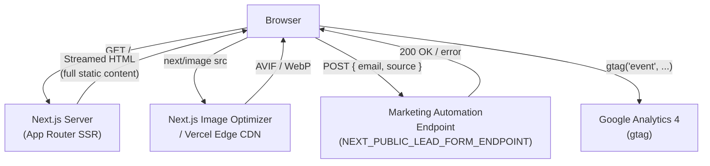

# Design: Marketing Landing Page

## Architecture

### System Context

The landing page is a Next.js App Router route at `app/(marketing)/page.tsx`. The outer route group `(marketing)` has its own `layout.tsx` that injects the site header (nav + CTA link), site footer, and the Google Analytics script tag. The page entry point is a React Server Component: it reads environment variables, assembles the `generateMetadata` return value, and renders the full page from static data (no runtime API calls). All page content — hero copy, feature definitions, testimonials, logos — is authored as TypeScript constants in `lib/content/landing.ts` so that copy changes require no component edits.

The only Client Components are those that require browser APIs: `AnalyticsProvider` (fires `page_view` on mount, wires scroll-depth tracking), `ScrollAnimationWrapper` (Intersection Observer for fade-in), `TestimonialCarousel` (carousel state and ARIA live region), and `LeadForm` (form state and submission).



### Component Design

```
app/(marketing)/
  layout.tsx                        (S) Site header, footer, GA4 <Script> tag
  page.tsx                          (S) generateMetadata + full page assembly
  _components/
    Hero.tsx                        (S) H1 headline, subheadline, CTA buttons, hero image
    CtaButton.tsx                   (C) Fires conversion_event on click, then navigates
    FeatureSection.tsx              (S) Single feature block (heading, copy, image)
    FeatureGrid.tsx                 (S) Renders 3–6 FeatureSection instances
    ScrollAnimationWrapper.tsx      (C) Intersection Observer fade-in; respects prefers-reduced-motion
    SocialProof.tsx                 (S) Outer container for logos + testimonials
    LogoStrip.tsx                   (S) Company logo  row, greyscale CSS filter
    TestimonialCarousel.tsx         (C) Carousel state, aria-live, Prev/Next controls
    TestimonialCard.tsx             (S) Single testimonial: quote, name, role, avatar
    LeadForm.tsx                    (C) Email input, submission state, error/success display
    StructuredData.tsx              (S) <script type="application/ld+json"> Organization schema
    AnalyticsProvider.tsx           (C) page_view fire, scroll-depth Intersection Observers
    SkipLink.tsx                    (S) Visually-hidden "Skip to main content" anchor

lib/
  analytics.ts                      trackEvent() helper, consent check, localStorage queue
  content/
    landing.ts                      Typed constants: hero copy, features[], testimonials[], logos[]
```

## Data Models

```typescript
// lib/content/landing.ts

export interface HeroContent {
  headline: string;            // H1 — ≤ 70 characters
  subheadline: string;         // subtitle paragraph — 1–2 sentences
  primaryCta: CtaLink;
  secondaryCta?: CtaLink;
  image: {
    src: string;               // local path or absolute URL
    alt: string;
    width: number;
    height: number;
  };
}

export interface CtaLink {
  label: string;               // visible button text
  href: string;
  analyticsLabel: string;      // e.g. 'hero_primary'
}

export interface FeatureItem {
  id: string;                  // slug used as section id, e.g. 'fast-onboarding'
  heading: string;             // H3 — ≤ 50 characters
  description: string;         // 20–80 words
  image?: {
    src: string;
    alt: string;
    width: number;
    height: number;
  };
  imagePosition: 'left' | 'right';
}

export interface Testimonial {
  id: string;
  quote: string;               // 30–120 words
  authorName: string;
  authorRole: string;          // e.g. "Head of Engineering"
  authorCompany: string;
  avatarSrc: string;
  avatarAlt: string;           // must equal authorName
}

export interface CompanyLogo {
  name: string;                // used as alt text
  src: string;                 // SVG path
  width: number;
  height: number;
}

// lib/analytics.ts

export interface ConversionEvent {
  action: string;              // e.g. 'cta_click', 'lead_form_submit', 'page_view'
  label?: string;
  section?: string;
  destination?: string;
  depth?: 25 | 50 | 75 | 90;
  utm_source?: string;
  utm_medium?: string;
  utm_campaign?: string;
  referrer?: string;
}
```

## Files & Interfaces

| File | Responsibility |
|---|---|
| `app/(marketing)/layout.tsx` | Wraps all marketing pages; renders `<SiteHeader>`, `<SiteFooter>`, and `<Script src="https://www.googletagmanager.com/gtag/js" strategy="afterInteractive">` |
| `app/(marketing)/page.tsx` | `generateMetadata()` for title/description/OG/Twitter; renders `<SkipLink>`, `<AnalyticsProvider>`, `<Hero>`, `<FeatureGrid>`, `<SocialProof>`, `<LeadForm>`, `<StructuredData>` |
| `app/(marketing)/_components/Hero.tsx` | Server Component; accepts `HeroContent`; renders `<section>` with H1, subheadline, `<CtaButton>` × 1–2, `<Image priority>` |
| `app/(marketing)/_components/CtaButton.tsx` | `'use client'`; fires `trackEvent('cta_click', { label, section, destination })` on click; renders `<a>` or `<button>` depending on `href` presence |
| `app/(marketing)/_components/FeatureGrid.tsx` | Server Component; maps `features[]` to `<ScrollAnimationWrapper><FeatureSection /></ScrollAnimationWrapper>` |
| `app/(marketing)/_components/ScrollAnimationWrapper.tsx` | `'use client'`; Intersection Observer adds `is-visible` CSS class; CSS `@keyframes` fade-up; suppressed when `prefers-reduced-motion` is active |
| `app/(marketing)/_components/TestimonialCarousel.tsx` | `'use client'`; `useState` for active index; `aria-live="polite"` region; Prev/Next `<button>` elements |
| `app/(marketing)/_components/LeadForm.tsx` | `'use client'`; `useActionState` or `useState` for idle/submitting/success/error; POSTs to `NEXT_PUBLIC_LEAD_FORM_ENDPOINT`; calls `trackEvent('lead_form_submit')` on success |
| `app/(marketing)/_components/AnalyticsProvider.tsx` | `'use client'`; `useEffect` fires `page_view`; attaches `IntersectionObserver` on sentinel divs at 25/50/75/90% of page height |
| `lib/analytics.ts` | `trackEvent(name, params)` — checks `window.__analyticsConsent`, calls `window.gtag`, queues in `localStorage` if gtag not ready |
| `lib/content/landing.ts` | Exported constants: `HERO`, `FEATURES`, `TESTIMONIALS`, `LOGOS`; all typed with interfaces above |

## Accessibility

**Heading hierarchy**
The page contains exactly one `<h1>` (hero headline). Feature section headings are `<h2>`. Testimonial section heading is `<h2>`. Sub-items within sections use `<h3>` where applicable. No heading levels are skipped.

**Skip link**
`<SkipLink>` renders `<a href="#main-content" className="sr-only focus:not-sr-only focus:fixed focus:top-4 focus:left-4 focus:z-50">Skip to main content</a>` as the first focusable element in `<body>`.

**Focus ring**
Tailwind `focus-visible:outline` with 2 px solid ring and 2 px offset is applied globally via `@layer base` in `globals.css`. The `CtaButton` component never removes the outline.

**Testimonial carousel**
`<TestimonialCarousel>` renders a `<div role="region" aria-label="Customer testimonials">`. Prev/Next buttons carry `aria-label`. A `<div role="status" aria-live="polite" aria-atomic="true" className="sr-only">` announces "Testimonial 2 of 5" on index change.

**Lead form**
`<label htmlFor="email-input">` is always visible (not a placeholder). `autocomplete="email"`, `type="email"`, `required` attributes are set. Error messages are associated with the input via `aria-describedby`.

**Color contrast**
Primary button background and text are validated at ≥ 4.5:1 in the design token system. All body-copy foreground/background pairs target ≥ 7:1 for comfortable reading. Decorative SVG shapes carry `aria-hidden="true"`.

## Performance

**LCP**
`<Hero>` passes `priority={true}` to `<Image>`. The image is pre-declared in `next.config.js` `images.domains` and served by the Next.js Image Optimizer as AVIF with WebP fallback. Target: LCP < 2.5 s on a simulated 4G mobile connection (Lighthouse throttling profile).

**CLS prevention**
Every `<Image>` has explicit `width` and `height` (or a fixed-aspect-ratio container when using `fill`). Below-fold images use `loading="lazy"`. No font-swap layout shift: heading fonts are loaded with `<link rel="preload" as="font" crossorigin>` and `font-display: swap`. No late-injected content shifts above-the-fold content.

**JavaScript budget**
Server Components produce no client JS. The five Client Components (`CtaButton`, `ScrollAnimationWrapper`, `TestimonialCarousel`, `LeadForm`, `AnalyticsProvider`) are code-split automatically by Next.js. Combined gzipped JS budget for the marketing route: < 30 KB.

**GA4 script**
Loaded with `<Script strategy="afterInteractive">` so it does not block the initial render. `trackEvent` queues events in `localStorage` until `gtag` is available, preventing data loss.

**Core Web Vitals targets**

| Metric | Target |
|--------|--------|
| LCP | < 2.5 s (aspirational: < 2.0 s) |
| CLS | < 0.1 |
| INP | < 200 ms |

## State Management

The page is intentionally stateless at the route level. Local UI state is confined to individual Client Components:

- `TestimonialCarousel` — `activeIndex: number` via `useState`.
- `LeadForm` — `status: 'idle' | 'submitting' | 'success' | 'error'` and `errorMessage: string` via `useState`.
- `AnalyticsProvider` — `firedDepths: Set<number>` in a `useRef` (no re-render needed).
- `ScrollAnimationWrapper` — `isVisible: boolean` via `useState`, set by `IntersectionObserver`.

No global state store is needed. The URL carries no page-specific state.

## Error Handling

| Error Path | Trigger | Handling |
|---|---|---|
| Lead form POST network error | `fetch` throws | Set `status = 'error'`, display "Something went wrong. Please try again.", re-enable submit, retain email value |
| Lead form POST 4xx/5xx | Response `!ok` | Same as network error |
| Missing `NEXT_PUBLIC_LEAD_FORM_ENDPOINT` | Env var not set at build | `LeadForm` renders a `console.error` in development and disables the form with message "Lead form unavailable" |
| Missing `NEXT_PUBLIC_SITE_URL` | Env var not set at build | `generateMetadata` falls back to `'https://example.com'` and logs a build-time warning via `console.warn` |
| Analytics consent not granted | `window.__analyticsConsent === false` | `trackEvent` no-ops silently; logs `console.debug('Analytics suppressed: no consent')` |
| OG image asset missing | 404 on og-image path | Next.js returns a broken OG image; a lint rule in CI checks that `public/og-image.jpg` exists at build time |

## Testing Strategy

### Unit Tests (Vitest + React Testing Library)

- `trackEvent` — fires `window.gtag` when consent is granted; no-ops and queues in localStorage when gtag is absent; no-ops when `window.__analyticsConsent` is false.
- `<CtaButton>` — calls `trackEvent` with correct params on click; navigates to `href` after event; accessible name equals visible label.
- `<LeadForm>` — idle state renders email input + submit button; submitting state disables button; success state renders confirmation message; error state renders error message and re-enables button.
- `<TestimonialCarousel>` — Next button advances index; Previous button decrements; wraps correctly; aria-live region text updates.
- `<ScrollAnimationWrapper>` — adds `is-visible` class when IntersectionObserver fires; does not add class or attach observer when `prefers-reduced-motion` is active.

### Integration Tests (Vitest + RTL + MSW)

- **Lead form happy path** — MSW intercepts POST to lead endpoint, returns 200; assert confirmation message visible, `trackEvent` called with `lead_form_submit`.
- **Lead form error** — MSW returns 500; assert error message visible, email input value preserved, submit button re-enabled.
- **Analytics page_view** — Mount `<AnalyticsProvider>`; assert `window.gtag` called with `'event', 'page_view'` on first render.
- **Scroll depth** — Simulate IntersectionObserver entries at 25% and 50%; assert `trackEvent` called once per threshold.

### Accessibility Tests (axe-core + Playwright)

- `axe-core` automated scan on the full page in its default rendered state — zero WCAG 2.1 AA violations.
- Keyboard walkthrough (Playwright): Tab from skip link through all CTAs, form field, submit button, carousel controls — assert correct focus order, no focus traps.
- Screen reader smoke test (manual, NVDA + Chrome): confirm H1 is announced first, carousel live region is announced on slide change, form error message is announced via `aria-describedby`.

### End-to-End Tests (Playwright)

- **Happy path** — Navigate to `/`, assert H1 visible, click primary CTA, assert navigation occurs, assert `gtag` event fired.
- **Lead form** — Fill email, submit, assert confirmation message; use MSW-server mode for endpoint mock.
- **LCP + CLS** — `page.goto('/')` with Playwright's web-vitals integration; assert LCP < 2 500 ms and CLS < 0.1 on desktop (1 280 × 800) and mobile (375 × 812).
- **OG tags** — Fetch page HTML via `fetch` and assert presence of `og:title`, `og:image`, `og:description` meta tags.
