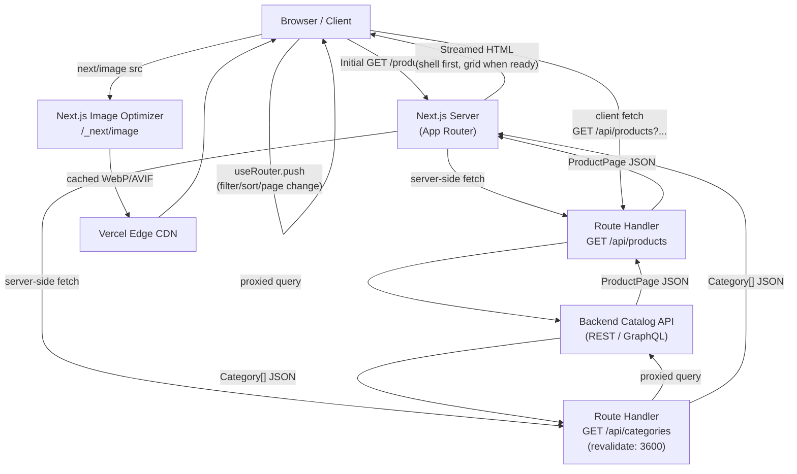

# Design: Product Listing Page

## Architecture

### System Context

The Product Listing Page is a dynamic Next.js 14+ App Router route (`app/products/page.tsx`). The page entry point is a React Server Component that reads URL `searchParams`, validates and normalises them through `parseFilters`, then fetches data on the server and streams the result. The product grid lives inside a `<Suspense>` boundary so the page shell (header, filter panel, sort control) is sent to the browser immediately while the slower product-list fetch resolves in parallel.

Client Components (`'use client'`) handle all interactive concerns — filter checkboxes, the price-range slider, the sort select, and pagination links. Each Client Component reads the current URL via `useSearchParams()` and writes back via `useRouter().push()` wrapped in a `useTransition`, which keeps the previous UI visible while the Server Component subtree re-renders with new data.

The `GET /api/products` Route Handler proxies to a backend catalog service, applying runtime cache semantics. Product images flow through Next.js Image Optimization at `/api/image`, serving WebP/AVIF from a Vercel Edge CDN.



### Component Design

Components are split across the Server/Client boundary following the React Server Components model. Server Components (marked **S**) fetch data and render HTML; Client Components (marked **C**) handle user interaction and browser APIs.

```
app/products/
  page.tsx                          (S) Page entry — reads searchParams, fetches data, composes layout
  loading.tsx                       (S) Route-level Suspense fallback — renders ProductGridSkeleton
  error.tsx                         (C) Error Boundary — renders ErrorState
  not-found.tsx                     (S) 404 fallback

  _components/
    ProductGrid.tsx                 (S) Renders <ul> of ProductCard from ProductPage data
    ProductCard.tsx                 (S) <article> with next/image, name link, price, badge
    ProductCardSkeleton.tsx         (S) Pulsing placeholder matching ProductCard dimensions
    ProductGridSkeleton.tsx         (S) 12 × ProductCardSkeleton in responsive grid
    EmptyState.tsx                  (S) Zero-results state with clear-filters link + category suggestions
    FilterPanel.tsx                 (C) <nav aria-label="Product filters"> wrapper
    CategoryFilter.tsx              (C) Checkbox list per Category
    PriceRangeSlider.tsx            (C) Two <input type="range"> elements with full ARIA wiring
    SortSelect.tsx                  (C) <select> with visible <label>, four sort options
    ActiveFilterBar.tsx             (C) Dismissible filter chips + "Clear all filters" button
    Pagination.tsx                  (C) <nav aria-label="Pagination"> with <a> page links
    ErrorState.tsx                  (C) Error message + retry button + attempt counter
    LiveRegion.tsx                  (C) aria-live="polite" announcer for result-count updates

  _lib/
    types.ts                        TypeScript interfaces (Product, ProductPage, Category, ProductFilters)
    filters.ts                      parseFilters() — URL → ProductFilters with coercion
    url.ts                          buildUrl() — ProductFilters → canonical URL string
    api.ts                          fetchProducts() and fetchCategories() server-side helpers
```

## Data Models

```typescript
// ---- types.ts ----

/** A single product as returned by GET /api/products */
export interface Product {
  id: string;
  slug: string;           // URL-safe identifier, e.g. "nike-air-max-90"
  name: string;
  description: string;
  priceInCents: number;   // integer cents, e.g. 4999 = $49.99
  category: string;       // category slug, e.g. "shoes"
  imageUrl: string;       // absolute URL to source image
  imageAlt: string;       // pre-authored descriptive alt text
  available: boolean;
  createdAt: string;      // ISO 8601
}

/** Paginated response envelope from GET /api/products */
export interface ProductPage {
  products: Product[];
  total: number;          // total matching products (used for pagination math)
  page: number;           // 1-indexed current page
  pageSize: number;       // always 24
  totalPages: number;
  priceRange: {
    minInCents: number;   // min price present in full (unfiltered) result set
    maxInCents: number;   // max price present in full (unfiltered) result set
  };
}

/** A product category as returned by GET /api/categories */
export interface Category {
  slug: string;           // e.g. "shoes"
  label: string;          // display name, e.g. "Shoes"
  productCount: number;
}

/** Canonical shape of all user-controlled filter + sort + pagination state */
export interface ProductFilters {
  category: string[];             // multi-select; [] = all categories
  minPrice: number | null;        // cents; null = no lower bound
  maxPrice: number | null;        // cents; null = no upper bound
  sort: 'relevance' | 'price_asc' | 'price_desc' | 'newest';
  page: number;                   // 1-indexed
}

/** Default values — parameters equal to these are omitted from the URL */
export const DEFAULT_FILTERS: ProductFilters = {
  category: [],
  minPrice: null,
  maxPrice: null,
  sort: 'relevance',
  page: 1,
};
```

## Component / API Design

### URL Query Schema

All filter, sort, and pagination state is encoded in URL query parameters. Parameters equal to their default value are omitted (canonicalization).

| Parameter   | Type      | Example                           | Default     | Notes                              |
|-------------|-----------|-----------------------------------|-------------|------------------------------------|
| `category`  | `string[]`| `?category=shoes&category=bags`   | *(omitted)* | Repeatable parameter               |
| `minPrice`  | `integer` | `?minPrice=1000`                  | *(omitted)* | Integer cents                      |
| `maxPrice`  | `integer` | `?maxPrice=9999`                  | *(omitted)* | Integer cents                      |
| `sort`      | `string`  | `?sort=price_asc`                 | *(omitted)* | One of four enum values            |
| `page`      | `integer` | `?page=3`                         | *(omitted)* | 1-indexed; omitted when page = 1   |

### API Contract

**`GET /api/products`**

Accepts URL query parameters mirroring `ProductFilters` (snake_case for server-to-backend hop):

| Param       | Type      | Notes                            |
|-------------|-----------|----------------------------------|
| `category`  | string[]  | Repeatable                       |
| `min_price` | integer   | Cents                            |
| `max_price` | integer   | Cents                            |
| `sort`      | string    | Enum                             |
| `page`      | integer   | 1-indexed                        |
| `page_size` | integer   | Server enforces 24; not user-set |

Returns `ProductPage` JSON. Cache-Control: `no-store` at the Route Handler level (dynamic per request); downstream CDN caching is configured per-route via Vercel headers.

**`GET /api/categories`**

Returns `Category[]`. Configured with `export const revalidate = 3600` in the Route Handler file (stale-while-revalidate, 1 hour), since category lists change infrequently.

### Component Props

```typescript
// page.tsx — Server Component (receives Next.js searchParams)
interface ProductsPageProps {
  searchParams: Record<string, string | string[] | undefined>;
}

// ProductGrid.tsx — Server Component
interface ProductGridProps {
  productPage: ProductPage;
}

// ProductCard.tsx — Server Component
interface ProductCardProps {
  product: Product;
  priority?: boolean;   // true for first 4 cards to optimize LCP
}

// FilterPanel.tsx — Client Component
interface FilterPanelProps {
  categories: Category[];         // pre-fetched on server, passed as prop
  initialFilters: ProductFilters; // parsed from searchParams at page level
  priceRange: { minInCents: number; maxInCents: number }; // slider bounds
}

// PriceRangeSlider.tsx — Client Component
interface PriceRangeSliderProps {
  min: number;                    // slider lower bound (cents)
  max: number;                    // slider upper bound (cents)
  value: [number, number];        // [currentMin, currentMax]
  onChange: (value: [number, number]) => void;
}

// SortSelect.tsx — Client Component
interface SortSelectProps {
  currentSort: ProductFilters['sort'];
}

// Pagination.tsx — Client Component
interface PaginationProps {
  currentPage: number;
  totalPages: number;
  buildHref: (page: number) => string; // canonical URL for each page link
}

// LiveRegion.tsx — Client Component
interface LiveRegionProps {
  message: string;  // e.g. "Showing 48 products"
}

// ErrorState.tsx — Client Component
interface ErrorStateProps {
  onRetry: () => void;
  attemptCount: number;
}
```

## State Management

Filter, sort, and page state is owned exclusively by the URL (single source of truth). No global state store (Redux, Zustand, Jotai) is used.

**Flow:**

1. **Server read** — `page.tsx` calls `parseFilters(searchParams)` to produce a `ProductFilters` object. This is passed to Client Components as `initialFilters` and to Server Components as `filters`.
2. **Client write** — `FilterPanel`, `SortSelect`, and `Pagination` each call `router.push(buildUrl(newFilters, currentSearchParams), { scroll: false })` on user interaction.
3. **URL change → re-render** — The URL change triggers Next.js to re-run the Server Component subtree at `page.tsx` with updated `searchParams`, fetching fresh data.
4. **Transition** — `useTransition` wraps `router.push` in `FilterPanel` and `SortSelect`, marking the navigation as non-urgent. `isPending` is used to show the loading overlay and set `aria-busy="true"` on the grid container without removing the previous product list from the DOM.

```typescript
// _lib/url.ts — canonical URL builder used by all Client Components
export function buildUrl(
  override: Partial<ProductFilters>,
  current: URLSearchParams,
): string {
  const merged: ProductFilters = { ...parseFilters(current), ...override };
  const params = new URLSearchParams();

  if (merged.category.length > 0)
    merged.category.forEach(c => params.append('category', c));
  if (merged.minPrice !== null)
    params.set('minPrice', String(merged.minPrice));
  if (merged.maxPrice !== null)
    params.set('maxPrice', String(merged.maxPrice));
  if (merged.sort !== 'relevance')
    params.set('sort', merged.sort);
  if (merged.page !== 1)
    params.set('page', String(merged.page));

  const qs = params.toString();
  return qs ? `/products?${qs}` : '/products';
}
```

## Error Handling

| Error Path | Trigger | Handling |
|---|---|---|
| Network failure on SSR product fetch | `fetchProducts` throws during server render | Next.js propagates to `app/products/error.tsx` (Client Component Error Boundary); renders `<ErrorState onRetry={() => router.refresh()} attemptCount={n} />` |
| HTTP 5xx from `GET /api/products` | Route Handler receives 5xx from catalog API | `fetchProducts` throws a typed `ApiError`; same error-boundary path as above |
| HTTP 404 from `GET /api/products` | Route Handler receives 404 from catalog API | `fetchProducts` calls `notFound()` from `next/navigation`; renders `app/products/not-found.tsx` |
| Invalid URL query parameters | Non-numeric `page`, unrecognized `sort` | `parseFilters` coerces to defaults silently; no user-facing error; logs `console.warn`; `page.tsx` issues `permanentRedirect` to canonical URL (R3.4, R4.4) |
| `page` exceeds `totalPages` | `filters.page > productPage.totalPages` after fetch | `page.tsx` issues `redirect` to the last valid page URL and sets a cookie that triggers an informational banner reading "Page N does not exist. Showing the last page." (R4.5) |
| Client-side re-fetch failure | Network error during filter/sort/page transition | `useTransition` error is caught in a try/catch around `router.push`; `<ErrorState>` swaps into the product grid area with a retry button (R6.3, R6.6) |
| Zero results | `productPage.total === 0` | `<ProductGrid>` renders `<EmptyState>` with clear-filters CTA and up to 3 category suggestions (R6.4) |
| Continued retry failure | `router.refresh()` fails on subsequent attempts | `ErrorState` increments `attemptCount` and appends "(Attempt N)" to the error message (R6.6) |

## Accessibility

The PLP targets WCAG 2.1 AA conformance across all states (default, filtered, loading, empty, error).

**Focus management**
A `<LiveRegion>` component (`role="status"` + `aria-live="polite"`) is updated to "Showing [N] products" after every product grid transition. A `useEffect` in a thin `ProductGridController` Client Component watches `isPending` from `useTransition` and moves keyboard focus to the first product card `<a>` link once the transition completes (R7.2).

**Keyboard navigation**
A "Skip to product list" skip link (`<a href="#product-grid">`) is the first focusable element in the page layout, allowing keyboard users to bypass the filter panel (WCAG 2.4.1). All interactive elements are native HTML elements (`<input>`, `<select>`, `<a>`, `<button>`) to inherit built-in keyboard behaviour without custom ARIA widgets.

**Filter panel**
Wrapped in `<nav aria-label="Product filters">`. Category checkboxes use native `<input type="checkbox">` with `<label>` elements. The price slider uses two `<input type="range">` elements with `aria-label="Minimum price"` / `aria-label="Maximum price"`, `aria-valuemin`, `aria-valuemax`, and `aria-valuenow` updated to cent values on every change event (R7.3).

**Sort control**
Native `<select>` with a visible `<label for="sort-select">`. No custom ARIA widget. Selected option is reflected in the URL; screen readers announce the change via the select's built-in semantics.

**Pagination**
`<nav aria-label="Pagination">`. Page links are `<a>` elements with `href`. The current page link carries `aria-current="page"`. Disabled Previous/Next buttons use `aria-disabled="true"` plus `pointer-events: none` in CSS; they remain in the tab order so screen readers can announce their state (R5.3, R5.4).

**Product cards**
Each card is an `<article>` element. The primary `<a>` link wraps the product name (not the image) for an unambiguous accessible name. `next/image` renders with `alt={product.imageAlt}`, which is pre-authored descriptive text from the catalog API (R7.4).

**Color independence**
Active category filter chips display a checkmark icon and bold text in addition to the accent background colour. Disabled pagination buttons use reduced opacity and a dashed border in addition to greyed colour (R7.5).

**Contrast**
All foreground/background colour pairs are validated in the design system. Target ratios: ≥ 4.5:1 for body text, ≥ 3:1 for large text, price figures, and UI component outlines (R7.6).

## Performance

**Image optimization**
`<ProductCard>` uses `next/image`. The first 4 cards pass `priority={true}` to preload their images and optimise LCP. All other cards use the default `loading="lazy"`. Images are served in WebP/AVIF by the Next.js Image Optimizer (R1.4, Performance).

**Streaming**
The page shell is sent before the product fetch resolves, thanks to the `<Suspense>` boundary around `<ProductGrid>`. This decouples TTFB from catalog API latency.

**Skeleton / CLS prevention**
`<ProductGridSkeleton>` renders 12 placeholder cards with fixed height matching real cards. This prevents layout shift (CLS < 0.1) as content loads (R6.1).

**Bundle size**
Client Components (`FilterPanel`, `PriceRangeSlider`, `SortSelect`, `Pagination`, `ActiveFilterBar`, `LiveRegion`, `ErrorState`) are co-located in the `_components` directory and kept lightweight. No third-party slider library is used; `PriceRangeSlider` is a custom implementation. Combined gzipped Client Component JS budget: < 40 KB.

**List virtualization**
At the default page size of 24 items, the DOM is small and virtualization adds unnecessary complexity. A comment in `ProductGrid.tsx` documents the threshold: if `pageSize` ever exceeds 100 (e.g., for an infinite-scroll variant), the grid should be refactored to use `@tanstack/react-virtual`.

**Core Web Vitals targets**

| Metric | Target |
|--------|--------|
| LCP    | < 2.5 s |
| CLS    | < 0.1  |
| INP    | < 200 ms |

**Caching**
`GET /api/categories` uses `revalidate: 3600`. `GET /api/products` uses `no-store` (dynamic). Vercel Edge Cache can be layered per-route for popular category pages without code changes.

## Testing Strategy

### Unit Tests (Vitest + React Testing Library)

- `parseFilters` — valid inputs, unknown `sort` coerced to `relevance`, non-numeric `page` coerced to `1`, empty `searchParams` returns `DEFAULT_FILTERS`.
- `buildUrl` — default values omitted from output, multi-value `category` serialised as repeated params, `page=1` omitted, partial override merges with existing params.
- `<ProductCard>` — renders product name, formatted price (`$49.99`), image with correct `alt`, link `href` matching `/products/[slug]`.
- `<Pagination>` — `aria-disabled="true"` on "Previous" when `currentPage=1`, `aria-disabled="true"` on "Next" when on last page, `aria-current="page"` on current page button, correct `href` on each `<a>`.
- `<PriceRangeSlider>` — renders two `<input type="range">`, correct `aria-label`, `aria-valuemin`, `aria-valuemax`, `aria-valuenow`; `onChange` called with correct tuple on input event.
- `<EmptyState>` — renders message text and "Clear all filters" link pointing to `/products`.
- `<LiveRegion>` — text content updates when `message` prop changes; element has `role="status"` and `aria-live="polite"`.
- `<SortSelect>` — correct option is pre-selected when `currentSort` prop matches; `onChange` calls `router.push` with updated sort param.

### Integration Tests (Vitest + React Testing Library + MSW)

- **Filter flow** — Render page with MSW mock returning 48 products. User checks "Shoes" checkbox; assert `router.push` called with `?category=shoes`, MSW intercepted new request with `category=shoes`, updated product list rendered.
- **Sort change** — Change sort select to "Price: Low to High"; assert URL contains `sort=price_asc`, re-fetch occurs, product grid re-renders.
- **Pagination** — Click page 3 button; assert URL contains `page=3`, focus moves to first product card link.
- **Error recovery** — MSW returns 500 on first call; assert `<ErrorState>` renders. Click "Try again"; MSW returns 200; assert product grid renders.
- **Empty state** — MSW returns `{ products: [], total: 0, ... }`; assert `<EmptyState>` renders with correct message and clear-filters link.
- **Out-of-range page** — Render with `?page=99`, MSW returns `{ totalPages: 2 }`; assert `redirect` called with `?page=2`.
- **Clear all filters** — Apply filters, click "Clear all filters"; assert URL is `/products` (no query params).

### Accessibility Tests (axe-core + Playwright)

- Automated `axe-core` scan on four states: default (products loaded), filtered (category + price applied), error state, empty state. Assert zero WCAG 2.1 AA violations in each state.
- Keyboard-only walkthrough (Playwright): Tab through all interactive elements; assert focus order matches DOM order, no focus traps, all controls operable via Enter/Space.
- Screen reader smoke test (manual, NVDA on Windows / VoiceOver on macOS): confirm product card link names, filter checkbox labels, live region announcements on filter change, and pagination current-page announcement.

### End-to-End Tests (Playwright)

- **Happy path** — Navigate to `/products`, apply "Bags" + "Shoes" category filter, change sort to "Newest First", navigate to page 2. Assert URL encodes all params, visible products match.
- **Shared URL** — Build URL `/products?category=shoes&sort=price_asc&page=2` manually. Open in a fresh browser context (no prior session). Assert server-rendered HTML contains product data matching the filters.
- **Browser back/forward** — Apply filter, click first product link (PDP), press Back; assert filter state restored and `aria-live` region announces count.
- **Performance trace** — Playwright `page.goto` with `waitUntil: 'networkidle'`; assert `web-vitals` LCP < 2 500 ms and CLS < 0.1 on both desktop (1 280 px) and mobile (375 px) viewports.
