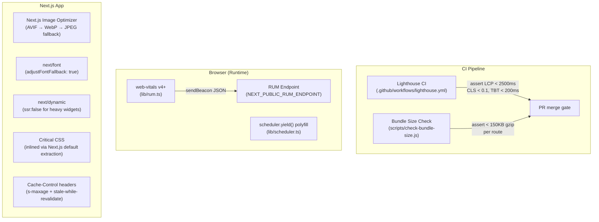

# Design: Web Performance Optimization

## Architecture

### System Context

This is an optimisation engagement on an existing Next.js App Router application. No new product features are added; changes are targeted and surgical: configuration files, component-level code modifications, new utility modules, and CI pipeline additions. The goal is measurable improvement across all three Core Web Vitals in both synthetic (Lighthouse CI) and field (RUM) data.

The optimisation surface spans four layers:

1. **Network / Delivery** — image format conversion, CDN caching headers, compression, resource hints (`preload`, `prefetch`).
2. **Render / Paint** — critical CSS inlining, font loading strategy, LCP image prioritisation.
3. **JavaScript Execution** — code splitting, dynamic imports, long-task breaking, `React.startTransition`, list virtualisation.
4. **Observability** — RUM instrumentation, Lighthouse CI, bundle-size CI gate.



### Component Design

The optimisation touches the following files and new modules. No new pages or product components are created.

```
lib/
  rum.ts                            RUM instrumentation: initRum(), onCWV(), sendBeacon wrapper
  scheduler.ts                      yieldToMain(): scheduler.yield() with setTimeout fallback
  vitals-attribution.ts             attributeVitals(): extract LCP element, INP target, CLS source

app/
  layout.tsx                        Add <link rel="preload"> for fonts; add <RumProvider> as last child
  _components/
    RumProvider.tsx                 (C) Mounts web-vitals listeners on client; fires sendBeacon

next.config.js                      images.formats: ['image/avif', 'image/webp'], compress: true,
                                    headers() for Cache-Control on static assets

scripts/
  check-bundle-size.js              Reads .next/build-manifest.json; asserts per-route JS ≤ 150 KB gzip
  convert-images.mjs                One-time script: converts existing JPEG/PNG assets to AVIF + WebP

.github/workflows/
  lighthouse.yml                    Lighthouse CI job: install, build, start server, run lhci autorun
  ci.yml                            Add bundle-size check step: node scripts/check-bundle-size.js

.lighthouserc.json                  lhci config: urls, assertions (lcp < 2500, cls < 0.1, tbt < 200)
```

## Data Models

```typescript
// lib/rum.ts

/** Shape of the JSON payload sent to the RUM endpoint */
export interface RumPayload {
  name: 'LCP' | 'INP' | 'CLS' | 'FCP' | 'TTFB';
  value: number;                   // raw metric value in ms (or unitless for CLS)
  rating: 'good' | 'needs-improvement' | 'poor';
  navigationType: string;          // e.g. 'navigate', 'reload', 'back-forward'
  url: string;                     // window.location.href
  deviceCategory: 'mobile' | 'tablet' | 'desktop';
  attribution?: Record<string, unknown>;  // from web-vitals attribution build
}

/** Fired additionally when any metric is in the "Poor" band */
export interface CwvPoorEvent {
  event: 'cwv_poor';
  metric: string;
  value: number;
  url: string;
}

// lib/scheduler.ts

/**
 * Yields to the browser main thread.
 * Uses scheduler.yield() when available (Chrome 115+),
 * falls back to a 0ms setTimeout Promise.
 */
export async function yieldToMain(): Promise<void> {
  if ('scheduler' in globalThis && typeof scheduler.yield === 'function') {
    return scheduler.yield();
  }
  return new Promise(resolve => setTimeout(resolve, 0));
}

// scripts/check-bundle-size.js (Node.js, not TypeScript)
// Reads .next/build-manifest.json and computes gzip size per route.
// Exits with code 1 if any route's JS exceeds LIMIT_KB (default 150 KB gzip).
```

## Files & Interfaces

| File | Change Type | Responsibility |
|---|---|---|
| `next.config.js` | Modify | Add `images.formats: ['image/avif', 'image/webp']`; `compress: true`; `async headers()` returning `Cache-Control: public, s-maxage=31536000, immutable` for `/_next/static/**`; `s-maxage=60, stale-while-revalidate=300` for API routes |
| `app/layout.tsx` | Modify | Add `<link rel="preload" as="font" crossorigin href="/fonts/Inter-Regular.woff2" type="font/woff2">` for each above-the-fold font file; move all `<Script strategy="afterInteractive">` or `strategy="lazyOnload"` for third-party scripts; append `<RumProvider>` |
| `app/_components/RumProvider.tsx` | Create | `'use client'`; `useEffect` with `onLCP`, `onINP`, `onCLS`, `onFCP`, `onTTFB` from `web-vitals/attribution`; each handler calls `sendRumPayload(metric)` |
| `lib/rum.ts` | Create | `initRum()` — registers all `web-vitals` handlers; `sendRumPayload(payload: RumPayload)` — `navigator.sendBeacon(endpoint, JSON.stringify(payload))` in try/catch; fires `cwv_poor` event when rating is `'poor'` |
| `lib/scheduler.ts` | Create | `yieldToMain()` — `scheduler.yield()` with `setTimeout` polyfill |
| `lib/vitals-attribution.ts` | Create | `attributeLcp(entry)`, `attributeInp(entry)`, `attributeCls(entry)` — extract `largestShiftTarget`, `interactionTarget`, `element` from attribution objects |
| `scripts/check-bundle-size.js` | Create | Node.js script; reads `.next/build-manifest.json`; for each route computes gzip size using `zlib.gzipSync`; logs table; exits 1 if any route exceeds `BUNDLE_LIMIT_KB` env var (default 150) |
| `scripts/convert-images.mjs` | Create | One-time ESM script using `sharp`; walks `public/images/`; for each JPEG/PNG writes an AVIF and WebP sibling with quality 80; logs size savings |
| `.lighthouserc.json` | Create | `lhci` config with `collect.url`, `assert.assertions` for `largest-contentful-paint`, `cumulative-layout-shift`, `total-blocking-time`, `server-response-time` |
| `.github/workflows/lighthouse.yml` | Create | GitHub Actions job: checkout, setup Node, `npm ci`, `next build`, `next start &`, wait for server, `npx lhci autorun`, upload `.lighthouseci/` as artifact, post PR comment |

## Accessibility

Performance optimisations must not degrade accessibility. The following checks are enforced:

- **`font-display: swap`** — ensures text is always visible (no FOIT); passes WCAG 1.4.3 (text visible regardless of font load state).
- **Skeleton fallbacks** — all `next/dynamic` skeletons include `role="status" aria-label="Loading..."` so screen readers announce the loading state.
- **Image `alt` preservation** — all `<Image>` component changes preserve existing `alt` attributes; the AVIF conversion script does not alter HTML.
- **Animation refactoring** — switching animations to `transform`/`opacity` does not affect keyboard or screen-reader interaction.
- **`scheduler.yield()` in event handlers** — yielding mid-handler does not break event handler semantics; the browser still processes the original event before yielding.

## Performance

### LCP

The LCP element on most pages is the hero image. The optimisation chain:

1. Image converted to AVIF (≤ 60 % of JPEG size) via `scripts/convert-images.mjs`.
2. `next/image` with `priority={true}` emits `<link rel="preload" fetchpriority="high" as="image">` in the document `<head>`.
3. `next.config.js` `images.formats` list prioritises AVIF over WebP.
4. CDN serves the AVIF from edge cache (`s-maxage=31536000, immutable` for hashed static assets).

Target: LCP < 2 500 ms on simulated 4G / 6× CPU throttle. Aspirational: < 2 000 ms.

### INP

INP is driven by Long Tasks. The optimisation strategy:

1. **Audit**: `PerformanceObserver` in RUM captures `event` entries with `interactionId`; INP Attribution identifies the offending handler.
2. **Yield**: Handlers confirmed as Long Tasks are refactored to call `await yieldToMain()` after every ≤ 50 ms chunk of synchronous work.
3. **`startTransition`**: Expensive React state updates (list filter, table sort) are wrapped in `React.startTransition` so React defers the re-render as non-urgent work.
4. **Virtualisation**: Lists > 100 items are migrated to `@tanstack/react-virtual`.
5. **Dynamic import**: Heavy Client Components are lazy-loaded with `next/dynamic({ ssr: false })`.

### CLS

1. All `` and `<Image>` elements gain explicit `width`/`height` (or `aspect-ratio` container).
2. `next/font` is used with `adjustFontFallback: true` to auto-generate `size-adjust` metrics.
3. Late-injected content (cookie banner, toasts) uses `fixed` positioning or pre-reserved space.
4. CSS animations are audited; `height`, `top`, `margin` animations are replaced with `transform`/`opacity`.

### Critical CSS

Next.js App Router inlines CSS Modules and global styles critical to above-the-fold rendering into the `<head>` `<style>` tags by default. The review confirms:
- No external `<link rel="stylesheet">` appears before `</head>` for above-the-fold styles.
- Third-party CSS (e.g., widget stylesheets) is loaded via `<link media="print" onload="this.media='all'">` trick or deferred via `<Script strategy="afterInteractive">`.

### Core Web Vitals Targets (with thresholds)

| Metric | Good (target) | Needs Improvement | Poor |
|--------|-------------|-------------------|------|
| LCP | < 2 500 ms (aspirational < 2 000 ms) | < 4 000 ms | ≥ 4 000 ms |
| INP | < 200 ms | < 500 ms | ≥ 500 ms |
| CLS | < 0.1 | < 0.25 | ≥ 0.25 |
| TTFB | < 800 ms | < 1 800 ms | ≥ 1 800 ms |

## Error Handling

| Error Path | Trigger | Handling |
|---|---|---|
| `sendBeacon` fails (RUM endpoint down) | Network error or `sendBeacon` returns `false` | Caught in try/catch; `console.warn('RUM send failed:', metric.name)` in non-production; no user-visible error |
| `scheduler.yield()` not supported | Browser lacks `scheduler` global | `yieldToMain()` polyfill silently falls back to `setTimeout(resolve, 0)` |
| Image AVIF not supported | Old browser (< 2022) | `next/image` `<picture>` element falls back to `<source type="image/webp">` then `` (JPEG) |
| Bundle size check fails | Route JS > 150 KB gzip | `scripts/check-bundle-size.js` exits 1; CI step fails; PR cannot merge; log identifies the offending route and its largest modules |
| Lighthouse CI fails threshold | LCP, CLS, or TBT breaches assertion | `lhci autorun` exits non-zero; GitHub Actions step fails; PR merge is blocked; artifact contains full Lighthouse HTML report for debugging |
| `convert-images.mjs` encounters corrupt image | `sharp` throws | Script logs error with file path and continues to next file; summary at end lists failed conversions for manual review |

## Testing Strategy

### Unit Tests (Vitest)

- `yieldToMain` — when `scheduler.yield` is defined, calls it; when absent, resolves after a 0ms setTimeout.
- `sendRumPayload` — calls `navigator.sendBeacon` with correct URL and serialised JSON; when `sendBeacon` unavailable, no-ops without throwing; when rating is `'poor'`, fires additional `cwv_poor` event.
- `inferDeviceCategory` — UA string with "Mobile" → `'mobile'`; "iPad" → `'tablet'`; desktop UA → `'desktop'`.
- `check-bundle-size.js` (Node test) — mocked `.next/build-manifest.json` with one route under limit and one over; assert exit code 1 and correct log output.

### Integration / Smoke Tests

- **RumProvider mount** — render `<RumProvider>` in RTL with mocked `web-vitals` handlers; assert all five `on*` functions are called with a handler; simulate a metric dispatch and assert `sendBeacon` was called with correct payload shape.
- **`yieldToMain` in a long handler** — mock a handler that calls `yieldToMain()` between iterations; verify with `performance.now()` that each iteration completes in < 50 ms wall time (using Vitest fake timers).

### Synthetic Tests (Lighthouse CI — `.github/workflows/lighthouse.yml`)

- **Audited URLs**: home page (`/`), a dynamic data page (`/dashboard`), a content-heavy page (`/blog/[slug]`).
- **Assertions** (per `.lighthouserc.json`):
  - `largest-contentful-paint` ≤ 2 500 ms (numeric, not score)
  - `cumulative-layout-shift` ≤ 0.1
  - `total-blocking-time` ≤ 200 ms
  - `server-response-time` ≤ 800 ms
  - `uses-optimized-images` audit: no failures
  - `uses-webp-images` audit: no failures (AVIF/WebP served)
- **Device**: Moto G Power profile (4G throttling, 6× CPU slowdown).
- **Artifacts**: Full HTML Lighthouse report uploaded per run; PR comment with metric summary table.

### Field Monitoring (RUM)

- Deploy `RumProvider` to production.
- After 48 hours, query RUM endpoint for p75 LCP, INP, CLS per page.
- Establish baseline; configure alert if p75 LCP > 2 500 ms or p75 INP > 200 ms for any page receiving > 100 sessions/day.
- Compare CrUX data in Google Search Console after 28 days to validate field improvements.
