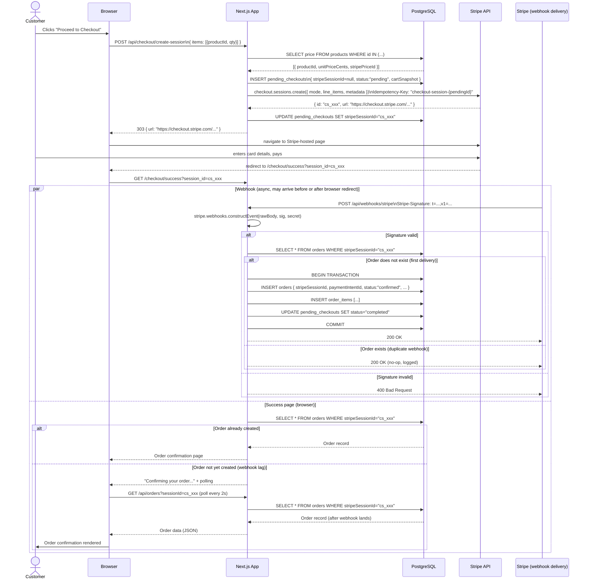
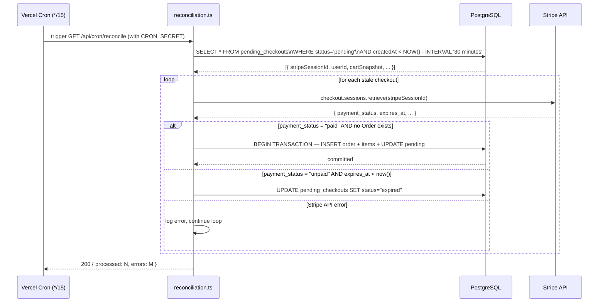

# Design: Stripe Checkout

## Architecture

### System Context

The Stripe Checkout feature spans three runtime contexts: the Next.js application (App Router, deployed on Vercel), the Stripe-hosted payment page, and the Stripe API platform. The Next.js app handles session creation (server-side only), return URL pages, webhook ingestion, order display, and a background reconciliation cron. No card data ever touches the application server.

```
Browser              Next.js App (Vercel)         Stripe Platform
  │                        │                             │
  │  POST /api/checkout/   │                             │
  │    create-session      │   stripe.checkout.sessions  │
  │──────────────────────> │ ──.create(...)──────────────>│
  │                        │ <────────── { url, id } ────│
  │ <── 303 { url } ───────│                             │
  │                        │                             │
  │ ── navigate(url) ──────────────────────────────────> │ (Stripe-hosted)
  │ <──────────────── payment form ─────────────────────│
  │                        │                             │
  │ (customer pays)        │   POST /api/webhooks/stripe │
  │                        │ <── checkout.session.       │
  │                        │      completed ─────────────│
  │                        │ ── verify sig + upsert ──>DB│
  │                        │ <── 200 OK ────────────────>│
  │                        │                             │
  │ ── /checkout/success ─>│                             │
  │ <── Order summary ─────│                             │
```

### Component Design

```
app/
├── (shop)/
│   ├── cart/
│   │   └── page.tsx                  # CartPage (Server Component)
│   │       └── CartClient.tsx        # "Proceed to Checkout" button (Client)
│   └── checkout/
│       ├── success/
│       │   └── page.tsx              # SuccessPage (Server Component)
│       │       └── OrderPoller.tsx   # polls /api/orders until Order appears (Client)
│       └── cancel/
│           └── page.tsx              # CancelPage (Server Component, reads cart)
├── account/
│   └── orders/
│       ├── page.tsx                  # OrderListPage (Server Component, paginated)
│       └── [orderId]/
│           └── page.tsx              # OrderDetailPage (Server Component)
│
├── api/
│   ├── checkout/
│   │   └── create-session/
│   │       └── route.ts             # POST handler — creates Stripe Checkout Session
│   ├── webhooks/
│   │   └── stripe/
│   │       └── route.ts             # POST handler — processes Stripe webhook events
│   └── orders/
│       └── [orderId]/
│           └── route.ts             # GET handler — authenticated order detail
│
lib/
├── stripe.ts                        # Stripe SDK singleton (server-only)
├── checkout/
│   ├── create-session.ts            # Business logic: resolve prices, build line_items
│   ├── webhook-handler.ts           # Business logic: verify sig, idempotent upsert
│   └── schemas.ts                   # Shared Zod schemas for request/response
├── db/
│   ├── orders.ts                    # Repository: createOrder, findBySessionId
│   └── pending-checkouts.ts         # Repository: create, markCompleted, markExpired
└── jobs/
    └── reconciliation.ts            # Cron job: query stale pending_checkouts
```

**Key constraint:** `lib/stripe.ts` is imported only in server-side modules. The `server-only` package is used to enforce this at build time.

## Sequence Diagrams

### Full Checkout and Webhook Lifecycle



### Reconciliation Job Lifecycle



## Data Models

### Prisma Schema

```prisma
model PendingCheckout {
  id              String   @id @default(cuid())
  userId          String
  stripeSessionId String?  @unique
  status          PendingCheckoutStatus @default(PENDING)
  cartSnapshot    Json     // CartItem[]
  createdAt       DateTime @default(now())
  updatedAt       DateTime @updatedAt

  user  User   @relation(fields: [userId], references: [id])
  order Order?

  @@index([status, createdAt])
}

enum PendingCheckoutStatus {
  PENDING
  COMPLETED
  EXPIRED
}

model Order {
  id                   String      @id @default(cuid())
  userId               String
  pendingCheckoutId    String      @unique
  stripeSessionId      String      @unique
  stripePaymentIntentId String     @unique
  status               OrderStatus @default(CONFIRMED)
  currency             String      // ISO 4217, e.g. "usd"
  totalAmountCents     Int
  createdAt            DateTime    @default(now())
  updatedAt            DateTime    @updatedAt

  user            User            @relation(fields: [userId], references: [id])
  pendingCheckout PendingCheckout @relation(fields: [pendingCheckoutId], references: [id])
  items           OrderItem[]
  payment         Payment?

  @@index([userId, createdAt(sort: Desc)])
}

enum OrderStatus {
  CONFIRMED
  REFUNDED
  DISPUTED
  CANCELLED
}

model OrderItem {
  id             String @id @default(cuid())
  orderId        String
  productId      String
  name           String
  quantity       Int
  unitPriceCents Int

  order   Order   @relation(fields: [orderId], references: [id], onDelete: Cascade)
  product Product @relation(fields: [productId], references: [id])
}

model Payment {
  id                    String        @id @default(cuid())
  orderId               String        @unique
  stripePaymentIntentId String        @unique
  amountCents           Int
  currency              String
  status                PaymentStatus
  stripeChargeId        String?
  receiptUrl            String?
  createdAt             DateTime      @default(now())

  order Order @relation(fields: [orderId], references: [id])
}

enum PaymentStatus {
  SUCCEEDED
  REQUIRES_ACTION
  FAILED
}
```

### TypeScript Types (application layer)

```typescript
// lib/checkout/schemas.ts
import { z } from "zod";

export const CartItemSchema = z.object({
  productId: z.string().cuid(),
  quantity:  z.number().int().min(1).max(100),
});

export const CreateSessionRequestSchema = z.object({
  items: z.array(CartItemSchema).min(1).max(50),
});

export const CreateSessionResponseSchema = z.object({
  url: z.string().url(),
});

export type CartItem            = z.infer<typeof CartItemSchema>;
export type CreateSessionRequest  = z.infer<typeof CreateSessionRequestSchema>;
export type CreateSessionResponse = z.infer<typeof CreateSessionResponseSchema>;
```

## API Design

### POST /api/checkout/create-session

Creates a Stripe Checkout Session from the customer's cart. Requires an authenticated session (NextAuth `getServerSession`).

**Request**

```http
POST /api/checkout/create-session
Content-Type: application/json
Cookie: next-auth.session-token=...

{
  "items": [
    { "productId": "clxyz123", "quantity": 2 },
    { "productId": "clxyz456", "quantity": 1 }
  ]
}
```

**Success Response — 303**

```http
HTTP/1.1 303 See Other
Content-Type: application/json

{
  "url": "https://checkout.stripe.com/c/pay/cs_test_a1Bcd..."
}
```

**Error Responses**

| Status | Body `error` | Condition |
|--------|-------------|-----------|
| 400 | `"CART_EMPTY"` | `items` array is empty |
| 400 | `"INVALID_PRODUCT"` | One or more `productId`s not found in catalog |
| 401 | `"UNAUTHENTICATED"` | No valid session cookie |
| 502 | `"STRIPE_ERROR"` | Stripe API unavailable |

**Stripe API objects used:**

- `stripe.checkout.sessions.create({ mode: "payment", line_items, success_url, cancel_url, metadata, customer_email, payment_method_types })`
- Returns `Stripe.Checkout.Session` — the `url` field is forwarded to the client.

**Implementation notes:**

```typescript
// lib/checkout/create-session.ts (server only)
import "server-only";
import Stripe from "stripe";
import { stripe } from "@/lib/stripe";
import { db } from "@/lib/db";

export async function createCheckoutSession(
  userId: string,
  items: CartItem[]
): Promise<{ url: string }> {
  // 1. Resolve prices server-side — never trust client amounts
  const products = await db.product.findMany({
    where: { id: { in: items.map(i => i.productId) } },
    select: { id: true, name: true, stripePriceId: true, priceCents: true },
  });

  if (products.length !== items.length) {
    throw new InvalidProductError();
  }

  // 2. Create pending_checkout record to enable reconciliation
  const pending = await db.pendingCheckout.create({
    data: { userId, cartSnapshot: items },
  });

  // 3. Build Stripe line_items from server-resolved prices
  const lineItems: Stripe.Checkout.SessionCreateParams.LineItem[] = items.map(item => {
    const product = products.find(p => p.id === item.productId)!;
    return { price: product.stripePriceId, quantity: item.quantity };
  });

  // 4. Create session with idempotency key
  const session = await stripe.checkout.sessions.create(
    {
      mode: "payment",
      line_items:  lineItems,
      success_url: `${process.env.NEXT_PUBLIC_URL}/checkout/success?session_id={CHECKOUT_SESSION_ID}`,
      cancel_url:  `${process.env.NEXT_PUBLIC_URL}/checkout/cancel`,
      metadata:    { internalOrderRef: pending.id },
      customer_email: undefined, // populated from session if available
      payment_method_types: ["card"],
    },
    { idempotencyKey: `checkout-session-${pending.id}` }
  );

  // 5. Store session ID for later webhook correlation
  await db.pendingCheckout.update({
    where: { id: pending.id },
    data:  { stripeSessionId: session.id },
  });

  return { url: session.url! };
}
```

### POST /api/webhooks/stripe

Receives and processes Stripe webhook events. Must use the **raw request body** (not the parsed JSON body) for signature verification — requires bypassing Next.js body parsing.

**Request (from Stripe)**

```http
POST /api/webhooks/stripe
Content-Type: application/json
Stripe-Signature: t=1718000000,v1=abc123...,v0=def456...

{ "id": "evt_xxx", "type": "checkout.session.completed", "data": { "object": { ... } } }
```

**Response**

| Status | Condition |
|--------|-----------|
| 200 | Event processed (or safely ignored) |
| 400 | Signature verification failed |
| 500 | Database error (triggers Stripe retry) |

**Supported event types:**

| Event | Action |
|-------|--------|
| `checkout.session.completed` | Create Order if `payment_status === "paid"` |
| `checkout.session.async_payment_succeeded` | Create Order for async payment methods (BACS, SEPA) |
| `checkout.session.async_payment_failed` | Mark pending_checkout as failed, notify customer |

**Route handler — raw body access:**

```typescript
// app/api/webhooks/stripe/route.ts
import { NextRequest, NextResponse } from "next/server";
import { stripe } from "@/lib/stripe";
import { handleCheckoutSessionCompleted } from "@/lib/checkout/webhook-handler";

export const runtime = "nodejs"; // required for raw body buffer access

export async function POST(req: NextRequest) {
  const rawBody  = await req.text();
  const signature = req.headers.get("stripe-signature") ?? "";

  let event: Stripe.Event;
  try {
    event = stripe.webhooks.constructEvent(
      rawBody,
      signature,
      process.env.STRIPE_WEBHOOK_SECRET!
    );
  } catch (err) {
    console.warn("[stripe-webhook] signature verification failed", err);
    return NextResponse.json({ error: "Invalid signature" }, { status: 400 });
  }

  switch (event.type) {
    case "checkout.session.completed":
    case "checkout.session.async_payment_succeeded":
      await handleCheckoutSessionCompleted(event.data.object as Stripe.Checkout.Session);
      break;
    default:
      // Log but return 200 so Stripe stops retrying unknown types
      console.info(`[stripe-webhook] unhandled event type: ${event.type}`);
  }

  return NextResponse.json({ received: true });
}
```

### GET /api/orders/[orderId]

Returns an Order and its items for the authenticated owner or an admin.

**Response — 200**

```typescript
{
  id:                    string;
  stripeSessionId:       string;
  status:                "CONFIRMED" | "REFUNDED" | "DISPUTED" | "CANCELLED";
  currency:              string;
  totalAmountCents:      number;
  createdAt:             string; // ISO 8601
  items: {
    productId:      string;
    name:           string;
    quantity:       number;
    unitPriceCents: number;
  }[];
  payment: {
    stripePaymentIntentId: string;
    amountCents:           number;
    receiptUrl:            string | null;
  };
}
```

## Webhook Handling

### Signature Verification

Stripe signs every webhook delivery with an HMAC-SHA256 signature. The `Stripe-Signature` header contains a timestamp (`t=`) and one or more signatures (`v1=`). The `stripe.webhooks.constructEvent` SDK method:

1. Reconstructs the signed payload as `${timestamp}.${rawBody}`.
2. Computes HMAC-SHA256 using `STRIPE_WEBHOOK_SECRET`.
3. Compares against `v1` signatures using a constant-time comparison.
4. Rejects events where the timestamp is older than 300 seconds (replay protection).

**Critical:** `STRIPE_WEBHOOK_SECRET` differs between local development (Stripe CLI forwards) and production (dashboard endpoint secret). Use `STRIPE_WEBHOOK_SECRET_LOCAL` in `.env.local` and `STRIPE_WEBHOOK_SECRET` in Vercel environment variables.

### Idempotency Strategy

The webhook handler uses a **check-then-insert with unique constraint fallback** pattern:

```typescript
// lib/checkout/webhook-handler.ts
export async function handleCheckoutSessionCompleted(
  session: Stripe.Checkout.Session
): Promise<void> {
  if (session.payment_status !== "paid") {
    console.info(`[webhook] session ${session.id} not paid, skipping order creation`);
    return;
  }

  // Application-level idempotency check (fast path)
  const existing = await db.order.findUnique({
    where: { stripeSessionId: session.id },
  });
  if (existing) {
    console.info(`[webhook] duplicate event for session ${session.id}, skipping`);
    return;
  }

  const pending = await db.pendingCheckout.findUniqueOrThrow({
    where: { stripeSessionId: session.id },
  });

  try {
    await db.$transaction(async (tx) => {
      const order = await tx.order.create({
        data: {
          userId:                pending.userId,
          pendingCheckoutId:     pending.id,
          stripeSessionId:       session.id,
          stripePaymentIntentId: session.payment_intent as string,
          status:                "CONFIRMED",
          currency:              session.currency!,
          totalAmountCents:      session.amount_total!,
          items: {
            create: (pending.cartSnapshot as CartItem[]).map(item => ({
              productId:      item.productId,
              name:           item.name,
              quantity:       item.quantity,
              unitPriceCents: item.unitPriceCents,
            })),
          },
          payment: {
            create: {
              stripePaymentIntentId: session.payment_intent as string,
              amountCents:           session.amount_total!,
              currency:              session.currency!,
              status:                "SUCCEEDED",
            },
          },
        },
      });

      await tx.pendingCheckout.update({
        where: { id: pending.id },
        data:  { status: "COMPLETED" },
      });

      return order;
    });
  } catch (err) {
    // Unique constraint violation = race condition lost; treat as duplicate
    if (isPrismaUniqueConstraintError(err)) {
      console.info(`[webhook] race condition on session ${session.id}, already created`);
      return;
    }
    throw err; // re-throw so the route handler returns 500 → Stripe retries
  }
}
```

### Retry Behavior

Stripe retries failed webhook deliveries (non-2xx responses) with exponential back-off over 72 hours (up to 25 attempts). The handler MUST return 200 for:
- Successful processing
- Duplicate events (already processed)
- Irrelevant event types

The handler MUST return 500 for database errors so Stripe retries until the issue is resolved.

## Error Handling

| Scenario | Handler behavior | HTTP status | User impact |
|----------|-----------------|-------------|-------------|
| Empty cart submitted | Reject before Stripe call | 400 | Error message in cart |
| Unknown product ID | Reject before Stripe call | 400 | Error message in cart |
| Stripe API unavailable | Return 502, log error | 502 | Toast "Try again" |
| Card declined | Stripe handles on hosted page | n/a | Stripe shows decline message |
| Webhook signature invalid | Log warning, reject | 400 | None (Stripe stops retrying after repeated 400s) |
| Duplicate webhook | Silent no-op, return 200 | 200 | None |
| DB error during order creation | Re-throw, return 500 | 500 | None (Stripe retries) |
| Session expired before customer pays | Reconciliation marks expired | n/a | Customer sees cancel page |
| Success page but Order not yet in DB | Client polls for 30s | n/a | "Confirming…" message |
| Order not found after 30s polling | Show support link | n/a | Order reference displayed |

## Security

1. **Server-side price resolution.** Unit prices are never read from the request body. The server queries the database by `productId` for every session creation (R1.2). A client that tampers with amounts will receive a `400 INVALID_PRODUCT` or the session will be created at the correct server price.

2. **Webhook signature verification.** Every inbound request to `/api/webhooks/stripe` is verified via HMAC before any database operation (R4.1–R4.2). The raw body buffer is used — parsing the body first invalidates the signature.

3. **`server-only` boundary.** `lib/stripe.ts` imports the Stripe SDK with the secret key. The `server-only` package is listed as a dependency and imported at the top of `lib/stripe.ts` to cause a build error if the module is accidentally imported by a Client Component.

4. **Environment variable discipline.** `STRIPE_SECRET_KEY`, `STRIPE_WEBHOOK_SECRET`, and `DATABASE_URL` are never prefixed with `NEXT_PUBLIC_`. Only `NEXT_PUBLIC_STRIPE_PUBLISHABLE_KEY` (if used for Elements fallback) is exposed to the client bundle.

5. **Authentication on order endpoints.** `GET /api/orders/[orderId]` verifies `session.user.id === order.userId` or `session.user.role === "ADMIN"` before returning data (R6.4).

6. **Idempotency key on Stripe API calls.** Prevents double charges on network retries (R5.4).

7. **Database unique constraints.** `Order.stripeSessionId` and `Order.stripePaymentIntentId` have `@unique` constraints as a last-resort guard (R5.1).

8. **CRON_SECRET header check.** The reconciliation endpoint at `/api/cron/reconcile` verifies `Authorization: Bearer ${CRON_SECRET}` to prevent unauthorized triggering.

## Testing Strategy

### Unit Tests (Vitest)

- `lib/checkout/create-session.ts`: mock `db.product.findMany` and `stripe.checkout.sessions.create`; assert `line_items` built from DB prices, not request body; assert `InvalidProductError` thrown when count mismatches.
- `lib/checkout/webhook-handler.ts`: mock `db` transaction; assert idempotency (call twice with same session ID, verify `order.create` called once); assert 200 returned on unique constraint error.
- `lib/checkout/schemas.ts`: Zod schema edge cases — empty items array, quantity 0, invalid CUID.

### Integration Tests (Vitest + test database)

- `POST /api/checkout/create-session`: seed products; call with valid cart; assert `pending_checkout` row created; assert Stripe `sessions.create` called with correct `line_items`.
- `POST /api/webhooks/stripe`: construct a real signed payload using `stripe.webhooks.generateTestHeaderString`; assert Order + Payment rows created in one transaction; call again with same payload; assert exactly one Order row.
- Invalid signature: assert 400, assert no DB writes.

### Stripe CLI Webhook Testing (local development)

```bash
# Forward Stripe events to local dev server
stripe listen --forward-to localhost:3000/api/webhooks/stripe

# Trigger a specific event
stripe trigger checkout.session.completed

# Trigger with a specific session (for idempotency testing)
stripe trigger checkout.session.completed \
  --override checkout_session:payment_status=paid

# Replay a recorded event
stripe events resend evt_xxx
```

The `STRIPE_WEBHOOK_SECRET` for local testing is the `whsec_xxx` secret printed by `stripe listen`.

### E2E Tests (Playwright)

- **Happy path:** add item to cart → click "Proceed to Checkout" → Stripe test card `4242 4242 4242 4242` → assert redirect to `/checkout/success` → assert Order row in DB → assert order appears in `/account/orders`.
- **Card declined:** Stripe test card `4000 0000 0000 0002` → assert no redirect to success → assert no Order row → assert cart contents preserved on cancel URL.
- **Duplicate webhook:** use `stripe events resend` in test setup; assert exactly one Order row after two deliveries.
- **Reconciliation:** seed a stale `pending_checkout` with `paid` status from Stripe fixture; trigger cron endpoint; assert Order created.

Playwright tests use Stripe's [test clock](https://stripe.com/docs/billing/testing/test-clocks) for time-sensitive scenarios (session expiry).
