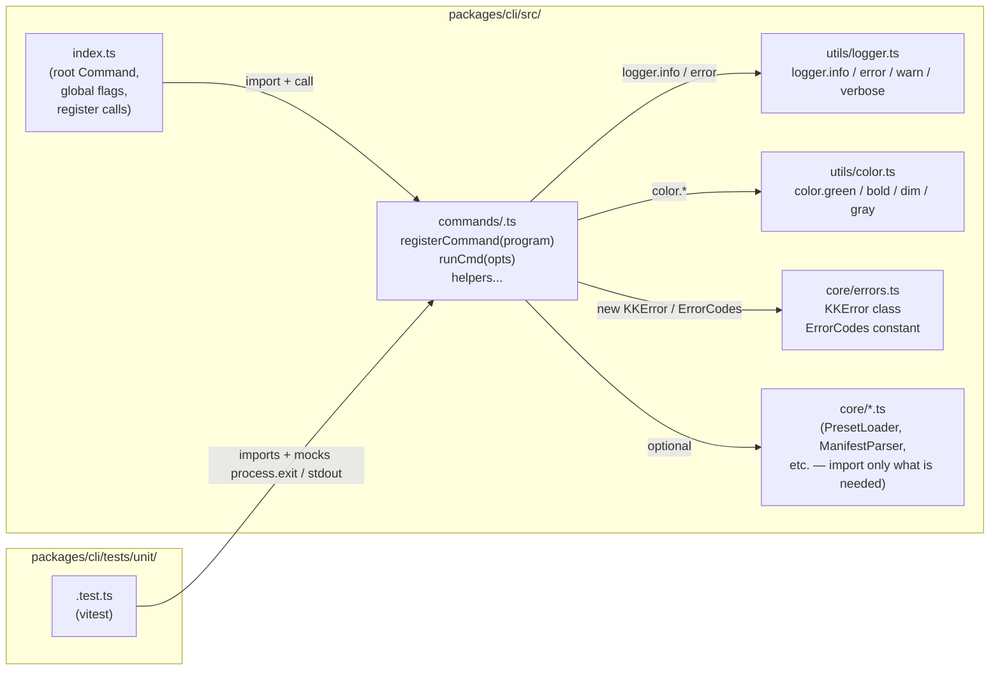
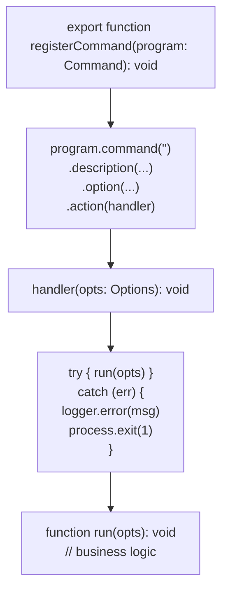

# Design: Add a CLI Command

## Architecture

### System Context

The kiro-kit CLI entry point is `packages/cli/src/index.ts`. It constructs a root `Command` object from the Commander library, registers global flags (`--verbose`, `--quiet`, `--no-color`), then calls each `register*Command(program)` function in sequence. Each call attaches a subcommand subtree. When the user invokes `kiro-kit <cmd>`, Commander routes to the matching `.action()` handler.

All commands share infrastructure from `packages/cli/src/utils/` (`logger`, `color`, `paths`, `fs-safe`) and `packages/cli/src/core/` (`errors`, `ManifestParser`, `PresetLoader`, etc.). A new command imports only what it needs — the architecture deliberately avoids a god-object that every command depends on.

tsup bundles the entire `src/` tree into `dist/index.js` (ESM). The `bin` entry in `package.json` points to `dist/index.js`.

### Component Design



### Command Module Internal Structure



The separation of `run<Cmd>` from the `register` function is the same pattern used in `spec.ts` (`runSpecNew`), `list.ts` (`runList`), `doctor.ts`, etc. It makes the business logic unit-testable without invoking Commander.

## Data Models

### Command Options Interface

Each command defines a local options interface matching the flags registered with `.option()`:

```typescript
// packages/cli/src/commands/<cmd>.ts

interface <Cmd>Options {
  flag?: boolean;       // e.g., --json
  param?: string;       // e.g., --preset <name>
  // ...
}
```

### Error Code Extension

New entries in `packages/cli/src/core/errors.ts` follow the existing numbering scheme:

```typescript
export const ErrorCodes = {
  // ... existing codes up to KK100 (SPEC_INVALID_TEMPLATE) ...
  NEW_FAILURE_MODE: 'KK<NNN>',  // next available slot
} as const;
```

The `KKError` constructor signature is:
```typescript
new KKError(code: string, message: string, suggestion?: string)
```

`KKError.format()` produces: `[KK<NNN>] <message>\n  Suggestion: <suggestion>`.

## Files and Interfaces

### Files Created

| Path | Description |
|---|---|
| `packages/cli/src/commands/<cmd>.ts` | Command module: `register<Cmd>Command`, `run<Cmd>`, options interface |
| `packages/cli/tests/unit/<cmd>.test.ts` | Vitest unit tests covering success, failure, and flag variations |

### Files Modified

| File | Change |
|---|---|
| `packages/cli/src/index.ts` | Add `import` and `register<Cmd>Command(program)` call |
| `packages/cli/src/core/errors.ts` | Add new `KK<NNN>` constant to `ErrorCodes` (only if new failure modes exist) |
| `README.md` (repo root) | Add row to commands reference table |

## Command Style Reference

The following conventions are enforced by code review. They are derived from the existing commands:

| Convention | Example from codebase |
|---|---|
| Import `Command` from `'commander'` | All command files |
| Import `process` from `'node:process'` | `spec.ts` line 4 |
| Export exactly one `register<Cmd>Command(program: Command): void` function | `registerSpecCommand`, `registerListCommand`, `registerDoctorCommand` |
| Use `logger.error(msg)` then `process.exit(1)` on errors — never `throw` past the action handler | `spec.ts` lines 207–210 |
| Use `process.stdout.write(...)` for primary output, not `console.log` | `list.ts` lines 95–98, `spec.ts` lines 185–191 |
| Wrap the action body in `try { run<Cmd>(...) } catch (err) { ... }` | `spec.ts` lines 203–211, `list.ts` lines 45–52 |
| Separate business logic into a private `run<Cmd>` function | `runSpecNew`, `runList` |
| Apply `color.green(...)`, `color.bold(...)`, `color.dim(...)` from `utils/color.ts` | `list.ts` lines 94–97 |

## Error Handling

| Scenario | Expected behavior |
|---|---|
| Known `KKError` thrown in `run<Cmd>` | Caught in action handler; `logger.error(err.message)` then `process.exit(1)` |
| Unknown error (generic `Error`) | Caught with `err instanceof Error ? err.message : String(err)`; `process.exit(1)` |
| Invalid option value | Validate early in `run<Cmd>`; throw `new KKError(ErrorCodes.RELEVANT_CODE, ...)` |
| Missing required argument | Commander handles via `.argument('<required>')` declaration; Commander prints usage and exits before the action fires |

## Testing Strategy

### Unit Tests (vitest)

Test file: `packages/cli/tests/unit/<cmd>.test.ts`

Every test file stubs `process.exit` and spies on `process.stdout.write` and `logger.error` to avoid side effects. The pattern used across the existing test suite:

```typescript
import { describe, it, expect, vi, beforeEach } from 'vitest';

// Spy on process.exit so tests don't terminate the runner
const exitSpy = vi.spyOn(process, 'exit').mockImplementation((() => {}) as never);
const writeSpy = vi.spyOn(process.stdout, 'write').mockImplementation(() => true);
```

**Required test cases:**

1. **Success path** — call `run<Cmd>` with valid inputs; assert `writeSpy` called with expected output substring; assert `exitSpy` not called with non-zero code.
2. **Error path per failure mode** — call `run<Cmd>` with invalid inputs; assert `exitSpy` called with `1`; assert `logger.error` called with the correct `KKError` message or the expected string.
3. **Flag variation tests** — for each `.option()` flag, exercise both the flag-present and flag-absent paths.

### TypeCheck

```bash
pnpm -r typecheck
```

Must pass after adding the command module and any `errors.ts` changes.

### Build

```bash
pnpm -r build
```

Must complete without errors. The tsup bundler emits `dist/index.js`; the new command module is included automatically because tsup follows imports from `index.ts`.

### Smoke Test

```bash
node packages/cli/dist/index.js <cmd> --help
node packages/cli/dist/index.js <cmd> <valid-args>
```

Confirms the command is reachable via the compiled binary and produces expected output.
