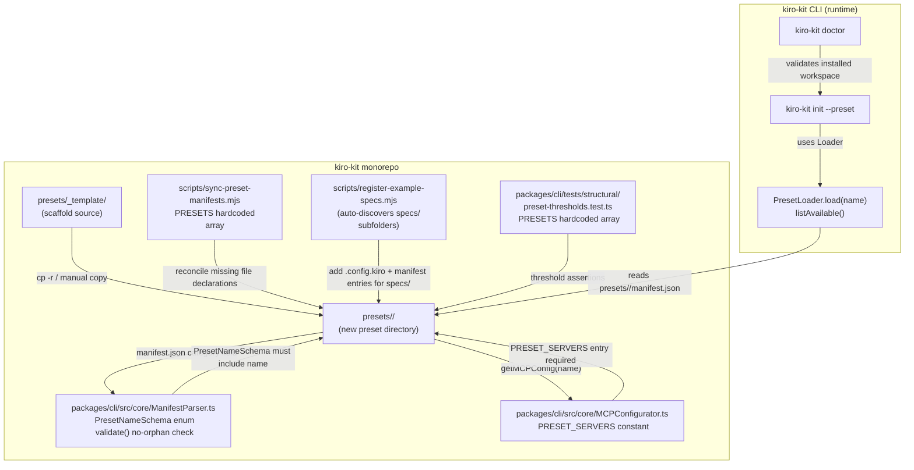
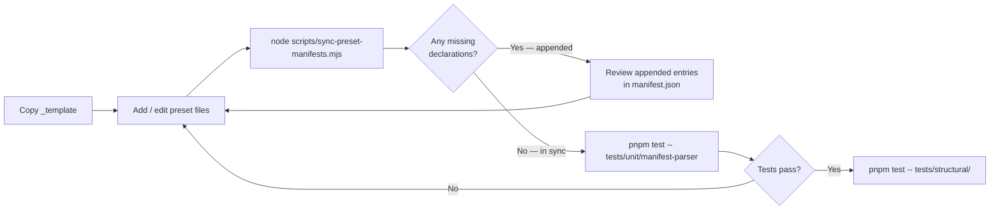

# Design: Add a New Preset

## Architecture

### System Context

A kiro-kit preset is a self-contained directory tree that `kiro-kit init` reads at runtime. The CLI discovers presets through `PresetLoader.listAvailable()`, which scans `presets/` (or the bundled `dist/presets/`) for subdirectories that are not `_`-prefixed and that contain a `manifest.json`. The manifest is parsed and schema-validated by `ManifestParser.parse()` before any files are copied. A second pass, `ManifestParser.validate()`, confirms that disk state and manifest declarations are in sync (no missing files, no orphans).

Adding a new preset therefore requires changes in three layers simultaneously:

1. **Data layer** — the preset directory itself (artifacts + `manifest.json`).
2. **Schema layer** — `PresetNameSchema` in `ManifestParser.ts` and `PRESET_SERVERS` in `MCPConfigurator.ts`.
3. **Test / tooling layer** — the `PRESETS` array in `preset-thresholds.test.ts` and `sync-preset-manifests.mjs`.

### Component Design



## Data Models

### manifest.json Shape

```typescript
// Reflects ManifestSchema from packages/cli/src/core/ManifestParser.ts
interface Manifest {
  name: string;             // e.g. "kiro-kit-dev"
  version: string;          // semver, e.g. "1.0.0"
  description: string;      // one-line description
  category: PresetName;     // must match PresetNameSchema enum value
  files: FileEntry[];       // EVERY file in the preset directory (except manifest.json + README.md)
  dependencies?: PresetName[];
  mcpServers?: Record<string, MCPServerDef>;
  hooks?: HookConfig;
  tags?: string[];
  minCounts?: MinCounts;
}

type PresetName =
  | 'frontend' | 'backend' | 'fullstack'
  | 'mobile' | 'devops' | 'data-ai';
  // NEW name added here

interface FileEntry {
  source: string;   // path relative to preset root, e.g. "agents/researcher.md"
  target: string;   // path relative to workspace root, e.g. ".kiro/agents/researcher.md"
  type: ArtifactType;
  executable?: boolean;
}

type ArtifactType =
  | 'steering' | 'hook' | 'mcp' | 'skill' | 'agent'
  | 'command' | 'workflow' | 'statusline' | 'metadata'
  | 'settings' | 'env' | 'spec' | 'docs' | 'doc'
  | 'config' | 'other' | 'powers';
```

### MCPPresetConfig Shape

```typescript
// From packages/cli/src/core/MCPConfigurator.ts
const PRESET_SERVERS: Record<string, { default: string[]; optional: string[] }> = {
  // existing presets ...
  '<name>': {
    default: ['filesystem', 'git', 'fetch', 'memory'],  // credential-free; auto-enabled
    optional: ['github', 'sentry'],                      // credentialed; scaffolded disabled
  },
};
```

### Artifact Threshold Invariants

The structural test in `packages/cli/tests/structural/preset-thresholds.test.ts` uses these counting functions:

| Counter | Counts | Source dir | Minimum |
|---|---|---|---|
| `countMdFiles` | all `*.md` files (recursive) | `agents/` | 16 |
| `countSkillFolders` | directories containing `SKILL.md` or sub-dirs with `SKILL.md` | `skills/` | 22 |
| `countMdFiles` | all `*.md` files (recursive) | `commands/` | 40 |
| `countHookSets` | `*.js` files (flat) | `hooks/` | 6 |
| `countWorkflows` | `*.md` files (flat) | `workflows/` | 4 |

## Files and Interfaces

### Files Created (preset directory)

| Path | Description |
|---|---|
| `presets/<name>/manifest.json` | Schema-validated preset manifest |
| `presets/<name>/README.md` | Human-readable description |
| `presets/<name>/agents/*.md` | At least 16 agent persona files |
| `presets/<name>/skills/<skill>/SKILL.md` | At least 22 skill folders |
| `presets/<name>/commands/**/*.md` | At least 40 command templates |
| `presets/<name>/hooks/*.js` | At least 6 hook scripts (+ optional `.sh`/`.ps1` pairs) |
| `presets/<name>/workflows/*.md` | At least 4 workflow documents |
| `presets/<name>/steering/*.md` | Context-aware steering files |
| `presets/<name>/statusline.js` | Node statusline script |
| `presets/<name>/statusline.sh` | Unix shell fallback (executable: true) |
| `presets/<name>/statusline.ps1` | PowerShell fallback |
| `presets/<name>/settings.json` | Settings template |
| `presets/<name>/.mcp.json.example` | MCP server config template |
| `presets/<name>/.env.example` | Environment variable template |
| `presets/<name>/powers.json` | Kiro Powers extension list |

### Files Modified (monorepo source)

| File | Change |
|---|---|
| `packages/cli/src/core/ManifestParser.ts` | Add new name literal to `PresetNameSchema` Zod enum |
| `packages/cli/src/core/MCPConfigurator.ts` | Add entry to `PRESET_SERVERS` constant |
| `packages/cli/tests/structural/preset-thresholds.test.ts` | Append new name to `PRESETS` array |
| `scripts/sync-preset-manifests.mjs` | Append new name to `PRESETS` array |
| `README.md` (repo root) | Add row to presets table |

## Manifest Authoring Flow

Authoring the manifest without orphans is the most common failure point. The recommended flow:



The script is idempotent: running it a second time after it already synced changes nothing.

## Error Handling

| Error Code | Trigger | Resolution |
|---|---|---|
| KK010 | `manifest.json` is not valid JSON | Fix JSON syntax |
| KK011 | `category` not in `PresetNameSchema` | Add name to the enum in `ManifestParser.ts` |
| KK012 | Path in `manifest.files[].source` does not exist on disk | Create the missing file or remove the declaration |
| KK013 | File on disk not declared in `manifest.files` | Run `sync-preset-manifests.mjs` or manually declare |
| KK020 | Preset directory not found | Confirm directory name matches the string passed to `kiro-kit init --preset` |
| KK021 | Preset `manifest.json` missing | Ensure `manifest.json` exists at `presets/<name>/manifest.json` |

## Testing Strategy

### Unit Tests (existing — no new tests required in this spec)

`packages/cli/tests/unit/manifest-parser.test.ts` already covers:
- `parse()` with valid and invalid JSON
- `validate()` no-orphan and file-completeness checks for the existing presets

The new preset automatically exercises these tests once it is loaded by the structural test.

### Structural Tests

`packages/cli/tests/structural/preset-thresholds.test.ts` — after adding the new name to `PRESETS`, the test runner generates five `it` blocks for the new preset. All must pass before the PR is merged.

Run subset:
```bash
pnpm test -- tests/structural/preset-thresholds.test.ts
```

### Integration — Local Install

```bash
mkdir /tmp/kk-test-<name> && cd /tmp/kk-test-<name>
node /path/to/repo/packages/cli/dist/index.js init --preset <name> --yes
node /path/to/repo/packages/cli/dist/index.js doctor
```

Expected: zero error lines from `doctor`, correct file count in the summary screen.

### TypeScript Typecheck

```bash
pnpm -r typecheck
```

Must pass with zero errors after modifying `ManifestParser.ts` and `MCPConfigurator.ts`.
