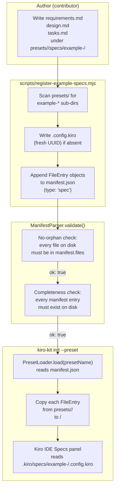
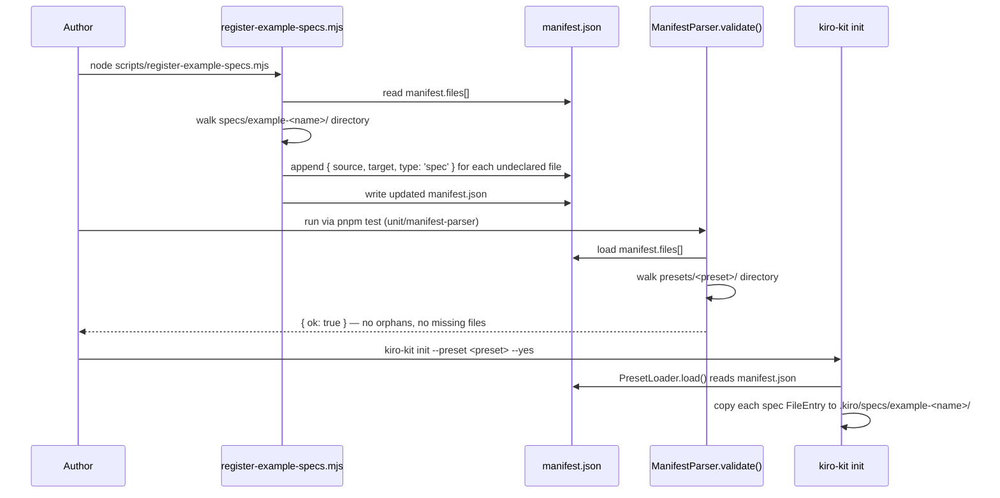

# Design: Spec Library Expansion

## Architecture

### System Context

Worked example specs serve two audiences: the Kiro IDE (which shows them in the Specs panel so users can read them in context) and the end user (who receives the files during `kiro-kit init`). The authoring workflow is entirely file-based: create the spec documents, run the register script, and the rest of the toolchain picks up the changes automatically.

The key constraint is the **no-orphan invariant** enforced by `ManifestParser.validate()`. Every file inside a preset directory (excluding `manifest.json` and `README.md`) must appear in `manifest.files`. The `scripts/register-example-specs.mjs` script bridges the gap: it discovers `example-*` folders inside each preset's `specs/` directory, writes `.config.kiro` markers where missing, and appends `FileEntry` objects to `manifest.json` for each undeclared file.

At install time, `PresetLoader.load(presetName)` reads the manifest and returns a `LoadedPreset` with the full `files[]` array. The init command copies each `FileEntry` from `presets/<preset>/<source>` to `<workspace>/<target>` — which for spec entries means `.kiro/specs/example-<name>/<file>`.

### Component Design



### FileEntry Lifecycle



## Data Models

### `.config.kiro` JSON Schema

```typescript
// Written by scripts/register-example-specs.mjs when absent
interface KiroSpecConfig {
  specId: string;           // UUID v4, generated with crypto.randomUUID()
  workflowType: string;     // always "requirements-first"
  specType: string;         // always "feature"
}

// Example:
// { "specId": "a1b2c3d4-...", "workflowType": "requirements-first", "specType": "feature" }
```

### FileEntry for Spec Files

Each file in an example spec folder is declared in `manifest.json` as:

```typescript
// FileEntry shape from ManifestParser.ts FileEntrySchema
interface FileEntry {
  source: string;   // "specs/example-<name>/requirements.md"
  target: string;   // ".kiro/specs/example-<name>/requirements.md"
  type: 'spec';     // inferred from top-level "specs/" directory prefix
}
```

The `register-example-specs.mjs` script hard-codes `type: 'spec'` and derives `target` as `.kiro/<source>`.

### Spec Document Structure

The three required documents follow this shape (Kiro house style):

```
requirements.md
  # Requirements Document
  ## Introduction        (2–4 sentences: problem, users, goal)
  ## Glossary            (domain terms)
  ## Out of Scope        (explicit exclusions)
  ## Requirements
    ### Requirement N: <title>
    **User Story:** As a [role], I want …, so that ….
    #### Acceptance Criteria
    1. WHEN … THE SYSTEM SHALL …
    2. IF … THEN …

design.md
  # Design: <Feature>
  ## Architecture
    ### System Context   (narrative)
    ### Component Design (Mermaid diagram)
  ## Data Models         (TypeScript interfaces or JSON shapes)
  ## Files & Interfaces  (real file paths + purpose)
  ## Error Handling      (table: scenario → behavior)
  ## Testing Strategy    (unit, integration, e2e)

tasks.md
  # Implementation Plan: <Feature>
  ## Overview            (2–3 sentences on build order)
  ## Tasks
    - [ ] N. <Top-level task>
      - [ ] N.M <Sub-task>
      - _Requirements: RN.M, …_
```

## Files and Interfaces

### Files Created (per new example spec)

| Path | Description |
|---|---|
| `presets/<preset>/specs/example-<name>/requirements.md` | Authored requirements document |
| `presets/<preset>/specs/example-<name>/design.md` | Authored design document |
| `presets/<preset>/specs/example-<name>/tasks.md` | Authored implementation plan |
| `presets/<preset>/specs/example-<name>/.config.kiro` | Generated by `register-example-specs.mjs` |

### Files Modified

| File | Change |
|---|---|
| `presets/<preset>/manifest.json` | Four new `FileEntry` objects appended by `register-example-specs.mjs` |

### Scripts Invoked (not modified)

| Script | Role |
|---|---|
| `scripts/register-example-specs.mjs` | Writes `.config.kiro`; appends `FileEntry` objects to `manifest.json` |
| `scripts/sync-preset-manifests.mjs` | Fallback reconcile — detects any remaining orphans after `register-example-specs.mjs` |

## Error Handling

| Scenario | Trigger | Resolution |
|---|---|---|
| Orphan spec file | File in `example-*/` not in `manifest.files` | Run `node scripts/register-example-specs.mjs`; the script appends the missing declaration |
| Missing spec file | File in `manifest.files` not on disk | Create the missing file (`requirements.md`, `design.md`, or `tasks.md`) |
| Duplicate `FileEntry` | Script run twice due to a bug | The script guards with `if (declared.has(source)) continue`, making it idempotent; no duplicates are produced |
| Invalid `.config.kiro` JSON | Manual edit introduced a syntax error | Delete the file and re-run `register-example-specs.mjs` to regenerate it |
| Spec folder not named `example-*` | Folder does not match the `d.name.startsWith('example-')` filter | Rename the folder to follow the `example-<name>` convention |

## Testing Strategy

### Unit Tests (existing — no new test file required)

`packages/cli/tests/unit/manifest-parser.test.ts` covers `ManifestParser.validate()`. The spec files added by this process automatically exercise the no-orphan and file-completeness checks whenever the test suite loads the preset's manifest.

Running:
```bash
pnpm test -- tests/unit/manifest-parser
```

Must still pass after the new spec files and their `manifest.json` entries are added.

### Structural Tests

```bash
pnpm test -- tests/structural/preset-thresholds.test.ts
```

Spec files do not count toward agent, skill, command, hook, or workflow thresholds (`countMdFiles` on the `specs/` directory is not called by the threshold test). All five threshold assertions for the affected preset must continue to pass.

### Integration — Install Verification

```bash
mkdir /tmp/kk-spec-test && cd /tmp/kk-spec-test
node /path/to/repo/packages/cli/dist/index.js init --preset <preset> --yes
ls .kiro/specs/example-<name>/
# Expected: requirements.md  design.md  tasks.md  .config.kiro
cat .kiro/specs/example-<name>/.config.kiro
# Expected: {"specId":"<uuid>","workflowType":"requirements-first","specType":"feature"}
node /path/to/repo/packages/cli/dist/index.js doctor
# Expected: 0 errors
```

### Script Idempotency Test

Run the register script twice on the same preset and confirm the manifest `files[]` count is identical after each run:

```bash
node scripts/register-example-specs.mjs
node scripts/register-example-specs.mjs
# Second run must print:
# Done. Added 0 .config.kiro marker(s) and 0 manifest declaration(s).
```
