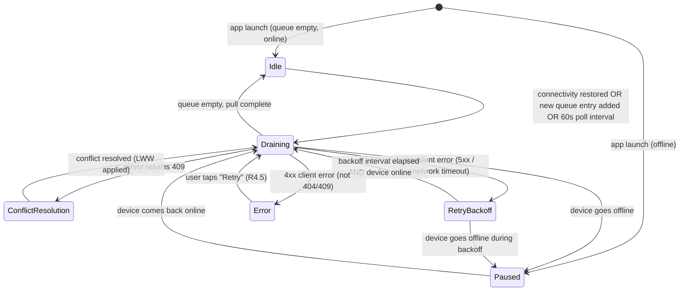

# Design: Offline-First Notes

## Architecture

### System Context

The Offline-First Notes feature follows a **local-first** architecture pattern. The device's on-disk WatermelonDB/SQLite database is the authoritative source of truth for all reads and writes. The Remote API is a secondary replica that receives changes asynchronously and provides cross-device availability. No user action ever blocks on the network.

```
┌─────────────────────────────────────────────────────────────────┐
│                      React Native App                           │
│                                                                 │
│  ┌────────────────┐    ┌──────────────────┐   ┌─────────────┐  │
│  │   UI Layer     │    │  State / Context  │   │  Background │  │
│  │  (React + RN)  │◄──►│  (Zustand +       │   │  Fetch Task │  │
│  └───────┬────────┘    │  WatermelonDB     │   └──────┬──────┘  │
│          │             │  observers)       │          │         │
│          ▼             └──────────────────┘          │         │
│  ┌───────────────────────────────────────────────────▼───────┐ │
│  │                     Note Repository                        │ │
│  │  (create / read / update / delete / observeAll / pull)     │ │
│  └──────────┬───────────────────────────────────┬────────────┘ │
│             │                                   │              │
│             ▼                                   ▼              │
│  ┌──────────────────┐              ┌────────────────────────┐  │
│  │  Local DB        │              │  Sync Engine           │  │
│  │  (WatermelonDB / │◄────────────►│  (queue drain,         │  │
│  │   SQLite)        │              │   conflict resolution, │  │
│  └──────────────────┘              │   retry/backoff)       │  │
│                                    └────────────┬───────────┘  │
└────────────────────────────────────────────────-│──────────────┘
                                                  │ HTTPS
                                                  ▼
                                        ┌──────────────────┐
                                        │   Remote API     │
                                        │  REST / JSON     │
                                        │  (Node.js +      │
                                        │   PostgreSQL)    │
                                        └──────────────────┘
```

### Component Design

#### UI Layer

- **NoteListScreen** — subscribes to `noteRepository.observeAll()` (a WatermelonDB reactive query). Re-renders automatically when any note changes locally. Renders a `FlatList` of `NoteListRow` components, each showing title, snippet, `updatedAt`, and a `SyncStatusBadge`.
- **NoteDetailScreen** — subscribes to `noteRepository.observeById(id)`. Shows full note content with a `SyncStatusBadge` in the header. Hosts an auto-save debounce (500 ms) that calls `noteRepository.update()`.
- **ConnectivityBanner** — reads `ConnectivityContext`. Renders the "Offline" banner (R5, R4.7).
- **GlobalSyncIndicator** — reads `SyncEngineContext.status`. Shows the animated spinner in the nav bar (R4.6).
- **SyncStatusBadge** — a pure component that maps `Note.syncStatus` to an icon: clock (pending), cloud-check (synced), warning (error).

#### Note Repository

The repository is the sole gateway to the Local DB and the Sync Queue. It encapsulates all WatermelonDB model interactions and enforces the invariant that every mutation also creates a SyncQueueEntry in the same batch transaction.

```
noteRepository
  .create(draft: NoteDraft) → Promise<Note>
  .readAll() → Note[]
  .observeAll() → Observable<Note[]>
  .observeById(id: string) → Observable<Note>
  .update(id: string, patch: Partial<NoteDraft>) → Promise<Note>
  .delete(id: string) → Promise<void>
  .applyRemoteChanges(changes: RemoteChangeSet) → Promise<void>
```

#### Local DB (WatermelonDB)

Two tables: `notes` and `sync_queue`. Both are SQLite tables managed by WatermelonDB's schema system with full migration support.

#### Sync Engine

A singleton service (class `SyncEngine`) that:
1. Listens to `ConnectivityContext` for online/offline transitions.
2. Drains the `sync_queue` table in dependency order (creates before updates before deletes).
3. Handles conflict responses (409) and missing-resource responses (404) per the strategies in the Sync Engine section below.
4. Schedules retries with truncated exponential backoff.
5. Registers with `react-native-background-fetch` for background execution.

#### Remote API

A RESTful JSON API. Relevant endpoints:

| Method | Path | Purpose |
|--------|------|---------|
| `GET` | `/api/v1/notes?since=<iso8601>` | Pull notes updated after timestamp |
| `POST` | `/api/v1/notes` | Create a new note |
| `PATCH` | `/api/v1/notes/:id` | Update a note; may return 409 |
| `DELETE` | `/api/v1/notes/:id` | Delete a note; may return 404 |

The API accepts and returns a `versionVector` field alongside `updatedAt` (an ISO 8601 string derived from the server clock). Conflict detection uses optimistic locking: the client sends the last-known `updatedAt`; the server rejects the request with `409` if its own `updatedAt` is newer.

---

## Data Models

```typescript
// ─── WatermelonDB Model: Note ────────────────────────────────────────────────

import { Model } from '@nozbe/watermelondb';
import { field, date, readonly, json } from '@nozbe/watermelondb/decorators';

export type SyncStatus =
  | 'synced'
  | 'pending_create'
  | 'pending_update'
  | 'pending_delete'
  | 'sync_error';

export type VersionVector = Record<string, number>; // deviceId → logicalClock

export class Note extends Model {
  static table = 'notes';

  @field('remote_id')       remoteId!: string | null;
  @field('title')           title!: string;
  @field('body')            body!: string;        // lazy-loaded for >50 k chars (R7.4)
  @field('sync_status')     syncStatus!: SyncStatus;
  @json('version_vector', v => v ?? {})
                            versionVector!: VersionVector;
  @field('local_version')   localVersion!: number; // monotonic counter, incremented on each local edit
  @field('deleted_at')      deletedAt!: number | null; // epoch ms; non-null = tombstone
  @readonly @date('created_at') createdAt!: Date;
  @date('updated_at')       updatedAt!: Date;     // updated on every local save
}

// ─── WatermelonDB Model: SyncQueueEntry ──────────────────────────────────────

export type SyncOperation = 'create' | 'update' | 'delete';

export class SyncQueueEntry extends Model {
  static table = 'sync_queue';

  @field('note_id')         noteId!: string;      // WatermelonDB local ID
  @field('remote_id')       remoteId!: string | null;
  @field('operation')       operation!: SyncOperation;
  @json('payload', v => v)  payload!: Partial<Note>; // snapshot at time of mutation
  @field('retry_count')     retryCount!: number;
  @field('last_error')      lastError!: string | null;
  @field('status')          status!: 'pending' | 'processing' | 'synced' | 'error';
  @readonly @date('created_at') createdAt!: Date;
}

// ─── Sync Metadata (AsyncStorage) ────────────────────────────────────────────

export interface SyncMetadata {
  lastPullTimestamp: string | null;   // ISO 8601; used as `since` param on GET /notes
  lastSyncedAt: string | null;        // ISO 8601; shown in UI
  deviceId: string;                   // UUID generated on first launch; used as version-vector key
}

// ─── Remote API DTOs ─────────────────────────────────────────────────────────

export interface RemoteNote {
  id: string;
  title: string;
  body: string;
  versionVector: VersionVector;
  updatedAt: string;   // ISO 8601
  deletedAt: string | null;
}

export interface RemoteChangeSet {
  notes: RemoteNote[];
  serverTimestamp: string; // ISO 8601; becomes the next lastPullTimestamp
}
```

### WatermelonDB Schema

```typescript
// src/db/schema.ts
import { appSchema, tableSchema } from '@nozbe/watermelondb';

export const schema = appSchema({
  version: 1,
  tables: [
    tableSchema({
      name: 'notes',
      columns: [
        { name: 'remote_id',      type: 'string',  isOptional: true },
        { name: 'title',          type: 'string'  },
        { name: 'body',           type: 'string'  },
        { name: 'sync_status',    type: 'string'  },
        { name: 'version_vector', type: 'string'  }, // stored as JSON
        { name: 'local_version',  type: 'number'  },
        { name: 'deleted_at',     type: 'number',  isOptional: true },
        { name: 'created_at',     type: 'number'  },
        { name: 'updated_at',     type: 'number'  },
      ],
    }),
    tableSchema({
      name: 'sync_queue',
      columns: [
        { name: 'note_id',     type: 'string' },
        { name: 'remote_id',   type: 'string', isOptional: true },
        { name: 'operation',   type: 'string' },
        { name: 'payload',     type: 'string' }, // JSON blob
        { name: 'retry_count', type: 'number' },
        { name: 'last_error',  type: 'string', isOptional: true },
        { name: 'status',      type: 'string' },
        { name: 'created_at',  type: 'number' },
      ],
    }),
  ],
});
```

---

## Sync Engine

### Sync State Machine



### Queue Drain Sequence

```mermaid
sequenceDiagram
    participant App as React Native App
    participant SE as Sync Engine
    participant DB as Local DB (WatermelonDB)
    participant API as Remote API

    App->>SE: onConnectivityChange(online)
    SE->>DB: query sync_queue WHERE status='pending' ORDER BY created_at
    DB-->>SE: [entry1, entry2, ...]

    loop for each entry in batch
        SE->>SE: mark entry status='processing'
        alt operation = create
            SE->>API: POST /api/v1/notes { payload }
            API-->>SE: 201 Created { id, updatedAt, versionVector }
            SE->>DB: batch: update note.remoteId, note.syncStatus='synced';\n delete queue entry
        else operation = update
            SE->>API: PATCH /api/v1/notes/:remoteId { payload, versionVector }
            alt 200 OK
                API-->>SE: 200 OK { updatedAt, versionVector }
                SE->>DB: batch: update note.syncStatus='synced', note.versionVector;\n delete queue entry
            else 409 Conflict
                API-->>SE: 409 { remoteNote }
                SE->>SE: LWW: compare updatedAt timestamps
                alt local wins
                    SE->>API: PATCH /api/v1/notes/:remoteId { payload, force:true, mergedVector }
                    API-->>SE: 200 OK
                    SE->>DB: update note.syncStatus='synced', merge versionVector
                else remote wins
                    SE->>DB: batch: overwrite local note with remoteNote;\n delete queue entry;\n show toast
                end
            else 404 Not Found
                API-->>SE: 404
                SE->>API: POST /api/v1/notes { payload } (re-create)
                API-->>SE: 201 Created { id }
                SE->>DB: batch: update note.remoteId, note.syncStatus='synced'
            end
        else operation = delete
            SE->>API: DELETE /api/v1/notes/:remoteId
            alt 204 No Content
                API-->>SE: 204
                SE->>DB: permanently delete tombstone + queue entry
            else 404 Not Found
                API-->>SE: 404 (already gone — treat as success)
                SE->>DB: permanently delete tombstone + queue entry
            end
        end
    end

    SE->>API: GET /api/v1/notes?since=<lastPullTimestamp>
    API-->>SE: RemoteChangeSet { notes[], serverTimestamp }
    SE->>DB: applyRemoteChanges(changes) in single batch
    SE->>DB: update AsyncStorage.lastPullTimestamp = serverTimestamp
    SE->>App: emit syncComplete event
```

### Conflict Resolution Strategy

Conflicts (HTTP 409) arise when both the client and the server have mutations for the same note since the last sync point. Resolution proceeds as follows:

1. **Compare logical timestamps**: The `updatedAt` field on both the local note and the remote note (returned in the 409 body) is compared. This is a monotonic server-side timestamp for the remote version and the device clock for the local version.
2. **Merge version vectors**: Regardless of which version wins, the version vectors are merged by taking `Math.max(local[deviceId], remote[deviceId])` for every `deviceId` key in the union of both vectors.
3. **Apply LWW rule**: The version with the higher `updatedAt` wins. If timestamps are identical (clock collision), the remote wins as a tie-breaker to prefer the authoritative server state.
4. **Version vector history**: The full merged version vector is persisted to both the local DB and the remote API, providing a complete audit trail of which devices contributed to the note.

### Retry and Backoff

```typescript
// Truncated exponential backoff with ±10% jitter (R6.1)
function computeRetryDelay(retryCount: number): number {
  const BASE_MS = 5_000;
  const CEILING_MS = 5 * 60_000; // 5 minutes
  const exponential = BASE_MS * Math.pow(2, retryCount);
  const capped = Math.min(exponential, CEILING_MS);
  const jitter = capped * (0.9 + Math.random() * 0.2); // ±10%
  return Math.round(jitter);
}
```

Entries that exceed 3 retries in a session are marked `sync_error` and excluded from automatic drain cycles until the user triggers a manual retry (R6.3, R4.4, R4.5).

---

## State Management

The app uses a two-layer state strategy:

| Layer | Technology | Scope |
|-------|-----------|-------|
| **Persistent app data** | WatermelonDB reactive queries | Notes, sync queue — all reads go through reactive observers; UI re-renders are automatic |
| **Transient UI / engine state** | Zustand stores | Connectivity status, sync engine status (idle/draining/paused/error), active toast messages, sync progress percentage |

### Zustand Stores

```typescript
// src/stores/syncStore.ts
interface SyncStore {
  engineStatus: 'idle' | 'draining' | 'paused' | 'error';
  progressPercent: number | null;   // null = indeterminate
  lastSyncedAt: string | null;
  setEngineStatus: (s: SyncStore['engineStatus']) => void;
  setProgress: (pct: number | null) => void;
  setLastSyncedAt: (ts: string) => void;
}

// src/stores/connectivityStore.ts
interface ConnectivityStore {
  isOnline: boolean;
  isApiReachable: boolean;
  setOnline: (v: boolean) => void;
  setApiReachable: (v: boolean) => void;
}
```

WatermelonDB `observe()` and `observeWithColumns()` hooks are wrapped in custom React hooks (`useNotes`, `useNote(id)`) that feed directly into component props, keeping WatermelonDB as the single reactive data source and avoiding redundant Zustand state for note content.

---

## Error Handling

| Scenario | Detection | Response |
|----------|-----------|----------|
| Network timeout (>10 s) | `axios` timeout config | Treat as transient; increment retry count; apply backoff |
| 5xx server error | HTTP status check | Transient; retry with backoff |
| 4xx client error (except 404, 409) | HTTP status check | Permanent error; mark `sync_error`; log body; surface UI warning (R4.4) |
| 409 Conflict | HTTP status check | Conflict resolution flow (R3.1–R3.3) |
| 404 on update/delete | HTTP status check | Re-create (R3.4) or accept deletion (R3.5) |
| WatermelonDB write failure | Caught exception from `database.write()` | Roll back batch; surface error toast; do not enqueue SyncQueueEntry |
| OS kills app mid-sync | App relaunch | SyncQueueEntries with `status='processing'` are reset to `pending` on startup |
| Schema migration failure | WatermelonDB migration exception | Log error; force full DB reset (user warned); trigger full re-sync from remote |

Errors are logged using a structured logger (`react-native-logs`) that writes to a rotating on-device file. In production, logs are uploaded to a crash-reporting service (e.g., Sentry) on the next app foreground event.

On app launch, the `SyncEngine.boot()` method resets any `status='processing'` entries back to `status='pending'` to handle the OS-kill-mid-sync scenario (R2.7).

---

## Performance

| Concern | Strategy | Target |
|---------|----------|--------|
| Local write latency | All mutations inside `database.write()` batch; no network call in the critical path | < 100 ms (R1.1) |
| List rendering | `FlatList` with `initialNumToRender=15`, `windowSize=5`, `keyExtractor` by WatermelonDB ID, `getItemLayout` for fixed-height rows | ≥ 55 FPS at 10 k notes (R7.2) |
| Large note bodies | Excluded from `observeAll()` projection; loaded lazily on detail screen open | List stays fast regardless of body size (R7.4) |
| Batch sync throughput | Sync Queue drained in batches of 50 with `setImmediate` yield between batches | Avoids JS thread jank during large syncs (R6.5) |
| DB query performance | `created_at` and `remote_id` columns indexed; `sync_queue.status` indexed | Sub-10 ms queries at 10 k rows |
| Pull response size | `since` parameter limits remote response to changed records only; paginated at 200 records per request | Avoids large payloads on reconnect after extended offline |

---

## Testing Strategy

### Unit Tests (Jest + React Native Testing Library)

- `NoteRepository` — test create/update/delete with an in-memory WatermelonDB instance (using `@nozbe/watermelondb/DatabaseProvider` with a Jest-compatible adapter). Assert SyncQueueEntry creation in same transaction.
- `SyncEngine` — mock `axios` with `axios-mock-adapter`. Test each state transition (idle → draining, conflict → LWW, 404 → re-create, retry backoff delays). Assert correct DB mutations after each response.
- `conflictResolver` — pure function unit tests for all LWW and version-vector merge scenarios, including tie-breaking and equal-vector short-circuit.
- `computeRetryDelay` — assert output within expected ranges for retryCount 0–6, and that jitter is within ±10% bounds.

### Integration Tests (Detox)

- **Happy path**: Create note offline → go online → assert note appears via mock API.
- **Conflict**: Edit note on "device A" offline, mock API returns 409 with newer remote version → assert UI reflects remote version and toast shown.
- **Edit then server delete**: Edit note offline → mock API returns 404 on sync → assert note re-created remotely.
- **App-kill resume**: Start sync, force-quit app, relaunch → assert Sync Queue resumes from pending entries.
- **Large queue**: Pre-populate 600 SyncQueueEntries → drain → assert batching and progress indicator updates.

### E2E Coverage Matrix

| Requirement | Test Type | Key Scenario |
|-------------|-----------|-------------|
| R1 (Local CRUD) | Unit + Integration | Create/edit/delete while mocking network off |
| R2 (Background Sync) | Integration | Queue drain on reconnect; background-fetch cycle |
| R3 (Conflict Resolution) | Unit (pure) + Integration | LWW local wins, LWW remote wins, 404-edit, 404-delete |
| R4 (Optimistic UI) | Detox E2E | Immediate list update; badge state transitions |
| R5 (Connectivity) | Integration | NetInfo event → engine state transition |
| R6 (Retry) | Unit (timers) + Integration | Backoff delays, 4xx permanent error, jitter range |
| R7 (Integrity/Perf) | Unit (transactions) + Perf | Rollback on batch failure; FPS measurement |
