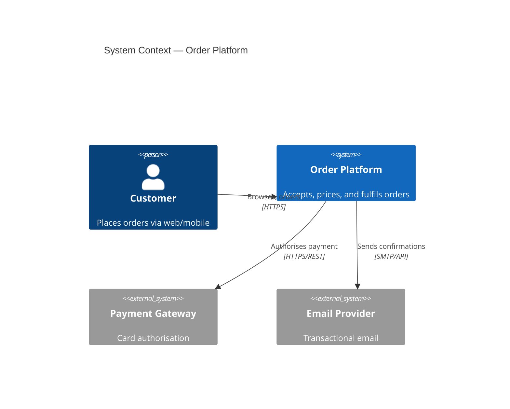
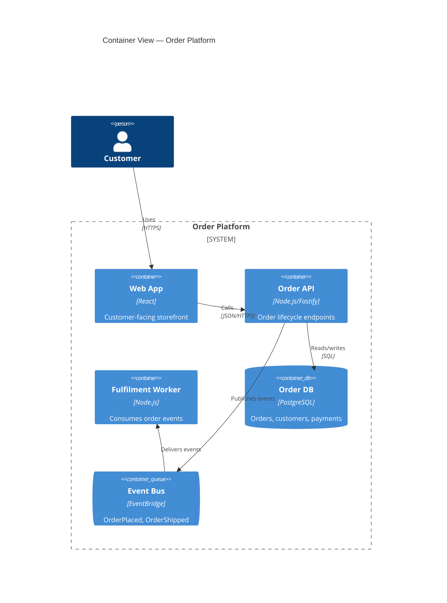
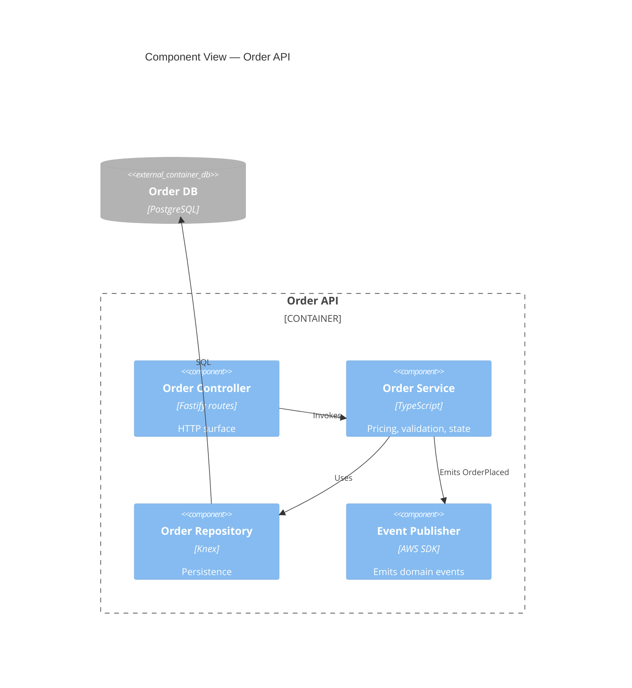
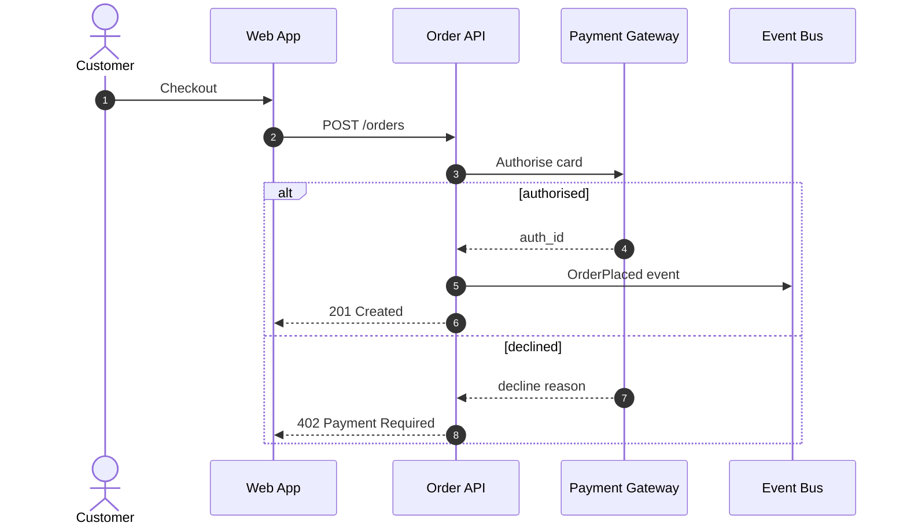
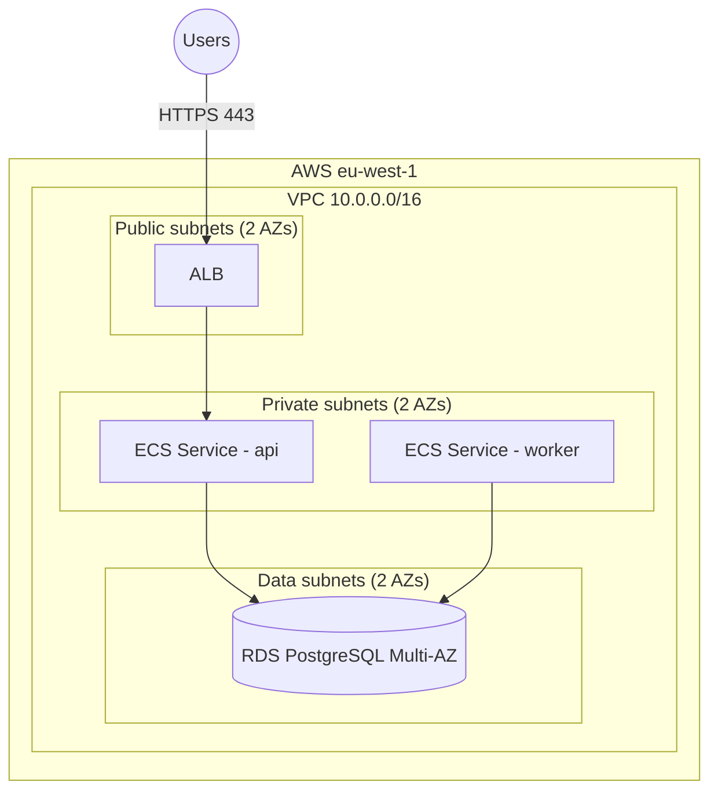
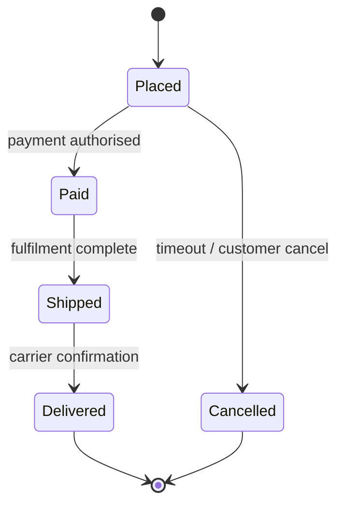

# Mermaid Diagrams

Text-first diagramming for architecture documents, specs, and READMEs. Mermaid
renders natively in GitHub, GitLab, and most Markdown viewers; sources live in
the repo and diff cleanly.

**Mermaid vs draw.io** (see also the `diagramming-conventions` steering file):
use Mermaid for logical views (C4, sequence, state, flows) embedded in
Markdown; use the `drawio-aws`/`drawio-azure`/`drawio-gcp` skills when the
audience expects official cloud provider icons or a standalone `.drawio`
artifact.

## Validation

Every diagram must compile before it ships:

```bash
npx -y @mermaid-js/mermaid-cli -i diagram.mmd -o /tmp/diagram.svg
```

Exit code 0 = valid. For diagrams embedded in Markdown, extract the fenced
block to a temp `.mmd` file first. Render PNG for decks/docs with `-o out.png -s 3`.

## C4 Model (levels 1–3)

Mermaid has first-class C4 syntax. Keep one level per diagram (see the
`c4-model` steering file for when to use each level).

### Level 1 — System Context



### Level 2 — Container



### Level 3 — Component



## Sequence Diagram

One critical flow per diagram; name participants after containers, not classes.



## Deployment View (flowchart + subgraphs)

Mermaid has no dedicated deployment type; model zones as nested subgraphs.



## State Diagram

For lifecycle entities (order status, provisioning states, DR modes).



## Authoring Rules

- **One concern per diagram.** Split rather than cram; a diagram with >15 nodes
  needs decomposition or a lower C4 level.
- **Stable IDs.** Node IDs (`api`, `rds`) are code — keep them short, reuse them
  consistently across diagrams in the same spec.
- **Direction**: `TB` for layered/deployment views, `LR` for pipelines.
- **No styling by default.** Add `classDef` colors only to encode meaning (e.g.
  external vs owned) and always add a legend node when you do.
- **Label edges with protocol/verb** ("JSON/HTTPS", "publishes"), not vague
  arrows.
- Escape or avoid `(){}[]` inside labels — quote labels that contain them.

## Embedding

- In spec/design Markdown: fenced ` ```mermaid ` blocks inline.
- In docx/pptx deliverables: render PNG at scale 3 and embed the image (see
  `architecture-doc` / `architecture-deck` skills); commit the `.mmd` source
  next to the artifact.
