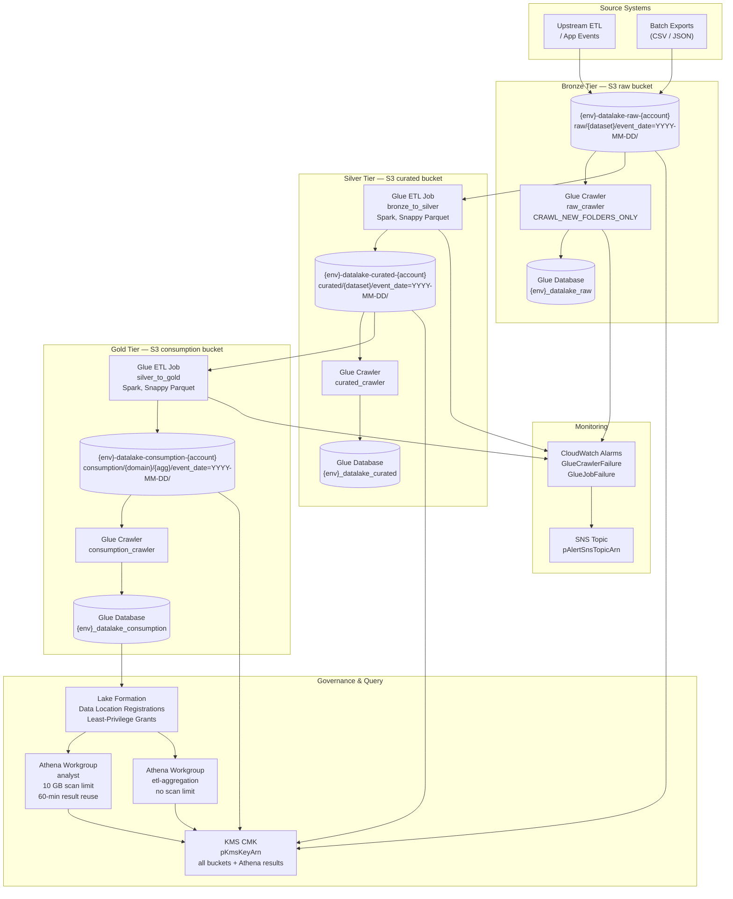

# Design: AWS Data Lake Architecture

## Architecture

### System Context

The data lake operates in two distinct operational modes:

- **Ingestion and transformation pipeline**: Source systems land raw files (JSON, CSV, Parquet) in the Bronze S3 bucket. Glue crawlers discover schemas and update the Glue Data Catalog. Glue ETL jobs (Spark) read Bronze, apply cleansing and deduplication, and write Snappy-compressed Parquet to Silver, then aggregate Silver into Gold. A CloudWatch Events rule (or Step Functions orchestrator) triggers the pipeline on a schedule or on S3 event notification.
- **Query serving layer**: Analysts and BI tools submit SQL queries through Amazon Athena, targeting Gold-tier Glue catalog tables. Lake Formation enforces column- and table-level permissions. Athena workgroups enforce per-query scan limits and route results to isolated S3 result paths. All results are KMS-encrypted at rest.

The entire infrastructure is defined in a single CloudFormation template (`infra/cloudformation/data-lake-stack.yaml`) parameterised by `pEnvironment`, `pKmsKeyArn`, `pAlertSnsTopicArn`, and `pAnalystRoleArn`.

### Component Design



## Tier and Zone Design

### Bucket Naming and Retention

| Tier | S3 Bucket Name Pattern | S3 Prefix | Format | Partition Keys | Retention |
|------|------------------------|-----------|--------|----------------|-----------|
| Bronze | `{env}-datalake-raw-{account_id}` | `raw/{dataset}/` | Original (JSON, CSV, Parquet) | `event_date=YYYY-MM-DD/` | Indefinite; Glacier after 365 d |
| Silver | `{env}-datalake-curated-{account_id}` | `curated/{dataset}/` | Snappy Parquet | `event_date=YYYY-MM-DD/source_system={name}/` | Standard-IA after 60 d; Glacier after 180 d |
| Gold | `{env}-datalake-consumption-{account_id}` | `consumption/{domain}/{agg}/` | Snappy Parquet | `event_date=YYYY-MM-DD/` | Standard-IA after 90 d; never Glacier |
| ETL Manifests | `{env}-datalake-raw-{account_id}` | `etl-manifests/{job_name}/` | JSON | `{run_id}.json` | Expire noncurrent versions after 90 d |
| Athena Results | `{env}-datalake-consumption-{account_id}` | `athena-results/{workgroup}/` | CSV + metadata | by query ID | Expire after 30 d |

### Glue Data Catalog Databases

| Database Name | Target Tier | Crawler | Update Behaviour |
|---------------|-------------|---------|-----------------|
| `{env}_datalake_raw` | Bronze | `raw_crawler` | `MERGE` (preserve existing columns) |
| `{env}_datalake_curated` | Silver | `curated_crawler` | `MERGE` |
| `{env}_datalake_consumption` | Gold | `consumption_crawler` | `MERGE` |

## Data Format Decisions

All transformation output uses **Apache Parquet with Snappy compression**. The rationale:

- Parquet's columnar layout allows Athena to read only the columns referenced in a query, reducing scan bytes and cost by 60–80 % compared to row-oriented formats.
- Snappy compression achieves ~3× compression on typical event data with negligible CPU overhead in Glue Spark jobs, reducing both S3 storage cost and network transfer during Athena scans.
- Files are sized to 128–256 MB per Parquet file by tuning `spark.sql.shuffle.partitions` and calling `repartition()` before the Glue write to avoid small-file problems that inflate S3 LIST request counts and Athena planning time.
- Partition columns (`event_date`, `source_system`) are written as Hive-style directory prefixes so that Glue crawlers detect them as partition keys and Athena's partition pruning filters at the S3 prefix level before reading any data.

## Governance Model

Lake Formation is the single enforcement point for data access:

1. **Data location registration**: Each S3 bucket root path is registered as a Lake Formation data location. No IAM principal can read or write the registered paths without an explicit Lake Formation grant, even if their IAM policy would otherwise allow `s3:GetObject`.
2. **Coarse-grained grants**: The Glue ETL role for Bronze→Silver gets `CREATE_TABLE`, `ALTER` on `{env}_datalake_curated` only. The ETL role for Silver→Gold gets the same on `{env}_datalake_consumption` only. Neither role has cross-tier catalog access.
3. **Analyst grants**: The `pAnalystRoleArn` IAM role receives `SELECT` on all tables in `{env}_datalake_consumption`. It has no Lake Formation grant on raw or curated databases, and the bucket policy additionally denies direct S3 access from any principal not in the approved list.
4. **Column-level security**: Sensitive columns (PII, financial) in Gold tables are granted `SELECT` only to principals with an additional Lake Formation column-level `GRANT` scoped to the approved column list.

## Files & Interfaces

| File / Path | Tool / Skill | Purpose |
|-------------|-------------|---------|
| `infra/cloudformation/data-lake-stack.yaml` | cfn-lint, AWS CloudFormation | Full IaC: S3 buckets, lifecycle rules, KMS policy, Glue databases and crawlers, Athena workgroups, Lake Formation registrations and grants, CloudWatch alarms |
| `infra/cloudformation/stack-policy.json` | AWS CloudFormation | Stack policy denying `Update:Replace` and `Update:Delete` on S3 bucket resources |
| `docs/diagrams/data-lake-architecture.drawio` | `drawio-ai` CLI + `drawio-aws` skill | Draw.io infrastructure diagram with AWS icons: three-tier swimlanes, Glue, Athena, Lake Formation, KMS |
| `docs/data-lake-sad.docx` | `architecture-doc` skill | Solution Architecture Document: Executive Summary, Architecture Overview, Component Descriptions, Data Flow, Security Model, Cost Model, Well-Architected Review |
| `docs/well-architected-review.md` | Authored manually during review task | Markdown Well-Architected review covering all six pillars; ingested into the SAD |
| `docs/system-architecture.md` | Updated in documentation task | Top-level system architecture document updated to reference the data lake as a component |
| `glue/jobs/bronze_to_silver.py` | AWS Glue Spark (PySpark) | Bronze-to-Silver ETL: schema validation, deduplication, Snappy Parquet output |
| `glue/jobs/silver_to_gold.py` | AWS Glue Spark (PySpark) | Silver-to-Gold ETL: SQL aggregation (parameterised via `--TRANSFORM_SQL`), Snappy Parquet output |
| `tests/cfn/test_stack_lint.sh` | cfn-lint | Runs `cfn-lint --include-checks W infra/cloudformation/data-lake-stack.yaml`; exits non-zero on any finding |
| `tests/cfn/test_stack_policy.py` | pytest + boto3 | Validates the CloudFormation stack policy JSON schema and asserts `Deny` actions cover S3 bucket Replace and Delete |
| `tests/integration/test_ingest_crawl_query.py` | pytest + boto3 + Athena SDK | Seeds Bronze S3 path, triggers crawler, runs Athena query on Gold catalog table, asserts result count |
| `tests/integration/test_lf_deny.py` | pytest + boto3 | Asserts that calling `s3:GetObject` on the Silver bucket with the analyst role raises `AccessDenied` |

## CloudFormation Stack Structure

The single stack `data-lake-stack.yaml` is organised into logical sections using CloudFormation comments:

```yaml
# ── Parameters ─────────────────────────────────────────────────────────────
Parameters:
  pEnvironment:
    Type: String
    AllowedValues: [dev, staging, prod]
  pKmsKeyArn:
    Type: String
    Description: ARN of the customer-managed KMS key for S3 and Athena encryption.
  pAlertSnsTopicArn:
    Type: String
    Description: SNS topic ARN for CloudWatch alarm notifications.
  pAnalystRoleArn:
    Type: String
    Description: IAM Role ARN for the analyst team; granted SELECT on Gold database.
  pGlueEtlRoleArn:
    Type: String
    Description: IAM Role ARN for Glue ETL jobs; granted CREATE_TABLE on target databases.

# ── S3 Buckets ──────────────────────────────────────────────────────────────
Resources:

  RawBucket:
    Type: AWS::S3::Bucket
    Properties:
      BucketName: !Sub "${pEnvironment}-datalake-raw-${AWS::AccountId}"
      BucketEncryption:
        ServerSideEncryptionConfiguration:
          - ServerSideEncryptionByDefault:
              SSEAlgorithm: aws:kms
              KMSMasterKeyID: !Ref pKmsKeyArn
      VersioningConfiguration:
        Status: Enabled
      PublicAccessBlockConfiguration:
        BlockPublicAcls: true
        BlockPublicPolicy: true
        IgnorePublicAcls: true
        RestrictPublicBuckets: true
      LifecycleConfiguration:
        Rules:
          - Id: BronzeIntelligentTiering
            Status: Enabled
            Transitions:
              - TransitionInDays: 30
                StorageClass: INTELLIGENT_TIERING
              - TransitionInDays: 365
                StorageClass: GLACIER
            NoncurrentVersionExpiration:
              NoncurrentDays: 90
      Tags:
        - Key: Environment
          Value: !Ref pEnvironment
        - Key: Project
          Value: DataLake
        - Key: Owner
          Value: platform-team
        - Key: ManagedBy
          Value: CloudFormation

  CuratedBucket:
    Type: AWS::S3::Bucket
    Properties:
      BucketName: !Sub "${pEnvironment}-datalake-curated-${AWS::AccountId}"
      BucketEncryption:
        ServerSideEncryptionConfiguration:
          - ServerSideEncryptionByDefault:
              SSEAlgorithm: aws:kms
              KMSMasterKeyID: !Ref pKmsKeyArn
      VersioningConfiguration:
        Status: Enabled
      PublicAccessBlockConfiguration:
        BlockPublicAcls: true
        BlockPublicPolicy: true
        IgnorePublicAcls: true
        RestrictPublicBuckets: true
      LifecycleConfiguration:
        Rules:
          - Id: SilverTierTransitions
            Status: Enabled
            Transitions:
              - TransitionInDays: 60
                StorageClass: STANDARD_IA
              - TransitionInDays: 180
                StorageClass: GLACIER
            NoncurrentVersionExpiration:
              NoncurrentDays: 90
      Tags:
        - Key: Environment
          Value: !Ref pEnvironment
        - Key: Project
          Value: DataLake
        - Key: Owner
          Value: platform-team
        - Key: ManagedBy
          Value: CloudFormation

  ConsumptionBucket:
    Type: AWS::S3::Bucket
    Properties:
      BucketName: !Sub "${pEnvironment}-datalake-consumption-${AWS::AccountId}"
      BucketEncryption:
        ServerSideEncryptionConfiguration:
          - ServerSideEncryptionByDefault:
              SSEAlgorithm: aws:kms
              KMSMasterKeyID: !Ref pKmsKeyArn
      VersioningConfiguration:
        Status: Enabled
      PublicAccessBlockConfiguration:
        BlockPublicAcls: true
        BlockPublicPolicy: true
        IgnorePublicAcls: true
        RestrictPublicBuckets: true
      LifecycleConfiguration:
        Rules:
          - Id: GoldTierStandardIA
            Status: Enabled
            Transitions:
              - TransitionInDays: 90
                StorageClass: STANDARD_IA
            NoncurrentVersionExpiration:
              NoncurrentDays: 90
          - Id: AthenaResultsExpiry
            Status: Enabled
            Prefix: athena-results/
            ExpirationInDays: 30
      Tags:
        - Key: Environment
          Value: !Ref pEnvironment
        - Key: Project
          Value: DataLake
        - Key: Owner
          Value: platform-team
        - Key: ManagedBy
          Value: CloudFormation

# ── S3 Bucket Policies (enforce KMS + HTTPS) ────────────────────────────────

  RawBucketPolicy:
    Type: AWS::S3::BucketPolicy
    Properties:
      Bucket: !Ref RawBucket
      PolicyDocument:
        Version: "2012-10-17"
        Statement:
          - Sid: DenyNonKmsUploads
            Effect: Deny
            Principal: "*"
            Action: s3:PutObject
            Resource: !Sub "arn:aws:s3:::${RawBucket}/*"
            Condition:
              StringNotEquals:
                s3:x-amz-server-side-encryption: aws:kms
          - Sid: DenyHTTP
            Effect: Deny
            Principal: "*"
            Action: s3:*
            Resource:
              - !Sub "arn:aws:s3:::${RawBucket}"
              - !Sub "arn:aws:s3:::${RawBucket}/*"
            Condition:
              Bool:
                aws:SecureTransport: "false"

# ── Glue Databases and Crawlers ─────────────────────────────────────────────

  GlueRawDatabase:
    Type: AWS::Glue::Database
    Properties:
      CatalogId: !Ref AWS::AccountId
      DatabaseInput:
        Name: !Sub "${pEnvironment}_datalake_raw"
        Description: "Glue catalog database for Bronze (raw) tier data."

  GlueCuratedDatabase:
    Type: AWS::Glue::Database
    Properties:
      CatalogId: !Ref AWS::AccountId
      DatabaseInput:
        Name: !Sub "${pEnvironment}_datalake_curated"
        Description: "Glue catalog database for Silver (curated) tier data."

  GlueConsumptionDatabase:
    Type: AWS::Glue::Database
    Properties:
      CatalogId: !Ref AWS::AccountId
      DatabaseInput:
        Name: !Sub "${pEnvironment}_datalake_consumption"
        Description: "Glue catalog database for Gold (consumption) tier data."

  RawCrawler:
    Type: AWS::Glue::Crawler
    Properties:
      Name: !Sub "${pEnvironment}-raw-crawler"
      Role: !Ref pGlueEtlRoleArn
      DatabaseName: !Sub "${pEnvironment}_datalake_raw"
      Targets:
        S3Targets:
          - Path: !Sub "s3://${RawBucket}/raw/"
      RecrawlPolicy:
        RecrawlBehavior: CRAWL_NEW_FOLDERS_ONLY
      SchemaChangePolicy:
        UpdateBehavior: UPDATE_IN_DATABASE
        DeleteBehavior: LOG
      Tags:
        Environment: !Ref pEnvironment
        ManagedBy: CloudFormation

# ── Athena Workgroups ────────────────────────────────────────────────────────

  AnalystWorkgroup:
    Type: AWS::Athena::WorkGroup
    Properties:
      Name: !Sub "${pEnvironment}-analyst"
      Description: "Athena workgroup for analyst ad-hoc queries; 10 GB scan cap."
      WorkGroupConfiguration:
        EnforceWorkGroupConfiguration: true
        BytesScannedCutoffPerQuery: 10737418240   # 10 GB in bytes
        ResultConfiguration:
          OutputLocation: !Sub "s3://${ConsumptionBucket}/athena-results/analyst/"
          EncryptionConfiguration:
            EncryptionOption: SSE_KMS
            KmsKey: !Ref pKmsKeyArn
        ResultReuseConfiguration:
          ResultReuseByAgeConfiguration:
            Enabled: true
            MaxAgeInMinutes: 60
      Tags:
        - Key: Environment
          Value: !Ref pEnvironment
        - Key: ManagedBy
          Value: CloudFormation

  EtlAggregationWorkgroup:
    Type: AWS::Athena::WorkGroup
    Properties:
      Name: !Sub "${pEnvironment}-etl-aggregation"
      Description: "Athena workgroup for programmatic Gold-tier aggregation queries."
      WorkGroupConfiguration:
        EnforceWorkGroupConfiguration: true
        ResultConfiguration:
          OutputLocation: !Sub "s3://${ConsumptionBucket}/athena-results/etl-aggregation/"
          EncryptionConfiguration:
            EncryptionOption: SSE_KMS
            KmsKey: !Ref pKmsKeyArn
      Tags:
        - Key: Environment
          Value: !Ref pEnvironment
        - Key: ManagedBy
          Value: CloudFormation

# ── Lake Formation ───────────────────────────────────────────────────────────

  LFRawLocationRegistration:
    Type: AWS::LakeFormation::Resource
    Properties:
      ResourceArn: !Sub "arn:aws:s3:::${RawBucket}"
      UseServiceLinkedRole: false
      RoleArn: !Ref pGlueEtlRoleArn

  LFAnalystSelectGrant:
    Type: AWS::LakeFormation::Permissions
    Properties:
      DataLakePrincipal:
        DataLakePrincipalIdentifier: !Ref pAnalystRoleArn
      Resource:
        DatabaseResource:
          Name: !Sub "${pEnvironment}_datalake_consumption"
      Permissions:
        - SELECT
      PermissionsWithGrantOption: []

# ── CloudWatch Alarms ────────────────────────────────────────────────────────

  GlueCrawlerFailureAlarm:
    Type: AWS::CloudWatch::Alarm
    Properties:
      AlarmName: !Sub "${pEnvironment}-GlueCrawlerFailure"
      MetricName: GlueCrawlerFailure
      Namespace: DataLake/Glue
      Statistic: Sum
      Period: 300
      EvaluationPeriods: 1
      Threshold: 1
      ComparisonOperator: GreaterThanOrEqualToThreshold
      AlarmActions:
        - !Ref pAlertSnsTopicArn
```

## Cost Model

### Storage Class Transitions (Bronze Bucket, per 1 TB ingested per day)

| Age of Data | Storage Class | Approx. Cost/GB/Month | Notes |
|-------------|--------------|----------------------|-------|
| 0–30 days | S3 Standard | $0.023 | Active pipeline window |
| 30–365 days | S3 Intelligent-Tiering | $0.023 (FA) / $0.0125 (IA) | Auto-tiered; no retrieval fee |
| > 365 days | Glacier Flexible Retrieval | $0.004 | Archival; retrieval minutes–hours |

### Athena Scan Cost Estimates (at $5/TB scanned)

| Scenario | Daily Bronze Ingest | Athena Queries/Day | Avg Scan/Query (Parquet) | Monthly Athena Cost |
|----------|--------------------|--------------------|--------------------------|---------------------|
| Small | 100 GB | 50 | 2 GB | ~$15 |
| Medium | 1 TB | 500 | 5 GB | ~$375 |
| Large | 10 TB | 2 000 | 10 GB | ~$3 000 |

Parquet + Snappy compression and partition pruning on `event_date` reduce scan volume by an estimated 70 % compared to uncompressed CSV. At the large scenario, uncompressed CSV would cost ~$10 000/month vs. ~$3 000 with the Parquet + partitioning approach.

### Glue ETL DPU Estimates

| Job | Input Size | DPU | Run Time | DPU-Hours/Run | Monthly Cost (30 runs) |
|-----|-----------|-----|----------|---------------|----------------------|
| `bronze_to_silver` | 1 TB/day | 10 | 45 min | 7.5 | ~$33 |
| `silver_to_gold` | 500 GB/day | 5 | 20 min | 1.67 | ~$7 |

Glue ETL billing: $0.44/DPU-hour (G.1X workers).

## Well-Architected Mapping

| Pillar | Design Decision | WA Question |
|--------|----------------|-------------|
| **Operational Excellence** | CloudFormation IaC for repeatable deployments; cfn-lint in CI/CD gates | OPS 5 |
| **Operational Excellence** | ETL run manifests written to S3 for audit and replay capability | OPS 6 |
| **Security** | KMS CMK encryption at rest for all buckets and Athena results | SEC 8 |
| **Security** | Lake Formation least-privilege grants; bucket policy denying direct S3 bypass | SEC 6 |
| **Security** | S3 Block Public Access on all buckets; `aws:SecureTransport` bucket policy | SEC 7 |
| **Security** | Lake Formation column-level grants for PII/financial columns | SEC 6 |
| **Reliability** | Glue crawler `MERGE` schema update policy prevents table definition drops | REL 9 |
| **Reliability** | Glue job `MaxRetries: 2` with CloudWatch alarms on failure; SNS notification | REL 7 |
| **Performance Efficiency** | Parquet columnar format + Snappy compression; 128–256 MB file sizing | PERF 7 |
| **Performance Efficiency** | Hive-style partitioning on `event_date` enables Athena partition pruning | PERF 8 |
| **Cost Optimization** | S3 lifecycle rules transitioning Bronze to Intelligent-Tiering (day 30) and Glacier (day 365) | COST 6 |
| **Cost Optimization** | Athena workgroup `BytesScannedCutoffPerQuery` (10 GB) prevents runaway scan cost | COST 8 |
| **Cost Optimization** | Parquet + partition pruning reduces Athena scan volume ~70 % vs. CSV | COST 8 |
| **Cost Optimization** | Athena result reuse (60-min TTL) eliminates duplicate scan cost for repeated queries | COST 8 |
| **Sustainability** | Parquet compression reduces data volume and therefore Athena CPU and network energy | SUS 4 |
| **Sustainability** | Glacier transitions move cold data to high-density storage with lower energy per GB | SUS 5 |

### Deep Dive: Cost Optimization Pillar

The architecture addresses cost at four layers:

1. **Storage tiering**: Bronze data follows a three-stage cost curve. Data accessed within the first 30 days is kept in S3 Standard. After 30 days, S3 Intelligent-Tiering eliminates the need to predict access patterns — objects not accessed in 30 days are automatically moved to the infrequent-access tier at $0.0125/GB/month, with no retrieval fee. After 365 days, objects transition to Glacier Flexible Retrieval at $0.004/GB/month, reducing long-term archival cost by ~83 % vs. Standard.

2. **Query cost control**: The `analyst` Athena workgroup enforces a 10 GB `BytesScannedCutoffPerQuery` hard limit. Without this, a single analyst query with a missing `WHERE event_date` filter could scan the entire Gold tier, generating a single query cost that exceeds the monthly budget. Result reuse further eliminates repeated scan costs for dashboards that refresh on the same query repeatedly within 60 minutes.

3. **Format and partitioning**: Storing Silver and Gold data as Snappy-compressed Parquet with Hive-style `event_date` partitions is the single highest-ROI cost control: columnar reads skip non-queried columns (typically 70–90 % of columns in analytics queries), and Athena partition pruning skips non-queried date partitions. Together, these reduce billed scan volume by 60–80 % compared to CSV on the same data.

4. **File sizing**: Glue ETL jobs are tuned to produce 128–256 MB Parquet files. Files smaller than 64 MB cause Athena to issue more S3 GET requests, increasing S3 request cost and Athena planning overhead. Files larger than 512 MB reduce parallelism in Athena. The 128–256 MB target is the Athena-documented sweet spot.

### Deep Dive: Security Pillar

1. **Encryption at rest**: All three S3 buckets use `aws:kms` with a customer-managed KMS key (`pKmsKeyArn`). The bucket policy denies any `PutObject` request that does not include `x-amz-server-side-encryption: aws:kms`, preventing unencrypted writes even from IAM principals with write access. Athena query results are also KMS-encrypted in the result bucket, ensuring that query output is never stored in plaintext.

2. **Encryption in transit**: The bucket policy includes a `Deny` statement on `aws:SecureTransport: false`, blocking all HTTP (non-TLS) API calls to S3. AWS Glue and Athena exclusively use HTTPS; the policy provides defence-in-depth against misconfigured clients or boto3 sessions with SSL verification disabled.

3. **Lake Formation as the security perimeter**: All three S3 paths are registered as Lake Formation data locations. Lake Formation intercepts Glue Data Catalog calls (used by Athena and Glue ETL jobs) and enforces its own permission model on top of IAM. A principal with an IAM `s3:GetObject` allow statement but no Lake Formation `SELECT` grant is still denied at the catalog query level. Additionally, the bucket policy allowlist (`StringNotEquals aws:PrincipalArn`) blocks direct S3 API access from any principal not in the approved ETL role list, closing the bypass path.

4. **Least-privilege IAM and Lake Formation grants**: Glue ETL roles are scoped to their target database only — the Bronze-to-Silver role has no Lake Formation grant on the Gold database, and vice versa. Analyst roles have `SELECT` on the Gold database only, with no access to raw or curated databases. Column-level Lake Formation grants restrict access to PII columns to a named list of data stewards.

5. **S3 Block Public Access**: All three buckets have all four Block Public Access settings enabled (`BlockPublicAcls`, `BlockPublicPolicy`, `IgnorePublicAcls`, `RestrictPublicBuckets`). This prevents any ACL or bucket policy change from accidentally exposing data lake objects publicly, even if an administrator error grants public access at the ACL level.

## Error Handling

| Condition | Behaviour |
|-----------|-----------|
| Glue crawler fails with S3 access denied | CloudWatch metric `GlueCrawlerFailure` emitted; CloudWatch Alarm triggers SNS notification to `pAlertSnsTopicArn`; no automatic retry (operator must investigate IAM/LF grant) |
| Glue crawler detects schema drift (new column) | `MERGE` schema update adds new column to catalog table; downstream Athena queries that do not reference the new column are unaffected |
| Glue crawler detects schema conflict (type change) | `SchemaChangePolicy.DeleteBehavior: LOG` logs the conflict without deleting the table; operator must resolve manually via Glue console or ALTER TABLE DDL |
| Glue ETL job fails on first attempt | Glue retries automatically up to `MaxRetries: 2`; each retry reads the full input partition and overwrites the output path (idempotent) |
| Glue ETL job fails after all retries | CloudWatch metric `GlueJobFailure` emitted; SNS alarm fired; ETL manifest written with `status: FAILED` and error message |
| Athena query exceeds 10 GB scan limit (`analyst` workgroup) | Athena cancels the query automatically with error `QUERY_CANCELLED: Query exhausted data scan limit`; no cost incurred for cancelled query beyond scanned bytes |
| KMS key unavailable (disabled or deleted) | All S3 `GetObject` and `PutObject` calls fail with `KMSDisabledException`; Glue jobs and Athena queries fail immediately; CloudWatch Alarm on KMS key state recommended as a separate key management control |
| Lake Formation grant missing for analyst role | Athena returns `AccessDeniedException: User is not authorized to perform glue:GetTable`; operator must add the Lake Formation `SELECT` grant |
| ETL manifest write fails (S3 write error) | ETL job logs the error but does not fail the job; manifest absence is detected by the monitoring task that checks for missing manifests in the `etl-manifests/` prefix |

## Testing Strategy

### CloudFormation Linting and Policy Tests

| Test | Command / Tool | What Is Verified |
|------|---------------|-----------------|
| Template lint | `cfn-lint --include-checks W infra/cloudformation/data-lake-stack.yaml` | Zero cfn-lint errors and warnings, including W3002 (bucket name length), E3012 (parameter type), and W2001 (unused parameters) |
| Stack policy schema | `pytest tests/cfn/test_stack_policy.py` | `infra/cloudformation/stack-policy.json` has `Deny` statements covering `Update:Replace` and `Update:Delete` for `AWS::S3::Bucket` resource type |
| Parameter derivation | `pytest tests/cfn/test_parameter_substitution.py` using `cfn-flip` + regex | All resource `BucketName` properties use `!Sub` with `${pEnvironment}` and `${AWS::AccountId}`; no hardcoded names |
| Lifecycle rule correctness | `pytest tests/cfn/test_lifecycle_rules.py` using `cfn-flip` + PyYAML | Bronze bucket has INTELLIGENT_TIERING at day 30 and GLACIER at day 365; Gold bucket has no GLACIER transition |

### Integration Tests

| Test File | What Is Verified |
|-----------|-----------------|
| `tests/integration/test_ingest_crawl_query.py` | Deploy stack to sandbox account; upload 10 Parquet files to Bronze S3 path; trigger `raw_crawler`; assert Glue catalog table `{env}_datalake_raw.sample_events` exists with expected schema; run Athena query against catalog table; assert row count matches uploaded file |
| `tests/integration/test_bronze_to_silver_etl.py` | Trigger `bronze_to_silver` Glue job on sample dataset; assert Silver S3 path contains Snappy-compressed Parquet; assert ETL manifest JSON is written to `etl-manifests/` prefix; assert rejected row count is 0 for clean input |
| `tests/integration/test_lf_deny.py` | Assume `pAnalystRoleArn` via STS; call `s3:GetObject` on a Silver bucket object; assert `ClientError: AccessDenied` is raised; call Athena `GetQueryResults` on the Gold workgroup with a valid Gold table query; assert results are returned |
| `tests/integration/test_athena_scan_limit.py` | Submit an Athena query against a large Silver table without a date filter using the `analyst` workgroup; assert the query state transitions to `CANCELLED` and the state change reason contains `data scan limit` |
| `tests/integration/test_drawio_diagram.py` | Run `drawio-ai validate docs/diagrams/data-lake-architecture.drawio`; assert exit code 0 (valid draw.io XML); assert diagram XML contains at least one `AWS S3` shape and one `AWS Glue` shape by checking mxCell labels |
