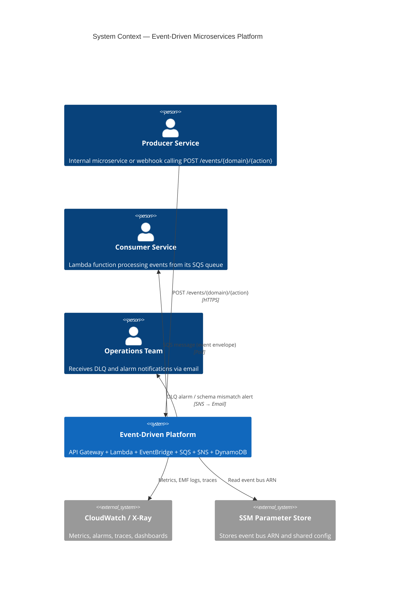
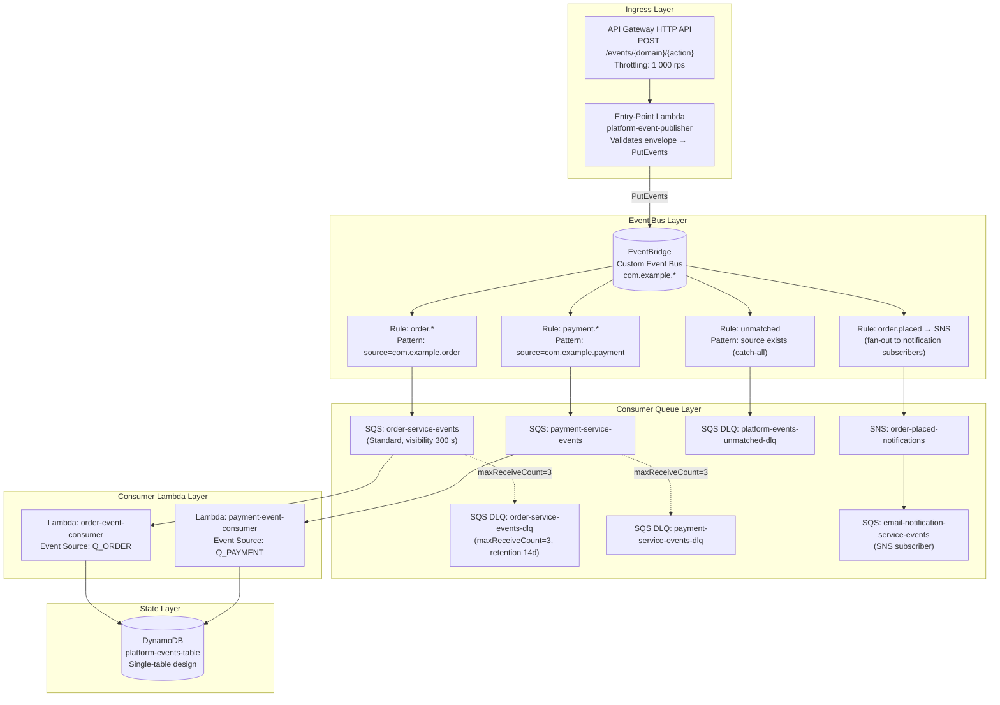
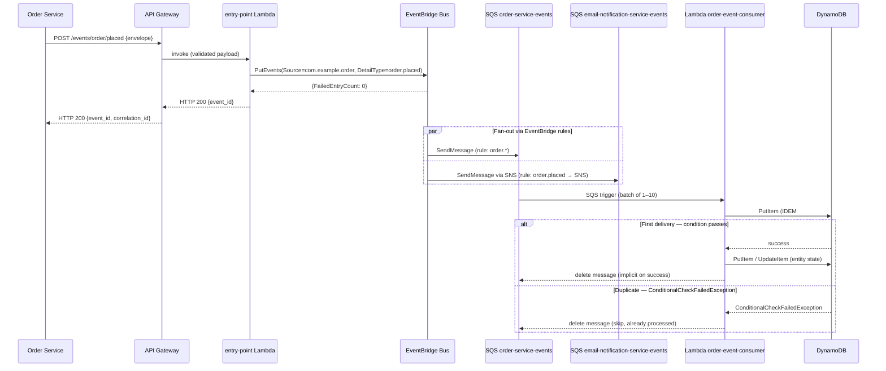

# Design: AWS Event-Driven Microservices Architecture

## Architecture

### System Context

The platform exposes a single HTTP entry point via API Gateway (HTTP API). Producers — internal microservices or third-party webhooks — POST domain events to `POST /events/{domain}/{action}`. A thin entry-point Lambda validates the envelope and forwards it to the EventBridge custom event bus. EventBridge evaluates content-based rules and fans out to multiple consumer SQS queues; each queue triggers its own Lambda consumer. For broadcast scenarios, EventBridge also targets an SNS topic whose subscribers include additional SQS queues and email endpoints. All consumer state (idempotency keys, entity records) is stored in a single DynamoDB table. Operational signals flow into CloudWatch (metrics, alarms, EMF logs) and AWS X-Ray (distributed traces).



### Component Design



### Event Flow Sequence — Order Placed



## Event Envelope Schema

Every domain event must conform to the following JSON structure. The `detail` object is the EventBridge `Detail` field; `source` and `detail-type` are top-level EventBridge fields.

```json
{
  "source": "com.example.order",
  "detail-type": "order.placed",
  "detail": {
    "event_id": "550e8400-e29b-41d4-a716-446655440000",
    "event_version": "1.0.0",
    "occurred_at": "2025-09-01T14:23:00.000Z",
    "correlation_id": "b3a2f891-0c4e-4d7f-a99b-123456789abc",
    "producer": "order-service",
    "payload": {
      "order_id": "ORD-20250901-0042",
      "customer_id": "CUST-1001",
      "items": [
        { "sku": "WIDGET-A", "quantity": 2, "unit_price_usd": 19.99 }
      ],
      "total_usd": 39.98,
      "currency": "USD"
    }
  }
}
```

Required `detail` fields: `event_id` (UUID v4), `event_version` (semver), `occurred_at` (ISO 8601 UTC), `correlation_id` (UUID v4), `producer` (string), `payload` (object). Additional top-level fields beyond `payload` are permitted but not routed on.

## DynamoDB Single-Table Design

Table name: `platform-events-table`. All entity types share the table; the `EntityType` attribute in each item distinguishes them.

| Entity Type | PK | SK | Attributes | GSI |
|------------|----|----|-----------|-----|
| IdempotencyKey | `IDEM#{consumer_id}` | `{event_id}` | `processed_at`, `ttl` | — |
| OrderEntity | `ORDER#{order_id}` | `METADATA` | `status`, `customer_id`, `total_usd`, `updated_at` | GSI1: `customer_id` / `updated_at` |
| OrderEvent | `ORDER#{order_id}` | `EVENT#{occurred_at}#{event_id}` | `event_type`, `correlation_id`, `payload` (JSON) | — |
| CustomerOrders | `CUSTOMER#{customer_id}` | `ORDER#{created_at}#{order_id}` | `status`, `total_usd` | — |

**GSI1** — `GSI1PK = customer_id`, `GSI1SK = updated_at` — supports the query: *"list all orders for a customer, sorted by last updated"*.

**Access patterns supported without full-table scan:**

| Pattern | Key condition |
|---------|--------------|
| Get order metadata | `PK = ORDER#{order_id}` AND `SK = METADATA` |
| List order events (audit trail) | `PK = ORDER#{order_id}` AND `SK BEGINS_WITH EVENT#` |
| Idempotency check | `PK = IDEM#{consumer_id}` AND `SK = {event_id}` (conditional write) |
| List orders by customer | `PK = CUSTOMER#{customer_id}` AND `SK BEGINS_WITH ORDER#` |
| Orders by customer on GSI | GSI1: `customer_id = ?` AND `updated_at BETWEEN ? AND ?` |

## Idempotency and Ordering Strategy

**Idempotency:** Each consumer writes a DynamoDB item at `PK=IDEM#{consumer_id}`, `SK={event_id}` with `ConditionExpression = "attribute_not_exists(PK)"` before any side-effectful logic. The item's `ttl` is set to `now + 86400` so DynamoDB TTL prunes stale keys. A `ConditionalCheckFailedException` is caught, the SQS message deleted, and the handler returns without re-executing business logic.

**Ordering:** SQS Standard Queues do not guarantee strict ordering. Consumers handle out-of-order delivery by using a `version` attribute on entity items with an optimistic-lock `ConditionExpression = "version = :expected_version"`. If the condition fails the consumer logs the event and re-enqueues the message for later retry, relying on the SQS visibility timeout rather than ordering guarantees.

**Partial batch failure:** Lambda SQS event source mappings use `ReportBatchItemFailures`. On partial failure, the Lambda handler returns `{"batchItemFailures": [{"itemIdentifier": "<messageId>"}]}` for messages that failed, leaving them in the queue for retry while successfully processed messages are deleted.

## Files & Interfaces

| File / Path | Purpose |
|------------|---------|
| `infra/terraform/modules/api/main.tf` | `aws_apigatewayv2_api`, `aws_apigatewayv2_stage`, `aws_apigatewayv2_integration`, `aws_apigatewayv2_route`, `aws_lambda_function` (entry-point), `aws_iam_role` |
| `infra/terraform/modules/api/variables.tf` | `event_bus_arn`, `lambda_runtime`, `lambda_timeout`, `throttle_rate_limit`, `environment`, `project`, `owner` |
| `infra/terraform/modules/api/outputs.tf` | `api_endpoint`, `entry_lambda_function_name`, `entry_lambda_arn` |
| `infra/terraform/modules/events/main.tf` | `aws_cloudwatch_event_bus`, `aws_cloudwatch_event_rule` (one per consumer + catch-all + SNS), `aws_cloudwatch_event_target`, `aws_cloudwatch_event_bus_policy` |
| `infra/terraform/modules/events/variables.tf` | `bus_name`, `consumer_queue_arns` (map), `sns_topic_arn`, `environment` |
| `infra/terraform/modules/events/outputs.tf` | `event_bus_arn`, `event_bus_name`, `rule_arns` (map) |
| `infra/terraform/modules/queues/main.tf` | `aws_sqs_queue` (standard + DLQ pairs), `aws_sqs_queue_policy`, `aws_sns_topic`, `aws_sns_topic_subscription`, `aws_cloudwatch_metric_alarm` (DLQ depth + consumer depth), `aws_sns_topic` (ops-alerts) |
| `infra/terraform/modules/queues/variables.tf` | `consumer_definitions` (list of objects: name, visibility_timeout, max_receive_count), `ops_email`, `sns_fan_out_consumers`, `environment` |
| `infra/terraform/modules/queues/outputs.tf` | `consumer_queue_arns` (map), `consumer_dlq_arns` (map), `ops_sns_topic_arn`, `order_placed_sns_arn` |
| `infra/terraform/modules/tables/main.tf` | `aws_dynamodb_table` (single-table, PAY_PER_REQUEST, GSI1, TTL, point-in-time recovery, encryption) |
| `infra/terraform/modules/tables/variables.tf` | `table_name`, `enable_pitr`, `environment` |
| `infra/terraform/modules/tables/outputs.tf` | `table_name`, `table_arn` |
| `infra/terraform/environments/sandbox/main.tf` | Root module instantiating all four modules for the sandbox environment |
| `infra/terraform/environments/production/main.tf` | Root module for production with larger throttle limits and `enable_pitr = true` |
| `docs/architecture/adr-001-eventbridge-vs-sns-only.md` | ADR: EventBridge custom bus vs. SNS-only fan-out |
| `docs/architecture/adr-002-single-table-vs-multi-table.md` | ADR: DynamoDB single-table vs. per-service tables |
| `docs/architecture/adr-003-sqs-buffering-vs-direct-lambda.md` | ADR: SQS queue buffering vs. direct EventBridge-to-Lambda targets |
| `docs/architecture/system-context.mmd` | Mermaid C4 Context diagram source |
| `docs/architecture/component-design.mmd` | Mermaid flowchart (component design) source |
| `docs/architecture/event-flow-sequence.mmd` | Mermaid sequence diagram source |
| `docs/architecture/aws-architecture.drawio` | draw.io AWS architecture diagram (produced by `drawio-ai generate`) |
| `docs/architecture/well-architected-review.md` | WA Framework pillar-by-pillar mapping |
| `docs/architecture/sad.docx` | System Architecture Document (produced by `architecture-doc` skill) |
| `docs/architecture/architecture-deck.pptx` | Architecture presentation deck (produced by `architecture-deck` skill) |

## Terraform Module Structure

### Module: `api`

```hcl
# infra/terraform/modules/api/main.tf

resource "aws_lambda_function" "event_publisher" {
  function_name = "${var.project}-event-publisher-${var.environment}"
  role          = aws_iam_role.event_publisher.arn
  handler       = "index.handler"
  runtime       = var.lambda_runtime   # "nodejs20.x"
  timeout       = var.lambda_timeout   # 10
  filename      = data.archive_file.publisher_zip.output_path

  environment {
    variables = {
      EVENT_BUS_ARN = var.event_bus_arn
      LOG_LEVEL     = "INFO"
    }
  }

  tracing_config {
    mode = "Active"
  }

  tags = local.common_tags
}

resource "aws_apigatewayv2_api" "events_api" {
  name          = "${var.project}-events-api-${var.environment}"
  protocol_type = "HTTP"

  cors_configuration {
    allow_methods = ["POST", "OPTIONS"]
    allow_origins = ["*"]
    max_age       = 300
  }

  tags = local.common_tags
}

resource "aws_apigatewayv2_stage" "default" {
  api_id      = aws_apigatewayv2_api.events_api.id
  name        = "$default"
  auto_deploy = true

  default_route_settings {
    throttling_rate_limit  = var.throttle_rate_limit   # 1000
    throttling_burst_limit = var.throttle_rate_limit * 2
  }

  access_log_settings {
    destination_arn = aws_cloudwatch_log_group.api_access_logs.arn
  }
}

resource "aws_apigatewayv2_integration" "publisher_lambda" {
  api_id                 = aws_apigatewayv2_api.events_api.id
  integration_type       = "AWS_PROXY"
  integration_uri        = aws_lambda_function.event_publisher.invoke_arn
  payload_format_version = "2.0"
}

resource "aws_apigatewayv2_route" "post_event" {
  api_id    = aws_apigatewayv2_api.events_api.id
  route_key = "POST /events/{domain}/{action}"
  target    = "integrations/${aws_apigatewayv2_integration.publisher_lambda.id}"
}
```

### Module: `events`

```hcl
# infra/terraform/modules/events/main.tf

resource "aws_cloudwatch_event_bus" "platform" {
  name = "${var.bus_name}-${var.environment}"
  tags = local.common_tags
}

resource "aws_cloudwatch_event_rule" "order_events" {
  name           = "order-events-to-sqs-${var.environment}"
  event_bus_name = aws_cloudwatch_event_bus.platform.name
  description    = "Route all order.* events to the order-service SQS queue"

  event_pattern = jsonencode({
    source = [{ "prefix" = "com.example.order" }]
  })

  tags = local.common_tags
}

resource "aws_cloudwatch_event_target" "order_sqs" {
  rule           = aws_cloudwatch_event_rule.order_events.name
  event_bus_name = aws_cloudwatch_event_bus.platform.name
  target_id      = "OrderServiceSQSQueue"
  arn            = var.consumer_queue_arns["order"]
}

resource "aws_cloudwatch_event_rule" "order_placed_sns" {
  name           = "order-placed-to-sns-${var.environment}"
  event_bus_name = aws_cloudwatch_event_bus.platform.name
  description    = "Fan-out order.placed events to SNS for notification subscribers"

  event_pattern = jsonencode({
    source      = ["com.example.order"]
    "detail-type" = ["order.placed"]
  })

  tags = local.common_tags
}

resource "aws_cloudwatch_event_target" "order_placed_sns" {
  rule           = aws_cloudwatch_event_rule.order_placed_sns.name
  event_bus_name = aws_cloudwatch_event_bus.platform.name
  target_id      = "OrderPlacedSNSTopic"
  arn            = var.sns_topic_arn

  input_transformer {
    input_paths = {
      event_id       = "$.detail.event_id"
      correlation_id = "$.detail.correlation_id"
      detail         = "$.detail"
    }
    input_template = "\"<detail>\""
  }
}
```

### Module: `queues`

```hcl
# infra/terraform/modules/queues/main.tf

resource "aws_sqs_queue" "consumer_dlq" {
  for_each = { for c in var.consumer_definitions : c.name => c }

  name                       = "${each.key}-dlq-${var.environment}"
  message_retention_seconds  = 1209600   # 14 days
  kms_master_key_id          = "alias/aws/sqs"

  tags = local.common_tags
}

resource "aws_sqs_queue" "consumer" {
  for_each = { for c in var.consumer_definitions : c.name => c }

  name                       = "${each.key}-${var.environment}"
  visibility_timeout_seconds = each.value.visibility_timeout   # 300
  kms_master_key_id          = "alias/aws/sqs"

  redrive_policy = jsonencode({
    deadLetterTargetArn = aws_sqs_queue.consumer_dlq[each.key].arn
    maxReceiveCount     = each.value.max_receive_count   # 3
  })

  tags = local.common_tags
}

resource "aws_cloudwatch_metric_alarm" "dlq_depth" {
  for_each = { for c in var.consumer_definitions : c.name => c }

  alarm_name          = "${each.key}-dlq-messages-${var.environment}"
  comparison_operator = "GreaterThanOrEqualToThreshold"
  evaluation_periods  = 1
  metric_name         = "ApproximateNumberOfMessagesVisible"
  namespace           = "AWS/SQS"
  period              = 60
  statistic           = "Sum"
  threshold           = 1
  alarm_description   = "DLQ ${each.key} has messages — investigate poison messages"
  alarm_actions       = [aws_sns_topic.ops_alerts.arn]

  dimensions = {
    QueueName = aws_sqs_queue.consumer_dlq[each.key].name
  }

  tags = local.common_tags
}
```

### Module: `tables`

```hcl
# infra/terraform/modules/tables/main.tf

resource "aws_dynamodb_table" "platform_events" {
  name         = var.table_name
  billing_mode = "PAY_PER_REQUEST"
  hash_key     = "PK"
  range_key    = "SK"

  attribute {
    name = "PK"
    type = "S"
  }

  attribute {
    name = "SK"
    type = "S"
  }

  attribute {
    name = "GSI1PK"
    type = "S"
  }

  attribute {
    name = "GSI1SK"
    type = "S"
  }

  global_secondary_index {
    name            = "GSI1"
    hash_key        = "GSI1PK"
    range_key       = "GSI1SK"
    projection_type = "ALL"
  }

  ttl {
    attribute_name = "ttl"
    enabled        = true
  }

  point_in_time_recovery {
    enabled = var.enable_pitr   # true in production
  }

  server_side_encryption {
    enabled = true
  }

  tags = local.common_tags
}
```

## Architecture Decision Records

### ADR-001: EventBridge Custom Bus vs. SNS-Only Fan-Out

**Context:** The platform needs content-based routing (route `order.*` to one consumer, `payment.*` to another) without the publisher knowing the consumer list.

**Decision:** Use an EventBridge custom event bus as the primary routing layer. SNS is used only for broadcast fan-out within a sub-domain (e.g., `order.placed` → notification subscribers).

**Rationale:** EventBridge supports up to 300 content-based rules per bus with structured JSON filter patterns, avoids the SNS subscription management overhead for routing, and natively integrates with SQS, Lambda, and Step Functions as targets. SNS-only fan-out would require the publisher to know every topic ARN and would lack content-based filtering without Lambda glue code.

**Consequences:** EventBridge adds ~1–2 ms median latency vs. direct SNS publish. Rule evaluation limits (300/bus) must be monitored; a second bus may be needed if the platform grows beyond 250 active rules.

### ADR-002: DynamoDB Single-Table vs. Per-Service Tables

**Context:** Multiple consumer services need to persist entity state and idempotency keys. Each service could own a separate DynamoDB table.

**Decision:** Use a single DynamoDB table (`platform-events-table`) shared by all consumer services, with entity type encoded in the `PK` prefix.

**Rationale:** Single-table design allows all access patterns to be served with at most two indexes, avoids per-table provisioning overhead, simplifies IAM policy management (one table ARN), and consolidates CloudWatch metrics. The downside (shared operational blast radius) is mitigated by per-item-type prefix isolation and DynamoDB's per-item conditional writes.

**Consequences:** Schema governance across teams requires discipline. A `table-design.md` document with all PK/SK patterns must be kept current. If a consumer requires a high-throughput write pattern incompatible with others, it will be migrated to its own table under a future ADR.

### ADR-003: SQS Buffering vs. Direct EventBridge-to-Lambda Targets

**Context:** EventBridge can invoke Lambda directly without an SQS queue in between.

**Decision:** All Lambda consumers are triggered via SQS queues (EventBridge → SQS → Lambda), not directly (EventBridge → Lambda).

**Rationale:** Direct Lambda invocation is asynchronous but does not provide durable queuing — EventBridge's built-in retry window is 24 hours with up to 185 retries; after that, events are dropped or sent to an EventBridge DLQ. SQS Standard Queues provide durable, long-term buffering (up to 14 days retention), back-pressure (Lambda concurrency throttling surfaces as queue depth, not dropped events), and `ReportBatchItemFailures` for partial batch processing. The additional ~50 ms SQS polling latency is acceptable for the asynchronous event-driven use case.

## Well-Architected Framework Mapping

| Pillar | Applied Practice |
|--------|-----------------|
| **Operational Excellence** | All resources provisioned by Terraform (IaC); `tflint` and `checkov` in CI; structured EMF logging per event; CloudWatch dashboard `EventPipelineDashboard` for single-pane observability |
| **Security** | SQS and DynamoDB encrypted at rest (AWS-managed KMS); Lambda not publicly exposed; API Gateway throttling prevents abuse; IAM roles follow least-privilege (scoped to specific bus ARN and table ARN) |
| **Reliability** | SQS DLQs with `maxReceiveCount=3` prevent poison messages from blocking queues; DynamoDB PITR enabled in production; multi-AZ Lambda and SQS by default; X-Ray traces enable failure localisation |
| **Performance Efficiency** | DynamoDB PAY_PER_REQUEST scales automatically; SQS buffering decouples producer throughput from consumer processing rate; Lambda event source mapping batch size configurable per consumer |
| **Cost Optimisation** | PAY_PER_REQUEST DynamoDB avoids over-provisioning; Lambda billed per invocation (no idle cost); DynamoDB TTL auto-prunes idempotency keys (avoids unbounded table growth) |
| **Sustainability** | Event-driven, idle-free compute (Lambda) vs. always-on servers; DynamoDB on-demand eliminates over-provisioned reserved capacity |

## Error Handling

### DLQ Policy

Every consumer SQS queue is paired with a DLQ. `maxReceiveCount = 3` means a message is attempted three times before moving to the DLQ. DLQ messages are retained for 14 days. A CloudWatch alarm fires within 60 seconds of the first DLQ message arrival.

### Retry and Backoff

| Layer | Retry Mechanism |
|-------|----------------|
| EventBridge → SQS | EventBridge retries delivery for up to 24 h with exponential backoff if the SQS `SendMessage` call fails (e.g., queue policy misconfiguration) |
| SQS → Lambda | SQS visibility timeout (300 s) governs redeliver cadence; Lambda scales concurrency to drain backlog |
| Lambda DynamoDB calls | AWS SDK default retry with jitter (up to 3 retries on `ProvisionedThroughputExceededException`; PAY_PER_REQUEST eliminates most throttling) |
| API Gateway → Publisher Lambda | Synchronous; no retry at gateway level — caller handles HTTP 5xx |

### Poison Messages

A message is classified as a poison message when it consistently fails processing across all three SQS delivery attempts. On DLQ arrival:

1. The CloudWatch DLQ alarm fires and notifies the `ops-alerts` SNS topic.
2. An on-call engineer inspects the DLQ message body and X-Ray trace.
3. If the failure is a schema mismatch, the message is discarded after investigation.
4. If the failure is a transient infrastructure issue (e.g., DynamoDB throttle during a burst), the message is replayed via the DLQ replay Lambda (`platform-dlq-replay`), which re-enqueues the message to the original consumer queue with the original `MessageAttributes` preserved.

### Partial Batch Failure

All Lambda consumer functions set `FunctionResponseType = "ReportBatchItemFailures"` on their event source mapping. The handler catches per-message exceptions, accumulates `batchItemFailures`, and returns the list. SQS retries only failed messages; successfully processed messages in the same batch are not re-delivered.

## Testing Strategy

### Infrastructure Tests (Static Analysis)

| Tool | Command | Gate |
|------|---------|------|
| `terraform validate` | `terraform -chdir=infra/terraform/modules/<name> validate` | Zero errors |
| `terraform plan` | `terraform plan -out=plan.tfplan` (sandbox workspace) | No unexpected destroys |
| `tflint` | `tflint --module --config .tflint.hcl infra/terraform/` | Zero warnings (ruleset-aws ≥ 0.27) |
| `checkov` | `checkov -d infra/terraform/ --framework terraform` | Zero HIGH/CRITICAL failures |
| `terrascan` | `terrascan scan -i terraform -d infra/terraform/` | Zero violations (optional gate) |

### Integration Tests — Deployed Sandbox

1. **Smoke test:** Run `tests/integration/test_event_publish.sh` — POST a valid `order.placed` event envelope to the sandbox API Gateway endpoint; assert HTTP 200 and `event_id` in response body.
2. **Fan-out assertion:** After the smoke test POST, poll the `order-service-events` SQS queue (using AWS CLI `aws sqs receive-message`) and assert the message body matches the published envelope's `detail` within 10 seconds.
3. **Idempotency test:** Replay the same message (same `event_id`) to the consumer queue twice; assert the DynamoDB `IDEM#order-consumer/{event_id}` item exists exactly once; assert no duplicate entity writes.
4. **DLQ trigger test:** Publish a deliberately malformed payload (missing `event_id`) that the consumer Lambda cannot process; assert the message appears in `order-service-events-dlq` after 3 redelivery attempts (visibility timeout set to 5 s in sandbox for test speed).
5. **draw.io validation:** Run `drawio-ai validate docs/architecture/aws-architecture.drawio` and assert exit code 0 (no broken shape references or disconnected connectors).

### CI Pipeline

All static analysis tools run in `ci/event-pipeline.yml` on every pull request. The sandbox deploy + integration tests run as a nightly job (`schedule: cron 0 2 * * *`) against the shared sandbox AWS account using OIDC-based GitHub Actions role assumption.
