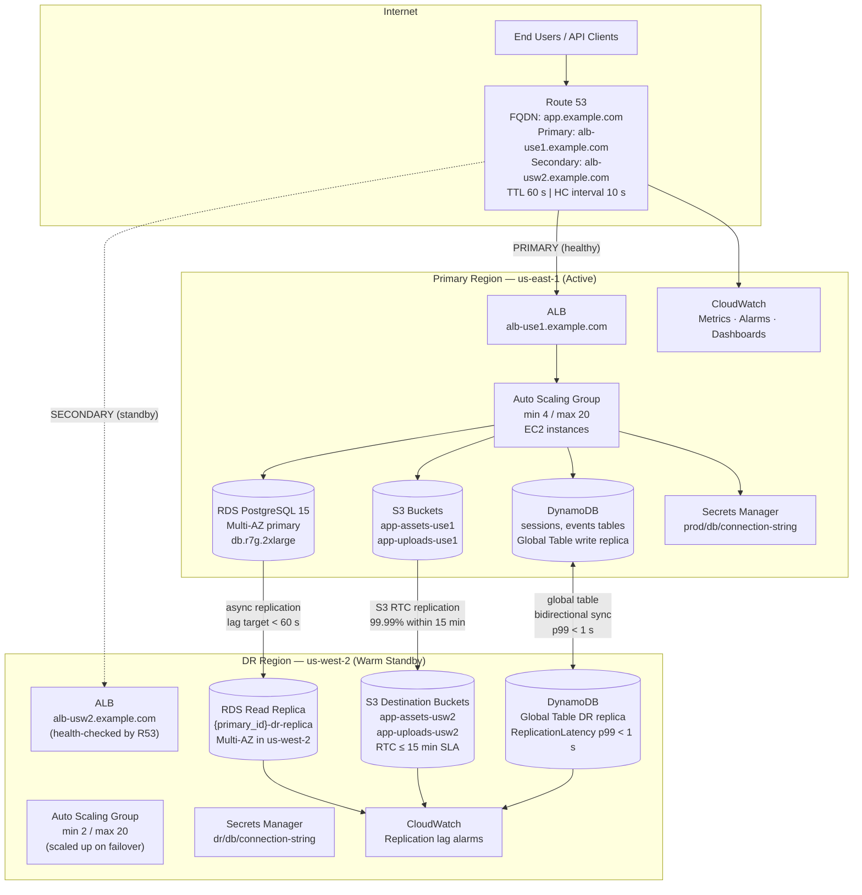
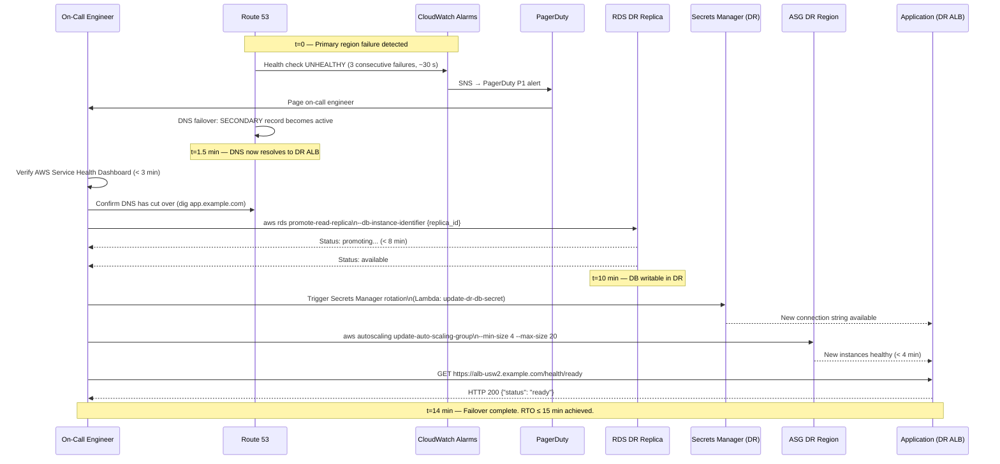

# Design: AWS Multi-Region Disaster Recovery

## Architecture

### System Context

The DR architecture operates across two AWS regions in an **active/passive warm-standby** topology:

- **Primary region (`us-east-1`)**: serves all production traffic; hosts the writable RDS primary, authoritative S3 buckets, the DynamoDB global table's local replica, and the full-capacity Auto Scaling group behind an Application Load Balancer (ALB).
- **DR region (`us-west-2`)**: runs a scaled-down but fully provisioned copy of every stateful component — an RDS cross-region read replica, S3 destination buckets with replication enabled, and the DynamoDB global table's DR replica. The Auto Scaling group is maintained at minimum capacity (2 instances) to keep AMI and configuration drift to zero; it is scaled to full production capacity during failover.

Route 53 health checks probe both region endpoints continuously. DNS failover from primary to DR is automatic (triggered by 3 consecutive health-check failures at a 10-second interval). Failback is always human-approved to prevent split-brain and premature re-failover.

### Component Design



### Failover Sequence Diagram



## DR Strategy Comparison

| Criterion | Pilot Light | Warm Standby (chosen) | Active/Active |
|-----------|-------------|----------------------|--------------|
| RTO | 30–60 min (provisioning required) | **10–15 min** (scale-up only) | < 1 min (no failover needed) |
| RPO | 5–15 min | **< 5 min** (replication lag) | Near-zero |
| DR region cost | ~5 % of primary | ~20–30 % of primary | ~100 % of primary |
| Operational complexity | Low | **Medium** | High (conflict resolution, active routing) |
| Split-brain risk | Low | **Low** (human-gated failover) | High (requires CRDT or last-writer-wins) |
| DynamoDB fit | Poor (manual restore) | **Good** (global tables, no promotion) | Excellent (native multi-master) |
| RDS fit | Poor (cold start) | **Good** (replica promotion < 10 min) | Complex (Aurora Global or Patroni) |
| Chosen for this workload | No | **Yes** | No — consistency requirements rule it out |

**Decision**: Warm standby is selected because it meets the 15-minute RTO and 5-minute RPO targets at a cost of ~25 % of primary while keeping split-brain risk manageable through human-gated failover. Active/active is explicitly rejected due to the application's strong-consistency requirements for the relational database. See `adr-001-warm-standby-vs-pilot-light.md` and `adr-002-warm-standby-vs-active-active.md`.

## RTO/RPO Budget Breakdown

| Component | Failover Step | Time Budget | RPO Contribution |
|-----------|--------------|------------|-----------------|
| Route 53 DNS cutover | Automatic (health checks) | ≤ 1.5 min | 0 (no data) |
| On-call triage and declaration | Human runbook step 1 | ≤ 3 min | 0 (no data) |
| RDS replica promotion | `aws rds promote-read-replica` | ≤ 8 min | ≤ 5 min (replication lag) |
| Secrets Manager update | Lambda function invocation | ≤ 1 min | 0 (no data) |
| ASG scale-up to production | `update-auto-scaling-group` | ≤ 4 min | 0 (stateless) |
| Application health validation | `GET /health/ready` | ≤ 1 min | 0 (no data) |
| **Total (sequential critical path)** | | **≤ 18.5 min** | **≤ 5 min** |
| **Parallelism savings (RDS + triage overlap)** | | **−4 min** | |
| **Net RTO target** | | **≤ 15 min** | **≤ 5 min** |

Note: RDS promotion and on-call triage (steps 2 and 3) run in parallel from `t=1.5 min` once DNS has cut over, yielding the 4-minute saving.

## Replication Topology

| Data Store | Replication Mechanism | Direction | Lag Target | RPO Contribution |
|------------|----------------------|-----------|-----------|-----------------|
| RDS PostgreSQL | Cross-region async streaming replication (`replicate_source_db`) | Primary → DR | < 60 s warning, < 240 s critical | ≤ 5 min (bounded by alarm) |
| S3 (versioned buckets) | S3 Replication Time Control (RTC) | Primary → DR (unidirectional) | 99.99 % of objects within 15 min | ≤ 15 min (S3 SLA) |
| DynamoDB global tables | Native multi-master bidirectional replication | Primary ↔ DR | p99 < 1 s | < 1 s (negligible) |
| Secrets Manager | Manual rotation Lambda (runbook step) | Primary → DR (on demand) | N/A (runbook-triggered) | 0 (operational data) |

## Files & Interfaces

| File / Directory | Purpose |
|-----------------|---------|
| `modules/route53-failover/main.tf` | `aws_route53_health_check` resources for both regions, PRIMARY/SECONDARY `aws_route53_record` failover records, SNS alarm integration |
| `modules/route53-failover/variables.tf` | `primary_endpoint`, `dr_endpoint`, `hosted_zone_id`, `fqdn`, `health_check_interval`, `failure_threshold` |
| `modules/rds-dr/main.tf` | `aws_db_instance` with `replicate_source_db` cross-region, CloudWatch alarms for `ReplicaLag`, IAM policy for promotion Lambda |
| `modules/rds-dr/variables.tf` | `primary_db_arn`, `replica_identifier`, `instance_class`, `multi_az`, `dr_region` |
| `modules/s3-replication/main.tf` | `aws_s3_bucket_replication_configuration`, `aws_iam_role` and `aws_iam_policy` for replication, destination bucket versioning |
| `modules/s3-replication/variables.tf` | `source_bucket_arns`, `destination_bucket_arns`, `enable_rtc`, `enable_delete_marker_replication` |
| `modules/dynamodb-global/main.tf` | `aws_dynamodb_table` with `replica` blocks, CloudWatch `ReplicationLatency` alarm, DynamoDB Streams Lambda for conflict logging |
| `modules/dynamodb-global/variables.tf` | `table_name`, `hash_key`, `range_key`, `billing_mode`, `replica_regions`, `enable_streams` |
| `modules/monitoring/main.tf` | Composite CloudWatch dashboard for RTO/RPO KPIs, SNS topics, PagerDuty integration via `aws_sns_topic_subscription` |
| `environments/prod/main.tf` | Root module composing all sub-modules, provider aliases for `us-east-1` and `us-west-2` |
| `environments/prod/terraform.tfvars` | Production values: instance classes, bucket names, hosted zone ID, FQDN |
| `environments/sandbox/main.tf` | Game-day sandbox mirror of `prod/main.tf` with reduced instance sizes |
| `scripts/promote-rds.sh` | Wrapper for `aws rds promote-read-replica` with pre-condition checks and status polling |
| `scripts/validate-db-consistency.sh` | Row count and checksum comparison between primary and DR database post-failback |
| `scripts/scale-up-asg.sh` | Wrapper for `aws autoscaling update-auto-scaling-group` with health-check wait loop |
| `runbooks/failover-runbook.md` | Step-by-step operator guide: triage → declare → DNS → DB promote → ASG scale → validate |
| `runbooks/failback-runbook.md` | Step-by-step guide: primary restore → reverse replication → consistency check → DNS restore |
| `runbooks/game-day-playbook.md` | Game-day drill procedure: scope, success criteria, inject failure, record timestamps, debrief |
| `architecture/multi-region-dr.drawio` | draw.io source diagram generated by `drawio-ai generate --template aws-multi-region` |
| `architecture/multi-region-dr.png` | PNG export of the draw.io diagram for embedding in docs and the SAD |
| `docs/adrs/adr-001-warm-standby-vs-pilot-light.md` | ADR: why warm standby was chosen over pilot light |
| `docs/adrs/adr-002-warm-standby-vs-active-active.md` | ADR: why active/active was not chosen |
| `docs/adrs/adr-003-rds-replica-vs-aurora-global.md` | ADR: RDS cross-region replica vs Aurora Global Database |
| `docs/well-architected-review.md` | Reliability pillar review mapped to this architecture |
| `docs/system-architecture.md` | System Architecture Document (SAD) produced via `architecture-doc` skill |
| `docs/game-day-reports/{date}-report.md` | Post-drill reports with measured RTO/RPO, gaps, action items |

## Terraform Module Structure

### Provider Configuration (`environments/prod/main.tf`)

```hcl
terraform {
  required_providers {
    aws = {
      source  = "hashicorp/aws"
      version = "~> 5.50"
    }
  }
  backend "s3" {
    bucket         = "example-tfstate-prod"
    key            = "dr/terraform.tfstate"
    region         = "us-east-1"
    dynamodb_table = "example-tfstate-lock"
    encrypt        = true
  }
}

provider "aws" {
  alias  = "primary"
  region = "us-east-1"
}

provider "aws" {
  alias  = "dr"
  region = "us-west-2"
}
```

### Route 53 Failover Health Checks (`modules/route53-failover/main.tf`)

```hcl
resource "aws_route53_health_check" "primary" {
  fqdn              = var.primary_endpoint
  port              = 443
  type              = "HTTPS"
  resource_path     = "/health/live"
  request_interval  = 10
  failure_threshold = 3
  measure_latency   = true

  tags = {
    Name        = "dr-hc-primary-${var.fqdn}"
    Environment = "prod"
    Region      = "us-east-1"
  }
}

resource "aws_route53_health_check" "dr" {
  fqdn              = var.dr_endpoint
  port              = 443
  type              = "HTTPS"
  resource_path     = "/health/live"
  request_interval  = 10
  failure_threshold = 3
  measure_latency   = true

  tags = {
    Name        = "dr-hc-secondary-${var.fqdn}"
    Environment = "prod"
    Region      = "us-west-2"
  }
}

resource "aws_route53_record" "primary_failover" {
  zone_id = var.hosted_zone_id
  name    = var.fqdn
  type    = "CNAME"
  ttl     = 60

  failover_routing_policy {
    type = "PRIMARY"
  }

  set_identifier  = "primary"
  records         = [var.primary_endpoint]
  health_check_id = aws_route53_health_check.primary.id
}

resource "aws_route53_record" "dr_failover" {
  zone_id = var.hosted_zone_id
  name    = var.fqdn
  type    = "CNAME"
  ttl     = 60

  failover_routing_policy {
    type = "SECONDARY"
  }

  set_identifier  = "dr"
  records         = [var.dr_endpoint]
  health_check_id = aws_route53_health_check.dr.id
}

resource "aws_cloudwatch_metric_alarm" "hc_primary_unhealthy" {
  alarm_name          = "route53-primary-health-check-failed"
  comparison_operator = "LessThanThreshold"
  evaluation_periods  = 1
  metric_name         = "HealthCheckStatus"
  namespace           = "AWS/Route53"
  period              = 30
  statistic           = "Minimum"
  threshold           = 1
  alarm_description   = "Primary region Route 53 health check has failed"
  alarm_actions       = [aws_sns_topic.dr_alerts.arn]
  ok_actions          = [aws_sns_topic.dr_alerts.arn]

  dimensions = {
    HealthCheckId = aws_route53_health_check.primary.id
  }
}
```

### RDS Cross-Region Read Replica (`modules/rds-dr/main.tf`)

```hcl
resource "aws_db_instance" "dr_replica" {
  provider = aws.dr

  identifier             = "${var.primary_db_identifier}-dr-replica"
  replicate_source_db    = var.primary_db_arn   # cross-region: full ARN required
  instance_class         = var.instance_class    # e.g., "db.r7g.2xlarge"
  multi_az               = true
  storage_encrypted      = true
  publicly_accessible    = false
  auto_minor_version_upgrade = false

  backup_retention_period = 7
  backup_window           = "02:00-03:00"

  # Replica inherits engine, engine_version, allocated_storage from source.
  # vpc_security_group_ids and db_subnet_group_name must reference DR VPC resources.
  vpc_security_group_ids = [var.dr_security_group_id]
  db_subnet_group_name   = var.dr_db_subnet_group_name

  tags = {
    Name        = "${var.primary_db_identifier}-dr-replica"
    Role        = "dr-replica"
    Environment = "prod"
  }

  lifecycle {
    prevent_destroy = true
  }
}

resource "aws_cloudwatch_metric_alarm" "rds_replica_lag_warning" {
  provider            = aws.dr
  alarm_name          = "rds-dr-replica-lag-warning"
  comparison_operator = "GreaterThanThreshold"
  evaluation_periods  = 2
  metric_name         = "ReplicaLag"
  namespace           = "AWS/RDS"
  period              = 60
  statistic           = "Maximum"
  threshold           = 60
  alarm_description   = "DR RDS replica lag exceeded 60 seconds (WARNING)"
  alarm_actions       = [var.dr_sns_topic_arn]

  dimensions = {
    DBInstanceIdentifier = aws_db_instance.dr_replica.identifier
  }
}

resource "aws_cloudwatch_metric_alarm" "rds_replica_lag_critical" {
  provider            = aws.dr
  alarm_name          = "rds-dr-replica-lag-critical"
  comparison_operator = "GreaterThanThreshold"
  evaluation_periods  = 2
  metric_name         = "ReplicaLag"
  namespace           = "AWS/RDS"
  period              = 60
  statistic           = "Maximum"
  threshold           = 240
  alarm_description   = "DR RDS replica lag exceeded 240 seconds (CRITICAL) — RPO at risk"
  alarm_actions       = [var.dr_sns_topic_arn]

  dimensions = {
    DBInstanceIdentifier = aws_db_instance.dr_replica.identifier
  }
}
```

### S3 Cross-Region Replication (`modules/s3-replication/main.tf`)

```hcl
resource "aws_iam_role" "s3_replication" {
  name = "s3-cross-region-replication-role"

  assume_role_policy = jsonencode({
    Version = "2012-10-17"
    Statement = [{
      Effect    = "Allow"
      Principal = { Service = "s3.amazonaws.com" }
      Action    = "sts:AssumeRole"
    }]
  })
}

resource "aws_iam_policy" "s3_replication" {
  name = "s3-cross-region-replication-policy"

  policy = jsonencode({
    Version = "2012-10-17"
    Statement = [
      {
        Effect = "Allow"
        Action = [
          "s3:GetReplicationConfiguration",
          "s3:ListBucket"
        ]
        Resource = [for arn in var.source_bucket_arns : arn]
      },
      {
        Effect = "Allow"
        Action = [
          "s3:GetObjectVersionForReplication",
          "s3:GetObjectVersionAcl",
          "s3:GetObjectVersionTagging"
        ]
        Resource = [for arn in var.source_bucket_arns : "${arn}/*"]
      },
      {
        Effect = "Allow"
        Action = [
          "s3:ReplicateObject",
          "s3:ReplicateDelete",
          "s3:ReplicateTags"
        ]
        Resource = [for arn in var.destination_bucket_arns : "${arn}/*"]
      }
    ]
  })
}

resource "aws_iam_role_policy_attachment" "s3_replication" {
  role       = aws_iam_role.s3_replication.name
  policy_arn = aws_iam_policy.s3_replication.arn
}

resource "aws_s3_bucket_replication_configuration" "assets" {
  provider = aws.primary
  role     = aws_iam_role.s3_replication.arn
  bucket   = var.source_assets_bucket_id

  rule {
    id     = "replicate-all-to-dr"
    status = "Enabled"

    filter {}   # empty filter replicates all objects

    destination {
      bucket        = var.destination_assets_bucket_arn
      storage_class = "STANDARD_IA"

      replication_time {
        status = "Enabled"
        time   { minutes = 15 }
      }

      metrics {
        status = "Enabled"
        event_threshold { minutes = 15 }
      }
    }

    delete_marker_replication {
      status = "Disabled"   # prevent accidental deletion propagation
    }
  }

  depends_on = [aws_s3_bucket_versioning.source_assets]
}
```

### DynamoDB Global Tables (`modules/dynamodb-global/main.tf`)

```hcl
resource "aws_dynamodb_table" "sessions" {
  provider       = aws.primary
  name           = "app-sessions"
  billing_mode   = "PAY_PER_REQUEST"
  hash_key       = "session_id"

  attribute {
    name = "session_id"
    type = "S"
  }

  stream_enabled   = true
  stream_view_type = "NEW_AND_OLD_IMAGES"

  point_in_time_recovery {
    enabled = true
  }

  server_side_encryption {
    enabled = true
  }

  replica {
    region_name            = "us-west-2"
    point_in_time_recovery = true
  }

  tags = {
    Name        = "app-sessions"
    GlobalTable = "true"
    Environment = "prod"
  }
}

resource "aws_cloudwatch_metric_alarm" "ddb_replication_lag" {
  provider            = aws.dr
  alarm_name          = "dynamodb-global-table-replication-lag"
  comparison_operator = "GreaterThanThreshold"
  evaluation_periods  = 3
  metric_name         = "ReplicationLatency"
  namespace           = "AWS/DynamoDB"
  period              = 60
  statistic           = "p99"
  threshold           = 5000   # 5 seconds in milliseconds
  alarm_description   = "DynamoDB global table p99 replication latency exceeded 5 s"
  alarm_actions       = [var.dr_sns_topic_arn]

  dimensions = {
    TableName   = aws_dynamodb_table.sessions.name
    ReceivingRegion = "us-west-2"
  }
}
```

## Runbook Outline

### `runbooks/failover-runbook.md` Structure

| Step | Action | Owner | Time Budget | Pre-condition Check |
|------|--------|-------|------------|---------------------|
| 1 | Triage: verify AWS Health Dashboard, Route 53 HC status, replica lag | On-call SRE | 3 min | N/A |
| 2 | Declare disaster; record `disaster_declaration_timestamp` | On-call SRE | 1 min | Health dashboard shows regional impairment |
| 3 | Confirm DNS has cut over (`dig app.example.com +short`) | On-call SRE | 1 min | Route 53 SECONDARY record active |
| 4 | Promote RDS replica: `scripts/promote-rds.sh {replica_id}` | On-call SRE | 8 min | Replica status = `available` before command |
| 5 | Update Secrets Manager: invoke Lambda `update-dr-db-secret` | On-call SRE | 1 min | DB status = `available` post-promotion |
| 6 | Scale ASG to production: `scripts/scale-up-asg.sh {asg_name} 4 20` | On-call SRE | 4 min | Secrets Manager updated |
| 7 | Validate application: `GET https://alb-usw2.example.com/health/ready` | On-call SRE | 1 min | All ASG instances pass ELB health check |
| 8 | Notify stakeholders; open P1 incident in PagerDuty | Incident Commander | 1 min | Application healthy in DR |

### `runbooks/failback-runbook.md` Structure

| Step | Action | Time Budget |
|------|--------|------------|
| 1 | Verify primary region fully restored (AWS console + health checks) | 10 min |
| 2 | Restore primary RDS from snapshot or re-establish replica from DR | 30–60 min |
| 3 | Run `scripts/validate-db-consistency.sh` — must return exit 0 | 5 min |
| 4 | Re-enable S3 replication in original direction (DR → primary for gap fill) | 5 min |
| 5 | Shift Route 53 SECONDARY record back to PRIMARY (manual DNS update) | 2 min |
| 6 | Monitor for 30 minutes; confirm no reversion | 30 min |

## Well-Architected Review — Reliability Pillar

| Best-Practice Area | Architectural Decision | Evidence |
|-------------------|----------------------|---------|
| **Foundations** | Use multiple AZs within each region (RDS Multi-AZ in both primary and DR) | `multi_az = true` on `aws_db_instance.dr_replica` |
| **Workload Architecture** | Decouple DNS from application health via Route 53 health checks | `aws_route53_health_check` with 10-second probes, automatic failover record |
| **Change Management** | Terraform with locked provider versions and S3-backed remote state | `required_providers { aws ~> 5.50 }`, `backend "s3"` with DynamoDB state locking |
| **Failure Management** | Warm-standby pattern minimises provisioning time during failover | ASG min=2 in DR keeps instances warm; promotion only requires scale-up |
| **Data Durability** | Three independent replication paths (RDS async, S3 RTC, DynamoDB global tables) | Documented per-path RPO contribution in budget table above |
| **Testing** | Quarterly game-day drills with measured RTO/RPO | `game-day-playbook.md`; debrief reports in `docs/game-day-reports/` |
| **Known deviation** | No automated failover trigger (human approval required) | Compensating control: Route 53 DNS cuts over automatically (< 90 s); only DB promotion and ASG scale-up are human-gated to prevent split-brain |

Detailed Well-Architected Tool answers for all 26 Reliability pillar questions are recorded in `docs/well-architected-review.md`, produced as part of Task 9.

## Error Handling

| Failure Mode | Detection | Mitigation |
|-------------|-----------|-----------|
| **Split-brain** (both regions accept writes simultaneously) | CloudWatch alarm on DynamoDB `SuccessfulRequestLatency` drop in primary + active writes in DR | Human-gated failover runbook; Route 53 SECONDARY record only activated by health-check failure; RDS promotion is a one-way, irreversible step — primary becomes read-only after replica promotion |
| **Replication lag spike** (RDS lag > 60 s) | `rds-dr-replica-lag-warning` CloudWatch alarm | SNS → PagerDuty alert; SRE investigates I/O contention on primary; increase replica instance class if sustained |
| **S3 replication failure** (object fails to replicate) | `aws_s3_bucket_replication_configuration` with RTC metrics; `ReplicationFailedOperations` CloudWatch metric | Alarm on `ReplicationFailedOperations > 0`; retry via S3 Batch Replication job; root cause: encryption key access or bucket policy mismatch |
| **Health-check flapping** (primary intermittently unhealthy) | Route 53 health check state transition metric | Set `failure_threshold = 3` (30 seconds of sustained failure before failover); CloudWatch alarm on rapid state transitions (`HealthCheckStatus` changes > 2 in 5 min) triggers investigation before automatic failback |
| **Partial region degradation** (some AZs healthy, others not) | Route 53 health check probes a specific ALB endpoint; ALB itself health-checks instances across AZs | If ALB is serving < 50 % healthy targets, it returns 5xx; health check will detect and trigger DNS failover; not a split-brain because primary ALB is still the single DNS target until full R53 cutover |
| **RDS promotion failure** (replica stuck in `modifying`) | `scripts/promote-rds.sh` polls `describe-db-instances` every 30 seconds with a 12-minute timeout | On timeout, escalate to AWS Support; use the last-known-good Aurora Global snapshot in S3 as fallback; document in runbook Step 4 escalation path |
| **DynamoDB conflict on split-brain window** | DynamoDB Streams Lambda consumer detects version conflicts via `NEW_AND_OLD_IMAGES` comparison | Last-writer-wins (DynamoDB default); conflicts logged to `/aws/dynamodb/conflict-resolution/{table_name}` for manual review post-incident |
| **Terraform state lock contention** | DynamoDB state lock table blocks concurrent applies | CI/CD pipeline enforces single-pipeline concurrency; manual `terraform force-unlock` documented in runbook escalation |

## Testing Strategy

### Static Analysis

| Tool | Command | Gate |
|------|---------|------|
| `terraform validate` | `terraform -chdir=modules/route53-failover validate` (all modules) | Must pass; fail = PR blocked |
| `tflint` | `tflint --recursive --config=.tflint.hcl` (AWS ruleset enabled) | Must pass; no violations allowed |
| `checkov` | `checkov -d . --framework terraform --skip-check CKV_AWS_116` | Must pass; any HIGH/CRITICAL finding blocks merge |
| `terraform-docs` | `terraform-docs markdown . > README.md` (all modules) | README diff checked in PR; stale docs fail CI |
| `drawio-ai validate` | `drawio-ai validate architecture/multi-region-dr.drawio --schema aws` | Diagram must contain both regions, all replication paths, Route 53 node |

### Game-Day Drill Steps (Integration Test)

The sandbox environment (`environments/sandbox/`) mirrors production topology at 50 % capacity. The drill is executed against sandbox exclusively.

| Step | Action | Success Criterion | Timestamp Variable |
|------|--------|------------------|-------------------|
| D-1 | Open all monitoring dashboards; confirm baseline | All alarms GREEN; replication lag < 10 s | — |
| D-2 | Inject failure: modify sandbox primary ALB SG to deny all ingress | Primary ALB returning 5xx within 10 s | `t_failure_injected` |
| D-3 | Observe Route 53 DNS failover | `dig app.sandbox.example.com` returns DR ALB within 90 s | `t_dns_cutover_complete` |
| D-4 | Execute runbook Steps 4–7 (promote RDS, update secret, scale ASG) | Each step completes within its time budget | — |
| D-5 | Validate application in DR: `GET /health/ready` returns HTTP 200 | HTTP 200 with `{"status":"ready"}` | `t_app_healthy_in_dr` |
| D-6 | Compute measured RTO: `t_app_healthy_in_dr − t_failure_injected` | Measured RTO ≤ 15 min | Recorded in debrief report |
| D-7 | Compute measured RPO: query DR DB for youngest committed transaction age | Youngest transaction age ≤ 5 min | Recorded in debrief report |
| D-8 | Execute failback runbook (Steps 1–6 of `failback-runbook.md`) | `dig app.sandbox.example.com` returns primary ALB | `t_failback_complete` |
| D-9 | Restore sandbox ALB SG to original rules | Primary ALB healthy in Route 53 HC | — |
| D-10 | Write debrief report to `docs/game-day-reports/{date}-report.md` | Report reviewed and merged within 48 h | — |
