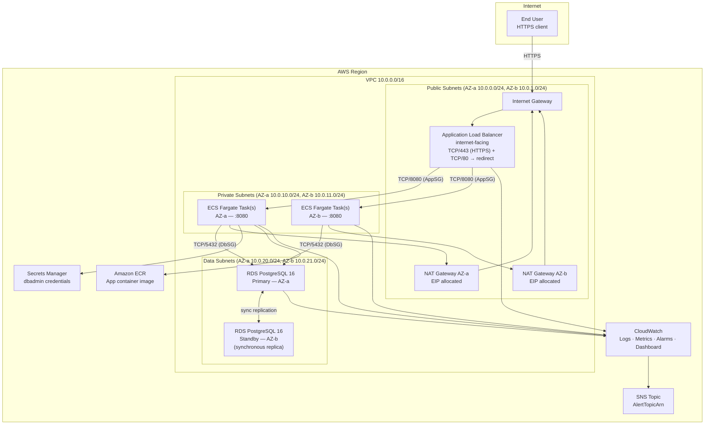
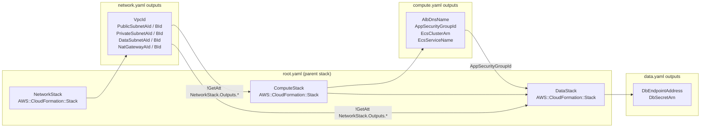

# Design: AWS Three-Tier Web Architecture

## Architecture

### System Context

The classic three-tier web architecture segments all resources across three network layers inside a single Amazon VPC spanning two Availability Zones:

- **Load Balancer Tier** (public subnets): An internet-facing ALB terminates TLS, redirects HTTP to HTTPS, and distributes traffic to healthy application tasks. NAT Gateways in the same public subnets provide egress for private-subnet resources.
- **Application Tier** (private subnets): ECS Fargate tasks run the containerised application workload. Tasks have no public IP addresses; all internet egress flows through NAT Gateways. Auto Scaling maintains between 2 and 10 tasks based on CPU utilisation.
- **Data Tier** (data subnets): Amazon RDS for PostgreSQL 16 with Multi-AZ provides synchronous replication to a standby in the second AZ. Data subnets have no internet route — not even NAT — so the database is unreachable from the public internet regardless of security group state.

CloudWatch collects logs from every tier and drives alarms to an SNS topic. All resources are defined in three nested CloudFormation stacks (network, compute, data) composed by a root stack and deployed with `rain`.

### Component Design





## Network Design

### Subnet and CIDR Plan

| Subnet | CIDR | AZ | Tier | Route Table Default Route | MapPublicIpOnLaunch |
|--------|------|----|------|--------------------------|---------------------|
| `PublicSubnetA` | `10.0.0.0/24` | AZ-a | public | `0.0.0.0/0 → InternetGateway` | false |
| `PublicSubnetB` | `10.0.1.0/24` | AZ-b | public | `0.0.0.0/0 → InternetGateway` | false |
| `PrivateSubnetA` | `10.0.10.0/24` | AZ-a | private | `0.0.0.0/0 → NatGatewayA` | false |
| `PrivateSubnetB` | `10.0.11.0/24` | AZ-b | private | `0.0.0.0/0 → NatGatewayB` | false |
| `DataSubnetA` | `10.0.20.0/24` | AZ-a | data | local only (`10.0.0.0/16`) | false |
| `DataSubnetB` | `10.0.21.0/24` | AZ-b | data | local only (`10.0.0.0/16`) | false |

### Security Group Matrix

| Security Group | Inbound Rule | Inbound Source | Outbound Rule | Outbound Destination |
|---------------|-------------|----------------|---------------|----------------------|
| `AlbSecurityGroup` | `TCP/443` | `0.0.0.0/0` | `TCP/8080` | `AppSecurityGroup` |
| `AlbSecurityGroup` | `TCP/80` | `0.0.0.0/0` | — | — |
| `AppSecurityGroup` | `TCP/8080` | `AlbSecurityGroup` | `TCP/5432` | `DbSecurityGroup` |
| `AppSecurityGroup` | — | — | `TCP/443` | `0.0.0.0/0` (ECR, SM, CW via NAT) |
| `DbSecurityGroup` | `TCP/5432` | `AppSecurityGroup` | _(none)_ | _(none — zero outbound)_ |

All intra-VPC rules use `SourceSecurityGroupId` / `DestinationSecurityGroupId` references; no CIDR-based intra-VPC rules are permitted.

## Files & Interfaces

| File | Purpose |
|------|---------|
| `infra/cloudformation/root.yaml` | Parent stack; declares `NetworkStack`, `ComputeStack`, `DataStack` nested stacks; wires outputs → parameters via `!GetAtt` |
| `infra/cloudformation/network.yaml` | VPC, IGW, 6 subnets, 2 NAT Gateways, 5 route tables, route associations; exports all resource IDs |
| `infra/cloudformation/compute.yaml` | ALB, Target Group, HTTPS + HTTP listeners, ECS Cluster, Task Definition, ECS Service, App Auto Scaling, all security groups, IAM roles, CloudWatch Log Group, CloudWatch Dashboard and alarms |
| `infra/cloudformation/data.yaml` | RDS DB Subnet Group, Secrets Manager secret, RDS DBInstance; imports VPC/subnet IDs from network stack and `AppSecurityGroupId` from compute stack |
| `docs/architecture-diagram.drawio` | draw.io source file generated by `drawio-ai generate`; contains VPC swimlane, subnet lanes, all AWS components with official icons |
| `docs/architecture-diagram.png` | PNG export at 150 dpi produced by `drawio-ai export`; embedded in the SAD docx |
| `docs/solution-architecture-document.docx` | SAD produced by the `architecture-doc` skill; executive summary, architecture overview, per-tier descriptions, CloudFormation parameter reference, operational runbook |
| `docs/well-architected-review.md` | Structured table of findings against the 6 Well-Architected pillars; each finding classified as `IMPLEMENTED`, `PARTIAL`, or `RISK` with remediation notes |
| `docs/system-architecture.md` | Updated system-level diagram reference; cross-links to SAD and draw.io source |

## CloudFormation Stack Structure

### network.yaml — Key Resources

```yaml
Parameters:
  StackName:
    Type: String
    Description: Prefix applied to all resource names and export keys.

Resources:
  VPC:
    Type: AWS::EC2::VPC
    Properties:
      CidrBlock: 10.0.0.0/16
      EnableDnsSupport: true
      EnableDnsHostnames: true
      Tags:
        - Key: Name
          Value: !Sub "${StackName}-vpc"

  InternetGateway:
    Type: AWS::EC2::InternetGateway
    Properties:
      Tags:
        - Key: Name
          Value: !Sub "${StackName}-igw"

  VPCGatewayAttachment:
    Type: AWS::EC2::VPCGatewayAttachment
    Properties:
      VpcId: !Ref VPC
      InternetGatewayId: !Ref InternetGateway

  PublicSubnetA:
    Type: AWS::EC2::Subnet
    Properties:
      VpcId: !Ref VPC
      CidrBlock: 10.0.0.0/24
      AvailabilityZone: !Select [0, !GetAZs ""]
      MapPublicIpOnLaunch: false
      Tags:
        - Key: Name
          Value: !Sub "${StackName}-public-a"
        - Key: Tier
          Value: public

  NatGatewayEipA:
    Type: AWS::EC2::EIP
    Properties:
      Domain: vpc

  NatGatewayA:
    Type: AWS::EC2::NatGateway
    Properties:
      AllocationId: !GetAtt NatGatewayEipA.AllocationId
      SubnetId: !Ref PublicSubnetA
      Tags:
        - Key: Name
          Value: !Sub "${StackName}-nat-a"

  PrivateRouteTableA:
    Type: AWS::EC2::RouteTable
    Properties:
      VpcId: !Ref VPC
      Tags:
        - Key: Name
          Value: !Sub "${StackName}-private-rt-a"

  PrivateDefaultRouteA:
    Type: AWS::EC2::Route
    Properties:
      RouteTableId: !Ref PrivateRouteTableA
      DestinationCidrBlock: 0.0.0.0/0
      NatGatewayId: !Ref NatGatewayA

  DataRouteTableA:
    Type: AWS::EC2::RouteTable
    Properties:
      VpcId: !Ref VPC
      Tags:
        - Key: Name
          Value: !Sub "${StackName}-data-rt-a"
    # No default route: data subnets are local-only

Outputs:
  VpcId:
    Value: !Ref VPC
    Export:
      Name: !Sub "${StackName}-VpcId"
  PrivateSubnetAId:
    Value: !Ref PrivateSubnetA
    Export:
      Name: !Sub "${StackName}-PrivateSubnetAId"
  DataSubnetAId:
    Value: !Ref DataSubnetA
    Export:
      Name: !Sub "${StackName}-DataSubnetAId"
```

### compute.yaml — ALB, Target Group, Listeners, ECS, Security Groups

```yaml
Parameters:
  NetworkStackName:
    Type: String
    NoEcho: false
  CertificateArn:
    Type: String
    NoEcho: true
  AppImageUri:
    Type: String
  TaskCpu:
    Type: Number
    Default: 512
  TaskMemory:
    Type: Number
    Default: 1024
  DesiredTaskCount:
    Type: Number
    Default: 2
  AccessLogBucketName:
    Type: String
    NoEcho: false
  AlertTopicArn:
    Type: String
    NoEcho: true

Resources:
  AlbSecurityGroup:
    Type: AWS::EC2::SecurityGroup
    Properties:
      GroupDescription: ALB — internet-facing inbound HTTP and HTTPS
      VpcId: !ImportValue
        Fn::Sub: "${NetworkStackName}-VpcId"
      SecurityGroupIngress:
        - IpProtocol: tcp
          FromPort: 443
          ToPort: 443
          CidrIp: 0.0.0.0/0
        - IpProtocol: tcp
          FromPort: 80
          ToPort: 80
          CidrIp: 0.0.0.0/0
      SecurityGroupEgress:
        - IpProtocol: tcp
          FromPort: 8080
          ToPort: 8080
          DestinationSecurityGroupId: !Ref AppSecurityGroup
      Tags:
        - Key: Name
          Value: !Sub "${AWS::StackName}-alb-sg"

  AppSecurityGroup:
    Type: AWS::EC2::SecurityGroup
    Properties:
      GroupDescription: App tier — inbound from ALB only on 8080
      VpcId: !ImportValue
        Fn::Sub: "${NetworkStackName}-VpcId"
      SecurityGroupIngress:
        - IpProtocol: tcp
          FromPort: 8080
          ToPort: 8080
          SourceSecurityGroupId: !Ref AlbSecurityGroup
      SecurityGroupEgress:
        - IpProtocol: tcp
          FromPort: 5432
          ToPort: 5432
          DestinationSecurityGroupId: !Ref DbSecurityGroup
        - IpProtocol: tcp
          FromPort: 443
          ToPort: 443
          CidrIp: 0.0.0.0/0
      Tags:
        - Key: Name
          Value: !Sub "${AWS::StackName}-app-sg"

  DbSecurityGroup:
    Type: AWS::EC2::SecurityGroup
    Properties:
      GroupDescription: Data tier — inbound from app tier only on 5432
      VpcId: !ImportValue
        Fn::Sub: "${NetworkStackName}-VpcId"
      SecurityGroupIngress:
        - IpProtocol: tcp
          FromPort: 5432
          ToPort: 5432
          SourceSecurityGroupId: !Ref AppSecurityGroup
      Tags:
        - Key: Name
          Value: !Sub "${AWS::StackName}-db-sg"

  ApplicationLoadBalancer:
    Type: AWS::ElasticLoadBalancingV2::LoadBalancer
    Properties:
      Name: !Sub "${AWS::StackName}-alb"
      Scheme: internet-facing
      Type: application
      Subnets:
        - !ImportValue
          Fn::Sub: "${NetworkStackName}-PublicSubnetAId"
        - !ImportValue
          Fn::Sub: "${NetworkStackName}-PublicSubnetBId"
      SecurityGroups:
        - !Ref AlbSecurityGroup
      LoadBalancerAttributes:
        - Key: access_logs.s3.enabled
          Value: "true"
        - Key: access_logs.s3.bucket
          Value: !Ref AccessLogBucketName
        - Key: access_logs.s3.prefix
          Value: alb-logs

  AppTargetGroup:
    Type: AWS::ElasticLoadBalancingV2::TargetGroup
    Properties:
      Name: !Sub "${AWS::StackName}-app-tg"
      Protocol: HTTP
      Port: 8080
      VpcId: !ImportValue
        Fn::Sub: "${NetworkStackName}-VpcId"
      TargetType: ip
      HealthCheckProtocol: HTTP
      HealthCheckPath: /health
      HealthCheckIntervalSeconds: 30
      HealthCheckTimeoutSeconds: 5
      HealthyThresholdCount: 2
      UnhealthyThresholdCount: 3
      Matcher:
        HttpCode: "200"

  HttpsListener:
    Type: AWS::ElasticLoadBalancingV2::Listener
    Properties:
      LoadBalancerArn: !Ref ApplicationLoadBalancer
      Port: 443
      Protocol: HTTPS
      SslPolicy: ELBSecurityPolicy-TLS13-1-2-2021-06
      Certificates:
        - CertificateArn: !Ref CertificateArn
      DefaultActions:
        - Type: forward
          TargetGroupArn: !Ref AppTargetGroup

  HttpRedirectListener:
    Type: AWS::ElasticLoadBalancingV2::Listener
    Properties:
      LoadBalancerArn: !Ref ApplicationLoadBalancer
      Port: 80
      Protocol: HTTP
      DefaultActions:
        - Type: redirect
          RedirectConfig:
            Protocol: HTTPS
            Port: "443"
            Host: "#{host}"
            Path: "/#{path}"
            Query: "#{query}"
            StatusCode: HTTP_301

  EcsCluster:
    Type: AWS::ECS::Cluster
    Properties:
      ClusterName: !Sub "${AWS::StackName}-cluster"
      ClusterSettings:
        - Name: containerInsights
          Value: enabled

  AppLogGroup:
    Type: AWS::Logs::LogGroup
    Properties:
      LogGroupName: !Sub "/ecs/${AWS::StackName}/app"
      RetentionInDays: 30

  AppTaskDefinition:
    Type: AWS::ECS::TaskDefinition
    Properties:
      Family: !Sub "${AWS::StackName}-app"
      RequiresCompatibilities:
        - FARGATE
      NetworkMode: awsvpc
      Cpu: !Ref TaskCpu
      Memory: !Ref TaskMemory
      ExecutionRoleArn: !GetAtt EcsExecutionRole.Arn
      TaskRoleArn: !GetAtt EcsTaskRole.Arn
      ContainerDefinitions:
        - Name: app
          Image: !Ref AppImageUri
          PortMappings:
            - ContainerPort: 8080
              Protocol: tcp
          Essential: true
          LogConfiguration:
            LogDriver: awslogs
            Options:
              awslogs-group: !Ref AppLogGroup
              awslogs-region: !Ref AWS::Region
              awslogs-stream-prefix: ecs

  AppService:
    Type: AWS::ECS::Service
    DependsOn: HttpsListener
    Properties:
      ServiceName: !Sub "${AWS::StackName}-app"
      Cluster: !Ref EcsCluster
      TaskDefinition: !Ref AppTaskDefinition
      DesiredCount: !Ref DesiredTaskCount
      LaunchType: FARGATE
      PlatformVersion: LATEST
      NetworkConfiguration:
        AwsvpcConfiguration:
          AssignPublicIp: DISABLED
          Subnets:
            - !ImportValue
              Fn::Sub: "${NetworkStackName}-PrivateSubnetAId"
            - !ImportValue
              Fn::Sub: "${NetworkStackName}-PrivateSubnetBId"
          SecurityGroups:
            - !Ref AppSecurityGroup
      LoadBalancers:
        - ContainerName: app
          ContainerPort: 8080
          TargetGroupArn: !Ref AppTargetGroup
      DeploymentConfiguration:
        MinimumHealthyPercent: 50
        MaximumPercent: 200
        DeploymentCircuitBreaker:
          Enable: true
          Rollback: true
```

### data.yaml — RDS, Subnet Group, Secrets Manager

```yaml
Parameters:
  NetworkStackName:
    Type: String
  ComputeStackName:
    Type: String
  DbInstanceClass:
    Type: String
    Default: db.t3.micro
  DbKmsKeyArn:
    Type: String
    NoEcho: true

Resources:
  DbSubnetGroup:
    Type: AWS::RDS::DBSubnetGroup
    Properties:
      DBSubnetGroupDescription: Data subnets for RDS PostgreSQL
      SubnetIds:
        - !ImportValue
          Fn::Sub: "${NetworkStackName}-DataSubnetAId"
        - !ImportValue
          Fn::Sub: "${NetworkStackName}-DataSubnetBId"
      Tags:
        - Key: Name
          Value: !Sub "${AWS::StackName}-db-subnet-group"

  DbSecret:
    Type: AWS::SecretsManager::Secret
    Properties:
      Name: !Sub "/${AWS::StackName}/db/credentials"
      Description: RDS master credentials for the three-tier architecture
      GenerateSecretString:
        SecretStringTemplate: '{"username": "dbadmin"}'
        GenerateStringKey: password
        PasswordLength: 32
        ExcludeCharacters: '/@"'

  DbInstance:
    Type: AWS::RDS::DBInstance
    DeletionPolicy: Retain
    UpdateReplacePolicy: Retain
    Properties:
      DBInstanceIdentifier: !Sub "${AWS::StackName}-postgres"
      Engine: postgres
      EngineVersion: "16.3"
      DBInstanceClass: !Ref DbInstanceClass
      MultiAZ: true
      StorageType: gp3
      AllocatedStorage: "20"
      StorageEncrypted: true
      KmsKeyId: !Ref DbKmsKeyArn
      MasterUsername: !Sub "{{resolve:secretsmanager:${DbSecret}:SecretString:username}}"
      MasterUserPassword: !Sub "{{resolve:secretsmanager:${DbSecret}:SecretString:password}}"
      DBSubnetGroupName: !Ref DbSubnetGroup
      VPCSecurityGroups:
        - !ImportValue
          Fn::Sub: "${ComputeStackName}-DbSecurityGroupId"
      BackupRetentionPeriod: 7
      PreferredBackupWindow: "03:00-04:00"
      PreferredMaintenanceWindow: "mon:04:00-mon:05:00"
      DeletionProtection: true
      AutoMinorVersionUpgrade: true
      EnablePerformanceInsights: true
      PerformanceInsightsRetentionPeriod: 7
      Tags:
        - Key: Name
          Value: !Sub "${AWS::StackName}-postgres"

Outputs:
  DbEndpointAddress:
    Value: !GetAtt DbInstance.Endpoint.Address
    Export:
      Name: !Sub "${AWS::StackName}-DbEndpointAddress"
  DbSecretArn:
    Value: !Ref DbSecret
    Export:
      Name: !Sub "${AWS::StackName}-DbSecretArn"
```

## Well-Architected Review Mapping

| Pillar | Finding | Status | Remediation |
|--------|---------|--------|-------------|
| Operational Excellence | All infrastructure defined as CloudFormation nested stacks; deployed via `rain` with change-set preview | `IMPLEMENTED` | — |
| Operational Excellence | CloudWatch Dashboard and alarms cover all three tiers; structured JSON logging to CloudWatch Logs | `IMPLEMENTED` | — |
| Operational Excellence | Deployment circuit breaker with auto-rollback on ECS service failures | `IMPLEMENTED` | — |
| Security | Security groups enforce least-privilege with SG-to-SG references; no CIDR-based intra-VPC rules | `IMPLEMENTED` | — |
| Security | Secrets Manager stores RDS credentials; ECS task role is granted only `secretsmanager:GetSecretValue` on that secret | `IMPLEMENTED` | — |
| Security | RDS storage encrypted with customer-managed KMS key; ALB uses TLS 1.3 policy | `IMPLEMENTED` | — |
| Security | No AWS WAF attached to the ALB | `RISK` | Add an `AWS::WAFv2::WebACL` with AWS-managed rule groups (AWSManagedRulesCommonRuleSet, AWSManagedRulesSQLiRuleSet) and associate it with the ALB |
| Reliability | ECS tasks and RDS standby span two AZs; NAT Gateways are per-AZ to eliminate cross-AZ NAT dependency | `IMPLEMENTED` | — |
| Reliability | RDS Multi-AZ with automated failover; backup retention 7 days; `DeletionProtection: true` | `IMPLEMENTED` | — |
| Reliability | No read replicas for RDS; all reads and writes hit the primary | `PARTIAL` | Add an RDS read replica in a third AZ (or use Aurora PostgreSQL) to offload read traffic and shorten recovery time objective |
| Performance Efficiency | ECS Fargate auto-scaling on CPU (2–10 tasks); ALB spreads load across AZs | `IMPLEMENTED` | — |
| Performance Efficiency | RDS Performance Insights enabled with 7-day retention for query-level analysis | `IMPLEMENTED` | — |
| Performance Efficiency | No caching layer between app tier and database | `PARTIAL` | Add an Amazon ElastiCache for Redis cluster in the private subnets to cache hot query results and reduce RDS load |
| Cost Optimisation | Fargate removes idle EC2 capacity; scale-in removes tasks when CPU drops below threshold | `IMPLEMENTED` | — |
| Cost Optimisation | `db.t3.micro` default suitable for non-production; no Savings Plan or Reserved Instance commitment | `PARTIAL` | After 30 days of production metrics, evaluate Compute Savings Plans for ECS Fargate and Reserved Instance pricing for RDS |
| Cost Optimisation | Two NAT Gateways (one per AZ) incur data-processing charges; cross-AZ data transfer is billed | `RISK` | For cost-sensitive workloads, evaluate a single NAT Gateway with accepted cross-AZ single-AZ-failure risk, or use VPC Endpoints for ECR, S3, Secrets Manager, and CloudWatch to eliminate NAT data charges for AWS API traffic |
| Sustainability | Fargate scales to zero idle capacity; right-sizing via auto-scaling reduces over-provisioning | `IMPLEMENTED` | — |
| Sustainability | No Graviton (ARM64) instance types selected for ECS tasks or RDS | `PARTIAL` | Switch ECS Task Definition `RuntimePlatform.CpuArchitecture` to `ARM64` and migrate RDS to a `db.t4g.*` Graviton instance class to reduce energy consumption by ~20 % |

## Error Handling

| Condition | Behaviour |
|-----------|-----------|
| Network stack deploy fails mid-way (e.g., NAT Gateway EIP limit exceeded) | CloudFormation rolls back the entire network stack; no partial subnet resources remain; EIP is released on rollback |
| Compute stack deployed before network stack outputs are available | `!ImportValue` reference fails with `Export not found`; stack enters `CREATE_FAILED`; fix by deploying root stack in dependency order via `rain deploy root.yaml` |
| ECS task fails health check 3 times | ALB deregisters task; ECS launches replacement; circuit breaker counts failure; if >50 % of tasks fail, ECS rolls back to previous task definition revision |
| ECS service deployment circuit breaker fires | ECS emits `SERVICE_DEPLOYMENT_FAILED` event; previous task definition revision is restored; alarm on ECS deployment failure fires to SNS |
| RDS primary AZ failure | RDS promotes standby; DNS CNAME of endpoint unchanged; total failover time typically 60–120 seconds; application must retry connections with exponential backoff |
| CloudFormation drift detected | Daily drift detection rule publishes report to SNS topic; on-call engineer reviews drift report and either remediates IaC or reverts out-of-band change |
| `cfn-lint` warning or error in PR | CI job exits with code 1; merge is blocked until the offending template is corrected and linting passes |
| ALB 5xx spike above alarm threshold | CloudWatch alarm transitions to `ALARM`; SNS publishes to `AlertTopicArn`; on-call engineer uses CloudWatch Dashboard to correlate with ECS CPU/memory and RDS latency widgets |

## Testing Strategy

### Unit Tests — Template Linting and Validation

| Check | Tool | Command | Gate |
|-------|------|---------|------|
| CloudFormation template syntax and best practices | `cfn-lint` | `cfn-lint --include-checks W --template infra/cloudformation/*.yaml` | Exit code 0, zero warnings |
| Security group rule audit | `cfn-nag` | `cfn_nag_scan --input-path infra/cloudformation/` | Zero WARN or FAIL findings |
| draw.io diagram schema validation | `drawio-ai` | `drawio-ai validate docs/architecture-diagram.drawio --schema aws-three-tier` | Exit code 0, all required component types present |
| Well-Architected review completeness | `grep` | All six pillar names present in `docs/well-architected-review.md` | Exit code 0 |

### Integration Tests — Deployed Stack Checks

| Check | Tool | Command | Gate |
|-------|------|---------|------|
| Root stack deploys to `CREATE_COMPLETE` | `rain` / `aws cli` | `rain deploy infra/cloudformation/root.yaml --stack-name test-three-tier` then `aws cloudformation describe-stacks --stack-name test-three-tier --query Stacks[0].StackStatus` | Returns `CREATE_COMPLETE` |
| ALB health check endpoint responds | `curl` | `curl -sk https://<AlbDnsName>/health` | HTTP 200 |
| HTTP to HTTPS redirect works | `curl` | `curl -sI http://<AlbDnsName>/health` | HTTP 301 with `Location: https://...` |
| RDS endpoint reachable from ECS task | `aws ecs execute-command` | Run `pg_isready -h <DbEndpoint> -p 5432 -U dbadmin` inside a task | Exit code 0 |
| ECS auto-scaling triggers on CPU load | `aws application-autoscaling` | Inject CPU load via stress container; wait 2 min; assert `DesiredCount` increases | `DesiredCount > 2` |
| CloudFormation drift detection clean | `aws cloudformation` | `aws cloudformation detect-stack-drift --stack-name test-three-tier` then poll until `DETECTION_COMPLETE` | `StackDriftStatus: NOT_DRIFTED` |
| Stack teardown with `Retain` policy | `rain` / `aws cli` | `rain rm test-three-tier`; assert RDS instance and S3 log bucket still exist | Both resources in `available` / existing state after stack deletion |
